# SSIS Package: WebDynamicActionProductProperties

**Project:** WebDynamicActionProductProperties  
**Folder:** WEB  
**Server:** STL-SSIS-P-01  

## Connection Managers

| Name | Type | Server | Catalog | Connection (sanitized) |
|---|---|---|---|---|
| IntegrationStaging | OLEDB | stl-ssis-p-01 | IntegrationStaging | Data Source=stl-ssis-p-01; Initial Catalog=IntegrationStaging; Provider=SQLNCLI11.1; Integrated Security=SSPI; Auto Translate=False |
| SMTP | SMTP |  |  |  |
| UK_PRODUCTPROPERTIES | FLATFILE |  |  |  |
| US_PRODUCTPROPERTIES | FLATFILE |  |  |  |
| dw | OLEDB | papamart | dw | Data Source=papamart; Initial Catalog=dw; Provider=SQLNCLI11.1; Integrated Security=SSPI; Auto Translate=False |

## Control Flow Tasks

| Task | Type |
|---|---|
| WebDynamicActionProductProperties | Package |
| Sequence Container - Export Product Properties Files to CSV | SEQUENCE |
| Data Flow Task - Generate Product Properties Files | Pipeline |
| Sequence Container - Load Dynamic Action Product Properties Table | SEQUENCE |
| Data Flow Task | Pipeline |
| Execute SQL Task - Truncate Stage | ExecuteSQLTask |
| Sequence Container - Process Bundle Book - TBD | SEQUENCE |
| Sequence Container Upload Files to SFTP Server | SEQUENCE |
| FEL - Archive Files | FOREACHLOOP |
| Archive Files | FileSystemTask |
| WinScp - Upload UK Files To Dynamic Action | ExecuteProcess |
| WinScp - Upload US Files To Dynamic Action | ExecuteProcess |
| Send Mail Task | SendMailTask |

## Control Flow Outline

```text
- Send Mail Task [SendMailTask]
- Sequence Container - Export Product Properties Files to CSV [SEQUENCE]
  - Data Flow Task - Generate Product Properties Files [Pipeline]
- Sequence Container - Load Dynamic Action Product Properties Table [SEQUENCE]
  - Data Flow Task [Pipeline]
  - Execute SQL Task - Truncate Stage [ExecuteSQLTask]
- Sequence Container - Process Bundle Book - TBD [SEQUENCE]
- Sequence Container Upload Files to SFTP Server [SEQUENCE]
  - FEL - Archive Files [FOREACHLOOP]
    - Archive Files [FileSystemTask]
  - WinScp - Upload UK Files To Dynamic Action [ExecuteProcess]
  - WinScp - Upload US Files To Dynamic Action [ExecuteProcess]
```

## Architecture Diagram

```mermaid
flowchart TD
    n_Package_Sequence_Container___Export_Product_Properties_Files_to_CSV["Sequence Container - Export Product Properties Files to CSV"]
    n_Package_Sequence_Container___Export_Product_Properties_Files_to_CSV_Data_Flow_Task___Generate_Product_Properties_Files["Data Flow Task - Generate Product Properties Files"]
    n_Package_Sequence_Container___Load_Dynamic_Action_Product_Properties_Table["Sequence Container - Load Dynamic Action Product Properties Table"]
    n_Package_Sequence_Container___Load_Dynamic_Action_Product_Properties_Table_Data_Flow_Task["Data Flow Task"]
    n_Package_Sequence_Container___Load_Dynamic_Action_Product_Properties_Table_Execute_SQL_Task___Truncate_Stage["Execute SQL Task - Truncate Stage"]
    n_Package_Sequence_Container___Process_Bundle_Book___TBD["Sequence Container - Process Bundle Book - TBD"]
    n_Package_Sequence_Container_Upload_Files_to_SFTP_Server["Sequence Container Upload Files to SFTP Server"]
    n_Package_Sequence_Container_Upload_Files_to_SFTP_Server_FEL___Archive_Files["FEL - Archive Files"]
    n_Package_Sequence_Container_Upload_Files_to_SFTP_Server_FEL___Archive_Files_Archive_Files["Archive Files"]
    n_Package_Sequence_Container_Upload_Files_to_SFTP_Server_WinScp___Upload_UK_Files_To_Dynamic_Action["WinScp - Upload UK Files To Dynamic Action"]
    n_Package_Sequence_Container_Upload_Files_to_SFTP_Server_WinScp___Upload_US_Files_To_Dynamic_Action["WinScp - Upload US Files To Dynamic Action"]
    n_Package_EventHandlers_OnError__Send_Mail_Task["Send Mail Task"]
    n_Package_Sequence_Container___Load_Dynamic_Action_Product_Properties_Table_Execute_SQL_Task___Truncate_Stage --> n_Package_Sequence_Container___Load_Dynamic_Action_Product_Properties_Table_Data_Flow_Task
    n_Package_Sequence_Container_Upload_Files_to_SFTP_Server_WinScp___Upload_US_Files_To_Dynamic_Action --> n_Package_Sequence_Container_Upload_Files_to_SFTP_Server_WinScp___Upload_UK_Files_To_Dynamic_Action
    n_Package_Sequence_Container_Upload_Files_to_SFTP_Server_WinScp___Upload_UK_Files_To_Dynamic_Action --> n_Package_Sequence_Container_Upload_Files_to_SFTP_Server_FEL___Archive_Files
    n_Package_Sequence_Container___Load_Dynamic_Action_Product_Properties_Table --> n_Package_Sequence_Container___Export_Product_Properties_Files_to_CSV
    n_Package_Sequence_Container___Export_Product_Properties_Files_to_CSV --> n_Package_Sequence_Container_Upload_Files_to_SFTP_Server
```



## Variables

| Namespace | Name | Expression-bound |
|---|---|---|
| System | Propagate | No |
| User | ArchiveFileDest | No |
| User | ArchiveFilename | No |
| User | DateTimeStamp | Yes |
| User | EndDate | Yes |
| User | EndDateAsDATE | Yes |
| User | FileDestDir | No |
| User | GetDate | Yes |
| User | GetDateAsDATE | Yes |
| User | GetDateDynamicActionFormat | Yes |
| User | StartDate | Yes |
| User | StartDateAsDATE | Yes |

### Expression-bound variable values

#### User::DateTimeStamp

**Expression:**

```sql
(DT_WSTR,4)DATEPART("yyyy",GetDate()) 
+ (DT_WSTR,4)DATEPART("mm",GetDate()) 
+ (DT_WSTR,4)DATEPART("dd",GetDate()) 
+ (DT_WSTR,4)DATEPART("hh",GetDate()) 
+ (DT_WSTR,4)DATEPART("mi",GetDate()) 
+ (DT_WSTR,4)DATEPART("ss",GetDate()) 
+ (DT_WSTR,4)DATEPART("ms",GetDate())
```

**Evaluated value:**

```sql
20211216163940840
```

#### User::EndDate

**Expression:**

```sql
dateadd("dd", @[$Package::DaysToInclude], @[User::StartDate])
```

**Evaluated value:**

```sql
12/16/2021
```

#### User::EndDateAsDATE

**Expression:**

```sql
(DT_WSTR, 4) datepart("year", @[User::EndDate])  + "-" +
right("0"+ (DT_WSTR, 2) datepart("mm", @[User::EndDate]),2)  + "-" +
right("0" +(DT_WSTR, 2) datepart("dd",  @[User::EndDate]),2)
```

**Evaluated value:**

```sql
2021-12-16
```

#### User::GetDate

**Expression:**

```sql
(DT_DATE)DATEDIFF("Day", (DT_DATE) 0, GETDATE())
```

**Evaluated value:**

```sql
12/16/2021
```

#### User::GetDateAsDATE

**Expression:**

```sql
(DT_WSTR, 4) datepart("year", @[User::GetDate])  + "-" +
right("0"+ (DT_WSTR, 2) datepart("mm", @[User::GetDate]),2)  + "-" +
right("0" +(DT_WSTR, 2) datepart("dd",  @[User::GetDate]),2)
```

**Evaluated value:**

```sql
2021-12-16
```

#### User::GetDateDynamicActionFormat

**Expression:**

```sql
right("0" +(DT_WSTR, 2) datepart("dd",  @[User::GetDate]),2)+
right("0"+ (DT_WSTR, 2) datepart("mm", @[User::GetDate]),2)+ 
(DT_WSTR, 4) datepart("year", @[User::GetDate])
```

**Evaluated value:**

```sql
16122021
```

#### User::StartDate

**Expression:**

```sql
dateadd("dd", -@[$Package::DaysToGoBack] , @[User::GetDate] )
```

**Evaluated value:**

```sql
12/15/2021
```

#### User::StartDateAsDATE

**Expression:**

```sql
(DT_WSTR, 4) datepart("year", @[User::StartDate])  + "-" +
right("0"+ (DT_WSTR, 2) datepart("mm", @[User::StartDate]),2)  + "-" +
right("0" +(DT_WSTR, 2) datepart("dd",  @[User::StartDate]),2)
```

**Evaluated value:**

```sql
2021-12-15
```

## Execute SQL Tasks

### Execute SQL Task - Truncate Stage

**Path:** `Package\Sequence Container - Load Dynamic Action Product Properties Table\Execute SQL Task - Truncate Stage`  
**Connection:** IntegrationStaging (stl-ssis-p-01/IntegrationStaging)  

```sql
truncate table WEB.[DynamicActionProductPropertiesStage]
```

## Data Flow: Sources

| Component | Source Object | Type | Data Flow Task | Connection | SQL Kind |
|---|---|---|---|---|---|
| OLE DB Source  - ProdProp UK |  | OLEDBSource | Data Flow Task - Generate Product Properties Files | IntegrationStaging | SqlCommand |
| OLE DB Source - ProdProp US |  | OLEDBSource | Data Flow Task - Generate Product Properties Files | IntegrationStaging | SqlCommand |
| OLE DB Source |  | OLEDBSource | Data Flow Task | dw | SqlCommand |

#### OLE DB Source  - ProdProp UK — SqlCommand

```sql
select ProductID, 
ProductName, 
UPPER(ProductCategory1) AS ProductCategory1, 
ProductCategory2, 
ProductCategory3
from web.DynamicActionProductPropertiesStage
--where ProductSellingGeography = 'US'
where ProductSellingGeography = 'UK'
order by 1
```

#### OLE DB Source - ProdProp US — SqlCommand

```sql
select ProductID, 
ProductName, 
UPPER(ProductCategory1) AS ProductCategory1, 
ProductCategory2, 
ProductCategory3
from web.DynamicActionProductPropertiesStage
where ProductSellingGeography = 'US'
--where ProductSellingGeography = 'UK'
order by 1
```

#### OLE DB Source — SqlCommand

```sql
with
Styles as -- This is the eligible styles we use for the WebPricebook
(
	select distinct style_code , ProductSellingGeography
	from [stl-ssis-p-01].IntegrationStaging.Web.ProductCatalogMasterAttributes --- This is on integration staging as well, preferred 
	where StoreFrontEligible = 1

	
),

DynamicsProductName as (
select ProductNumber, ProductName
from [stl-ssis-p-01].IntegrationStaging.wms.ItemMasterProducts


),

ProdKey as
(
select
s.style_code, 
s.ProductSellingGeography,
ISNULL(pd1.product_key, ISNULL(pd2.product_key, 0)) as ProductKey
from ( select s.style_code, s.ProductSellingGeography from styles s) s
LEFT JOIN dw.dbo.product_dim pd1 WITH (NOLOCK) ON pd1.sku = s.style_code
		  AND pd1.jurisdiction_code = s.ProductSellingGeography
LEFT JOIN (SELECT sku,
			MIN(product_key) AS product_key
			FROM dw.dbo.product_dim WITH (NOLOCK)
			GROUP BY sku) pd2
ON pd2.sku = s.style_code
)

select 
	PK.style_code as ProductID,
	isnull(dpn.ProductName,pd.product_desc) as ProductName, 
	pd.division as ProductCategory1,
	pd.Department as ProductCategory2, 
	pd.Class as ProductCategory3, 
	pk.ProductSellingGeography
from ProdKey pk
join dw.dbo.product_dim pd on pk.ProductKey=pd.product_key
left join DynamicsProductName dpn on dpn.ProductNumber=pk.style_code 
order by 6,1
```

## Data Flow: Destinations

| Component | Target Table | Type | Data Flow Task | Connection | SQL Kind |
|---|---|---|---|---|---|
| Flat File Destination - UKProductProperties |  | FlatFileDestination | Data Flow Task - Generate Product Properties Files | UK_PRODUCTPROPERTIES |  |
| Flat File Destination - USProductProperties |  | FlatFileDestination | Data Flow Task - Generate Product Properties Files | US_PRODUCTPROPERTIES |  |
| OLE DB Destination - DynamicActionProductPropertiesStage |  | OLEDBDestination | Data Flow Task | IntegrationStaging |  |
