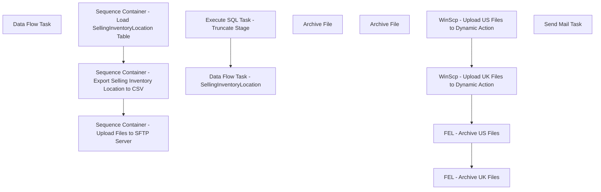

# SSIS Package: WebDynamicActionSellingInventoryLocation

**Project:** WebDynamicActionSellingInventoryLocation  
**Folder:** WEB  
**Server:** STL-SSIS-P-01  

## Connection Managers

| Name | Type | Server | Catalog | Connection (sanitized) |
|---|---|---|---|---|
| IntegrationStaging | OLEDB | stl-ssis-p-01 | IntegrationStaging | Data Source=stl-ssis-p-01; Initial Catalog=IntegrationStaging; Provider=SQLNCLI11.1; Integrated Security=SSPI; Auto Translate=False |
| SMTP | SMTP |  |  |  |
| UK_SellingInventoryLocation | FLATFILE |  |  |  |
| US_SellingInventoryLocation | FLATFILE |  |  |  |
| dw | OLEDB | papamart | dw | Data Source=papamart; Initial Catalog=dw; Provider=SQLNCLI11.1; Integrated Security=SSPI; Auto Translate=False |
| me_01 | OLEDB | BEDROCKDB02 | me_01 | Data Source=BEDROCKDB02; Initial Catalog=me_01; Provider=SQLNCLI11.1; Integrated Security=SSPI; Auto Translate=False |

## Control Flow Tasks

| Task | Type |
|---|---|
| WebDynamicActionSellingInventoryLocation | Package |
| Sequence Container - Export Selling Inventory Location to CSV | SEQUENCE |
| Data Flow Task | Pipeline |
| Sequence Container - Load SellingInventoryLocation Table | SEQUENCE |
| Data Flow Task - SellingInventoryLocation | Pipeline |
| Execute SQL Task - Truncate Stage | ExecuteSQLTask |
| Sequence Container - Upload Files to SFTP Server | SEQUENCE |
| FEL - Archive UK Files | FOREACHLOOP |
| Archive File | FileSystemTask |
| FEL - Archive US Files | FOREACHLOOP |
| Archive File | FileSystemTask |
| WinScp - Upload UK Files to Dynamic Action | ExecuteProcess |
| WinScp - Upload US Files to Dynamic Action | ExecuteProcess |
| Send Mail Task | SendMailTask |

## Control Flow Outline

```text
- Send Mail Task [SendMailTask]
- Sequence Container - Export Selling Inventory Location to CSV [SEQUENCE]
  - Data Flow Task [Pipeline]
- Sequence Container - Load SellingInventoryLocation Table [SEQUENCE]
  - Data Flow Task - SellingInventoryLocation [Pipeline]
  - Execute SQL Task - Truncate Stage [ExecuteSQLTask]
- Sequence Container - Upload Files to SFTP Server [SEQUENCE]
  - FEL - Archive UK Files [FOREACHLOOP]
    - Archive File [FileSystemTask]
  - FEL - Archive US Files [FOREACHLOOP]
    - Archive File [FileSystemTask]
  - WinScp - Upload UK Files to Dynamic Action [ExecuteProcess]
  - WinScp - Upload US Files to Dynamic Action [ExecuteProcess]
```

## Architecture Diagram



## Variables

| Namespace | Name | Expression-bound |
|---|---|---|
| System | Propagate | No |
| User | ArchiveFileDest | No |
| User | ArchiveFileName | No |
| User | DateTimeStamp | Yes |
| User | EndDate | Yes |
| User | EndDateAsDATE | Yes |
| User | FileDestDir | No |
| User | GetDate | Yes |
| User | GetDateAsDATE | Yes |
| User | GetDateDynamicActionFormat | Yes |
| User | StartDate | Yes |
| User | StartDateAsDATE | Yes |

### Expression-bound variable values

#### User::DateTimeStamp

**Expression:**

```sql
(DT_WSTR,4)DATEPART("yyyy",GetDate()) 
+ (DT_WSTR,4)DATEPART("mm",GetDate()) 
+ (DT_WSTR,4)DATEPART("dd",GetDate()) 
+ (DT_WSTR,4)DATEPART("hh",GetDate()) 
+ (DT_WSTR,4)DATEPART("mi",GetDate()) 
+ (DT_WSTR,4)DATEPART("ss",GetDate()) 
+ (DT_WSTR,4)DATEPART("ms",GetDate())
```

**Evaluated value:**

```sql
20226281138153
```

#### User::EndDate

**Expression:**

```sql
dateadd("dd", @[$Package::DaysToInclude], @[User::StartDate])
```

**Evaluated value:**

```sql
6/28/2022
```

#### User::EndDateAsDATE

**Expression:**

```sql
(DT_WSTR, 4) datepart("year", @[User::EndDate])  + "-" +
right("0"+ (DT_WSTR, 2) datepart("mm", @[User::EndDate]),2)  + "-" +
right("0" +(DT_WSTR, 2) datepart("dd",  @[User::EndDate]),2)
```

**Evaluated value:**

```sql
2022-06-28
```

#### User::GetDate

**Expression:**

```sql
(DT_DATE)DATEDIFF("Day", (DT_DATE) 0, GETDATE())
```

**Evaluated value:**

```sql
6/28/2022
```

#### User::GetDateAsDATE

**Expression:**

```sql
(DT_WSTR, 4) datepart("year", @[User::GetDate])  + "-" +
right("0"+ (DT_WSTR, 2) datepart("mm", @[User::GetDate]),2)  + "-" +
right("0" +(DT_WSTR, 2) datepart("dd",  @[User::GetDate]),2)
```

**Evaluated value:**

```sql
2022-06-28
```

#### User::GetDateDynamicActionFormat

**Expression:**

```sql
right("0" +(DT_WSTR, 2) datepart("dd",  @[User::GetDate]),2)+
right("0"+ (DT_WSTR, 2) datepart("mm", @[User::GetDate]),2)+ 
(DT_WSTR, 4) datepart("year", @[User::GetDate])
```

**Evaluated value:**

```sql
28062022
```

#### User::StartDate

**Expression:**

```sql
dateadd("dd", -@[$Package::DaysToGoBack] , @[User::GetDate] )
```

**Evaluated value:**

```sql
6/27/2022
```

#### User::StartDateAsDATE

**Expression:**

```sql
(DT_WSTR, 4) datepart("year", @[User::StartDate])  + "-" +
right("0"+ (DT_WSTR, 2) datepart("mm", @[User::StartDate]),2)  + "-" +
right("0" +(DT_WSTR, 2) datepart("dd",  @[User::StartDate]),2)
```

**Evaluated value:**

```sql
2022-06-27
```

## Execute SQL Tasks

### Execute SQL Task - Truncate Stage

**Path:** `Package\Sequence Container - Load SellingInventoryLocation Table\Execute SQL Task - Truncate Stage`  
**Connection:** IntegrationStaging (stl-ssis-p-01/IntegrationStaging)  

```sql
truncate table WEB.[DynamicActionSellingInventoryLocationStage]
```

## Data Flow: Sources

| Component | Source Object | Type | Data Flow Task | Connection | SQL Kind |
|---|---|---|---|---|---|
| OLE DB Source - SellingInventoryLocaiton - UK |  | OLEDBSource | Data Flow Task | IntegrationStaging | SqlCommand |
| OLE DB Source - SellingInventoryLocation - US |  | OLEDBSource | Data Flow Task | IntegrationStaging | SqlCommand |
| OLE DB Source |  | OLEDBSource | Data Flow Task - SellingInventoryLocation | dw | SqlCommand |

#### OLE DB Source - SellingInventoryLocaiton - UK — SqlCommand

```sql
select Date, 
Site, 
ProductID, 
SKU, 
--PublishDate, -- Omitting Per Dan as of 12/8/2021
IsMarkdown, 
IsDiscontinued, 
isCore, 
SeasonStartDate, 
SeasonEndDate, 
IsSellable, 
IsBackOrder, 
IsPreOder, 
CurrentPrice, 
CurrentPriceExTax, 
FullPrice, 
FullPriceExTax, 
BackorderUnits, 
[Pre-OrderUnits], 
WaitlistUnits
from web.DynamicActionSellingInventoryLocationStage
--where site = 'US'
where site = 'UK'
order by 3
```

#### OLE DB Source - SellingInventoryLocation - US — SqlCommand

```sql
select Date, 
Site, 
ProductID, 
SKU, 
--PublishDate, -- Omitting Per Dan as of 12/8/2021
IsMarkdown, 
IsDiscontinued, 
isCore, 
SeasonStartDate, 
SeasonEndDate, 
IsSellable, 
IsBackOrder, 
IsPreOder, 
CurrentPrice, 
CurrentPriceExTax, 
FullPrice, 
FullPriceExTax, 
BackorderUnits, 
[Pre-OrderUnits], 
WaitlistUnits
from web.DynamicActionSellingInventoryLocationStage
where site = 'US'
--where site = 'UK'
order by 3
```

#### OLE DB Source — SqlCommand

```sql
with UKVatExempt as (

select distinct cast (sku as varchar) as sku
from product_dim
where (department_code in ('R-B-U-46','R-B-U-80') and jurisdiction_code = 'UK')


),
Styles as -- This is the eligible styles we use for the WebPricebook
(
select pf.style_code, 
pf.CurrentPrice, 
pf.SalePrice,
pf.Catalog as ProductSellingGeography, 
a.MerchInDate,
a.MSTAT
from [stl-ssis-p-01].IntegrationStaging.Web.PricebookFact PF
join [stl-ssis-p-01].IntegrationStaging.Web.ProductCatalogMasterAttributes a on pf.style_code=a.style_code 			

),

ProdKey as
(
select
s.style_code, 
s.ProductSellingGeography,
s.CurrentPrice,
s.SalePrice, 
ISNULL(pd1.product_key, ISNULL(pd2.product_key, 0)) as ProductKey,
s.MerchInDate,
S.MSTAT
from ( select s.style_code, s.CurrentPrice, s.SalePrice, s.ProductSellingGeography, s.MerchInDate, s.MSTAT from styles s) s
LEFT JOIN dw.dbo.product_dim pd1 WITH (NOLOCK) ON pd1.sku = s.style_code
		  AND pd1.jurisdiction_code = s.ProductSellingGeography
LEFT JOIN (SELECT sku,
			MIN(product_key) AS product_key
			FROM dw.dbo.product_dim WITH (NOLOCK)
			GROUP BY sku) pd2
ON pd2.sku = s.style_code
)


select 
	cast(getdate()as date) as [Date],
	--'Not Supported?' as Channel, -- Bryce to follow up with Edited 
	pk.ProductSellingGeography as Site, 
	PK.style_code as ProductID,
	PK.style_code as SKU,
	--'BAB?' as Seller, -- We don't think is going to be used, confirm with Bryce 
	pk.MerchInDate as PublishDate, -- Commerce Cloud sourced most likely 
	case when pk.saleprice is null then 'N'
		when pk.saleprice is not null then 'Y'
	end as IsMarkdown,
	--case when isnull(left(pk.mstat,4),'') = 'DISC' then 'Y'
	case when isnull(pk.mstat,'') = 'DISC' then 'Y'
		 when isnull(pk.mstat,'') = 'WEB-D' then 'Y'
		 when isnull(pk.mstat,'') = 'FFB' then 'Y'
		 when isnull(pk.mstat,'') = 'DISC-R' then 'Y'
		 when isnull(pk.mstat,'') = 'CLR' then 'Y'
		 when isnull(pk.mstat,'') = 'QC NO' then 'Y'
		 when isnull(pk.mstat,'') = 'LIC NO' then 'Y'
		 when isnull(pk.mstat,'') = 'WROFF' then 'Y'
		 when isnull(pk.mstat,'') = 'WO' then 'Y'
		 when isnull(pk.mstat,'') = 'GONE' then 'Y'
		 else 'N'
	end as IsDiscontinued, -- Bryce to follow up with possible additional statuses 
	case when isnull(pk.mstat,'') = 'REPL' then 'Y'
		 when isnull(pk.mstat,'') = 'WEB-R' then 'Y'
		 when isnull(pk.mstat,'') = 'REPL-C' then 'Y'
		 else 'N'
	end as isCore, 
	cast (getdate()-1 as date) as SeasonStartDate, -- Use Custom Property iDate 
	cast (getdate()+10 as date) as SeasonEndDate, --Use Custom Property oDate 
	'Y' as IsSellable, -- Hardcoding to Yes due to being in the WebPricebook as those are "StoreFrontEligible", future may be based on Commerce Cloud Attribute 
	'N' as IsBackOrder, -- For now hard coding No
	'N' as IsPreOder, -- For now hard coding No
	case when pk.saleprice is not null then pk.saleprice
		 when pk.saleprice is null then pk.currentprice
	end as CurrentPrice,
	cast (
	case when pk.ProductSellingGeography = 'US'
		then 
					case when pk.saleprice is not null then pk.saleprice
					 when pk.saleprice is null then pk.currentprice
					end
	when pk.ProductSellingGeography = 'UK' and uv.sku is not null 
		then 
					case when pk.saleprice is not null then pk.saleprice
					 when pk.saleprice is null then pk.currentprice
			end
	else 
		case when pk.saleprice is not null then pk.saleprice
		 when pk.saleprice is null then pk.currentprice
	end  /1.2 
	end  as decimal (9,2)) as CurrentPriceExTax, 
	pk.currentprice as FullPrice, -- Per Bryce he wants List Price in Pricebook, but just for my sanity List Price is sourced from Current Price  in pricebookfact per vwPricebookListUSXML
	cast(
	case when pk.ProductSellingGeography = 'US'
		then pk.currentprice  
		 when pk.ProductSellingGeography = 'UK' and uv.sku is not null 
		 then pk.currentprice 
	else pk.currentprice /1.2 
	end as decimal (9,2)) as FullPriceExTax,	
	--case when pk.ProductSellingGeography = 'US' then 'USD'
	--	 when pk.ProductSellingGeography = 'UK' then 'GBP'
	--end as Currency, -- -- Bryce to follow up with Edited , Omitting for now due to not supported 
	0 as BackorderUnits, -- 0 null or possibly omit, follow up with technical team 
	0 as [Pre-OrderUnits],-- 0 null or possibly omit, follow up with technical team 
	0 as WaitlistUnits -- 0 null or possibly omit, follow up with technical team 
from ProdKey pk
join dw.dbo.product_dim pd on pk.ProductKey=pd.product_key
left join UKVatExempt UV on uv.sku=pd.sku
order by 4
```

## Data Flow: Destinations

| Component | Target Table | Type | Data Flow Task | Connection | SQL Kind |
|---|---|---|---|---|---|
| Flat File Destination  - UK Selling Inventory Location |  | FlatFileDestination | Data Flow Task | UK_SellingInventoryLocation |  |
| Flat File Destination - US Selling Inventory Location |  | FlatFileDestination | Data Flow Task | US_SellingInventoryLocation |  |
| OLE DB Destination |  | OLEDBDestination | Data Flow Task - SellingInventoryLocation | IntegrationStaging |  |
