# SSIS Package: WebInventory

**Project:** WebInventory  
**Folder:** WEB  
**Server:** STL-SSIS-P-01  

## Architecture Diagram

```mermaid
flowchart TD
    subgraph Connections
        DW_conn(["DW [OLEDB]"])
        DWStaging_conn(["DWStaging [OLEDB]"])
        ESELL_conn(["ESELL [OLEDB]"])
        IntegrationStaging_conn(["IntegrationStaging [OLEDB]"])
        ME_01_conn(["ME_01 [OLEDB]"])
        PreOrderBackOrderInventoryCSV_conn(["PreOrderBackOrderInventoryCSV [FLATFILE]"])
        ProductInventory_xml_conn(["ProductInventory.xml [FILE]"])
        ProductInventory_xsd_conn(["ProductInventory.xsd [FILE]"])
        ProductInventory_zip_conn(["ProductInventory.zip [FILE]"])
        ProductInventoryCSV_conn(["ProductInventoryCSV [FLATFILE]"])
        ProductInventoryCSVFeedUK_conn(["ProductInventoryCSVFeedUK [FLATFILE]"])
        ProductInventoryCSVFeedUS_conn(["ProductInventoryCSVFeedUS [FLATFILE]"])
        SMTP_EMAIL_conn(["SMTP_EMAIL [SMTP]"])
        Validate_xml_conn(["Validate.xml [FILE]"])
        XML_FILE_conn(["XML FILE [FILE]"])
    end
    subgraph ControlFlow
        WebInventory_task["WebInventory"]
        CSV_File_Generation_and_Move_task["CSV File Generation and Move"]
        WebInventory_task --> CSV_File_Generation_and_Move_task
        Archive_Web_Inventory_task["Archive Web Inventory"]
        CSV_File_Generation_and_Move_task --> Archive_Web_Inventory_task
        Foreach_Loop_Container_task["Foreach Loop Container"]
        Archive_Web_Inventory_task --> Foreach_Loop_Container_task
        Archive_ZIP_File_task["Archive ZIP File"]
        Foreach_Loop_Container_task --> Archive_ZIP_File_task
        Copy_File_to_Feedonomics_Dir_task["Copy File to Feedonomics Dir"]
        Archive_ZIP_File_task --> Copy_File_to_Feedonomics_Dir_task
        Copy_File_to_FTP_Stage_Prod_task["Copy File to FTP Stage Prod"]
        Copy_File_to_Feedonomics_Dir_task --> Copy_File_to_FTP_Stage_Prod_task
        Copy_File_to_FTP_Stage_Test_task["Copy File to FTP Stage Test"]
        Copy_File_to_FTP_Stage_Prod_task --> Copy_File_to_FTP_Stage_Test_task
        Zip_File_task["Zip File"]
        Copy_File_to_FTP_Stage_Test_task --> Zip_File_task
        Inventory_to_CSV_task["Inventory to CSV"]
        Zip_File_task --> Inventory_to_CSV_task
        Send_Mail_Task_task["Send Mail Task"]
        Inventory_to_CSV_task --> Send_Mail_Task_task
        UK_RowCount_Check_task["UK RowCount Check"]
        Send_Mail_Task_task --> UK_RowCount_Check_task
        FAUX_CONTROL_task["FAUX CONTROL"]
        UK_RowCount_Check_task --> FAUX_CONTROL_task
        Feedonomics_Generate_Upload_and_Archive_task["Feedonomics Generate Upload and Archive"]
        FAUX_CONTROL_task --> Feedonomics_Generate_Upload_and_Archive_task
        SeqCont____Generate_and_Zip_Files_task["SeqCont  - Generate and Zip Files"]
        Feedonomics_Generate_Upload_and_Archive_task --> SeqCont____Generate_and_Zip_Files_task
        SeqCont___Generate_UK_and_US_Files_task["SeqCont - Generate UK and US Files"]
        SeqCont____Generate_and_Zip_Files_task --> SeqCont___Generate_UK_and_US_Files_task
        Inventory_to_CSV___UK_task["Inventory to CSV - UK"]
        SeqCont___Generate_UK_and_US_Files_task --> Inventory_to_CSV___UK_task
        Inventory_to_CSV___US_task["Inventory to CSV - US"]
        Inventory_to_CSV___UK_task --> Inventory_to_CSV___US_task
        Zip_Files_task["Zip Files"]
        Inventory_to_CSV___US_task --> Zip_Files_task
        Sequence_Container_task["Sequence Container"]
        Zip_Files_task --> Sequence_Container_task
        FEL___Archive_Feedonomics_File_task["FEL - Archive Feedonomics File"]
        Sequence_Container_task --> FEL___Archive_Feedonomics_File_task
        File_System_Task_task["File System Task"]
        FEL___Archive_Feedonomics_File_task --> File_System_Task_task
        WinSCP___Upload_Files_to_Feedonomics_FTP_task["WinSCP - Upload Files to Feedonomics FTP"]
        File_System_Task_task --> WinSCP___Upload_Files_to_Feedonomics_FTP_task
        Load_Inventory_to_DW_task["Load Inventory to DW"]
        WinSCP___Upload_Files_to_Feedonomics_FTP_task --> Load_Inventory_to_DW_task
        PreStage_Web_and_Store_Inventory_task["PreStage Web and Store Inventory"]
        Load_Inventory_to_DW_task --> PreStage_Web_and_Store_Inventory_task
        Stage_All_Inventory_task["Stage All Inventory"]
        PreStage_Web_and_Store_Inventory_task --> Stage_All_Inventory_task
        Truncate_Stage_task["Truncate Stage"]
        Stage_All_Inventory_task --> Truncate_Stage_task
        SEQ___PreOrder_Capture___WAITING_ON_THE_BUSINESS_task["SEQ - PreOrder Capture - WAITING ON THE BUSINESS"]
        Truncate_Stage_task --> SEQ___PreOrder_Capture___WAITING_ON_THE_BUSINESS_task
        Foreach_Loop___PreOrder_Data_task["Foreach Loop - PreOrder Data"]
        SEQ___PreOrder_Capture___WAITING_ON_THE_BUSINESS_task --> Foreach_Loop___PreOrder_Data_task
        DataFlow___PreOrderCSV_task["DataFlow - PreOrderCSV"]
        Foreach_Loop___PreOrder_Data_task --> DataFlow___PreOrderCSV_task
        Merge_PreOrderBackOrderInventory_task["Merge PreOrderBackOrderInventory"]
        DataFlow___PreOrderCSV_task --> Merge_PreOrderBackOrderInventory_task
        Truncate_PreOrderBackOrderInventoryStage_task["Truncate PreOrderBackOrderInventoryStage"]
        Merge_PreOrderBackOrderInventory_task --> Truncate_PreOrderBackOrderInventoryStage_task
        Stage_Data_task["Stage Data"]
        Truncate_PreOrderBackOrderInventoryStage_task --> Stage_Data_task
        Merge_InventoryFact_task["Merge InventoryFact"]
        Stage_Data_task --> Merge_InventoryFact_task
        Stage_Inventory_From_Dynamics_and_Clipper_task["Stage Inventory From Dynamics and Clipper"]
        Merge_InventoryFact_task --> Stage_Inventory_From_Dynamics_and_Clipper_task
        Truncate_Stage_task["Truncate Stage"]
        Stage_Inventory_From_Dynamics_and_Clipper_task --> Truncate_Stage_task
        Stage_Data_1___backup_task["Stage Data 1 - backup"]
        Truncate_Stage_task --> Stage_Data_1___backup_task
        Merge_from_Enterprise_Selling_task["Merge from Enterprise Selling"]
        Stage_Data_1___backup_task --> Merge_from_Enterprise_Selling_task
        Merge_from_WM_Dynamics_task["Merge from WM Dynamics"]
        Merge_from_Enterprise_Selling_task --> Merge_from_WM_Dynamics_task
        PreStage_Inventory_task["PreStage Inventory"]
        Merge_from_WM_Dynamics_task --> PreStage_Inventory_task
        Stage_Inventory_From_Dynamics_and_Clipper_task["Stage Inventory From Dynamics and Clipper"]
        PreStage_Inventory_task --> Stage_Inventory_From_Dynamics_and_Clipper_task
        Stage_Inventory_from_Enterprise_Selling_task["Stage Inventory from Enterprise Selling"]
        Stage_Inventory_From_Dynamics_and_Clipper_task --> Stage_Inventory_from_Enterprise_Selling_task
        Truncate_Stage_task["Truncate Stage"]
        Stage_Inventory_from_Enterprise_Selling_task --> Truncate_Stage_task
        Send_Email_onError_task["Send Email onError"]
        Truncate_Stage_task --> Send_Email_onError_task
    end
```

## Connection Managers

| Name | Type |
|---|---|
| DW | OLEDB |
| DWStaging | OLEDB |
| ESELL | OLEDB |
| IntegrationStaging | OLEDB |
| ME_01 | OLEDB |
| PreOrderBackOrderInventoryCSV | FLATFILE |
| ProductInventory.xml | FILE |
| ProductInventory.xsd | FILE |
| ProductInventory.zip | FILE |
| ProductInventoryCSV | FLATFILE |
| ProductInventoryCSVFeedUK | FLATFILE |
| ProductInventoryCSVFeedUS | FLATFILE |
| SMTP_EMAIL | SMTP |
| Validate.xml | FILE |
| XML FILE | FILE |

## Control Flow Tasks

| Task | Type |
|---|---|
| WebInventory | Microsoft.Package |
| CSV File Generation and Move | STOCK:SEQUENCE |
| Archive Web Inventory | Microsoft.ExecuteSQLTask |
| Foreach Loop Container | STOCK:FOREACHLOOP |
| Archive ZIP File | Microsoft.FileSystemTask |
| Copy File to Feedonomics Dir | Microsoft.FileSystemTask |
| Copy File to FTP Stage Prod | Microsoft.FileSystemTask |
| Copy File to FTP Stage Test | Microsoft.FileSystemTask |
| Zip File | Microsoft.ExecuteProcess |
| Inventory to CSV | Microsoft.Pipeline |
| Send Mail Task | Microsoft.SendMailTask |
| UK RowCount Check | Microsoft.ExecuteSQLTask |
| FAUX CONTROL | Microsoft.ExecuteSQLTask |
| Feedonomics Generate Upload and Archive | STOCK:SEQUENCE |
| SeqCont  - Generate and Zip Files | STOCK:SEQUENCE |
| SeqCont - Generate UK and US Files | STOCK:SEQUENCE |
| Inventory to CSV - UK | Microsoft.Pipeline |
| Inventory to CSV - US | Microsoft.Pipeline |
| Zip Files | Microsoft.ExecuteProcess |
| Sequence Container | STOCK:SEQUENCE |
| FEL - Archive Feedonomics File | STOCK:FOREACHLOOP |
| File System Task | Microsoft.FileSystemTask |
| WinSCP - Upload Files to Feedonomics FTP | Microsoft.ExecuteProcess |
| Load Inventory to DW | STOCK:SEQUENCE |
| PreStage Web and Store Inventory | Microsoft.ExecuteSQLTask |
| Stage All Inventory | Microsoft.Pipeline |
| Truncate Stage | Microsoft.ExecuteSQLTask |
| SEQ - PreOrder Capture - WAITING ON THE BUSINESS | STOCK:SEQUENCE |
| Foreach Loop - PreOrder Data | STOCK:FOREACHLOOP |
| DataFlow - PreOrderCSV | Microsoft.Pipeline |
| Merge PreOrderBackOrderInventory | Microsoft.ExecuteSQLTask |
| Truncate PreOrderBackOrderInventoryStage | Microsoft.ExecuteSQLTask |
| Stage Data | STOCK:SEQUENCE |
| Merge InventoryFact | Microsoft.ExecuteSQLTask |
| Stage Inventory From Dynamics and Clipper | Microsoft.Pipeline |
| Truncate Stage | Microsoft.ExecuteSQLTask |
| Stage Data 1 - backup | STOCK:SEQUENCE |
| Merge from Enterprise Selling | Microsoft.ExecuteSQLTask |
| Merge from WM Dynamics | Microsoft.ExecuteSQLTask |
| PreStage Inventory | Microsoft.ExecuteSQLTask |
| Stage Inventory From Dynamics and Clipper | Microsoft.Pipeline |
| Stage Inventory from Enterprise Selling | Microsoft.Pipeline |
| Truncate Stage | Microsoft.ExecuteSQLTask |
| Send Email onError | Microsoft.SendMailTask |

## Data Flow: Sources

| Component | SQL Preview |
|---|---|
|  | select * from WEB.vwInventoryCSV --where cast(WarehouseCode as int)=? -- Remarked out on 8/22/2023 |
|  | select c.GTIN,  c.TotalQuantity, c.WarehouseCode,  c.ProductCode from WEB.vwInventoryCSV C where cast(WarehouseCode as int)= '2013' |
|  | select c.GTIN,  c.TotalQuantity, c.WarehouseCode,  c.ProductCode from WEB.vwInventoryCSV C where cast(WarehouseCode as int)= '0013' |
|  | select cast(actual_date as date) as ActualDate, date_key  from date_dim with (nolock) |
|  | select   	style_code, 	jurisdiction_code, 	product_key  from product_dim with (nolock) where style_code is not null and jurisdiction_code in ('US', 'UK') |
|  | select  	v.StyleCode, 	v.StoreInventoryUS, 	v.StoreInventoryUK, 	v.WebInventoryUS, 	v.WebInventoryUK, 	v.WarehouseInventoryUS, 	v.WarehouseInventoryUK, 	cast(getdate() as date) as InventoryDate, 	j.attribute_set_code as Jurisdiction   from vwDWInventoryRollups v left join vwDW_ProductPrimaryJurisdiction j on v.StyleCode = j.style_code |
|  | select  	'0013' as LocationCode, 	cast(ItemNumber as varchar(6)) as SKU, 	ONHANDQUANTITY as Quantity from WMS.WarehouseOnHand --DATA IS CAPTURED HOURLY FROM DYNAMICS AND LOADED TO THIS TABLE where 1=1 and InventoryWarehouseID in ('1013') and isnumeric(left(ItemNumber,1)) = 1 UNION select  	'2013' as LocationCode, 	cast(pb.StyleCode as varchar(6)) as SKU, 	sum((AVLQuantity + ALLQuantity + PCKQuanti |
|  | with MaxDate as 	( 		select 			StyleCode, 			Max(InventoryDate) MaxDate 		from web.UKWebstoreProductBalance with (nolock) 		group by  			StyleCode 	) select  	'0013' as LocationCode, 	cast(ItemNumber as varchar(6)) as SKU, 	ONHANDQUANTITY as Quantity from WMS.WarehouseOnHand --DATA IS CAPTURED HOURLY FROM DYNAMICS AND LOADED TO THIS TABLE where 1=1 and InventoryWarehouseID in ('1013') and isnumeri |
|  | select x.sku_id, cast(right(x.outlet_id, 4) as varchar(4)) as LocationCode, cast(sum(x.qty) as int) as QTY from esell.outlet_sku_xref x with (nolock) group by x.sku_id, cast(right(x.outlet_id, 4) as varchar(4)) |

## Data Flow: Destinations

| Component | Destination |
|---|---|
|  | [WEB].[vwInventoryCSV] |
|  | [WEB].[vwInventoryCSV] |
|  | [WEB].[vwInventoryCSV] |
|  | [dbo].[vwDWInventoryRollups] |
|  | [WebInventoryRollups] |
|  | [WEB].[PreOrderBackOrderInventoryStage] |
|  | [WEB].[WMInventoryStage] |
|  | [WEB].[WMInventoryStage] |
|  | [WEB].[InventoryStage] |
|  | [dbo].[WebInventoryStage] |

