# SSIS Package: WebInventory

**Project:** WebInventory  
**Folder:** WEB  
**Server:** STL-SSIS-P-01  

## Connection Managers

| Name | Type | Server | Catalog | Connection (sanitized) |
|---|---|---|---|---|
| DW | OLEDB | papamart | dw | Data Source=papamart; Initial Catalog=dw; Provider=SQLNCLI11.1; Integrated Security=SSPI; Auto Translate=False |
| DWStaging | OLEDB | papamart | DWStaging | Data Source=papamart; Initial Catalog=DWStaging; Provider=SQLNCLI11.1; Integrated Security=SSPI; Auto Translate=False |
| ESELL | OLEDB | bedrockdb02 | esell | Data Source=bedrockdb02; Initial Catalog=esell; Provider=SQLNCLI11.1; Integrated Security=SSPI; Auto Translate=False |
| IntegrationStaging | OLEDB | STL-SSIS-P-01 | IntegrationStaging | Data Source=STL-SSIS-P-01; Initial Catalog=IntegrationStaging; Provider=SQLNCLI11.1; Integrated Security=SSPI; Auto Translate=False |
| ME_01 | OLEDB | bedrockdb02 | me_01 | Data Source=bedrockdb02; Initial Catalog=me_01; Provider=SQLNCLI11.1; Integrated Security=SSPI; Auto Translate=False |
| PreOrderBackOrderInventoryCSV | FLATFILE |  |  |  |
| ProductInventory.xml | FILE |  |  |  |
| ProductInventory.xsd | FILE |  |  |  |
| ProductInventory.zip | FILE |  |  |  |
| ProductInventoryCSV | FLATFILE |  |  |  |
| ProductInventoryCSVFeedUK | FLATFILE |  |  |  |
| ProductInventoryCSVFeedUS | FLATFILE |  |  |  |
| SMTP_EMAIL | SMTP |  |  |  |
| Validate.xml | FILE |  |  |  |
| XML FILE | FILE |  |  |  |

## Control Flow Tasks

| Task | Type |
|---|---|
| WebInventory | Package |
| CSV File Generation and Move | SEQUENCE |
| Archive Web Inventory | ExecuteSQLTask |
| Foreach Loop Container | FOREACHLOOP |
| Archive ZIP File | FileSystemTask |
| Copy File to Feedonomics Dir | FileSystemTask |
| Copy File to FTP Stage Prod | FileSystemTask |
| Copy File to FTP Stage Test | FileSystemTask |
| Zip File | ExecuteProcess |
| Inventory to CSV | Pipeline |
| Send Mail Task | SendMailTask |
| UK RowCount Check | ExecuteSQLTask |
| FAUX CONTROL | ExecuteSQLTask |
| Feedonomics Generate Upload and Archive | SEQUENCE |
| SeqCont  - Generate and Zip Files | SEQUENCE |
| SeqCont - Generate UK and US Files | SEQUENCE |
| Inventory to CSV - UK | Pipeline |
| Inventory to CSV - US | Pipeline |
| Zip Files | ExecuteProcess |
| Sequence Container | SEQUENCE |
| FEL - Archive Feedonomics File | FOREACHLOOP |
| File System Task | FileSystemTask |
| WinSCP - Upload Files to Feedonomics FTP | ExecuteProcess |
| Load Inventory to DW | SEQUENCE |
| PreStage Web and Store Inventory | ExecuteSQLTask |
| Stage All Inventory | Pipeline |
| Truncate Stage | ExecuteSQLTask |
| SEQ - PreOrder Capture - WAITING ON THE BUSINESS | SEQUENCE |
| Foreach Loop - PreOrder Data | FOREACHLOOP |
| DataFlow - PreOrderCSV | Pipeline |
| Merge PreOrderBackOrderInventory | ExecuteSQLTask |
| Truncate PreOrderBackOrderInventoryStage | ExecuteSQLTask |
| Stage Data | SEQUENCE |
| Merge InventoryFact | ExecuteSQLTask |
| Stage Inventory From Dynamics and Clipper | Pipeline |
| Truncate Stage | ExecuteSQLTask |
| Stage Data 1 - backup | SEQUENCE |
| Merge from Enterprise Selling | ExecuteSQLTask |
| Merge from WM Dynamics | ExecuteSQLTask |
| PreStage Inventory | ExecuteSQLTask |
| Stage Inventory From Dynamics and Clipper | Pipeline |
| Stage Inventory from Enterprise Selling | Pipeline |
| Truncate Stage | ExecuteSQLTask |
| Send Email onError | SendMailTask |

## Control Flow Outline

```text
- Send Email onError [SendMailTask]
- CSV File Generation and Move [SEQUENCE]
  - Archive Web Inventory [ExecuteSQLTask]
  - Foreach Loop Container [FOREACHLOOP]
    - Archive ZIP File [FileSystemTask]
    - Copy File to FTP Stage Prod [FileSystemTask]
    - Copy File to FTP Stage Test [FileSystemTask]
    - Copy File to Feedonomics Dir [FileSystemTask]
    - Zip File [ExecuteProcess]
  - Inventory to CSV [Pipeline]
  - Send Mail Task [SendMailTask]
  - UK RowCount Check [ExecuteSQLTask]
- FAUX CONTROL [ExecuteSQLTask]
- Feedonomics Generate Upload and Archive [SEQUENCE]
  - SeqCont  - Generate and Zip Files [SEQUENCE]
    - SeqCont - Generate UK and US Files [SEQUENCE]
      - Inventory to CSV - UK [Pipeline]
      - Inventory to CSV - US [Pipeline]
    - Zip Files [ExecuteProcess]
  - Sequence Container [SEQUENCE]
    - FEL - Archive Feedonomics File [FOREACHLOOP]
      - File System Task [FileSystemTask]
    - WinSCP - Upload Files to Feedonomics FTP [ExecuteProcess]
- Load Inventory to DW [SEQUENCE]
  - PreStage Web and Store Inventory [ExecuteSQLTask]
  - Stage All Inventory [Pipeline]
  - Truncate Stage [ExecuteSQLTask]
- SEQ - PreOrder Capture - WAITING ON THE BUSINESS [SEQUENCE]
  - Foreach Loop - PreOrder Data [FOREACHLOOP]
    - DataFlow - PreOrderCSV [Pipeline]
    - Merge PreOrderBackOrderInventory [ExecuteSQLTask]
  - Truncate PreOrderBackOrderInventoryStage [ExecuteSQLTask]
- Stage Data [SEQUENCE]
- Stage Data 1 - backup [SEQUENCE]
  - Merge from Enterprise Selling [ExecuteSQLTask]
  - Merge from WM Dynamics [ExecuteSQLTask]
  - PreStage Inventory [ExecuteSQLTask]
  - Stage Inventory From Dynamics and Clipper [Pipeline]
  - Stage Inventory from Enterprise Selling [Pipeline]
  - Truncate Stage [ExecuteSQLTask]
  - Merge InventoryFact [ExecuteSQLTask]
  - Stage Inventory From Dynamics and Clipper [Pipeline]
  - Truncate Stage [ExecuteSQLTask]
```

## Architecture Diagram

```mermaid
flowchart TD
    n_Package_CSV_File_Generation_and_Move["CSV File Generation and Move"]
    n_Package_CSV_File_Generation_and_Move_Archive_Web_Inventory["Archive Web Inventory"]
    n_Package_CSV_File_Generation_and_Move_Foreach_Loop_Container["Foreach Loop Container"]
    n_Package_CSV_File_Generation_and_Move_Foreach_Loop_Container_Archive_ZIP_File["Archive ZIP File"]
    n_Package_CSV_File_Generation_and_Move_Foreach_Loop_Container_Copy_File_to_Feedonomics_Dir["Copy File to Feedonomics Dir"]
    n_Package_CSV_File_Generation_and_Move_Foreach_Loop_Container_Copy_File_to_FTP_Stage_Prod["Copy File to FTP Stage Prod"]
    n_Package_CSV_File_Generation_and_Move_Foreach_Loop_Container_Copy_File_to_FTP_Stage_Test["Copy File to FTP Stage Test"]
    n_Package_CSV_File_Generation_and_Move_Foreach_Loop_Container_Zip_File["Zip File"]
    n_Package_CSV_File_Generation_and_Move_Inventory_to_CSV["Inventory to CSV"]
    n_Package_CSV_File_Generation_and_Move_Send_Mail_Task["Send Mail Task"]
    n_Package_CSV_File_Generation_and_Move_UK_RowCount_Check["UK RowCount Check"]
    n_Package_FAUX_CONTROL["FAUX CONTROL"]
    n_Package_Feedonomics_Generate_Upload_and_Archive["Feedonomics Generate Upload and Archive"]
    n_Package_Feedonomics_Generate_Upload_and_Archive_SeqCont____Generate_and_Zip_Files["SeqCont  - Generate and Zip Files"]
    n_Package_Feedonomics_Generate_Upload_and_Archive_SeqCont____Generate_and_Zip_Files_SeqCont___Generate_UK_and_US_Files["SeqCont - Generate UK and US Files"]
    n_Package_Feedonomics_Generate_Upload_and_Archive_SeqCont____Generate_and_Zip_Files_SeqCont___Generate_UK_and_US_Files_Inventory_to_CSV___UK["Inventory to CSV - UK"]
    n_Package_Feedonomics_Generate_Upload_and_Archive_SeqCont____Generate_and_Zip_Files_SeqCont___Generate_UK_and_US_Files_Inventory_to_CSV___US["Inventory to CSV - US"]
    n_Package_Feedonomics_Generate_Upload_and_Archive_SeqCont____Generate_and_Zip_Files_Zip_Files["Zip Files"]
    n_Package_Feedonomics_Generate_Upload_and_Archive_Sequence_Container["Sequence Container"]
    n_Package_Feedonomics_Generate_Upload_and_Archive_Sequence_Container_FEL___Archive_Feedonomics_File["FEL - Archive Feedonomics File"]
    n_Package_Feedonomics_Generate_Upload_and_Archive_Sequence_Container_FEL___Archive_Feedonomics_File_File_System_Task["File System Task"]
    n_Package_Feedonomics_Generate_Upload_and_Archive_Sequence_Container_WinSCP___Upload_Files_to_Feedonomics_FTP["WinSCP - Upload Files to Feedonomics FTP"]
    n_Package_Load_Inventory_to_DW["Load Inventory to DW"]
    n_Package_Load_Inventory_to_DW_PreStage_Web_and_Store_Inventory["PreStage Web and Store Inventory"]
    n_Package_Load_Inventory_to_DW_Stage_All_Inventory["Stage All Inventory"]
    n_Package_Load_Inventory_to_DW_Truncate_Stage["Truncate Stage"]
    n_Package_SEQ___PreOrder_Capture___WAITING_ON_THE_BUSINESS["SEQ - PreOrder Capture - WAITING ON THE BUSINESS"]
    n_Package_SEQ___PreOrder_Capture___WAITING_ON_THE_BUSINESS_Foreach_Loop___PreOrder_Data["Foreach Loop - PreOrder Data"]
    n_Package_SEQ___PreOrder_Capture___WAITING_ON_THE_BUSINESS_Foreach_Loop___PreOrder_Data_DataFlow___PreOrderCSV["DataFlow - PreOrderCSV"]
    n_Package_SEQ___PreOrder_Capture___WAITING_ON_THE_BUSINESS_Foreach_Loop___PreOrder_Data_Merge_PreOrderBackOrderInventory["Merge PreOrderBackOrderInventory"]
    n_Package_SEQ___PreOrder_Capture___WAITING_ON_THE_BUSINESS_Truncate_PreOrderBackOrderInventoryStage["Truncate PreOrderBackOrderInventoryStage"]
    n_Package_Stage_Data["Stage Data"]
    n_Package_Stage_Data_Merge_InventoryFact["Merge InventoryFact"]
    n_Package_Stage_Data_Stage_Inventory_From_Dynamics_and_Clipper["Stage Inventory From Dynamics and Clipper"]
    n_Package_Stage_Data_Truncate_Stage["Truncate Stage"]
    n_Package_Stage_Data_1___backup["Stage Data 1 - backup"]
    n_Package_Stage_Data_1___backup_Merge_from_Enterprise_Selling["Merge from Enterprise Selling"]
    n_Package_Stage_Data_1___backup_Merge_from_WM_Dynamics["Merge from WM Dynamics"]
    n_Package_Stage_Data_1___backup_PreStage_Inventory["PreStage Inventory"]
    n_Package_Stage_Data_1___backup_Stage_Inventory_From_Dynamics_and_Clipper["Stage Inventory From Dynamics and Clipper"]
    n_Package_Stage_Data_1___backup_Stage_Inventory_from_Enterprise_Selling["Stage Inventory from Enterprise Selling"]
    n_Package_Stage_Data_1___backup_Truncate_Stage["Truncate Stage"]
    n_Package_EventHandlers_OnError__Send_Email_onError["Send Email onError"]
    n_Package_CSV_File_Generation_and_Move_Foreach_Loop_Container_Copy_File_to_FTP_Stage_Test --> n_Package_CSV_File_Generation_and_Move_Foreach_Loop_Container_Copy_File_to_Feedonomics_Dir
    n_Package_CSV_File_Generation_and_Move_Foreach_Loop_Container_Copy_File_to_Feedonomics_Dir --> n_Package_CSV_File_Generation_and_Move_Foreach_Loop_Container_Archive_ZIP_File
    n_Package_CSV_File_Generation_and_Move_Foreach_Loop_Container_Zip_File --> n_Package_CSV_File_Generation_and_Move_Foreach_Loop_Container_Copy_File_to_FTP_Stage_Prod
    n_Package_CSV_File_Generation_and_Move_Foreach_Loop_Container_Copy_File_to_FTP_Stage_Prod --> n_Package_CSV_File_Generation_and_Move_Foreach_Loop_Container_Copy_File_to_FTP_Stage_Test
    n_Package_CSV_File_Generation_and_Move_Inventory_to_CSV --> n_Package_CSV_File_Generation_and_Move_Foreach_Loop_Container
    n_Package_CSV_File_Generation_and_Move_UK_RowCount_Check --> n_Package_CSV_File_Generation_and_Move_Send_Mail_Task
    n_Package_CSV_File_Generation_and_Move_UK_RowCount_Check --> n_Package_CSV_File_Generation_and_Move_Inventory_to_CSV
    n_Package_CSV_File_Generation_and_Move_Foreach_Loop_Container --> n_Package_CSV_File_Generation_and_Move_Archive_Web_Inventory
    n_Package_Feedonomics_Generate_Upload_and_Archive_SeqCont____Generate_and_Zip_Files_SeqCont___Generate_UK_and_US_Files --> n_Package_Feedonomics_Generate_Upload_and_Archive_SeqCont____Generate_and_Zip_Files_Zip_Files
    n_Package_Feedonomics_Generate_Upload_and_Archive_Sequence_Container_WinSCP___Upload_Files_to_Feedonomics_FTP --> n_Package_Feedonomics_Generate_Upload_and_Archive_Sequence_Container_FEL___Archive_Feedonomics_File
    n_Package_Feedonomics_Generate_Upload_and_Archive_SeqCont____Generate_and_Zip_Files --> n_Package_Feedonomics_Generate_Upload_and_Archive_Sequence_Container
    n_Package_Load_Inventory_to_DW_PreStage_Web_and_Store_Inventory --> n_Package_Load_Inventory_to_DW_Stage_All_Inventory
    n_Package_Load_Inventory_to_DW_Truncate_Stage --> n_Package_Load_Inventory_to_DW_PreStage_Web_and_Store_Inventory
    n_Package_SEQ___PreOrder_Capture___WAITING_ON_THE_BUSINESS_Foreach_Loop___PreOrder_Data_DataFlow___PreOrderCSV --> n_Package_SEQ___PreOrder_Capture___WAITING_ON_THE_BUSINESS_Foreach_Loop___PreOrder_Data_Merge_PreOrderBackOrderInventory
    n_Package_SEQ___PreOrder_Capture___WAITING_ON_THE_BUSINESS_Truncate_PreOrderBackOrderInventoryStage --> n_Package_SEQ___PreOrder_Capture___WAITING_ON_THE_BUSINESS_Foreach_Loop___PreOrder_Data
    n_Package_Stage_Data_Truncate_Stage --> n_Package_Stage_Data_Stage_Inventory_From_Dynamics_and_Clipper
    n_Package_Stage_Data_Stage_Inventory_From_Dynamics_and_Clipper --> n_Package_Stage_Data_Merge_InventoryFact
    n_Package_Stage_Data_1___backup_Truncate_Stage --> n_Package_Stage_Data_1___backup_PreStage_Inventory
    n_Package_Stage_Data_1___backup_Stage_Inventory_from_Enterprise_Selling --> n_Package_Stage_Data_1___backup_Stage_Inventory_From_Dynamics_and_Clipper
    n_Package_Stage_Data_1___backup_PreStage_Inventory --> n_Package_Stage_Data_1___backup_Stage_Inventory_from_Enterprise_Selling
    n_Package_Stage_Data_1___backup_Stage_Inventory_From_Dynamics_and_Clipper --> n_Package_Stage_Data_1___backup_Merge_from_Enterprise_Selling
    n_Package_Stage_Data_1___backup_Merge_from_Enterprise_Selling --> n_Package_Stage_Data_1___backup_Merge_from_WM_Dynamics
    n_Package_Stage_Data --> n_Package_CSV_File_Generation_and_Move
    n_Package_CSV_File_Generation_and_Move --> n_Package_Feedonomics_Generate_Upload_and_Archive
    n_Package_FAUX_CONTROL --> n_Package_Stage_Data
    n_Package_FAUX_CONTROL --> n_Package_Load_Inventory_to_DW
```



## Variables

| Namespace | Name | Expression-bound |
|---|---|---|
| System | Propagate | No |
| User | FTPStageDirectory | Yes |
| User | FeedonomicsFTPStageDirectory | Yes |
| User | FeedonomicsInventoryFileRename | Yes |
| User | FeedonomicsProductInventoryCsvUK | Yes |
| User | FeedonomicsProductInventoryCsvUS | Yes |
| User | FelFoundFileName | No |
| User | FileName | No |
| User | FtpStageDirectoryTest | No |
| User | InventoryFileRename | Yes |
| User | LoadType | Yes |
| User | PreOrderCSV | No |
| User | ProductInventoryCSV_ConnectionString | Yes |
| User | SQL_InventoryOutputQuery | No |
| User | Source | Yes |
| User | UKRowCount | No |
| User | ZipCommand | Yes |
| User | ZipDest | Yes |
| User | ZipSource | No |

### Expression-bound variable values

#### User::FTPStageDirectory

**Expression:**

```sql
@[$Package::WebInventoryFTPStageLocation]
```

**Evaluated value:**

```sql
\\stl-sftp-p-01\ecommerce\to-deck\Inventory\Prod\
```

#### User::FeedonomicsFTPStageDirectory

**Expression:**

```sql
@[$Package::FeedonomicsFTPStageLocation]
```

**Evaluated value:**

```sql
\\stl-ssis-p-01\IntegrationStaging\WEB\Outbound\Feedonomics\Inventory\
```

#### User::FeedonomicsInventoryFileRename

**Expression:**

```sql
"\\\\" + @[$Package::IntegrationStaging_ServerName] + "\\IntegrationStaging\\WEB\\Outbound\\Feedonomics\\Inventory\\Archive\\" + "ProductInventoryWeb" + 
(DT_WSTR, 4) YEAR( @[System::ContainerStartTime]  ) +  (DT_WSTR, 2) MONTH( @[System::ContainerStartTime]  ) + (DT_WSTR, 2) DAY( @[System::ContainerStartTime]  ) +  (DT_WSTR, 2) DATEPART("Hh", @[System::ContainerStartTime] ) + (DT_WSTR, 2) DATEPART("mi", @[System::ContainerStartTime] ) + (DT_WSTR, 2) DATEPART("ss", @[System::ContainerStartTime] ) + (DT_WSTR, 2) DATEPART("Ms", @[System::ContainerStartTime] ) + ".zip"
```

**Evaluated value:**

```sql
\\STL-SSIS-P-01\IntegrationStaging\WEB\Outbound\Feedonomics\Inventory\Archive\ProductInventoryWeb202412101037330.zip
```

#### User::FeedonomicsProductInventoryCsvUK

**Expression:**

```sql
@[User::FeedonomicsFTPStageDirectory]+ "ProductInventoryUK.csv"
```

**Evaluated value:**

```sql
\\stl-ssis-p-01\IntegrationStaging\WEB\Outbound\Feedonomics\Inventory\ProductInventoryUK.csv
```

#### User::FeedonomicsProductInventoryCsvUS

**Expression:**

```sql
@[User::FeedonomicsFTPStageDirectory] + "ProductInventoryUS.csv"
```

**Evaluated value:**

```sql
\\stl-ssis-p-01\IntegrationStaging\WEB\Outbound\Feedonomics\Inventory\ProductInventoryUS.csv
```

#### User::InventoryFileRename

**Expression:**

```sql
"\\\\" + @[$Package::IntegrationStaging_ServerName] + "\\IntegrationStaging\\WEB\\Outbound\\Inventory\\Archive\\" + "ProductInventoryWeb" + 
(DT_WSTR, 4) YEAR( @[System::ContainerStartTime]  ) +  (DT_WSTR, 2) MONTH( @[System::ContainerStartTime]  ) + (DT_WSTR, 2) DAY( @[System::ContainerStartTime]  ) +  (DT_WSTR, 2) DATEPART("Hh", @[System::ContainerStartTime] ) + (DT_WSTR, 2) DATEPART("mi", @[System::ContainerStartTime] ) + (DT_WSTR, 2) DATEPART("ss", @[System::ContainerStartTime] ) + (DT_WSTR, 2) DATEPART("Ms", @[System::ContainerStartTime] ) + ".zip"
```

**Evaluated value:**

```sql
\\STL-SSIS-P-01\IntegrationStaging\WEB\Outbound\Inventory\Archive\ProductInventoryWeb202412101037330.zip
```

#### User::LoadType

**Expression:**

```sql
@[$Package::LoadType]
```

**Evaluated value:**

```sql
FULL
```

#### User::ProductInventoryCSV_ConnectionString

**Expression:**

```sql
@[$Package::WebInventoryCSVPreStageLocation] + "ProductInventory.csv"
```

**Evaluated value:**

```sql
\\stl-ssis-p-01\IntegrationStaging\WEB\Outbound\Inventory\ProductInventory.csv
```

#### User::Source

**Expression:**

```sql
@[$Package::WebInventorySource]
```

**Evaluated value:**

```sql
WM
```

#### User::ZipCommand

**Expression:**

```sql
"a -tzip \""+ @[User::ZipDest]  + "\"  \"" +  @[User::ZipSource]  +"\" -sdel"
```

**Evaluated value:**

```sql
a -tzip "\\STL-SSIS-P-01\IntegrationStaging\WEB\Outbound\Inventory\ProductInventoryWeb.zip"  "ProductInventory.csv" -sdel
```

#### User::ZipDest

**Expression:**

```sql
"\\\\" +  @[$Package::IntegrationStaging_ServerName] + "\\IntegrationStaging\\WEB\\Outbound\\Inventory\\ProductInventoryWeb.zip"
```

**Evaluated value:**

```sql
\\STL-SSIS-P-01\IntegrationStaging\WEB\Outbound\Inventory\ProductInventoryWeb.zip
```

## Execute SQL Tasks

### Archive Web Inventory

**Path:** `Package\CSV File Generation and Move\Archive Web Inventory`  
**Connection:** IntegrationStaging (STL-SSIS-P-01/IntegrationStaging)  

> ⚠️ `SqlStatementSource` is overridden at runtime by a property expression (shown below); the static SQL may not be what executes.

**Static SqlStatementSource:**

```sql
insert WEB.InventoryFactWebArchive 
select 
 LocationCode,
 GTIN,
 StyleCode,
 QTY,
 PreviousQTY,
 SellingGeography,
 UnbufferedQty,
 InsertDate,
 UpdateDate,
 CheckDate
from WEB.InventoryFact 
where LocationCode = 0
```

**Property expression (runtime override):**

```sql
"insert WEB.InventoryFactWebArchive 
select 
 LocationCode,
 GTIN,
 StyleCode,
 QTY,
 PreviousQTY,
 SellingGeography,
 UnbufferedQty,
 InsertDate,
 UpdateDate,
 CheckDate
from WEB.InventoryFact 
where LocationCode = " + (DT_STR, 4, 1252) @[$Package::LocationID]
```

### UK RowCount Check

**Path:** `Package\CSV File Generation and Move\UK RowCount Check`  
**Connection:** IntegrationStaging (STL-SSIS-P-01/IntegrationStaging)  

```sql
select count(*) as UKRowCount
from web.UKWebstoreProductBalance 
where datediff(dd, InventoryDate, getdate())=0
```

### FAUX CONTROL

**Path:** `Package\FAUX CONTROL`  
**Connection:** IntegrationStaging (STL-SSIS-P-01/IntegrationStaging)  

```sql
--DO NOTHING -- CONTROLS FLOW --
```

### PreStage Web and Store Inventory

**Path:** `Package\Load Inventory to DW\PreStage Web and Store Inventory`  
**Connection:** ESELL (bedrockdb02/esell)  

```sql
exec spSelectEnterpriseSellingInventory
```

### Truncate Stage

**Path:** `Package\Load Inventory to DW\Truncate Stage`  
**Connection:** DW (papamart/dw)  

```sql
TRUNCATE TABLE WebInventoryRollups
```

### Merge PreOrderBackOrderInventory

**Path:** `Package\SEQ - PreOrder Capture - WAITING ON THE BUSINESS\Foreach Loop - PreOrder Data\Merge PreOrderBackOrderInventory`  
**Connection:** IntegrationStaging (STL-SSIS-P-01/IntegrationStaging)  

```sql
exec web.spMergePreOrderBackOrderInventory
```

### Truncate PreOrderBackOrderInventoryStage

**Path:** `Package\SEQ - PreOrder Capture - WAITING ON THE BUSINESS\Truncate PreOrderBackOrderInventoryStage`  
**Connection:** IntegrationStaging (STL-SSIS-P-01/IntegrationStaging)  

```sql
Truncate Table WEB.PreOrderBackOrderInventoryStage
```

### Merge from Enterprise Selling

**Path:** `Package\Stage Data 1 - backup\Merge from Enterprise Selling`  
**Connection:** IntegrationStaging (STL-SSIS-P-01/IntegrationStaging)  

> ⚠️ `SqlStatementSource` is overridden at runtime by a property expression (shown below); the static SQL may not be what executes.

**Static SqlStatementSource:**

```sql
exec WEB.spMergeInventoryFact 
 @LoadType = 'FULL'
```

**Property expression (runtime override):**

```sql
"exec WEB.spMergeInventoryFact 
 @LoadType = '" +  @[User::LoadType] + "'"
```

### Merge from WM Dynamics

**Path:** `Package\Stage Data 1 - backup\Merge from WM Dynamics`  
**Connection:** IntegrationStaging (STL-SSIS-P-01/IntegrationStaging)  

```sql
exec WEB.spMergeInventoryFactFromWM
```

### PreStage Inventory

**Path:** `Package\Stage Data 1 - backup\PreStage Inventory`  
**Connection:** ESELL (bedrockdb02/esell)  

```sql
exec spSelectEnterpriseSellingInventory
```

### Truncate Stage

**Path:** `Package\Stage Data 1 - backup\Truncate Stage`  
**Connection:** IntegrationStaging (STL-SSIS-P-01/IntegrationStaging)  

```sql
TRUNCATE TABLE WEB.InventoryStage
TRUNCATE TABLE WEB.WMInventoryStage

```

### Merge InventoryFact

**Path:** `Package\Stage Data\Merge InventoryFact`  
**Connection:** IntegrationStaging (STL-SSIS-P-01/IntegrationStaging)  

```sql
exec WEB.spMergeInventoryFactFromWM
```

### Truncate Stage

**Path:** `Package\Stage Data\Truncate Stage`  
**Connection:** IntegrationStaging (STL-SSIS-P-01/IntegrationStaging)  

```sql
TRUNCATE TABLE WEB.InventoryStage
TRUNCATE TABLE WEB.WMInventoryStage

```

## Data Flow: Sources

| Component | Source Object | Type | Data Flow Task | Connection | SQL Kind |
|---|---|---|---|---|---|
| vwInventoryCSV |  | OLEDBSource | Inventory to CSV | IntegrationStaging | SqlCommand |
| vwInventoryCSV |  | OLEDBSource | Inventory to CSV - UK | IntegrationStaging | SqlCommand |
| vwInventoryCSV |  | OLEDBSource | Inventory to CSV - US | IntegrationStaging | SqlCommand |
| Staged Inventory Data |  | OLEDBSource | Stage All Inventory | ME_01 | SqlCommand |
| PreOrderBackOrderCSV |  | FlatFileSource | DataFlow - PreOrderCSV | PreOrderBackOrderInventoryCSV |  |
| Dynamics Union Clipper |  | OLEDBSource | Stage Inventory From Dynamics and Clipper | IntegrationStaging | SqlCommand |
| Dynamics Union Clipper |  | OLEDBSource | Stage Inventory From Dynamics and Clipper | IntegrationStaging | SqlCommand |
| WebInventoryStage |  | OLEDBSource | Stage Inventory from Enterprise Selling | ESELL | SqlCommand |

#### vwInventoryCSV — SqlCommand

```sql
select *
from WEB.vwInventoryCSV
--where cast(WarehouseCode as int)=? -- Remarked out on 8/22/2023
```

#### vwInventoryCSV — SqlCommand

```sql
select
c.GTIN, 
c.TotalQuantity,
c.WarehouseCode, 
c.ProductCode
from WEB.vwInventoryCSV C
where cast(WarehouseCode as int)= '2013'
```

#### vwInventoryCSV — SqlCommand

```sql
select
c.GTIN, 
c.TotalQuantity,
c.WarehouseCode, 
c.ProductCode
from WEB.vwInventoryCSV C
where cast(WarehouseCode as int)= '0013'
```

#### Staged Inventory Data — SqlCommand

```sql
select 
	v.StyleCode,
	v.StoreInventoryUS,
	v.StoreInventoryUK,
	v.WebInventoryUS,
	v.WebInventoryUK,
	v.WarehouseInventoryUS,
	v.WarehouseInventoryUK,
	cast(getdate() as date) as InventoryDate,
	j.attribute_set_code as Jurisdiction  
from vwDWInventoryRollups v
left join vwDW_ProductPrimaryJurisdiction j on v.StyleCode = j.style_code
```

#### Dynamics Union Clipper — SqlCommand

```sql
select 
	'0013' as LocationCode,
	cast(ItemNumber as varchar(6)) as SKU,
	ONHANDQUANTITY as Quantity
from WMS.WarehouseOnHand --DATA IS CAPTURED HOURLY FROM DYNAMICS AND LOADED TO THIS TABLE
where 1=1
and InventoryWarehouseID in ('1013')
and isnumeric(left(ItemNumber,1)) = 1
UNION
select 
	'2013' as LocationCode,
	cast(pb.StyleCode as varchar(6)) as SKU,
	sum((AVLQuantity + ALLQuantity + PCKQuantity + AWPQuantity)) as Quantity 
from web.UKWebstoreProductBalance pb with (nolock)
where isnumeric(pb.StyleCode)=1
and len(pb.StyleCode)=6
and datediff(dd, InventoryDate, getdate())=0 --DATA IS LOADED FROM UK AT 5:15PM, BEFORE RUNNING THIS ..
group by 
	pb.StyleCode
```

#### Dynamics Union Clipper — SqlCommand

```sql
with
MaxDate as
	(
		select
			StyleCode,
			Max(InventoryDate) MaxDate
		from web.UKWebstoreProductBalance with (nolock)
		group by 
			StyleCode
	)
select 
	'0013' as LocationCode,
	cast(ItemNumber as varchar(6)) as SKU,
	ONHANDQUANTITY as Quantity
from WMS.WarehouseOnHand --DATA IS CAPTURED HOURLY FROM DYNAMICS AND LOADED TO THIS TABLE
where 1=1
and InventoryWarehouseID in ('1013')
and isnumeric(left(ItemNumber,1)) = 1
UNION
select 
	'2013' as LocationCode,
	pb.StyleCode as SKU,
	sum((pb.AVLQuantity + pb.ALLQuantity + pb.PCKQuantity)) as Quantity 
from web.UKWebstoreProductBalance pb with (nolock)
join MaxDate md 
	on pb.StyleCode=md.StyleCode
	and pb.InventoryDate=md.MaxDate
where isnumeric(pb.StyleCode)=1
and len(pb.StyleCode)=6
and datediff(dd, InventoryDate, getdate())=0 --DATA IS LOADED FROM UK AT 5:15PM, BEFORE RUNNING THIS ..
group by 
	pb.StyleCode
```

#### WebInventoryStage — SqlCommand

```sql
select x.sku_id, cast(right(x.outlet_id, 4) as varchar(4)) as LocationCode, cast(sum(x.qty) as int) as QTY
from esell.outlet_sku_xref x with (nolock)
group by x.sku_id, cast(right(x.outlet_id, 4) as varchar(4))
```

## Data Flow: Destinations

| Component | Target Table | Type | Data Flow Task | Connection | SQL Kind |
|---|---|---|---|---|---|
| ProductInventoryCSV |  | FlatFileDestination | Inventory to CSV | ProductInventoryCSV |  |
| ProductInventoryCSVFeedUK |  | FlatFileDestination | Inventory to CSV - UK | ProductInventoryCSVFeedUK |  |
| ProductInventoryCSVFeedUK |  | FlatFileDestination | Inventory to CSV - US | ProductInventoryCSVFeedUS |  |
| WebInventoryRollups |  | OLEDBDestination | Stage All Inventory | DW |  |
| PreOrderBackOrderInventoryStage |  | OLEDBDestination | DataFlow - PreOrderCSV | IntegrationStaging |  |
| WMInventoryStage |  | OLEDBDestination | Stage Inventory From Dynamics and Clipper | IntegrationStaging |  |
| WMInventoryStage |  | OLEDBDestination | Stage Inventory From Dynamics and Clipper | IntegrationStaging |  |
| InventoryStage |  | OLEDBDestination | Stage Inventory from Enterprise Selling | IntegrationStaging |  |
