# SSIS Package: WebTrueAttachmentReport

**Project:** WebTrueAttachmentReport  
**Folder:** WEB  
**Server:** STL-SSIS-P-01  

## Connection Managers

| Name | Type | Server | Catalog | Connection (sanitized) |
|---|---|---|---|---|
| DWStaging | OLEDB | papamart | DWStaging | Data Source=papamart; Initial Catalog=DWStaging; Provider=SQLNCLI11.1; Integrated Security=SSPI; Auto Translate=False |
| IntegrationStaging | OLEDB | stl-ssis-p-01 | IntegrationStaging | Data Source=stl-ssis-p-01; Initial Catalog=IntegrationStaging; Provider=SQLNCLI11.1; Integrated Security=SSPI; Auto Translate=False |
| IntegrationStaging2019 | OLEDB | stl-ssis-p-02 | IntegrationStaging | Data Source=stl-ssis-p-02; Initial Catalog=IntegrationStaging; Provider=SQLNCLI11.1; Integrated Security=SSPI; Auto Translate=False |
| SMTP | SMTP |  |  |  |
| WebOrderProcessing | OLEDB | bearcluster01.sql.buildabear.com | WebOrderProcessing | Data Source=bearcluster01.sql.buildabear.com; Initial Catalog=WebOrderProcessing; Provider=SQLNCLI11.1; Integrated Security=SSPI; Auto Translate=False |

## Control Flow Tasks

| Task | Type |
|---|---|
| WebTrueAttachmentReport | Package |
| SeqCont - Merge Data | SEQUENCE |
| Execute SQL Task - spMergeWebOrderTrueAttachmentConcatenatedSKUs | ExecuteSQLTask |
| SeqCont - Stage Bundle Data | SEQUENCE |
| SeqCont - IntStaging to IntStaging2019 | SEQUENCE |
| Data Flow Task - Lookup KeyStory and Mstat | Pipeline |
| Execute SQL Task - Truncate Stage | ExecuteSQLTask |
| SeqCont - IntStaging2019 to DWStaging | SEQUENCE |
| Data Flow Task - Trim Underscores | Pipeline |
| Execute SQL Task - Truncate Stage | ExecuteSQLTask |
| SeqCont - WOP to IntStaging | SEQUENCE |
| Data Flow Task - Raw Data Concat | Pipeline |
| Execute SQL Task - Truncate Stage | ExecuteSQLTask |
| Send Mail Task | SendMailTask |

## Control Flow Outline

```text
- Send Mail Task [SendMailTask]
- SeqCont - Merge Data [SEQUENCE]
  - Execute SQL Task - spMergeWebOrderTrueAttachmentConcatenatedSKUs [ExecuteSQLTask]
- SeqCont - Stage Bundle Data [SEQUENCE]
  - SeqCont - IntStaging to IntStaging2019 [SEQUENCE]
    - Data Flow Task - Lookup KeyStory and Mstat [Pipeline]
    - Execute SQL Task - Truncate Stage [ExecuteSQLTask]
  - SeqCont - IntStaging2019 to DWStaging [SEQUENCE]
    - Data Flow Task - Trim Underscores [Pipeline]
    - Execute SQL Task - Truncate Stage [ExecuteSQLTask]
  - SeqCont - WOP to IntStaging [SEQUENCE]
    - Data Flow Task - Raw Data Concat [Pipeline]
    - Execute SQL Task - Truncate Stage [ExecuteSQLTask]
```

## Architecture Diagram

```mermaid
flowchart TD
    n_Package_SeqCont___Merge_Data["SeqCont - Merge Data"]
    n_Package_SeqCont___Merge_Data_Execute_SQL_Task___spMergeWebOrderTrueAttachmentConcatenatedSKUs["Execute SQL Task - spMergeWebOrderTrueAttachmentConcatenatedSKUs"]
    n_Package_SeqCont___Stage_Bundle_Data["SeqCont - Stage Bundle Data"]
    n_Package_SeqCont___Stage_Bundle_Data_SeqCont___IntStaging_to_IntStaging2019["SeqCont - IntStaging to IntStaging2019"]
    n_Package_SeqCont___Stage_Bundle_Data_SeqCont___IntStaging_to_IntStaging2019_Data_Flow_Task___Lookup_KeyStory_and_Mstat["Data Flow Task - Lookup KeyStory and Mstat"]
    n_Package_SeqCont___Stage_Bundle_Data_SeqCont___IntStaging_to_IntStaging2019_Execute_SQL_Task___Truncate_Stage["Execute SQL Task - Truncate Stage"]
    n_Package_SeqCont___Stage_Bundle_Data_SeqCont___IntStaging2019_to_DWStaging["SeqCont - IntStaging2019 to DWStaging"]
    n_Package_SeqCont___Stage_Bundle_Data_SeqCont___IntStaging2019_to_DWStaging_Data_Flow_Task___Trim_Underscores["Data Flow Task - Trim Underscores"]
    n_Package_SeqCont___Stage_Bundle_Data_SeqCont___IntStaging2019_to_DWStaging_Execute_SQL_Task___Truncate_Stage["Execute SQL Task - Truncate Stage"]
    n_Package_SeqCont___Stage_Bundle_Data_SeqCont___WOP_to_IntStaging["SeqCont - WOP to IntStaging"]
    n_Package_SeqCont___Stage_Bundle_Data_SeqCont___WOP_to_IntStaging_Data_Flow_Task___Raw_Data_Concat["Data Flow Task - Raw Data Concat"]
    n_Package_SeqCont___Stage_Bundle_Data_SeqCont___WOP_to_IntStaging_Execute_SQL_Task___Truncate_Stage["Execute SQL Task - Truncate Stage"]
    n_Package_EventHandlers_OnError__Send_Mail_Task["Send Mail Task"]
    n_Package_SeqCont___Stage_Bundle_Data_SeqCont___IntStaging_to_IntStaging2019_Execute_SQL_Task___Truncate_Stage --> n_Package_SeqCont___Stage_Bundle_Data_SeqCont___IntStaging_to_IntStaging2019_Data_Flow_Task___Lookup_KeyStory_and_Mstat
    n_Package_SeqCont___Stage_Bundle_Data_SeqCont___IntStaging2019_to_DWStaging_Execute_SQL_Task___Truncate_Stage --> n_Package_SeqCont___Stage_Bundle_Data_SeqCont___IntStaging2019_to_DWStaging_Data_Flow_Task___Trim_Underscores
    n_Package_SeqCont___Stage_Bundle_Data_SeqCont___WOP_to_IntStaging_Execute_SQL_Task___Truncate_Stage --> n_Package_SeqCont___Stage_Bundle_Data_SeqCont___WOP_to_IntStaging_Data_Flow_Task___Raw_Data_Concat
    n_Package_SeqCont___Stage_Bundle_Data_SeqCont___WOP_to_IntStaging --> n_Package_SeqCont___Stage_Bundle_Data_SeqCont___IntStaging_to_IntStaging2019
    n_Package_SeqCont___Stage_Bundle_Data_SeqCont___IntStaging_to_IntStaging2019 --> n_Package_SeqCont___Stage_Bundle_Data_SeqCont___IntStaging2019_to_DWStaging
    n_Package_SeqCont___Stage_Bundle_Data --> n_Package_SeqCont___Merge_Data
```



## Variables

| Namespace | Name | Expression-bound |
|---|---|---|
| System | Propagate | No |
| User | DateTimeStamp | Yes |
| User | EndDate | Yes |
| User | EndDateAsDATE | Yes |
| User | GetDate | Yes |
| User | GetDateAsDATE | Yes |
| User | SqlStringLookupWebstoreCountry | Yes |
| User | SqlStringWOPSource | Yes |
| User | StartDate | Yes |
| User | StartDateAsDATE | Yes |

### Expression-bound variable values

#### User::DateTimeStamp

**Expression:**

```sql
(DT_WSTR,4)DATEPART("yyyy",GetDate()) 
+ (DT_WSTR,4)DATEPART("mm",GetDate()) 
+ (DT_WSTR,4)DATEPART("dd",GetDate()) 
+ (DT_WSTR,4)DATEPART("hh",GetDate()) 
+ (DT_WSTR,4)DATEPART("mi",GetDate()) 
+ (DT_WSTR,4)DATEPART("ss",GetDate()) 
+ (DT_WSTR,4)DATEPART("ms",GetDate())
```

**Evaluated value:**

```sql
202291514329277
```

#### User::EndDate

**Expression:**

```sql
dateadd("dd", @[$Package::DaysToInclude], @[User::StartDate])
```

**Evaluated value:**

```sql
9/11/2020
```

#### User::EndDateAsDATE

**Expression:**

```sql
(DT_WSTR, 4) datepart("year", @[User::EndDate])  + "-" +
right("0"+ (DT_WSTR, 2) datepart("mm", @[User::EndDate]),2)  + "-" +
right("0" +(DT_WSTR, 2) datepart("dd",  @[User::EndDate]),2)
```

**Evaluated value:**

```sql
2020-09-11
```

#### User::GetDate

**Expression:**

```sql
(DT_DATE)DATEDIFF("Day", (DT_DATE) 0, GETDATE())
```

**Evaluated value:**

```sql
9/15/2022
```

#### User::GetDateAsDATE

**Expression:**

```sql
(DT_WSTR, 4) datepart("year", @[User::GetDate])  + "-" +
right("0"+ (DT_WSTR, 2) datepart("mm", @[User::GetDate]),2)  + "-" +
right("0" +(DT_WSTR, 2) datepart("dd",  @[User::GetDate]),2)
```

**Evaluated value:**

```sql
2022-09-15
```

#### User::SqlStringLookupWebstoreCountry

**Expression:**

```sql
"
select o.TransactionID, 
case when o.SourceSite = 'BABW-UK'
	then 'UK'
	when o.SourceSite = 'BABW-US'
	then 'US'
	ELSE O.SourceSite END AS Country, 
Max(o.OrderId) as MaxOrderId, 
max(OrderNum) as MaxOrderNum
from wm.Orders O (nolock) 
join wm.OrderItems oi (nolock) on o.TransactionID=oi.TransactionID 
where DATEDIFF(dd,OrderDate,getdate()) <= " +  (DT_WSTR,4) @[$Package::DaysToGoBack] + "
group by o.TransactionID, 
case when o.SourceSite = 'BABW-UK'
	then 'UK'
	when o.SourceSite = 'BABW-US'
	then 'US'
	ELSE O.SourceSite END
	"
```

**Evaluated value:**

```sql

select o.TransactionID, 
case when o.SourceSite = 'BABW-UK'
	then 'UK'
	when o.SourceSite = 'BABW-US'
	then 'US'
	ELSE O.SourceSite END AS Country, 
Max(o.OrderId) as MaxOrderId, 
max(OrderNum) as MaxOrderNum
from wm.Orders O (nolock) 
join wm.OrderItems oi (nolock) on o.TransactionID=oi.TransactionID 
where DATEDIFF(dd,OrderDate,getdate()) <= 735
group by o.TransactionID, 
case when o.SourceSite = 'BABW-UK'
	then 'UK'
	when o.SourceSite = 'BABW-US'
	then 'US'
	ELSE O.SourceSite END
	
```

#### User::SqlStringWOPSource

**Expression:**

```sql
"
use [WebOrderProcessing]
--===============================================================================================================================
-- Truncate Temp Tables
truncate table tmpWebTrueAttachmentReportMaxOrderNumber
truncate table tmpWebTrueAttachmentReportChildItem
truncate table tmpWebTrueAttachmentReportParentItem
truncate table tmpWebTrueAttachmentReportBundles
truncate table tmpWebTrueAttachmentReportBundlesSequenced
;

--MaxOrderNumber as (
insert into tmpWebTrueAttachmentReportMaxOrderNumber
select o.TransactionID, Max(o.OrderId) as MaxOrderId, max(OrderNum) as MaxOrderNum
--into tmpWebTrueAttachmentReportMaxOrderNumber
from wm.Orders O (nolock) 
join wm.OrderItems oi (nolock) on o.TransactionID=oi.TransactionID 
where DATEDIFF(dd,OrderDate,getdate()) <= " +  (DT_WSTR,4) @[$Package::DaysToGoBack] + "

--orderdate > '07-01-2022'
--and oi.ParentItem is not null  -- We only want to consider orders with a bundle item , may need more filters
--and  O.OrderNum in ('W4189974_1','W4180000_1') 
group by o.TransactionID

--childItem as
Insert Into tmpWebTrueAttachmentReportChildItem
select OI.sku, OI.QTY, OI.ItemDescription, OI.Price, OI.ParentItem,
--O.[OrderNum],
m.MaxOrderNum as OrderNum,
O.OrderDate,Cast(oi.OrderItemID as int) OrderItemID , 0 as isParent , OI.ParentItem as linkID, 
o.TransactionID
--into tmpWebTrueAttachmentReportChildItem
from wm.Transactions T (nolock)
inner join wm.Orders O (nolock)  on T.TransactionID = O.TransactionID
inner join wm.OrderItems OI (nolock)  on O.OrderID = OI.OrderID
join tmpWebTrueAttachmentReportMaxOrderNumber m on m.TransactionID=o.TransactionID and m.MaxOrderId=o.OrderId
where 1=1
and OI.ParentItem is not null


--parentItem as
Insert into tmpWebTrueAttachmentReportParentItem
select distinct OI.sku, OI.QTY, OI.ItemDescription, OI.Price, OI.ParentItem,
m.MaxOrderNum as OrderNum,
O.OrderDate,Cast(oi.OrderItemID as int) OrderItemID, 1 as isParent, Cast(oi.OrderItemID as int) as linkID, 
o.TransactionID
--into tmpWebTrueAttachmentReportParentItem
from wm.Transactions T (nolock)
inner join wm.Orders O (nolock) on T.TransactionID = O.TransactionID
inner join wm.OrderItems OI (nolock) on O.OrderID = OI.OrderID
inner join tmpWebTrueAttachmentReportChildItem c (nolock) on c.ParentItem = oi.OrderItemID
join tmpWebTrueAttachmentReportMaxOrderNumber m on m.TransactionID=o.TransactionID and m.MaxOrderId=o.OrderId
where 1=1

--bundles as

insert into tmpWebTrueAttachmentReportBundles
select * 
from tmpWebTrueAttachmentReportChildItem
union 
select * 
from tmpWebTrueAttachmentReportParentItem


--bundlesSequenced as

Insert into tmpWebTrueAttachmentReportBundlesSequenced
select b.*,
ROW_NUMBER() OVER(PARTITION BY linkID ORDER BY isParent desc,OrderItemID ) AS Row#

from tmpWebTrueAttachmentReportBundles b

;
with Summary1 as (
select  
bs1.OrderNum, 
cast(bs1.OrderDate as date) as OrderDate,
stuff(
		(
		SELECT '_' + cast(sku as varchar(10))
		FROM tmpWebTrueAttachmentReportBundlesSequenced bs2
		where bs1.linkID = bs2.linkID
		--group by bS.linkID
		order by bS2.Row#  -- This is grab the parent sku first		
		FOR XML PATH('')
		)
		,1,1,''
	  ) 
	as sku_string,
stuff(
		(
		SELECT '_' + cast(ItemDescription as varchar(255))
		FROM tmpWebTrueAttachmentReportBundlesSequenced bs2
		where bs1.linkID = bs2.linkID
		--group by bS.linkID
		order by bS2.Row#   -- This is grab the parent sku first		
		FOR XML PATH(''))
		,1,1,''
	) 
	as description_string
,1 as QTY
,sum(bs1.Price) as Price 
from tmpWebTrueAttachmentReportBundlesSequenced bs1
group by OrderNum, linkID, OrderDate

) 

select OrderNum, 
OrderDate, 
sku_string as SkuString, 
description_string as DescriptionString, 
QTY as Quantity 
,CAST (Price as Decimal (14,2)) as Price 
   ,substring(sku_string, p1.Pos,6)   AS Sku1
  ,substring(sku_string, P1.Pos + 7, 6)  AS Sku2
  ,substring(sku_string, P2.Pos + 8, 6)  AS Sku3
  ,substring(sku_string, P3.Pos + 9, 6)  AS Sku4
  ,substring(sku_string, P4.Pos + 10, 6)  AS Sku5  
  ,substring(sku_string, P5.Pos + 11, 6)  AS Sku6
  ,substring(sku_string, P6.Pos + 12, 6)  AS Sku7
  ,substring(sku_string, P7.Pos + 13, 6)  AS Sku8
  ,substring(sku_string, P8.Pos + 14, 6)  AS Sku9  
  ,substring(sku_string, P9.Pos + 15, 6)  AS Sku10
  ,substring(sku_string, P10.Pos + 16, 6)  AS Sku11
  ,substring(sku_string, P11.Pos + 17, 6)  AS Sku12
  ,substring(sku_string, P12.Pos + 18, 6)  AS Sku13
  ,substring(sku_string, P13.Pos + 19, 6)  AS Sku14
  ,substring(sku_string, P14.Pos + 20, 6)  AS Sku15
from Summary1
  CROSS APPLY (SELECT 1)            AS P1(Pos)
  CROSS APPLY (SELECT P1.Pos+6)     AS P2(Pos)
  CROSS APPLY (SELECT P2.Pos+6)     AS P3(Pos)
  CROSS APPLY (SELECT P3.Pos+6)     AS P4(Pos)
  CROSS APPLY (SELECT P4.Pos+6)     AS P5(Pos)
  CROSS APPLY (SELECT P5.Pos+6)     AS P6(Pos)
  CROSS APPLY (SELECT P6.Pos+6)     AS P7(Pos)
  CROSS APPLY (SELECT P7.Pos+6)     AS P8(Pos)
  CROSS APPLY (SELECT P8.Pos+6)     AS P9(Pos)
  CROSS APPLY (SELECT P9.Pos+6)     AS P10(Pos)
  CROSS APPLY (SELECT P10.Pos+6)     AS P11(Pos)
  CROSS APPLY (SELECT P11.Pos+6)     AS P12(Pos)
  CROSS APPLY (SELECT P12.Pos+6)     AS P13(Pos)
  CROSS APPLY (SELECT P13.Pos+6)     AS P14(Pos)
  CROSS APPLY (SELECT P14.Pos+6)     AS P15(Pos)
  "
```

**Evaluated value:**

```sql

use [WebOrderProcessing]
--===============================================================================================================================
-- Truncate Temp Tables
truncate table tmpWebTrueAttachmentReportMaxOrderNumber
truncate table tmpWebTrueAttachmentReportChildItem
truncate table tmpWebTrueAttachmentReportParentItem
truncate table tmpWebTrueAttachmentReportBundles
truncate table tmpWebTrueAttachmentReportBundlesSequenced
;

--MaxOrderNumber as (
insert into tmpWebTrueAttachmentReportMaxOrderNumber
select o.TransactionID, Max(o.OrderId) as MaxOrderId, max(OrderNum) as MaxOrderNum
--into tmpWebTrueAttachmentReportMaxOrderNumber
from wm.Orders O (nolock) 
join wm.OrderItems oi (nolock) on o.TransactionID=oi.TransactionID 
where DATEDIFF(dd,OrderDate,getdate()) <= 735

--orderdate > '07-01-2022'
--and oi.ParentItem is not null  -- We only want to consider orders with a bundle item , may need more filters
--and  O.OrderNum in ('W4189974_1','W4180000_1') 
group by o.TransactionID

--childItem as
Insert Into tmpWebTrueAttachmentReportChildItem
select OI.sku, OI.QTY, OI.ItemDescription, OI.Price, OI.ParentItem,
--O.[OrderNum],
m.MaxOrderNum as OrderNum,
O.OrderDate,Cast(oi.OrderItemID as int) OrderItemID , 0 as isParent , OI.ParentItem as linkID, 
o.TransactionID
--into tmpWebTrueAttachmentReportChildItem
from wm.Transactions T (nolock)
inner join wm.Orders O (nolock)  on T.TransactionID = O.TransactionID
inner join wm.OrderItems OI (nolock)  on O.OrderID = OI.OrderID
join tmpWebTrueAttachmentReportMaxOrderNumber m on m.TransactionID=o.TransactionID and m.MaxOrderId=o.OrderId
where 1=1
and OI.ParentItem is not null


--parentItem as
Insert into tmpWebTrueAttachmentReportParentItem
select distinct OI.sku, OI.QTY, OI.ItemDescription, OI.Price, OI.ParentItem,
m.MaxOrderNum as OrderNum,
O.OrderDate,Cast(oi.OrderItemID as int) OrderItemID, 1 as isParent, Cast(oi.OrderItemID as int) as linkID, 
o.TransactionID
--into tmpWebTrueAttachmentReportParentItem
from wm.Transactions T (nolock)
inner join wm.Orders O (nolock) on T.TransactionID = O.TransactionID
inner join wm.OrderItems OI (nolock) on O.OrderID = OI.OrderID
inner join tmpWebTrueAttachmentReportChildItem c (nolock) on c.ParentItem = oi.OrderItemID
join tmpWebTrueAttachmentReportMaxOrderNumber m on m.TransactionID=o.TransactionID and m.MaxOrderId=o.OrderId
where 1=1

--bundles as

insert into tmpWebTrueAttachmentReportBundles
select * 
from tmpWebTrueAttachmentReportChildItem
union 
select * 
from tmpWebTrueAttachmentReportParentItem


--bundlesSequenced as

Insert into tmpWebTrueAttachmentReportBundlesSequenced
select b.*,
ROW_NUMBER() OVER(PARTITION BY linkID ORDER BY isParent desc,OrderItemID ) AS Row#

from tmpWebTrueAttachmentReportBundles b

;
with Summary1 as (
select  
bs1.OrderNum, 
cast(bs1.OrderDate as date) as OrderDate,
stuff(
		(
		SELECT '_' + cast(sku as varchar(10))
		FROM tmpWebTrueAttachmentReportBundlesSequenced bs2
		where bs1.linkID = bs2.linkID
		--group by bS.linkID
		order by bS2.Row#  -- This is grab the parent sku first		
		FOR XML PATH('')
		)
		,1,1,''
	  ) 
	as sku_string,
stuff(
		(
		SELECT '_' + cast(ItemDescription as varchar(255))
		FROM tmpWebTrueAttachmentReportBundlesSequenced bs2
		where bs1.linkID = bs2.linkID
		--group by bS.linkID
		order by bS2.Row#   -- This is grab the parent sku first		
		FOR XML PATH(''))
		,1,1,''
	) 
	as description_string
,1 as QTY
,sum(bs1.Price) as Price 
from tmpWebTrueAttachmentReportBundlesSequenced bs1
group by OrderNum, linkID, OrderDate

) 

select OrderNum, 
OrderDate, 
sku_string as SkuString, 
description_string as DescriptionString, 
QTY as Quantity 
,CAST (Price as Decimal (14,2)) as Price 
   ,substring(sku_string, p1.Pos,6)   AS Sku1
  ,substring(sku_string, P1.Pos + 7, 6)  AS Sku2
  ,substring(sku_string, P2.Pos + 8, 6)  AS Sku3
  ,substring(sku_string, P3.Pos + 9, 6)  AS Sku4
  ,substring(sku_string, P4.Pos + 10, 6)  AS Sku5  
  ,substring(sku_string, P5.Pos + 11, 6)  AS Sku6
  ,substring(sku_string, P6.Pos + 12, 6)  AS Sku7
  ,substring(sku_string, P7.Pos + 13, 6)  AS Sku8
  ,substring(sku_string, P8.Pos + 14, 6)  AS Sku9  
  ,substring(sku_string, P9.Pos + 15, 6)  AS Sku10
  ,substring(sku_string, P10.Pos + 16, 6)  AS Sku11
  ,substring(sku_string, P11.Pos + 17, 6)  AS Sku12
  ,substring(sku_string, P12.Pos + 18, 6)  AS Sku13
  ,substring(sku_string, P13.Pos + 19, 6)  AS Sku14
  ,substring(sku_string, P14.Pos + 20, 6)  AS Sku15
from Summary1
  CROSS APPLY (SELECT 1)            AS P1(Pos)
  CROSS APPLY (SELECT P1.Pos+6)     AS P2(Pos)
  CROSS APPLY (SELECT P2.Pos+6)     AS P3(Pos)
  CROSS APPLY (SELECT P3.Pos+6)     AS P4(Pos)
  CROSS APPLY (SELECT P4.Pos+6)     AS P5(Pos)
  CROSS APPLY (SELECT P5.Pos+6)     AS P6(Pos)
  CROSS APPLY (SELECT P6.Pos+6)     AS P7(Pos)
  CROSS APPLY (SELECT P7.Pos+6)     AS P8(Pos)
  CROSS APPLY (SELECT P8.Pos+6)     AS P9(Pos)
  CROSS APPLY (SELECT P9.Pos+6)     AS P10(Pos)
  CROSS APPLY (SELECT P10.Pos+6)     AS P11(Pos)
  CROSS APPLY (SELECT P11.Pos+6)     AS P12(Pos)
  CROSS APPLY (SELECT P12.Pos+6)     AS P13(Pos)
  CROSS APPLY (SELECT P13.Pos+6)     AS P14(Pos)
  CROSS APPLY (SELECT P14.Pos+6)     AS P15(Pos)
  
```

#### User::StartDate

**Expression:**

```sql
dateadd("dd", -@[$Package::DaysToGoBack] , @[User::GetDate] )
```

**Evaluated value:**

```sql
9/10/2020
```

#### User::StartDateAsDATE

**Expression:**

```sql
(DT_WSTR, 4) datepart("year", @[User::StartDate])  + "-" +
right("0"+ (DT_WSTR, 2) datepart("mm", @[User::StartDate]),2)  + "-" +
right("0" +(DT_WSTR, 2) datepart("dd",  @[User::StartDate]),2)
```

**Evaluated value:**

```sql
2020-09-10
```

## Execute SQL Tasks

### Execute SQL Task - spMergeWebOrderTrueAttachmentConcatenatedSKUs

**Path:** `Package\SeqCont - Merge Data\Execute SQL Task - spMergeWebOrderTrueAttachmentConcatenatedSKUs`  
**Connection:** DWStaging (papamart/DWStaging)  

```sql
exec [dbo].[spMergeWebOrderTrueAttachmentConcatenatedSKUs]
```

### Execute SQL Task - Truncate Stage

**Path:** `Package\SeqCont - Stage Bundle Data\SeqCont - IntStaging to IntStaging2019\Execute SQL Task - Truncate Stage`  
**Connection:** IntegrationStaging2019 (stl-ssis-p-02/IntegrationStaging)  

```sql
truncate table WEB.[TrueAttachmentReportStageTwo]
```

### Execute SQL Task - Truncate Stage

**Path:** `Package\SeqCont - Stage Bundle Data\SeqCont - IntStaging2019 to DWStaging\Execute SQL Task - Truncate Stage`  
**Connection:** DWStaging (papamart/DWStaging)  

```sql
truncate table WebOrderTrueAttachmentConcatenatedSKUsStage
```

### Execute SQL Task - Truncate Stage

**Path:** `Package\SeqCont - Stage Bundle Data\SeqCont - WOP to IntStaging\Execute SQL Task - Truncate Stage`  
**Connection:** IntegrationStaging (stl-ssis-p-01/IntegrationStaging)  

```sql
truncate table WEB.[TrueAttachmentReportStage]
```

## Data Flow: Sources

| Component | Source Object | Type | Data Flow Task | Connection | SQL Kind |
|---|---|---|---|---|---|
| OLE DB Source - IntStaging |  | OLEDBSource | Data Flow Task - Lookup KeyStory and Mstat | IntegrationStaging | SqlCommand |
| OLE DB Source - IntStaging2019 |  | OLEDBSource | Data Flow Task - Trim Underscores | IntegrationStaging2019 | SqlCommand |
| OLE DB Source - WOP |  | OLEDBSource | Data Flow Task - Raw Data Concat | WebOrderProcessing | SqlCommand |

#### OLE DB Source - IntStaging — SqlCommand

```sql
with Summary1 as (
select t.*, 
a1.KeyStory as KeyStorySku1, 
a1.MSTAT as MstatSku1,
a2.KeyStory as KeyStorySku2, 
a2.MSTAT as MstatSku2,
a3.KeyStory as KeyStorySku3, 
a3.MSTAT as MstatSku3,
a4.KeyStory as KeyStorySku4, 
a4.MSTAT as MstatSku4,
a5.KeyStory as KeyStorySku5, 
a5.MSTAT as MstatSku5,
a6.KeyStory as KeyStorySku6, 
a6.MSTAT as MstatSku6,
a7.KeyStory as KeyStorySku7, 
a7.MSTAT as MstatSku7,
a8.KeyStory as KeyStorySku8, 
a8.MSTAT as MstatSku8,
a9.KeyStory as KeyStorySku9, 
a9.MSTAT as MstatSku9,
a10.KeyStory as KeyStorySku10, 
a10.MSTAT as MstatSku10,
a11.KeyStory as KeyStorySku11, 
a11.MSTAT as MstatSku11,
a12.KeyStory as KeyStorySku12, 
a12.MSTAT as MstatSku12,
a13.KeyStory as KeyStorySku13, 
a13.MSTAT as MstatSku13,
a14.KeyStory as KeyStorySku14, 
a14.MSTAT as MstatSku14,
a15.KeyStory as KeyStorySku15, 
a15.MSTAT as MstatSku15
from WEB.[TrueAttachmentReportStage] t
left join web.ProductCatalogMasterAttributes a1  on  a1.Style_Code=t.sku1
left join web.ProductCatalogMasterAttributes a2  on  a2.Style_Code=t.sku2
left join web.ProductCatalogMasterAttributes a3  on  a3.Style_Code=t.sku3
left join web.ProductCatalogMasterAttributes a4  on  a4.Style_Code=t.sku4
left join web.ProductCatalogMasterAttributes a5  on  a5.Style_Code=t.sku5
left join web.ProductCatalogMasterAttributes a6  on  a6.Style_Code=t.sku6
left join web.ProductCatalogMasterAttributes a7  on  a7.Style_Code=t.sku7
left join web.ProductCatalogMasterAttributes a8  on  a8.Style_Code=t.sku8
left join web.ProductCatalogMasterAttributes a9  on  a9.Style_Code=t.sku9
left join web.ProductCatalogMasterAttributes a10 on a10.Style_Code=t.sku10
left join web.ProductCatalogMasterAttributes a11 on a11.Style_Code=t.sku11
left join web.ProductCatalogMasterAttributes a12 on a12.Style_Code=t.sku12
left join web.ProductCatalogMasterAttributes a13 on a13.Style_Code=t.sku13
left join web.ProductCatalogMasterAttributes a14 on a14.Style_Code=t.sku14
left join web.ProductCatalogMasterAttributes a15 on a15.Style_Code=t.sku15
), 

Summary2 as (
select 
OrderNum, 
OrderDate, 
SkuString, 
DescriptionString, 
Quantity, 
Price,
concat(
isnull(KeyStorySku1,''),'_', isnull(KeyStorySku2,''),'_', isnull(KeyStorySku3,''),'_', isnull(KeyStorySku4,''),'_', isnull(KeyStorySku5,''),'_', isnull(KeyStorySku6,''),'_', isnull(KeyStorySku7,''),'_', isnull(KeyStorySku8,''),'_', isnull(KeyStorySku9,''),'_', isnull(KeyStorySku10,''),'_', isnull(KeyStorySku11,''),'_', isnull(KeyStorySku12,''),'_', isnull(KeyStorySku13,''),'_', isnull(KeyStorySku14,''),'_', isnull(KeyStorySku15,'')
)
as KeyStoryString, 
concat(
isnull(MstatSku1,''),'_', isnull(MstatSku2,''),'_', isnull(MstatSku3,''),'_', isnull(MstatSku4,''),'_', isnull(MstatSku5,''),'_', isnull(MstatSku6,''),'_', isnull(MstatSku7,''),'_', isnull(MstatSku8,''),'_', isnull(MstatSku9,''),'_', isnull(MstatSku10,''),'_', isnull(MstatSku11,''),'_', isnull(MstatSku12,''),'_', isnull(MstatSku13,''),'_', isnull(MstatSku14,''),'_', isnull(MstatSku15,'')
)
as MstatString, 
Country
from Summary1

) 

select OrderNum, 
OrderDate, 
SkuString, 
DescriptionString, 
Quantity, 
Price,
KeyStoryString, 
MstatString, 
Country 
from Summary2
```

#### OLE DB Source - IntStaging2019 — SqlCommand

```sql
select OrderNum, 
OrderDate, 
SkuString, 
DescriptionString, 
Quantity, 
Price,
trim('_' FROM KeyStoryString) as KeyStoryString, 
trim('_' FROM MstatString) as MstatString, 
Country
from WEB.[TrueAttachmentReportStageTwo]
```

#### OLE DB Source - WOP — SqlCommand

```sql
use [WebOrderProcessing]
--===============================================================================================================================
-- Truncate Temp Tables
truncate table tmpWebTrueAttachmentReportMaxOrderNumber
truncate table tmpWebTrueAttachmentReportChildItem
truncate table tmpWebTrueAttachmentReportParentItem
truncate table tmpWebTrueAttachmentReportBundles
truncate table tmpWebTrueAttachmentReportBundlesSequenced
;

--MaxOrderNumber as (
insert into tmpWebTrueAttachmentReportMaxOrderNumber
select o.TransactionID, Max(o.OrderId) as MaxOrderId, max(OrderNum) as MaxOrderNum
--into tmpWebTrueAttachmentReportMaxOrderNumber
from wm.Orders O (nolock) 
join wm.OrderItems oi (nolock) on o.TransactionID=oi.TransactionID 
where orderdate > '07-01-2022'
and oi.ParentItem is not null  -- We only want to consider orders with a bundle item , may need more filters
and  O.OrderNum in ('W4189974_1','W4180000_1') 
group by o.TransactionID

--childItem as
Insert Into tmpWebTrueAttachmentReportChildItem
select OI.sku, OI.QTY, OI.ItemDescription, OI.Price, OI.ParentItem,
--O.[OrderNum],
m.MaxOrderNum as OrderNum,
O.OrderDate,Cast(oi.OrderItemID as int) OrderItemID , 0 as isParent , OI.ParentItem as linkID, 
o.TransactionID
--into tmpWebTrueAttachmentReportChildItem
from wm.Transactions T (nolock)
inner join wm.Orders O (nolock)  on T.TransactionID = O.TransactionID
inner join wm.OrderItems OI (nolock)  on O.OrderID = OI.OrderID
join tmpWebTrueAttachmentReportMaxOrderNumber m on m.TransactionID=o.TransactionID and m.MaxOrderId=o.OrderId
where 1=1
and OI.ParentItem is not null


--parentItem as
Insert into tmpWebTrueAttachmentReportParentItem
select distinct OI.sku, OI.QTY, OI.ItemDescription, OI.Price, OI.ParentItem,
m.MaxOrderNum as OrderNum,
O.OrderDate,Cast(oi.OrderItemID as int) OrderItemID, 1 as isParent, Cast(oi.OrderItemID as int) as linkID, 
o.TransactionID
--into tmpWebTrueAttachmentReportParentItem
from wm.Transactions T (nolock)
inner join wm.Orders O (nolock) on T.TransactionID = O.TransactionID
inner join wm.OrderItems OI (nolock) on O.OrderID = OI.OrderID
inner join tmpWebTrueAttachmentReportChildItem c (nolock) on c.ParentItem = oi.OrderItemID
join tmpWebTrueAttachmentReportMaxOrderNumber m on m.TransactionID=o.TransactionID and m.MaxOrderId=o.OrderId
where 1=1

--bundles as

insert into tmpWebTrueAttachmentReportBundles
select * 
from tmpWebTrueAttachmentReportChildItem
union 
select * 
from tmpWebTrueAttachmentReportParentItem


--bundlesSequenced as

Insert into tmpWebTrueAttachmentReportBundlesSequenced
select b.*,
ROW_NUMBER() OVER(PARTITION BY linkID ORDER BY isParent desc,OrderItemID ) AS Row#

from tmpWebTrueAttachmentReportBundles b

;
with Summary1 as (
select  
bs1.OrderNum, 
cast(bs1.OrderDate as date) as OrderDate,
stuff(
		(
		SELECT '_' + cast(sku as varchar(10))
		FROM tmpWebTrueAttachmentReportBundlesSequenced bs2
		where bs1.linkID = bs2.linkID
		--group by bS.linkID
		order by bS2.Row#  -- This is grab the parent sku first		
		FOR XML PATH('')
		)
		,1,1,''
	  ) 
	as sku_string,
stuff(
		(
		SELECT '_' + cast(ItemDescription as varchar(255))
		FROM tmpWebTrueAttachmentReportBundlesSequenced bs2
		where bs1.linkID = bs2.linkID
		--group by bS.linkID
		order by bS2.Row#   -- This is grab the parent sku first		
		FOR XML PATH(''))
		,1,1,''
	) 
	as description_string
,1 as QTY
,sum(bs1.Price) as Price 
from tmpWebTrueAttachmentReportBundlesSequenced bs1
group by OrderNum, linkID, OrderDate

) 

select OrderNum, 
OrderDate, 
sku_string as SkuString, 
description_string as DescriptionString, 
QTY as Quantity 
   ,substring(sku_string, p1.Pos,6)   AS Sku1
  ,substring(sku_string, P1.Pos + 7, 6)  AS Sku2
  ,substring(sku_string, P2.Pos + 8, 6)  AS Sku3
  ,substring(sku_string, P3.Pos + 9, 6)  AS Sku4
  ,substring(sku_string, P4.Pos + 10, 6)  AS Sku5  
  ,substring(sku_string, P5.Pos + 11, 6)  AS Sku6
  ,substring(sku_string, P6.Pos + 12, 6)  AS Sku7
  ,substring(sku_string, P7.Pos + 13, 6)  AS Sku8
  ,substring(sku_string, P8.Pos + 14, 6)  AS Sku9  
  ,substring(sku_string, P9.Pos + 15, 6)  AS Sku10
  ,substring(sku_string, P10.Pos + 16, 6)  AS Sku11
  ,substring(sku_string, P11.Pos + 17, 6)  AS Sku12
  ,substring(sku_string, P12.Pos + 18, 6)  AS Sku13
  ,substring(sku_string, P13.Pos + 19, 6)  AS Sku14
  ,substring(sku_string, P14.Pos + 20, 6)  AS Sku15
from Summary1
  CROSS APPLY (SELECT 1)            AS P1(Pos)
  CROSS APPLY (SELECT P1.Pos+6)     AS P2(Pos)
  CROSS APPLY (SELECT P2.Pos+6)     AS P3(Pos)
  CROSS APPLY (SELECT P3.Pos+6)     AS P4(Pos)
  CROSS APPLY (SELECT P4.Pos+6)     AS P5(Pos)
  CROSS APPLY (SELECT P5.Pos+6)     AS P6(Pos)
  CROSS APPLY (SELECT P6.Pos+6)     AS P7(Pos)
  CROSS APPLY (SELECT P7.Pos+6)     AS P8(Pos)
  CROSS APPLY (SELECT P8.Pos+6)     AS P9(Pos)
  CROSS APPLY (SELECT P9.Pos+6)     AS P10(Pos)
  CROSS APPLY (SELECT P10.Pos+6)     AS P11(Pos)
  CROSS APPLY (SELECT P11.Pos+6)     AS P12(Pos)
  CROSS APPLY (SELECT P12.Pos+6)     AS P13(Pos)
  CROSS APPLY (SELECT P13.Pos+6)     AS P14(Pos)
  CROSS APPLY (SELECT P14.Pos+6)     AS P15(Pos)
```

## Data Flow: Destinations

| Component | Target Table | Type | Data Flow Task | Connection | SQL Kind |
|---|---|---|---|---|---|
| OLE DB Destination - IntStaging2019 |  | OLEDBDestination | Data Flow Task - Lookup KeyStory and Mstat | IntegrationStaging2019 |  |
| OLE DB Destination - DWStaging |  | OLEDBDestination | Data Flow Task - Trim Underscores | DWStaging |  |
| OLE DB Destination - IntStaging |  | OLEDBDestination | Data Flow Task - Raw Data Concat | IntegrationStaging |  |
