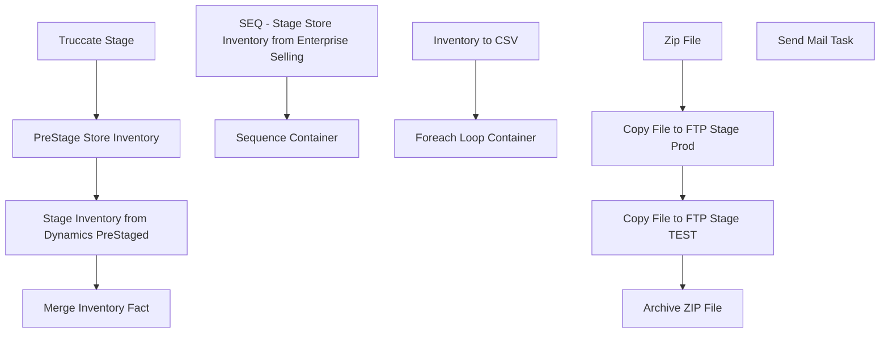

# SSIS Package: Web_StoreInventoryToDeck

**Project:** Web_StoreInventoryToDeck  
**Folder:** WEB  
**Server:** STL-SSIS-P-01  

## Connection Managers

| Name | Type | Server | Catalog | Connection (sanitized) |
|---|---|---|---|---|
| IntegrationStaging | OLEDB | STL-SSIS-P-01 | IntegrationStaging | Data Source=STL-SSIS-P-01; Initial Catalog=IntegrationStaging; Provider=SQLNCLI11.1; Integrated Security=SSPI; Auto Translate=False |
| ProductInventoryCSV | FLATFILE |  |  |  |
| SMTP | SMTP |  |  |  |
| me_01 | OLEDB | bedrockdb02 | me_01 | Data Source=bedrockdb02; Initial Catalog=me_01; Provider=SQLNCLI11.1; Integrated Security=SSPI; Auto Translate=False |

## Control Flow Tasks

| Task | Type |
|---|---|
| Web_StoreInventoryToDeck | Package |
| SEQ - Stage Store Inventory from Enterprise Selling | SEQUENCE |
| Merge Inventory Fact | ExecuteSQLTask |
| PreStage Store Inventory | ExecuteSQLTask |
| Stage Inventory from Dynamics PreStaged | Pipeline |
| Truccate Stage | ExecuteSQLTask |
| Sequence Container | SEQUENCE |
| Foreach Loop Container | FOREACHLOOP |
| Archive ZIP File | FileSystemTask |
| Copy File to FTP Stage Prod | FileSystemTask |
| Copy File to FTP Stage TEST | FileSystemTask |
| Zip File | ExecuteProcess |
| Inventory to CSV | Pipeline |
| Send Mail Task | SendMailTask |

## Control Flow Outline

```text
- Send Mail Task [SendMailTask]
- SEQ - Stage Store Inventory from Enterprise Selling [SEQUENCE]
  - Merge Inventory Fact [ExecuteSQLTask]
  - PreStage Store Inventory [ExecuteSQLTask]
  - Stage Inventory from Dynamics PreStaged [Pipeline]
  - Truccate Stage [ExecuteSQLTask]
- Sequence Container [SEQUENCE]
  - Foreach Loop Container [FOREACHLOOP]
    - Archive ZIP File [FileSystemTask]
    - Copy File to FTP Stage Prod [FileSystemTask]
    - Copy File to FTP Stage TEST [FileSystemTask]
    - Zip File [ExecuteProcess]
  - Inventory to CSV [Pipeline]
```

## Architecture Diagram



## Variables

| Namespace | Name | Expression-bound |
|---|---|---|
| System | Propagate | No |
| User | DateTimeStamp | Yes |
| User | EndDate | Yes |
| User | EndDateAsDATE | Yes |
| User | FTPStageDirectory | No |
| User | FileNameForLoop | No |
| User | GetDate | Yes |
| User | GetDateAsDATE | Yes |
| User | InventoryFilePreStageLocation | Yes |
| User | InventoryFileRename | Yes |
| User | InventoryStageforTEST | No |
| User | StartDate | Yes |
| User | StartDateAsDATE | Yes |
| User | ValidationCheck | No |
| User | ZipCommand | Yes |
| User | ZipDest | Yes |
| User | ZipSource | No |

### Expression-bound variable values

#### User::DateTimeStamp

**Expression:**

```sql
(DT_WSTR,4)DATEPART("yyyy",GetDate()) 
+ (DT_WSTR,4)DATEPART("mm",GetDate()) 
+ (DT_WSTR,4)DATEPART("dd",GetDate()) 
+ (DT_WSTR,4)DATEPART("hh",GetDate()) 
+ (DT_WSTR,4)DATEPART("mi",GetDate()) 
+ (DT_WSTR,4)DATEPART("ss",GetDate()) 
+ (DT_WSTR,4)DATEPART("ms",GetDate())
```

**Evaluated value:**

```sql
20241210101647837
```

#### User::EndDate

**Expression:**

```sql
dateadd("dd", @[$Package::DaysToInclude], @[User::StartDate])
```

**Evaluated value:**

```sql
12/10/2024
```

#### User::EndDateAsDATE

**Expression:**

```sql
(DT_WSTR, 4) datepart("year", @[User::EndDate])  + "-" + 
(DT_WSTR, 2) datepart("mm", @[User::EndDate])  + "-" + 
(DT_WSTR, 2) datepart("dd",  @[User::EndDate])
```

**Evaluated value:**

```sql
2024-12-10
```

#### User::GetDate

**Expression:**

```sql
(DT_DATE)DATEDIFF("Day", (DT_DATE) 0, GETDATE())
```

**Evaluated value:**

```sql
12/10/2024
```

#### User::GetDateAsDATE

**Expression:**

```sql
(DT_WSTR, 4) datepart("year", @[User::GetDate])  + "-" + 
(DT_WSTR, 2) datepart("mm", @[User::GetDate])  + "-" + 
(DT_WSTR, 2) datepart("dd",  @[User::GetDate])
```

**Evaluated value:**

```sql
2024-12-10
```

#### User::InventoryFilePreStageLocation

**Expression:**

```sql
"\\\\" + @[$Package::IntegrationStaging_ServerName] + "\\IntegrationStaging\\WEB\\Outbound\\Inventory\\"
```

**Evaluated value:**

```sql
\\STL-SSIS-P-01\IntegrationStaging\WEB\Outbound\Inventory\
```

#### User::InventoryFileRename

**Expression:**

```sql
@[$Package::WebInventoryCSVPreStageLocation] + "Archive\\ProductInventoryStore" +  @[User::DateTimeStamp] + ".zip"
```

**Evaluated value:**

```sql
\\STL-SSIS-P-01\IntegrationStaging\WEB\Outbound\Inventory\Archive\ProductInventoryStore20241210101647837.zip
```

#### User::StartDate

**Expression:**

```sql
dateadd("dd", -@[$Package::DaysToGoBack] , @[User::GetDate] )
```

**Evaluated value:**

```sql
12/9/2024
```

#### User::StartDateAsDATE

**Expression:**

```sql
(DT_WSTR, 4) datepart("year", @[User::StartDate])  + "-" + 
(DT_WSTR, 2) datepart("mm", @[User::StartDate])  + "-" + 
(DT_WSTR, 2) datepart("dd",  @[User::StartDate])
```

**Evaluated value:**

```sql
2024-12-9
```

#### User::ZipCommand

**Expression:**

```sql
"a -tzip \""+ @[User::ZipDest]  + "\"  \"" +  @[User::ZipSource]  +"\" -sdel"
```

**Evaluated value:**

```sql
a -tzip "\\STL-SSIS-P-01\IntegrationStaging\WEB\Outbound\Inventory\ProductInventoryStore.zip"  "StoreInventory.csv" -sdel
```

#### User::ZipDest

**Expression:**

```sql
@[$Package::WebInventoryCSVPreStageLocation] + "ProductInventoryStore.zip"
```

**Evaluated value:**

```sql
\\STL-SSIS-P-01\IntegrationStaging\WEB\Outbound\Inventory\ProductInventoryStore.zip
```

## Execute SQL Tasks

### Merge Inventory Fact

**Path:** `Package\SEQ - Stage Store Inventory from Enterprise Selling\Merge Inventory Fact`  
**Connection:** IntegrationStaging (STL-SSIS-P-01/IntegrationStaging)  

```sql
exec web.spMergeInventoryFactStoreInventory
```

### PreStage Store Inventory

**Path:** `Package\SEQ - Stage Store Inventory from Enterprise Selling\PreStage Store Inventory`  
**Connection:** me_01 (bedrockdb02/me_01)  

```sql
EXEC spSelectStoreInventoryPrepData
```

### Truccate Stage

**Path:** `Package\SEQ - Stage Store Inventory from Enterprise Selling\Truccate Stage`  
**Connection:** IntegrationStaging (STL-SSIS-P-01/IntegrationStaging)  

```sql
TRUNCATE TABLE web.StoreInventoryStage
```

## Data Flow: Sources

| Component | Source Object | Type | Data Flow Task | Connection | SQL Kind |
|---|---|---|---|---|---|
| StoreInventoryStage |  | OLEDBSource | Stage Inventory from Dynamics PreStaged | me_01 | SqlCommand |
| vwStoreInventoryCSV |  | OLEDBSource | Inventory to CSV | IntegrationStaging |  |

#### StoreInventoryStage — SqlCommand

```sql
select x.sku_id, cast(right(x.outlet_id, 4) as varchar(4)) as LocationCode, cast(sum(x.qty) as int) as QTY
from esell.outlet_sku_xref x with (nolock)
group by x.sku_id, cast(right(x.outlet_id, 4) as varchar(4))
```

## Data Flow: Destinations

| Component | Target Table | Type | Data Flow Task | Connection | SQL Kind |
|---|---|---|---|---|---|
| Web_StoreInventoryStage |  | OLEDBDestination | Stage Inventory from Dynamics PreStaged | IntegrationStaging |  |
| ProductInventoryCSV |  | FlatFileDestination | Inventory to CSV | ProductInventoryCSV |  |
