# SSIS Package: ERP_POReceipts

**Project:** ERP_POReceipts  
**Folder:** WMS  
**Server:** STL-SSIS-P-01  

## Connection Managers

| Name | Type | Server | Catalog | Connection (sanitized) |
|---|---|---|---|---|
| Archive | FILE |  |  |  |
| GetBlobUrl | HTTP (KingswaySoft) |  |  |  |
| GetStatus | HTTP (KingswaySoft) |  |  |  |
| IntegrationStaging | OLEDB | STL-SSIS-P-01 | IntegrationStaging | Data Source=STL-SSIS-P-01; Initial Catalog=IntegrationStaging; Provider=SQLNCLI11.1; Integrated Security=SSPI; Auto Translate=False |
| PostTriggerImport | HTTP (KingswaySoft) |  |  |  |
| SMTP_EMAIL | SMTP |  |  |  |
| SQL_LOG | OLEDB | stl-ssis-p-01 | msdb | Data Source=stl-ssis-p-01; Initial Catalog=msdb; Provider=SQLNCLI11.1; Integrated Security=SSPI; Auto Translate=False |
| me_01 | OLEDB | bedrockdb02 | me_01 | Data Source=bedrockdb02; Initial Catalog=me_01; Provider=SQLNCLI11.1; Integrated Security=SSPI; Auto Translate=False |

## Control Flow Tasks

| Task | Type |
|---|---|
| ERP_POReceipts | Package |
| SeqCont - Check to See if Receipts to Push | SEQUENCE |
| Execute SQL Task - ReceiptRowCount | ExecuteSQLTask |
| SeqCont - Generate Package API Files and Transmit | SEQUENCE |
| FEL - Copy Manifest and Header Files | FOREACHLOOP |
| Copy Manifest and Header | FileSystemTask |
| FEL - Purchase Order Receipt Create | FOREACHLOOP |
| FEL | FOREACHLOOP |
| Archive Files | FileSystemTask |
| azCopy to Blob | ExecuteProcess |
| ProcessStatusForLoop | FORLOOP |
| Get Summary Status | Pipeline |
| Set Process Status | ExecuteSQLTask |
| Wait 30 Seconds | ExecuteSQLTask |
| Set BatchID - Loop Count | ExecuteSQLTask |
| Set Rows Count | ExecuteSQLTask |
| Stage Blob URL | Pipeline |
| Trigger Import | Pipeline |
| spOutputD365PurchaseOrderReceiptXMLByEntity | ExecuteSQLTask |
| Zip File | ExecuteProcess |
| SeqCont- Generate XML and Upload to D365 - OLD | SEQUENCE |
| Dummy Control Task | ExecuteSQLTask |
| Foreach Loop - PO Receipts | FOREACHLOOP |
| Archive File | FileSystemTask |
| Copy File to D365 | FileSystemTask |
| Foreach Loop - Transfer Receipts | FOREACHLOOP |
| Archive File | FileSystemTask |
| Copy File To D365 | FileSystemTask |
| spOutputD365PurchaseOrderReceiptXMLByEntity | ExecuteSQLTask |
| spOutputTransferPalletReceipt | ExecuteSQLTask |
| Sequence - Stage Receipts from Warehouses | SEQUENCE |
| Merge Non PO Receipts | ExecuteSQLTask |
| Merge PO Receipts | ExecuteSQLTask |
| PO Exceptions | Pipeline |
| Sequence Container | SEQUENCE |
| Data Flow - Stage 3PL Receipts | Pipeline |
| Data Flow - Stage WC Receipts | Pipeline |
| Stage Pallet Receipts | Pipeline |
| Truncate Stage | ExecuteSQLTask |
| Send Email onError | SendMailTask |

## Control Flow Outline

```text
- Send Email onError [SendMailTask]
- SeqCont - Check to See if Receipts to Push [SEQUENCE]
  - Execute SQL Task - ReceiptRowCount [ExecuteSQLTask]
- SeqCont - Generate Package API Files and Transmit [SEQUENCE]
  - FEL - Copy Manifest and Header Files [FOREACHLOOP]
    - Copy Manifest and Header [FileSystemTask]
  - FEL - Purchase Order Receipt Create [FOREACHLOOP]
    - FEL [FOREACHLOOP]
      - Archive Files [FileSystemTask]
      - azCopy to Blob [ExecuteProcess]
    - ProcessStatusForLoop [FORLOOP]
      - Get Summary Status [Pipeline]
      - Set Process Status [ExecuteSQLTask]
      - Wait 30 Seconds [ExecuteSQLTask]
    - Set BatchID - Loop Count [ExecuteSQLTask]
    - Set Rows Count [ExecuteSQLTask]
    - Stage Blob URL [Pipeline]
    - Trigger Import [Pipeline]
  - Zip File [ExecuteProcess]
  - spOutputD365PurchaseOrderReceiptXMLByEntity [ExecuteSQLTask]
- SeqCont- Generate XML and Upload to D365 - OLD [SEQUENCE]
  - Dummy Control Task [ExecuteSQLTask]
  - Foreach Loop - PO Receipts [FOREACHLOOP]
    - Archive File [FileSystemTask]
    - Copy File to D365 [FileSystemTask]
  - Foreach Loop - Transfer Receipts [FOREACHLOOP]
    - Archive File [FileSystemTask]
    - Copy File To D365 [FileSystemTask]
  - spOutputD365PurchaseOrderReceiptXMLByEntity [ExecuteSQLTask]
  - spOutputTransferPalletReceipt [ExecuteSQLTask]
- Sequence - Stage Receipts from Warehouses [SEQUENCE]
  - Merge Non PO Receipts [ExecuteSQLTask]
  - Merge PO Receipts [ExecuteSQLTask]
  - PO Exceptions [Pipeline]
  - Sequence Container [SEQUENCE]
    - Data Flow - Stage 3PL Receipts [Pipeline]
    - Data Flow - Stage WC Receipts [Pipeline]
    - Stage Pallet Receipts [Pipeline]
    - Truncate Stage [ExecuteSQLTask]
```

## Architecture Diagram

```mermaid
flowchart TD
    n_Package_SeqCont___Check_to_See_if_Receipts_to_Push["SeqCont - Check to See if Receipts to Push"]
    n_Package_SeqCont___Check_to_See_if_Receipts_to_Push_Execute_SQL_Task___ReceiptRowCount["Execute SQL Task - ReceiptRowCount"]
    n_Package_SeqCont___Generate_Package_API_Files_and_Transmit["SeqCont - Generate Package API Files and Transmit"]
    n_Package_SeqCont___Generate_Package_API_Files_and_Transmit_FEL___Copy_Manifest_and_Header_Files["FEL - Copy Manifest and Header Files"]
    n_Package_SeqCont___Generate_Package_API_Files_and_Transmit_FEL___Copy_Manifest_and_Header_Files_Copy_Manifest_and_Header["Copy Manifest and Header"]
    n_Package_SeqCont___Generate_Package_API_Files_and_Transmit_FEL___Purchase_Order_Receipt_Create["FEL - Purchase Order Receipt Create"]
    n_Package_SeqCont___Generate_Package_API_Files_and_Transmit_FEL___Purchase_Order_Receipt_Create_FEL["FEL"]
    n_Package_SeqCont___Generate_Package_API_Files_and_Transmit_FEL___Purchase_Order_Receipt_Create_FEL_Archive_Files["Archive Files"]
    n_Package_SeqCont___Generate_Package_API_Files_and_Transmit_FEL___Purchase_Order_Receipt_Create_FEL_azCopy_to_Blob["azCopy to Blob"]
    n_Package_SeqCont___Generate_Package_API_Files_and_Transmit_FEL___Purchase_Order_Receipt_Create_ProcessStatusForLoop["ProcessStatusForLoop"]
    n_Package_SeqCont___Generate_Package_API_Files_and_Transmit_FEL___Purchase_Order_Receipt_Create_ProcessStatusForLoop_Get_Summary_Status["Get Summary Status"]
    n_Package_SeqCont___Generate_Package_API_Files_and_Transmit_FEL___Purchase_Order_Receipt_Create_ProcessStatusForLoop_Set_Process_Status["Set Process Status"]
    n_Package_SeqCont___Generate_Package_API_Files_and_Transmit_FEL___Purchase_Order_Receipt_Create_ProcessStatusForLoop_Wait_30_Seconds["Wait 30 Seconds"]
    n_Package_SeqCont___Generate_Package_API_Files_and_Transmit_FEL___Purchase_Order_Receipt_Create_Set_BatchID___Loop_Count["Set BatchID - Loop Count"]
    n_Package_SeqCont___Generate_Package_API_Files_and_Transmit_FEL___Purchase_Order_Receipt_Create_Set_Rows_Count["Set Rows Count"]
    n_Package_SeqCont___Generate_Package_API_Files_and_Transmit_FEL___Purchase_Order_Receipt_Create_Stage_Blob_URL["Stage Blob URL"]
    n_Package_SeqCont___Generate_Package_API_Files_and_Transmit_FEL___Purchase_Order_Receipt_Create_Trigger_Import["Trigger Import"]
    n_Package_SeqCont___Generate_Package_API_Files_and_Transmit_spOutputD365PurchaseOrderReceiptXMLByEntity["spOutputD365PurchaseOrderReceiptXMLByEntity"]
    n_Package_SeqCont___Generate_Package_API_Files_and_Transmit_Zip_File["Zip File"]
    n_Package_SeqCont__Generate_XML_and_Upload_to_D365___OLD["SeqCont- Generate XML and Upload to D365 - OLD"]
    n_Package_SeqCont__Generate_XML_and_Upload_to_D365___OLD_Dummy_Control_Task["Dummy Control Task"]
    n_Package_SeqCont__Generate_XML_and_Upload_to_D365___OLD_Foreach_Loop___PO_Receipts["Foreach Loop - PO Receipts"]
    n_Package_SeqCont__Generate_XML_and_Upload_to_D365___OLD_Foreach_Loop___PO_Receipts_Archive_File["Archive File"]
    n_Package_SeqCont__Generate_XML_and_Upload_to_D365___OLD_Foreach_Loop___PO_Receipts_Copy_File_to_D365["Copy File to D365"]
    n_Package_SeqCont__Generate_XML_and_Upload_to_D365___OLD_Foreach_Loop___Transfer_Receipts["Foreach Loop - Transfer Receipts"]
    n_Package_SeqCont__Generate_XML_and_Upload_to_D365___OLD_Foreach_Loop___Transfer_Receipts_Archive_File["Archive File"]
    n_Package_SeqCont__Generate_XML_and_Upload_to_D365___OLD_Foreach_Loop___Transfer_Receipts_Copy_File_To_D365["Copy File To D365"]
    n_Package_SeqCont__Generate_XML_and_Upload_to_D365___OLD_spOutputD365PurchaseOrderReceiptXMLByEntity["spOutputD365PurchaseOrderReceiptXMLByEntity"]
    n_Package_SeqCont__Generate_XML_and_Upload_to_D365___OLD_spOutputTransferPalletReceipt["spOutputTransferPalletReceipt"]
    n_Package_Sequence___Stage_Receipts_from_Warehouses["Sequence - Stage Receipts from Warehouses"]
    n_Package_Sequence___Stage_Receipts_from_Warehouses_Merge_Non_PO_Receipts["Merge Non PO Receipts"]
    n_Package_Sequence___Stage_Receipts_from_Warehouses_Merge_PO_Receipts["Merge PO Receipts"]
    n_Package_Sequence___Stage_Receipts_from_Warehouses_PO_Exceptions["PO Exceptions"]
    n_Package_Sequence___Stage_Receipts_from_Warehouses_Sequence_Container["Sequence Container"]
    n_Package_Sequence___Stage_Receipts_from_Warehouses_Sequence_Container_Data_Flow___Stage_3PL_Receipts["Data Flow - Stage 3PL Receipts"]
    n_Package_Sequence___Stage_Receipts_from_Warehouses_Sequence_Container_Data_Flow___Stage_WC_Receipts["Data Flow - Stage WC Receipts"]
    n_Package_Sequence___Stage_Receipts_from_Warehouses_Sequence_Container_Stage_Pallet_Receipts["Stage Pallet Receipts"]
    n_Package_Sequence___Stage_Receipts_from_Warehouses_Sequence_Container_Truncate_Stage["Truncate Stage"]
    n_Package_EventHandlers_OnError__Send_Email_onError["Send Email onError"]
    n_Package_SeqCont___Generate_Package_API_Files_and_Transmit_FEL___Purchase_Order_Receipt_Create_FEL_azCopy_to_Blob --> n_Package_SeqCont___Generate_Package_API_Files_and_Transmit_FEL___Purchase_Order_Receipt_Create_FEL_Archive_Files
    n_Package_SeqCont___Generate_Package_API_Files_and_Transmit_FEL___Purchase_Order_Receipt_Create_ProcessStatusForLoop_Wait_30_Seconds --> n_Package_SeqCont___Generate_Package_API_Files_and_Transmit_FEL___Purchase_Order_Receipt_Create_ProcessStatusForLoop_Get_Summary_Status
    n_Package_SeqCont___Generate_Package_API_Files_and_Transmit_FEL___Purchase_Order_Receipt_Create_ProcessStatusForLoop_Get_Summary_Status --> n_Package_SeqCont___Generate_Package_API_Files_and_Transmit_FEL___Purchase_Order_Receipt_Create_ProcessStatusForLoop_Set_Process_Status
    n_Package_SeqCont___Generate_Package_API_Files_and_Transmit_FEL___Purchase_Order_Receipt_Create_Set_BatchID___Loop_Count --> n_Package_SeqCont___Generate_Package_API_Files_and_Transmit_FEL___Purchase_Order_Receipt_Create_Stage_Blob_URL
    n_Package_SeqCont___Generate_Package_API_Files_and_Transmit_FEL___Purchase_Order_Receipt_Create_Stage_Blob_URL --> n_Package_SeqCont___Generate_Package_API_Files_and_Transmit_FEL___Purchase_Order_Receipt_Create_Set_Rows_Count
    n_Package_SeqCont___Generate_Package_API_Files_and_Transmit_FEL___Purchase_Order_Receipt_Create_Set_Rows_Count --> n_Package_SeqCont___Generate_Package_API_Files_and_Transmit_FEL___Purchase_Order_Receipt_Create_FEL
    n_Package_SeqCont___Generate_Package_API_Files_and_Transmit_FEL___Purchase_Order_Receipt_Create_FEL --> n_Package_SeqCont___Generate_Package_API_Files_and_Transmit_FEL___Purchase_Order_Receipt_Create_Trigger_Import
    n_Package_SeqCont___Generate_Package_API_Files_and_Transmit_FEL___Purchase_Order_Receipt_Create_Trigger_Import --> n_Package_SeqCont___Generate_Package_API_Files_and_Transmit_FEL___Purchase_Order_Receipt_Create_ProcessStatusForLoop
    n_Package_SeqCont___Generate_Package_API_Files_and_Transmit_spOutputD365PurchaseOrderReceiptXMLByEntity --> n_Package_SeqCont___Generate_Package_API_Files_and_Transmit_FEL___Copy_Manifest_and_Header_Files
    n_Package_SeqCont___Generate_Package_API_Files_and_Transmit_FEL___Copy_Manifest_and_Header_Files --> n_Package_SeqCont___Generate_Package_API_Files_and_Transmit_Zip_File
    n_Package_SeqCont___Generate_Package_API_Files_and_Transmit_Zip_File --> n_Package_SeqCont___Generate_Package_API_Files_and_Transmit_FEL___Purchase_Order_Receipt_Create
    n_Package_SeqCont__Generate_XML_and_Upload_to_D365___OLD_Foreach_Loop___PO_Receipts_Copy_File_to_D365 --> n_Package_SeqCont__Generate_XML_and_Upload_to_D365___OLD_Foreach_Loop___PO_Receipts_Archive_File
    n_Package_SeqCont__Generate_XML_and_Upload_to_D365___OLD_Foreach_Loop___Transfer_Receipts_Copy_File_To_D365 --> n_Package_SeqCont__Generate_XML_and_Upload_to_D365___OLD_Foreach_Loop___Transfer_Receipts_Archive_File
    n_Package_SeqCont__Generate_XML_and_Upload_to_D365___OLD_spOutputD365PurchaseOrderReceiptXMLByEntity --> n_Package_SeqCont__Generate_XML_and_Upload_to_D365___OLD_Foreach_Loop___PO_Receipts
    n_Package_SeqCont__Generate_XML_and_Upload_to_D365___OLD_spOutputTransferPalletReceipt --> n_Package_SeqCont__Generate_XML_and_Upload_to_D365___OLD_Foreach_Loop___Transfer_Receipts
    n_Package_SeqCont__Generate_XML_and_Upload_to_D365___OLD_Dummy_Control_Task --> n_Package_SeqCont__Generate_XML_and_Upload_to_D365___OLD_spOutputTransferPalletReceipt
    n_Package_Sequence___Stage_Receipts_from_Warehouses_Sequence_Container_Truncate_Stage --> n_Package_Sequence___Stage_Receipts_from_Warehouses_Sequence_Container_Data_Flow___Stage_WC_Receipts
    n_Package_Sequence___Stage_Receipts_from_Warehouses_Sequence_Container_Truncate_Stage --> n_Package_Sequence___Stage_Receipts_from_Warehouses_Sequence_Container_Data_Flow___Stage_3PL_Receipts
    n_Package_Sequence___Stage_Receipts_from_Warehouses_Sequence_Container_Data_Flow___Stage_WC_Receipts --> n_Package_Sequence___Stage_Receipts_from_Warehouses_Sequence_Container_Stage_Pallet_Receipts
    n_Package_Sequence___Stage_Receipts_from_Warehouses_Sequence_Container --> n_Package_Sequence___Stage_Receipts_from_Warehouses_PO_Exceptions
    n_Package_Sequence___Stage_Receipts_from_Warehouses_PO_Exceptions --> n_Package_Sequence___Stage_Receipts_from_Warehouses_Merge_PO_Receipts
    n_Package_Sequence___Stage_Receipts_from_Warehouses_Merge_PO_Receipts --> n_Package_Sequence___Stage_Receipts_from_Warehouses_Merge_Non_PO_Receipts
    n_Package_Sequence___Stage_Receipts_from_Warehouses --> n_Package_SeqCont__Generate_XML_and_Upload_to_D365___OLD
    n_Package_Sequence___Stage_Receipts_from_Warehouses --> n_Package_SeqCont___Check_to_See_if_Receipts_to_Push
    n_Package_SeqCont___Check_to_See_if_Receipts_to_Push --> n_Package_SeqCont___Generate_Package_API_Files_and_Transmit
```



## Variables

| Namespace | Name | Expression-bound |
|---|---|---|
| System | Propagate | No |
| User | ArchiveFolder | Yes |
| User | AzCopytoBlobCommand | Yes |
| User | BatchID | No |
| User | BlobURL | No |
| User | BlobURLRecordSet | No |
| User | D365FileDropLocation | Yes |
| User | Entity | No |
| User | FilesStagingLocationByEntity | Yes |
| User | HeaderAndManifestForLoop | No |
| User | JSON_GetBlobURL | Yes |
| User | JSON_GetSummaryStatus | Yes |
| User | LoopCount | No |
| User | OutputFileLocation | Yes |
| User | PackageAPIHeaderAndManifestPath | Yes |
| User | PalletCount | No |
| User | ProcessStatus | No |
| User | PurchaseOrderReceiptXMLFileName | No |
| User | RowsCount | No |
| User | RowsCountCheck | No |
| User | RowsCountCheckSqlString | Yes |
| User | SQL_3PL_ReceiptsByEntity | Yes |
| User | SQL_GetBlobURLCommand | Yes |
| User | SQL_GetSummaryStatus | Yes |
| User | SQL_TriggerImport | Yes |
| User | TransferReceiptArchive | Yes |
| User | TransferReceiptFile | No |
| User | TransferReceiptStageFolder | Yes |
| User | TransferReceiptsDynamicsDropFolder | Yes |
| User | WMS_PurchaseOrderReceipt | No |
| User | ZipCommand | Yes |
| User | ZipDest | Yes |
| User | ZipFileNameForFel | No |
| User | ZipSource | Yes |

### Expression-bound variable values

#### User::ArchiveFolder

**Expression:**

```sql
@[User::FilesStagingLocationByEntity]+"Archive"+"\\"
```

**Evaluated value:**

```sql
\\stl-ssis-p-01\IntegrationStaging\Dynamics\WarehouseInterfaces\PurchaseOrder\PurchaseOrderReceipts\3001\Archive\
```

#### User::AzCopytoBlobCommand

**Expression:**

```sql
"cp \"" +  @[User::ZipDest] + "\" \"" +  @[User::BlobURL] + "\""
```

**Evaluated value:**

```sql
cp "\\stl-ssis-p-01\IntegrationStaging\Dynamics\WarehouseInterfaces\PurchaseOrder\PurchaseOrderReceipts\3001\3PWPOReceipts3001.zip" ""
```

#### User::D365FileDropLocation

**Expression:**

```sql
@[$Package::ERP_PurchaseOrderReceiptFileDropFolder] +  @[User::Entity] + "\\Import\\"
```

**Evaluated value:**

```sql
\\stl-dynsnc-p-01\BABWIntegrations\WMS_PO\prod\3001\Import\
```

#### User::FilesStagingLocationByEntity

**Expression:**

```sql
@[$Package::WMS_POReceiptFileStageLocationBase]+ @[User::Entity]+"\\"
```

**Evaluated value:**

```sql
\\stl-ssis-p-01\IntegrationStaging\Dynamics\WarehouseInterfaces\PurchaseOrder\PurchaseOrderReceipts\3001\
```

#### User::JSON_GetBlobURL

**Expression:**

```sql
"
{
    \"uniqueFileName\":\"" + @[User::BatchID] + "\"
}
"
```

**Evaluated value:**

```sql

{
    "uniqueFileName":"5ECF043F-9E41-46F7-9FE9-0634BCE2C644"
}

```

#### User::JSON_GetSummaryStatus

**Expression:**

```sql
"
{
    \"executionId\":\"" + @[User::BatchID] + "\"
}
"
```

**Evaluated value:**

```sql

{
    "executionId":"5ECF043F-9E41-46F7-9FE9-0634BCE2C644"
}

```

#### User::OutputFileLocation

**Expression:**

```sql
"\\\\" + @[$Package::ERP_IntegrationStaging_ServerName] + "\\IntegrationStaging\\Dynamics\\WarehouseInterfaces\\PurchaseOrder\\PurchaseOrderReceipts\\" + @[User::Entity] + "\\"
```

**Evaluated value:**

```sql
\\STL-SSIS-P-01\IntegrationStaging\Dynamics\WarehouseInterfaces\PurchaseOrder\PurchaseOrderReceipts\3001\
```

#### User::PackageAPIHeaderAndManifestPath

**Expression:**

```sql
@[$Package::WMS_PackageAPI_StaticPackageFilesPath] + "PurchaseOrderReceipt"
```

**Evaluated value:**

```sql
\\stl-ssis-p-01\IntegrationStaging\Dynamics\WarehouseInterfaces\PackageAPI\PurchaseOrderReceipt
```

#### User::RowsCountCheckSqlString

**Expression:**

```sql
"select count (*) as ReceiptRowCount
from ERP.PurchaseOrderReceipt
where Transmitted = 0
and Entity =  "+ "'"+ @[User::Entity]+"'"
```

**Evaluated value:**

```sql
select count (*) as ReceiptRowCount
from ERP.PurchaseOrderReceipt
where Transmitted = 0
and Entity =  '3001'
```

#### User::SQL_3PL_ReceiptsByEntity

**Expression:**

```sql
"with 
Receipt as
	(
		select
			--PurchaseOrderNumber,
			cast(replace(
					case 
						when PurchaseOrderNumber like 'PO%-%'
							then substring(PurchaseOrderNumber, 0, charindex('-',PurchaseOrderNumber, 1))
						else PurchaseOrderNumber
					end,
					'PO ', 'PO'
				) as varchar(50)) as PurchaseOrderNumber,
			ReceiptLocation,
			ReceiptDate,
			cast(concat(ReceiptLocation, replace(ReceiptDate,'-',''), ItemID) as varchar(50)) as CaseNumber,
			ItemID,
			Qty,
			cast(InsertDate as date) InsertDate,
			Entity 
		from D365_PurchaseOrderReceiptStage 
		where Entity = '" + @[User::Entity]  + "' 
 AND datediff(dd, InsertDate, getdate()) <= 20	
)
select 
	case 
		when left(PurchaseOrderNumber,2) = 'PO' 
			then left(PurchaseOrderNumber, 11) 
		else PurchaseOrderNumber 
	end as PurchaseOrderNumber,
	ReceiptLocation,
	ReceiptDate,
	CaseNumber,
	ItemID,
	sum(Qty) as Qty,
	InsertDate,
	Entity 
from Receipt 
group by 
case 
		when left(PurchaseOrderNumber,2) = 'PO' 
			then left(PurchaseOrderNumber, 11) 
		else PurchaseOrderNumber 
	end,
	ReceiptLocation,
	ReceiptDate,
	CaseNumber,
	ItemID,
	InsertDate,
	Entity
"
```

**Evaluated value:**

```sql
with 
Receipt as
	(
		select
			--PurchaseOrderNumber,
			cast(replace(
					case 
						when PurchaseOrderNumber like 'PO%-%'
							then substring(PurchaseOrderNumber, 0, charindex('-',PurchaseOrderNumber, 1))
						else PurchaseOrderNumber
					end,
					'PO ', 'PO'
				) as varchar(50)) as PurchaseOrderNumber,
			ReceiptLocation,
			ReceiptDate,
			cast(concat(ReceiptLocation, replace(ReceiptDate,'-',''), ItemID) as varchar(50)) as CaseNumber,
			ItemID,
			Qty,
			cast(InsertDate as date) InsertDate,
			Entity 
		from D365_PurchaseOrderReceiptStage 
		where Entity = '3001' 
 AND datediff(dd, InsertDate, getdate()) <= 20	
)
select 
	case 
		when left(PurchaseOrderNumber,2) = 'PO' 
			then left(PurchaseOrderNumber, 11) 
		else PurchaseOrderNumber 
	end as PurchaseOrderNumber,
	ReceiptLocation,
	ReceiptDate,
	CaseNumber,
	ItemID,
	sum(Qty) as Qty,
	InsertDate,
	Entity 
from Receipt 
group by 
case 
		when left(PurchaseOrderNumber,2) = 'PO' 
			then left(PurchaseOrderNumber, 11) 
		else PurchaseOrderNumber 
	end,
	ReceiptLocation,
	ReceiptDate,
	CaseNumber,
	ItemID,
	InsertDate,
	Entity

```

#### User::SQL_GetBlobURLCommand

**Expression:**

```sql
"select cast('" +  @[User::JSON_GetBlobURL]  + "' as varchar(100)) as Command, cast('" + @[User::BatchID] + "' as varchar(50)) as BatchID, getdate() as InsertDate "
```

**Evaluated value:**

```sql
select cast('
{
    "uniqueFileName":"5ECF043F-9E41-46F7-9FE9-0634BCE2C644"
}
' as varchar(100)) as Command, cast('5ECF043F-9E41-46F7-9FE9-0634BCE2C644' as varchar(50)) as BatchID, getdate() as InsertDate 
```

#### User::SQL_GetSummaryStatus

**Expression:**

```sql
"select cast('" +  @[User::JSON_GetSummaryStatus]  + "' as varchar(100)) as Command, cast('" + @[User::BatchID] + "' as varchar(50)) as BatchID, getdate() as InsertDate "
```

**Evaluated value:**

```sql
select cast('
{
    "executionId":"5ECF043F-9E41-46F7-9FE9-0634BCE2C644"
}
' as varchar(100)) as Command, cast('5ECF043F-9E41-46F7-9FE9-0634BCE2C644' as varchar(50)) as BatchID, getdate() as InsertDate 
```

#### User::SQL_TriggerImport

**Expression:**

```sql
"select cast('" +  @[User::BlobURL] + "' as nvarchar(4000)) as packageUrl, cast('" +  @[User::BatchID] + "' as varchar(50)) as executionId, '" +  @[$Package::WMS_POReceiptDefinitionGroupID] + @[User::Entity] + "' as definitionGroupId, 'true' as [execute], 'true' as overwrite, '" +  @[User::Entity] + "' as legalEntityId"
```

**Evaluated value:**

```sql
select cast('' as nvarchar(4000)) as packageUrl, cast('5ECF043F-9E41-46F7-9FE9-0634BCE2C644' as varchar(50)) as executionId, '3PWPOReceipts3001' as definitionGroupId, 'true' as [execute], 'true' as overwrite, '3001' as legalEntityId
```

#### User::TransferReceiptArchive

**Expression:**

```sql
@[User::TransferReceiptStageFolder] + "\\Archive"
```

**Evaluated value:**

```sql
\\stl-ssis-p-01\IntegrationStaging\Dynamics\WarehouseInterfaces\TransferAndSaleOrders\TransferReceipts\3001\Archive
```

#### User::TransferReceiptStageFolder

**Expression:**

```sql
@[$Package::ERP_TransferReceiptsStageFolder] +  @[User::Entity]
```

**Evaluated value:**

```sql
\\stl-ssis-p-01\IntegrationStaging\Dynamics\WarehouseInterfaces\TransferAndSaleOrders\TransferReceipts\3001
```

#### User::TransferReceiptsDynamicsDropFolder

**Expression:**

```sql
@[$Package::ERP_TransferReceiptsDynamicsDropFolder] +  @[User::Entity]
```

**Evaluated value:**

```sql
\\stl-dynsnc-p-01\BABWIntegrations\WMSTransferOrders\Inbound\prod\3001
```

#### User::ZipCommand

**Expression:**

```sql
"a -tzip \""+ @[User::ZipDest]  + "\"  \"" +  @[User::ZipSource]  +"\" -sdel"
```

**Evaluated value:**

```sql
a -tzip "\\stl-ssis-p-01\IntegrationStaging\Dynamics\WarehouseInterfaces\PurchaseOrder\PurchaseOrderReceipts\3001\3PWPOReceipts3001.zip"  "*.xml" -sdel
```

#### User::ZipDest

**Expression:**

```sql
@[User::FilesStagingLocationByEntity]  + "3PWPOReceipts" +  @[User::Entity] + ".zip"
```

**Evaluated value:**

```sql
\\stl-ssis-p-01\IntegrationStaging\Dynamics\WarehouseInterfaces\PurchaseOrder\PurchaseOrderReceipts\3001\3PWPOReceipts3001.zip
```

#### User::ZipSource

**Expression:**

```sql
"*.xml"
```

**Evaluated value:**

```sql
*.xml
```

## Execute SQL Tasks

### Execute SQL Task - ReceiptRowCount

**Path:** `Package\SeqCont - Check to See if Receipts to Push\Execute SQL Task - ReceiptRowCount`  
**Connection:** IntegrationStaging (STL-SSIS-P-01/IntegrationStaging)  

```sql
User::RowsCountCheckSqlString
```

### Set Process Status

**Path:** `Package\SeqCont - Generate Package API Files and Transmit\FEL - Purchase Order Receipt Create\ProcessStatusForLoop\Set Process Status`  
**Connection:** IntegrationStaging (STL-SSIS-P-01/IntegrationStaging)  

```sql
With 
ProcStatus as 
 (
  select 
   case 
    when StatusResponse in ('Succeeded','PartiallySucceeded', 'Failed')
     then 1
    else 0
   end as ProcessStatus
  from wms.DynamicsPackageAPILog
  where BatchID= ?
 )
select 
 case 
  when ? < 200 --- designed to let the loop escape if still not finihed after 20 loops
   then count(*)
  else 1
 end as ProcessStatus
from ProcStatus
where ProcessStatus = 1
```

### Wait 30 Seconds

**Path:** `Package\SeqCont - Generate Package API Files and Transmit\FEL - Purchase Order Receipt Create\ProcessStatusForLoop\Wait 30 Seconds`  
**Connection:** IntegrationStaging (STL-SSIS-P-01/IntegrationStaging)  

```sql
waitfor delay '00:00:30'

```

### Set BatchID - Loop Count

**Path:** `Package\SeqCont - Generate Package API Files and Transmit\FEL - Purchase Order Receipt Create\Set BatchID - Loop Count`  
**Connection:** IntegrationStaging (STL-SSIS-P-01/IntegrationStaging)  

```sql
select 
newid() as BatchID, 
0 as LoopCount

```

### Set Rows Count

**Path:** `Package\SeqCont - Generate Package API Files and Transmit\FEL - Purchase Order Receipt Create\Set Rows Count`  
**Connection:** IntegrationStaging (STL-SSIS-P-01/IntegrationStaging)  

```sql
update wms.DynamicsPackageAPILog
set RowsCount=?
where BatchID=?
```

### spOutputD365PurchaseOrderReceiptXMLByEntity

**Path:** `Package\SeqCont - Generate Package API Files and Transmit\spOutputD365PurchaseOrderReceiptXMLByEntity`  
**Connection:** IntegrationStaging (STL-SSIS-P-01/IntegrationStaging)  

> ⚠️ `SqlStatementSource` is overridden at runtime by a property expression (shown below); the static SQL may not be what executes.

**Static SqlStatementSource:**

```sql
exec ERP.spOutputD365PurchaseOrderReceiptXMLByEntity @DropFile = '\\STL-SSIS-P-01\IntegrationStaging\Dynamics\WarehouseInterfaces\PurchaseOrder\PurchaseOrderReceipts\3001\', @Entity = '3001'
```

**Property expression (runtime override):**

```sql
"exec ERP.spOutputD365PurchaseOrderReceiptXMLByEntity @DropFile = '" +  @[User::OutputFileLocation] + "', @Entity = '" + @[User::Entity] + "'"
```

### Dummy Control Task

**Path:** `Package\SeqCont- Generate XML and Upload to D365 - OLD\Dummy Control Task`  
**Connection:** IntegrationStaging (STL-SSIS-P-01/IntegrationStaging)  

```sql
select getdate()
```

### spOutputD365PurchaseOrderReceiptXMLByEntity

**Path:** `Package\SeqCont- Generate XML and Upload to D365 - OLD\spOutputD365PurchaseOrderReceiptXMLByEntity`  
**Connection:** IntegrationStaging (STL-SSIS-P-01/IntegrationStaging)  

> ⚠️ `SqlStatementSource` is overridden at runtime by a property expression (shown below); the static SQL may not be what executes.

**Static SqlStatementSource:**

```sql
exec ERP.spOutputD365PurchaseOrderReceiptXMLByEntity @DropFile = '\\STL-SSIS-P-01\IntegrationStaging\Dynamics\WarehouseInterfaces\PurchaseOrder\PurchaseOrderReceipts\3001\', @Entity = '3001'
```

**Property expression (runtime override):**

```sql
"exec ERP.spOutputD365PurchaseOrderReceiptXMLByEntity @DropFile = '" +  @[User::OutputFileLocation] + "', @Entity = '" + @[User::Entity] + "'"
```

### spOutputTransferPalletReceipt

**Path:** `Package\SeqCont- Generate XML and Upload to D365 - OLD\spOutputTransferPalletReceipt`  
**Connection:** IntegrationStaging (STL-SSIS-P-01/IntegrationStaging)  

> ⚠️ `SqlStatementSource` is overridden at runtime by a property expression (shown below); the static SQL may not be what executes.

**Static SqlStatementSource:**

```sql
exec ERP.spOutputTransferPalletReceipt @DropFile = '\\stl-ssis-p-01\IntegrationStaging\Dynamics\WarehouseInterfaces\TransferAndSaleOrders\TransferReceipts\3001\'
```

**Property expression (runtime override):**

```sql
"exec ERP.spOutputTransferPalletReceipt @DropFile = '" + @[User::TransferReceiptStageFolder]  + "\\'"
```

### Merge Non PO Receipts

**Path:** `Package\Sequence - Stage Receipts from Warehouses\Merge Non PO Receipts`  
**Connection:** IntegrationStaging (STL-SSIS-P-01/IntegrationStaging)  

```sql
exec ERP.spMergeWhseReceipt_NonPO
```

### Merge PO Receipts

**Path:** `Package\Sequence - Stage Receipts from Warehouses\Merge PO Receipts`  
**Connection:** IntegrationStaging (STL-SSIS-P-01/IntegrationStaging)  

```sql
exec ERP.spMergePurchaseOrderReceipt
```

### Truncate Stage

**Path:** `Package\Sequence - Stage Receipts from Warehouses\Sequence Container\Truncate Stage`  
**Connection:** IntegrationStaging (STL-SSIS-P-01/IntegrationStaging)  

```sql
TRUNCATE TABLE ERP.PurchaseOrderReceiptStage
TRUNCATE TABLE ERP.WhseReceiptStage_NonPO
TRUNCATE TABLE ERP.WCPalletReceipts
```

## Data Flow: Sources

| Component | Source Object | Type | Data Flow Task | Connection | SQL Kind |
|---|---|---|---|---|---|
| Start |  | OLEDBSource | Get Summary Status | IntegrationStaging |  |
| Get BLOB Command |  | OLEDBSource | Stage Blob URL | IntegrationStaging |  |
| Trigger Import |  | OLEDBSource | Trigger Import | IntegrationStaging |  |
| vwPOReceiptIntegrationExceptionLog |  | OLEDBSource | PO Exceptions | IntegrationStaging |  |
| D365_PurchaseOrderReceiptStage |  | OLEDBSource | Data Flow - Stage 3PL Receipts | me_01 | SqlCommand |
| D365_PurchaseOrderReceiptStage |  | OLEDBSource | Data Flow - Stage WC Receipts | me_01 | SqlCommand |
| ERP_WCPalletReceipts |  | OLEDBSource | Stage Pallet Receipts | me_01 | SqlCommand |

#### D365_PurchaseOrderReceiptStage — SqlCommand

```sql
with 
Receipt as
	(
		select
			PurchaseOrderNumber,
			ReceiptLocation,
			ReceiptDate,
			cast(concat(ReceiptLocation, replace(ReceiptDate,'-',''), ItemID) as varchar(50)) as CaseNumber,
			ItemID,
			Qty,
			cast(InsertDate as date) InsertDate,
			Entity 
		from D365_PurchaseOrderReceiptStage 
		where datediff(dd, InsertDate, getdate()) <= 1
	)
select 
	PurchaseOrderNumber,
	ReceiptLocation,
	ReceiptDate,
	CaseNumber,
	ItemID,
	sum(Qty) as Qty,
	InsertDate,
	Entity 
from Receipt 
group by 
	PurchaseOrderNumber,
	ReceiptLocation,
	ReceiptDate,
	CaseNumber,
	ItemID,
	InsertDate,
	Entity
```

#### ERP_WCPalletReceipts — SqlCommand

```sql
select *
from ERP_WCPalletReceipts 
where datediff(dd, ReceiptDate, getdate()) = 0
```

## Data Flow: Destinations

| Component | Target Table | Type | Data Flow Task | Connection | SQL Kind |
|---|---|---|---|---|---|
| DynamicsPackageAPILog |  | OLEDBDestination | Stage Blob URL | IntegrationStaging |  |
| Recordset Destination |  | RecordsetDestination | Stage Blob URL |  |  |
| PurchaseOrderReceiptExceptions |  | OLEDBDestination | PO Exceptions | IntegrationStaging |  |
| PurchaseOrderReceiptStage |  | OLEDBDestination | Data Flow - Stage 3PL Receipts | IntegrationStaging |  |
| WhseReceiptStage_NonPO |  | OLEDBDestination | Data Flow - Stage 3PL Receipts | IntegrationStaging |  |
| PurchaseOrderReceiptStage |  | OLEDBDestination | Data Flow - Stage WC Receipts | IntegrationStaging |  |
| WhseReceiptStage_NonPO |  | OLEDBDestination | Data Flow - Stage WC Receipts | IntegrationStaging |  |
| WCPalletReceipts |  | OLEDBDestination | Stage Pallet Receipts | IntegrationStaging |  |
