# SSIS Package: ERP_ShipmentInvoiceToD365

**Project:** ERP_ShipmentInvoiceToD365  
**Folder:** WMS  
**Server:** STL-SSIS-P-01  

## Architecture Diagram

```mermaid
flowchart TD
    subgraph Connections
        GetBlobUrl_conn(["GetBlobUrl [HTTP (KingswaySoft)]"])
        GetStatus_conn(["GetStatus [HTTP (KingswaySoft)]"])
        IntegrationStaging_conn(["IntegrationStaging [OLEDB]"])
        me_01_conn(["me_01 [OLEDB]"])
        PostTriggerImport_conn(["PostTriggerImport [HTTP (KingswaySoft)]"])
        SMTP_EMAIL_conn(["SMTP_EMAIL [SMTP]"])
        SOCreateXML_conn(["SOCreateXML [FLATFILE]"])
        SQL_LOG_conn(["SQL_LOG [OLEDB]"])
        TOCreateXML_conn(["TOCreateXML [FLATFILE]"])
    end
    subgraph ControlFlow
        ERP_ShipmentInvoiceToD365_task["ERP_ShipmentInvoiceToD365"]
        Manual_Testing_Tools_task["Manual Testing Tools"]
        ERP_ShipmentInvoiceToD365_task --> Manual_Testing_Tools_task
        Get_Summary_Status___MANUALLY_BY_BATCH_ID_task["Get Summary Status - MANUALLY BY BATCH ID"]
        Manual_Testing_Tools_task --> Get_Summary_Status___MANUALLY_BY_BATCH_ID_task
        Temp_for_Testing___Import_3PL_Files_task["Temp for Testing - Import 3PL Files"]
        Get_Summary_Status___MANUALLY_BY_BATCH_ID_task --> Temp_for_Testing___Import_3PL_Files_task
        SEQ___Create_Blob___Upload_to_Blob___Trigger_Import___Get_Status_task["SEQ - Create Blob - Upload to Blob - Trigger Import - Get Status"]
        Temp_for_Testing___Import_3PL_Files_task --> SEQ___Create_Blob___Upload_to_Blob___Trigger_Import___Get_Status_task
        File_Generation_and_Move___SO_task["File Generation and Move - SO"]
        SEQ___Create_Blob___Upload_to_Blob___Trigger_Import___Get_Status_task --> File_Generation_and_Move___SO_task
        Foreach_Loop___Per_Entity_task["Foreach Loop - Per Entity"]
        File_Generation_and_Move___SO_task --> Foreach_Loop___Per_Entity_task
        DataFlow_XML_File_task["DataFlow XML File"]
        Foreach_Loop___Per_Entity_task --> DataFlow_XML_File_task
        Foreach___Create_Blob___Upload___Trigger___Get_Status_task["Foreach - Create Blob - Upload - Trigger - Get Status"]
        DataFlow_XML_File_task --> Foreach___Create_Blob___Upload___Trigger___Get_Status_task
        Foreach_Loop_Container_task["Foreach Loop Container"]
        Foreach___Create_Blob___Upload___Trigger___Get_Status_task --> Foreach_Loop_Container_task
        Archive_Files_task["Archive Files"]
        Foreach_Loop_Container_task --> Archive_Files_task
        azCopy_to_Blob_task["azCopy to Blob"]
        Archive_Files_task --> azCopy_to_Blob_task
        ProcessStatus_For_Loop_task["ProcessStatus For Loop"]
        azCopy_to_Blob_task --> ProcessStatus_For_Loop_task
        Get_Summary_Status_task["Get Summary Status"]
        ProcessStatus_For_Loop_task --> Get_Summary_Status_task
        Set_ProcessStatus_task["Set ProcessStatus"]
        Get_Summary_Status_task --> Set_ProcessStatus_task
        Wait_30_Seconds_task["Wait 30 Seconds"]
        Set_ProcessStatus_task --> Wait_30_Seconds_task
        Set_BatchID___LoopCount_task["Set BatchID - LoopCount"]
        Wait_30_Seconds_task --> Set_BatchID___LoopCount_task
        Set_RowsCount_task["Set RowsCount"]
        Set_BatchID___LoopCount_task --> Set_RowsCount_task
        Stage_Blob_URL_task["Stage Blob URL"]
        Set_RowsCount_task --> Stage_Blob_URL_task
        Trigger_Import_task["Trigger Import"]
        Stage_Blob_URL_task --> Trigger_Import_task
        Foreach_Loop___Copy_PackageTemplate_Files_task["Foreach Loop - Copy PackageTemplate Files"]
        Trigger_Import_task --> Foreach_Loop___Copy_PackageTemplate_Files_task
        Copy_Manifest___Header_task["Copy Manifest & Header"]
        Foreach_Loop___Copy_PackageTemplate_Files_task --> Copy_Manifest___Header_task
        SetTransmitted_task["SetTransmitted"]
        Copy_Manifest___Header_task --> SetTransmitted_task
        Zip_File_task["Zip File"]
        SetTransmitted_task --> Zip_File_task
        Sales_Order_UDA_task["Sales Order UDA"]
        Zip_File_task --> Sales_Order_UDA_task
        Stage_Company_Entities_task["Stage Company Entities"]
        Sales_Order_UDA_task --> Stage_Company_Entities_task
        File_Generation_and_Move___TO_task["File Generation and Move - TO"]
        Stage_Company_Entities_task --> File_Generation_and_Move___TO_task
        Foreach_Loop___Per_Entity_task["Foreach Loop - Per Entity"]
        File_Generation_and_Move___TO_task --> Foreach_Loop___Per_Entity_task
        DataFlow_XML_File_task["DataFlow XML File"]
        Foreach_Loop___Per_Entity_task --> DataFlow_XML_File_task
        Foreach___Create_Blob___Upload___Trigger___Get_Status_task["Foreach - Create Blob - Upload - Trigger - Get Status"]
        DataFlow_XML_File_task --> Foreach___Create_Blob___Upload___Trigger___Get_Status_task
        Foreach_Loop_Container_task["Foreach Loop Container"]
        Foreach___Create_Blob___Upload___Trigger___Get_Status_task --> Foreach_Loop_Container_task
        Archive_Files_task["Archive Files"]
        Foreach_Loop_Container_task --> Archive_Files_task
        azCopy_to_Blob_task["azCopy to Blob"]
        Archive_Files_task --> azCopy_to_Blob_task
        ProcessStatus_For_Loop_task["ProcessStatus For Loop"]
        azCopy_to_Blob_task --> ProcessStatus_For_Loop_task
        Get_Summary_Status_task["Get Summary Status"]
        ProcessStatus_For_Loop_task --> Get_Summary_Status_task
        Set_ProcessStatus_task["Set ProcessStatus"]
        Get_Summary_Status_task --> Set_ProcessStatus_task
        Wait_30_Seconds_task["Wait 30 Seconds"]
        Set_ProcessStatus_task --> Wait_30_Seconds_task
        Set_BatchID___LoopCount_task["Set BatchID - LoopCount"]
        Wait_30_Seconds_task --> Set_BatchID___LoopCount_task
        Set_RowsCount_task["Set RowsCount"]
        Set_BatchID___LoopCount_task --> Set_RowsCount_task
        Stage_Blob_URL_task["Stage Blob URL"]
        Set_RowsCount_task --> Stage_Blob_URL_task
        Trigger_Import_task["Trigger Import"]
        Stage_Blob_URL_task --> Trigger_Import_task
        Foreach_Loop___Copy_PackageTemplate_Files_task["Foreach Loop - Copy PackageTemplate Files"]
        Trigger_Import_task --> Foreach_Loop___Copy_PackageTemplate_Files_task
        Copy_Manifest___Header_task["Copy Manifest & Header"]
        Foreach_Loop___Copy_PackageTemplate_Files_task --> Copy_Manifest___Header_task
        SetTransmitted_task["SetTransmitted"]
        Copy_Manifest___Header_task --> SetTransmitted_task
        Zip_File_task["Zip File"]
        SetTransmitted_task --> Zip_File_task
        Stage_Company_Entities_task["Stage Company Entities"]
        Zip_File_task --> Stage_Company_Entities_task
        Stage_Shipment_Data_task["Stage Shipment Data"]
        Stage_Company_Entities_task --> Stage_Shipment_Data_task
        Merge_Shipments_task["Merge Shipments"]
        Stage_Shipment_Data_task --> Merge_Shipments_task
        PreStage_Shipments_task["PreStage Shipments"]
        Merge_Shipments_task --> PreStage_Shipments_task
        PreStage_Shipments_CN_task["PreStage Shipments CN"]
        PreStage_Shipments_task --> PreStage_Shipments_CN_task
        Prestage_Shipments_UK_task["Prestage Shipments UK"]
        PreStage_Shipments_CN_task --> Prestage_Shipments_UK_task
        PreStage_Shipments_WC_task["PreStage Shipments WC"]
        Prestage_Shipments_UK_task --> PreStage_Shipments_WC_task
        Truncate_Stage_task["Truncate Stage"]
        PreStage_Shipments_WC_task --> Truncate_Stage_task
        Stage_Shipments_task["Stage Shipments"]
        Truncate_Stage_task --> Stage_Shipments_task
        Send_Email_onError_task["Send Email onError"]
        Stage_Shipments_task --> Send_Email_onError_task
    end
```

## Connection Managers

| Name | Type |
|---|---|
| GetBlobUrl | HTTP (KingswaySoft) |
| GetStatus | HTTP (KingswaySoft) |
| IntegrationStaging | OLEDB |
| me_01 | OLEDB |
| PostTriggerImport | HTTP (KingswaySoft) |
| SMTP_EMAIL | SMTP |
| SOCreateXML | FLATFILE |
| SQL_LOG | OLEDB |
| TOCreateXML | FLATFILE |

## Control Flow Tasks

| Task | Type |
|---|---|
| ERP_ShipmentInvoiceToD365 | Microsoft.Package |
| Manual Testing Tools | STOCK:SEQUENCE |
| Get Summary Status - MANUALLY BY BATCH ID | Microsoft.Pipeline |
| Temp for Testing - Import 3PL Files | Microsoft.ExecuteSQLTask |
| SEQ - Create Blob - Upload to Blob - Trigger Import - Get Status | STOCK:SEQUENCE |
| File Generation and Move - SO | STOCK:SEQUENCE |
| Foreach Loop - Per Entity | STOCK:FOREACHLOOP |
| DataFlow XML File | Microsoft.Pipeline |
| Foreach - Create Blob - Upload - Trigger - Get Status | STOCK:FOREACHLOOP |
| Foreach Loop Container | STOCK:FOREACHLOOP |
| Archive Files | Microsoft.FileSystemTask |
| azCopy to Blob | Microsoft.ExecuteProcess |
| ProcessStatus For Loop | STOCK:FORLOOP |
| Get Summary Status | Microsoft.Pipeline |
| Set ProcessStatus | Microsoft.ExecuteSQLTask |
| Wait 30 Seconds | Microsoft.ExecuteSQLTask |
| Set BatchID - LoopCount | Microsoft.ExecuteSQLTask |
| Set RowsCount | Microsoft.ExecuteSQLTask |
| Stage Blob URL | Microsoft.Pipeline |
| Trigger Import | Microsoft.Pipeline |
| Foreach Loop - Copy PackageTemplate Files | STOCK:FOREACHLOOP |
| Copy Manifest & Header | Microsoft.FileSystemTask |
| SetTransmitted | Microsoft.ExecuteSQLTask |
| Zip File | Microsoft.ExecuteProcess |
| Sales Order UDA | Microsoft.ExecuteSQLTask |
| Stage Company Entities | Microsoft.ExecuteSQLTask |
| File Generation and Move - TO | STOCK:SEQUENCE |
| Foreach Loop - Per Entity | STOCK:FOREACHLOOP |
| DataFlow XML File | Microsoft.Pipeline |
| Foreach - Create Blob - Upload - Trigger - Get Status | STOCK:FOREACHLOOP |
| Foreach Loop Container | STOCK:FOREACHLOOP |
| Archive Files | Microsoft.FileSystemTask |
| azCopy to Blob | Microsoft.ExecuteProcess |
| ProcessStatus For Loop | STOCK:FORLOOP |
| Get Summary Status | Microsoft.Pipeline |
| Set ProcessStatus | Microsoft.ExecuteSQLTask |
| Wait 30 Seconds | Microsoft.ExecuteSQLTask |
| Set BatchID - LoopCount | Microsoft.ExecuteSQLTask |
| Set RowsCount | Microsoft.ExecuteSQLTask |
| Stage Blob URL | Microsoft.Pipeline |
| Trigger Import | Microsoft.Pipeline |
| Foreach Loop - Copy PackageTemplate Files | STOCK:FOREACHLOOP |
| Copy Manifest & Header | Microsoft.FileSystemTask |
| SetTransmitted | Microsoft.ExecuteSQLTask |
| Zip File | Microsoft.ExecuteProcess |
| Stage Company Entities | Microsoft.ExecuteSQLTask |
| Stage Shipment Data | STOCK:SEQUENCE |
| Merge Shipments | Microsoft.ExecuteSQLTask |
| PreStage Shipments | STOCK:SEQUENCE |
| PreStage Shipments CN | Microsoft.Pipeline |
| Prestage Shipments UK | Microsoft.Pipeline |
| PreStage Shipments WC | Microsoft.Pipeline |
| Truncate Stage | Microsoft.ExecuteSQLTask |
| Stage Shipments | Microsoft.Pipeline |
| Send Email onError | Microsoft.SendMailTask |

## Data Flow: Sources

| Component | SQL Preview |
|---|---|
|  | select cast(' {     "executionId":"{0EB9EE54-8BA8-4ACE-AD81-89ED7BF71A82}" } ' as varchar(100)) as Command, cast('{0EB9EE54-8BA8-4ACE-AD81-89ED7BF71A82}' as varchar(50)) as BatchID, getdate() as InsertDate |
|  | update l set  	l.StatusDate=getdate(),  	l.StatusResponse=?, 	l.Duration=convert(varchar, (getdate()-l.TriggerDate), 108) from wms.DynamicsPackageAPILog l where l.BatchID=? |
|  | with  ShippedOrders as 	( 		select  			Entity, 			InventLocationID as FROMWAREHOUSE, 			OrderRef as SALESID, 			ShipDate as ORDERSHIPDATE 		from ERP.ShipmentInvoice with (nolock) 		where 1=1 		and Transmitted = 0 		and left(OrderRef,2) = 'SO' 		--and Entity<>1200 --previously had this commented out since 1200 was only for the 1100 po receipts to 1200 shipment... now we have 1200 receipts from chin |
|  | update l set  	l.StatusDate=getdate(),  	l.StatusResponse=?, 	l.Duration=convert(varchar, (getdate()-l.TriggerDate), 108) from wms.DynamicsPackageAPILog l where l.BatchID=? |
|  | select 'do nothing' as DoNothing |
|  | update wms.DynamicsPackageAPILog  set TriggerDate=getdate(), TriggerResponse=? where BatchID=? |
|  | with  ShippedOrders as 	( 		select  			Entity, 			InventLocationID as FROMWAREHOUSE, 			OrderRef as TRANSFERID, 			cast(ShipDate as datetime) as TRANSFERSHIPDATE 		from ERP.ShipmentInvoice with (nolock) 		where 1=1 		and Transmitted = 0 		and left(OrderRef,2) = 'TO' 		and Entity = ? 		group by  			Entity, 			InventLocationID,  			OrderRef, 			ShipDate 	), ShippedData as 	( 		select  			si.Entity,  |
|  | update l set  	l.StatusDate=getdate(),  	l.StatusResponse=?, 	l.Duration=convert(varchar, (getdate()-l.TriggerDate), 108) from wms.DynamicsPackageAPILog l where l.BatchID=? |
|  | select 'do nothing' as DoNothing |
|  | update wms.DynamicsPackageAPILog  set TriggerDate=getdate(), TriggerResponse=? where BatchID=? |
|  | select  	fromLocation,	 	document_no,	 	location_code,	 	date_shipped,	 	distribution_no,	 	distribution_line,	 	style_code,	 	ordered_qty,	 	shipped_qty,	 	variance_qty,	 	carton_no,	 	rec_type,	 	external_system_name, 	cast(case when fromLocation='3980' then '1200' else '3001' end as nvarchar(40)) as Entity from ERP_DynamicsShipmentStage_CN  --where left(distribution_no, 2) in ('TO', 'SO')  -- R |
|  | select  WarehouseID, LocationCode  from erp.vwWarehouseIDToLocationCode where Entity in ( '3001','1200') |
|  | select * from [ERP].[DistributionHeader] |
|  | select  shipment as document_no,  location_code,  rec_type,  cast(ship_date as date) as ship_date,  style_code,  req_qty as ordered_qty,  sent_qty as shipped_qty,  carton_nbr as carton_no,  distribution_number as distribution_no, distribution_line from ERP_DynamicsShipmentStage_UK  --where left(distribution_number, 2) in ('TO', 'SO')  -- Remarked Out on 6/21/2022 where datediff(dd, ship_date, getd |
|  | select  sourceid,  destid,  rec_type,  style_code,  distribution_number,  ref_field_1,  DynamicsOrderId,  cast (document_number as varchar  (10))  as document_number,  dh.ModeofDelivery as DlvMode from wms.DynamicsTo3PLOrderExport e (nolock)  join erp.DistributionHeader DH (nolock) on dh.ORDERID=e.DynamicsOrderId  where e.sourceid = '2970' and dh.Entity = '2110' and datediff(dd,ExportDate,getdate( |
|  | select  	document_no,  	BOL,  	location_code,  	rec_type, 	cast(ship_date as date) as ship_date,  	style_code, 	ordered_qty, 	shipped_qty, 	carton_no, 	distribution_no, 	distribution_line  from ERP_DynamicsShipmentStage_WC --where left(distribution_no, 2) in ('TO', 'SO') -- Remarked Out on 6/21/2022 where datediff(dd, ship_date, getdate()) <= 7 and shipped_qty <> 0 |
|  | select  sourceid,  destid,  rec_type,  style_code,  distribution_number,  ref_field_1,  DynamicsOrderId,  cast (document_number as varchar  (10))  as document_number,  dh.ModeofDelivery as DlvMode from wms.DynamicsTo3PLOrderExport e (nolock)  join erp.DistributionHeader DH (nolock) on dh.ORDERID=e.DynamicsOrderId  where e.sourceid = '0960' and dh.Entity = '1100' and datediff(dd,ExportDate,getdate( |

## Data Flow: Destinations

| Component | Destination |
|---|---|
|  | [WMS].[DynamicsPackageAPILog] |
|  | [WMS].[DynamicsPackageAPILog] |
|  | [ERP].[ShipmentInvoicePreStage] |
|  | [ERP].[ShipmentInvoicePreStage] |
|  | [ERP].[ShipmentInvoicePreStage] |
|  | [ERP].[ShipmentInvoiceStage] |
|  | [ERP].[vwShipmentInvoiceStage] |

