# SSIS Package: EasyMetricsExtract

**Project:** EasyMetricsExtract  
**Folder:** WMS  
**Server:** STL-SSIS-P-01  

## Connection Managers

| Name | Type | Server | Catalog | Connection (sanitized) |
|---|---|---|---|---|
| BronzeDeltaLake | OLEDB | azsynapsewkstt3osb-ondemand.sql.azuresynapse.net | sqlmdwprodeus | Data Source=azsynapsewkstt3osb-ondemand.sql.azuresynapse.net; Initial Catalog=sqlmdwprodeus; Provider=SQLNCLI11.1; Auto Translate=False |
| Dynamics AX Connection Manager | DynamicsAX |  |  |  |
| EasyMetricsExtractCsv | FLATFILE |  |  |  |
| EasyMetricsExtractCsv_v2 | FLATFILE |  |  |  |
| EasyMetricsExtractPalletBuildCsv | FLATFILE |  |  |  |
| IntegrationStaging | OLEDB | stl-ssis-p-01 | IntegrationStaging | Data Source=stl-ssis-p-01; Initial Catalog=IntegrationStaging; Provider=SQLNCLI11.1; Integrated Security=SSPI; Auto Translate=False |
| SMTP | SMTP |  |  |  |
| SilverDeltaLake | OLEDB | azsynapsewkstt3osb-ondemand.sql.azuresynapse.net | silverdeltalake | Data Source=azsynapsewkstt3osb-ondemand.sql.azuresynapse.net; Initial Catalog=silverdeltalake; Provider=SQLNCLI11.1; Auto Translate=False |

## Control Flow Tasks

| Task | Type |
|---|---|
| EasyMetricsExtract | Package |
| FEL - Archive File | FOREACHLOOP |
| Archive File | FileSystemTask |
| SeqCont - Amazon S3 Transmission | SEQUENCE |
| WinScp - Upload Files To EasyMetrics Amazon S3 Bucket | ExecuteProcess |
| SeqCont - Sandbox - New Requirements | SEQUENCE |
| Data Flow Task | Pipeline |
| Execute SQL Task | ExecuteSQLTask |
| SeqCont - Sandbox - Orig | SEQUENCE |
| Data Flow Task - testing | Pipeline |
| SeqCont - Stage Data from DataLake - Dec 2023 | SEQUENCE |
| Execute SQL Task - Set Loop Count | ExecuteSQLTask |
| Foreach Loop Container | FOREACHLOOP |
| SeqCont - Easy Metric Extract and Transform | SEQUENCE |
| Data Flow Task  - Export To File | Pipeline |
| Execute SQL Task - Get Row Count from Raw Staging | ExecuteSQLTask |
| Execute SQL Task - spEasyMetricsTransform | ExecuteSQLTask |
| For Loop Container | FORLOOP |
| Data Flow Task  - Raw Extract | Pipeline |
| Execute SQL Task - Truncate Stage | ExecuteSQLTask |
| EXIT | ExpressionTask |
| Reset | ExpressionTask |
| WAIT | ExecuteSQLTask |
| Send Mail Task | SendMailTask |
| SeqCont - Stage from ODATA Entity - Eventrually Will Be Retired and REplaced with DataLake Queries Only | SEQUENCE |
| SeqCont - Easy Metric Extract and Transform | SEQUENCE |
| Data Flow Task  - Export To File | Pipeline |
| Data Flow Task - Raw Extract | Pipeline |
| Execute SQL Task - spEasyMetricsTransform | ExecuteSQLTask |
| Execute SQL Task - Truncate Stage | ExecuteSQLTask |
| SeqCont - Pallet Build Extract | SEQUENCE |
| Data Flow Task  - Export to PalletBuildFile | Pipeline |
| Data Flow Task - Raw Extract | Pipeline |
| Execute SQL Task - Truncate Stage | ExecuteSQLTask |
| SeqCont - Stage from ODATA Entity - Original | SEQUENCE |
| Data Flow Task - Export to File | Pipeline |
| Data Flow Task - Raw Extract | Pipeline |
| Execute SQL Task | ExecuteSQLTask |
| Send Mail Task | SendMailTask |

## Control Flow Outline

```text
- Send Mail Task [SendMailTask]
- FEL - Archive File [FOREACHLOOP]
  - Archive File [FileSystemTask]
- SeqCont - Amazon S3 Transmission [SEQUENCE]
  - WinScp - Upload Files To EasyMetrics Amazon S3 Bucket [ExecuteProcess]
- SeqCont - Sandbox - New Requirements [SEQUENCE]
  - Data Flow Task [Pipeline]
  - Execute SQL Task [ExecuteSQLTask]
- SeqCont - Sandbox - Orig [SEQUENCE]
  - Data Flow Task - testing [Pipeline]
- SeqCont - Stage Data from DataLake - Dec 2023 [SEQUENCE]
  - Execute SQL Task - Set Loop Count [ExecuteSQLTask]
  - Foreach Loop Container [FOREACHLOOP]
    - SeqCont - Easy Metric Extract and Transform [SEQUENCE]
      - Data Flow Task  - Export To File [Pipeline]
      - Execute SQL Task - Get Row Count from Raw Staging [ExecuteSQLTask]
      - Execute SQL Task - spEasyMetricsTransform [ExecuteSQLTask]
      - For Loop Container [FORLOOP]
        - Data Flow Task  - Raw Extract [Pipeline]
        - EXIT [ExpressionTask]
        - Execute SQL Task - Truncate Stage [ExecuteSQLTask]
        - Reset [ExpressionTask]
        - WAIT [ExecuteSQLTask]
      - Send Mail Task [SendMailTask]
- SeqCont - Stage from ODATA Entity - Eventrually Will Be Retired and REplaced with DataLake Queries Only [SEQUENCE]
  - SeqCont - Easy Metric Extract and Transform [SEQUENCE]
    - Data Flow Task  - Export To File [Pipeline]
    - Data Flow Task - Raw Extract [Pipeline]
    - Execute SQL Task - Truncate Stage [ExecuteSQLTask]
    - Execute SQL Task - spEasyMetricsTransform [ExecuteSQLTask]
  - SeqCont - Pallet Build Extract [SEQUENCE]
    - Data Flow Task  - Export to PalletBuildFile [Pipeline]
    - Data Flow Task - Raw Extract [Pipeline]
    - Execute SQL Task - Truncate Stage [ExecuteSQLTask]
- SeqCont - Stage from ODATA Entity - Original [SEQUENCE]
  - Data Flow Task - Export to File [Pipeline]
  - Data Flow Task - Raw Extract [Pipeline]
  - Execute SQL Task [ExecuteSQLTask]
```

## Architecture Diagram

```mermaid
flowchart TD
    n_Package_FEL___Archive_File["FEL - Archive File"]
    n_Package_FEL___Archive_File_Archive_File["Archive File"]
    n_Package_SeqCont___Amazon_S3_Transmission["SeqCont - Amazon S3 Transmission"]
    n_Package_SeqCont___Amazon_S3_Transmission_WinScp___Upload_Files_To_EasyMetrics_Amazon_S3_Bucket["WinScp - Upload Files To EasyMetrics Amazon S3 Bucket"]
    n_Package_SeqCont___Sandbox___New_Requirements["SeqCont - Sandbox - New Requirements"]
    n_Package_SeqCont___Sandbox___New_Requirements_Data_Flow_Task["Data Flow Task"]
    n_Package_SeqCont___Sandbox___New_Requirements_Execute_SQL_Task["Execute SQL Task"]
    n_Package_SeqCont___Sandbox___Orig["SeqCont - Sandbox - Orig"]
    n_Package_SeqCont___Sandbox___Orig_Data_Flow_Task___testing["Data Flow Task - testing"]
    n_Package_SeqCont___Stage_Data_from_DataLake___Dec_2023["SeqCont - Stage Data from DataLake - Dec 2023"]
    n_Package_SeqCont___Stage_Data_from_DataLake___Dec_2023_Execute_SQL_Task___Set_Loop_Count["Execute SQL Task - Set Loop Count"]
    n_Package_SeqCont___Stage_Data_from_DataLake___Dec_2023_Foreach_Loop_Container["Foreach Loop Container"]
    n_Package_SeqCont___Stage_Data_from_DataLake___Dec_2023_Foreach_Loop_Container_SeqCont___Easy_Metric_Extract_and_Transform["SeqCont - Easy Metric Extract and Transform"]
    n_Package_SeqCont___Stage_Data_from_DataLake___Dec_2023_Foreach_Loop_Container_SeqCont___Easy_Metric_Extract_and_Transform_Data_Flow_Task____Export_To_File["Data Flow Task  - Export To File"]
    n_Package_SeqCont___Stage_Data_from_DataLake___Dec_2023_Foreach_Loop_Container_SeqCont___Easy_Metric_Extract_and_Transform_Execute_SQL_Task___Get_Row_Count_from_Raw_Staging["Execute SQL Task - Get Row Count from Raw Staging"]
    n_Package_SeqCont___Stage_Data_from_DataLake___Dec_2023_Foreach_Loop_Container_SeqCont___Easy_Metric_Extract_and_Transform_Execute_SQL_Task___spEasyMetricsTransform["Execute SQL Task - spEasyMetricsTransform"]
    n_Package_SeqCont___Stage_Data_from_DataLake___Dec_2023_Foreach_Loop_Container_SeqCont___Easy_Metric_Extract_and_Transform_For_Loop_Container["For Loop Container"]
    n_Package_SeqCont___Stage_Data_from_DataLake___Dec_2023_Foreach_Loop_Container_SeqCont___Easy_Metric_Extract_and_Transform_For_Loop_Container_Data_Flow_Task____Raw_Extract["Data Flow Task  - Raw Extract"]
    n_Package_SeqCont___Stage_Data_from_DataLake___Dec_2023_Foreach_Loop_Container_SeqCont___Easy_Metric_Extract_and_Transform_For_Loop_Container_Execute_SQL_Task___Truncate_Stage["Execute SQL Task - Truncate Stage"]
    n_Package_SeqCont___Stage_Data_from_DataLake___Dec_2023_Foreach_Loop_Container_SeqCont___Easy_Metric_Extract_and_Transform_For_Loop_Container_EXIT["EXIT"]
    n_Package_SeqCont___Stage_Data_from_DataLake___Dec_2023_Foreach_Loop_Container_SeqCont___Easy_Metric_Extract_and_Transform_For_Loop_Container_Reset["Reset"]
    n_Package_SeqCont___Stage_Data_from_DataLake___Dec_2023_Foreach_Loop_Container_SeqCont___Easy_Metric_Extract_and_Transform_For_Loop_Container_WAIT["WAIT"]
    n_Package_SeqCont___Stage_Data_from_DataLake___Dec_2023_Foreach_Loop_Container_SeqCont___Easy_Metric_Extract_and_Transform_Send_Mail_Task["Send Mail Task"]
    n_Package_SeqCont___Stage_from_ODATA_Entity___Eventrually_Will_Be_Retired_and_REplaced_with_DataLake_Queries_Only["SeqCont - Stage from ODATA Entity - Eventrually Will Be Retired and REplaced with DataLake Queries Only"]
    n_Package_SeqCont___Stage_from_ODATA_Entity___Eventrually_Will_Be_Retired_and_REplaced_with_DataLake_Queries_Only_SeqCont___Easy_Metric_Extract_and_Transform["SeqCont - Easy Metric Extract and Transform"]
    n_Package_SeqCont___Stage_from_ODATA_Entity___Eventrually_Will_Be_Retired_and_REplaced_with_DataLake_Queries_Only_SeqCont___Easy_Metric_Extract_and_Transform_Data_Flow_Task____Export_To_File["Data Flow Task  - Export To File"]
    n_Package_SeqCont___Stage_from_ODATA_Entity___Eventrually_Will_Be_Retired_and_REplaced_with_DataLake_Queries_Only_SeqCont___Easy_Metric_Extract_and_Transform_Data_Flow_Task___Raw_Extract["Data Flow Task - Raw Extract"]
    n_Package_SeqCont___Stage_from_ODATA_Entity___Eventrually_Will_Be_Retired_and_REplaced_with_DataLake_Queries_Only_SeqCont___Easy_Metric_Extract_and_Transform_Execute_SQL_Task___spEasyMetricsTransform["Execute SQL Task - spEasyMetricsTransform"]
    n_Package_SeqCont___Stage_from_ODATA_Entity___Eventrually_Will_Be_Retired_and_REplaced_with_DataLake_Queries_Only_SeqCont___Easy_Metric_Extract_and_Transform_Execute_SQL_Task___Truncate_Stage["Execute SQL Task - Truncate Stage"]
    n_Package_SeqCont___Stage_from_ODATA_Entity___Eventrually_Will_Be_Retired_and_REplaced_with_DataLake_Queries_Only_SeqCont___Pallet_Build_Extract["SeqCont - Pallet Build Extract"]
    n_Package_SeqCont___Stage_from_ODATA_Entity___Eventrually_Will_Be_Retired_and_REplaced_with_DataLake_Queries_Only_SeqCont___Pallet_Build_Extract_Data_Flow_Task____Export_to_PalletBuildFile["Data Flow Task  - Export to PalletBuildFile"]
    n_Package_SeqCont___Stage_from_ODATA_Entity___Eventrually_Will_Be_Retired_and_REplaced_with_DataLake_Queries_Only_SeqCont___Pallet_Build_Extract_Data_Flow_Task___Raw_Extract["Data Flow Task - Raw Extract"]
    n_Package_SeqCont___Stage_from_ODATA_Entity___Eventrually_Will_Be_Retired_and_REplaced_with_DataLake_Queries_Only_SeqCont___Pallet_Build_Extract_Execute_SQL_Task___Truncate_Stage["Execute SQL Task - Truncate Stage"]
    n_Package_SeqCont___Stage_from_ODATA_Entity___Original["SeqCont - Stage from ODATA Entity - Original"]
    n_Package_SeqCont___Stage_from_ODATA_Entity___Original_Data_Flow_Task___Export_to_File["Data Flow Task - Export to File"]
    n_Package_SeqCont___Stage_from_ODATA_Entity___Original_Data_Flow_Task___Raw_Extract["Data Flow Task - Raw Extract"]
    n_Package_SeqCont___Stage_from_ODATA_Entity___Original_Execute_SQL_Task["Execute SQL Task"]
    n_Package_EventHandlers_OnError__Send_Mail_Task["Send Mail Task"]
    n_Package_SeqCont___Sandbox___New_Requirements_Execute_SQL_Task --> n_Package_SeqCont___Sandbox___New_Requirements_Data_Flow_Task
    n_Package_SeqCont___Stage_Data_from_DataLake___Dec_2023_Foreach_Loop_Container_SeqCont___Easy_Metric_Extract_and_Transform_For_Loop_Container_Data_Flow_Task____Raw_Extract --> n_Package_SeqCont___Stage_Data_from_DataLake___Dec_2023_Foreach_Loop_Container_SeqCont___Easy_Metric_Extract_and_Transform_For_Loop_Container_EXIT
    n_Package_SeqCont___Stage_Data_from_DataLake___Dec_2023_Foreach_Loop_Container_SeqCont___Easy_Metric_Extract_and_Transform_For_Loop_Container_Data_Flow_Task____Raw_Extract --> n_Package_SeqCont___Stage_Data_from_DataLake___Dec_2023_Foreach_Loop_Container_SeqCont___Easy_Metric_Extract_and_Transform_For_Loop_Container_WAIT
    n_Package_SeqCont___Stage_Data_from_DataLake___Dec_2023_Foreach_Loop_Container_SeqCont___Easy_Metric_Extract_and_Transform_For_Loop_Container_WAIT --> n_Package_SeqCont___Stage_Data_from_DataLake___Dec_2023_Foreach_Loop_Container_SeqCont___Easy_Metric_Extract_and_Transform_For_Loop_Container_Reset
    n_Package_SeqCont___Stage_Data_from_DataLake___Dec_2023_Foreach_Loop_Container_SeqCont___Easy_Metric_Extract_and_Transform_For_Loop_Container_Execute_SQL_Task___Truncate_Stage --> n_Package_SeqCont___Stage_Data_from_DataLake___Dec_2023_Foreach_Loop_Container_SeqCont___Easy_Metric_Extract_and_Transform_For_Loop_Container_Data_Flow_Task____Raw_Extract
    n_Package_SeqCont___Stage_Data_from_DataLake___Dec_2023_Foreach_Loop_Container_SeqCont___Easy_Metric_Extract_and_Transform_For_Loop_Container --> n_Package_SeqCont___Stage_Data_from_DataLake___Dec_2023_Foreach_Loop_Container_SeqCont___Easy_Metric_Extract_and_Transform_Execute_SQL_Task___Get_Row_Count_from_Raw_Staging
    n_Package_SeqCont___Stage_Data_from_DataLake___Dec_2023_Foreach_Loop_Container_SeqCont___Easy_Metric_Extract_and_Transform_Execute_SQL_Task___spEasyMetricsTransform --> n_Package_SeqCont___Stage_Data_from_DataLake___Dec_2023_Foreach_Loop_Container_SeqCont___Easy_Metric_Extract_and_Transform_Data_Flow_Task____Export_To_File
    n_Package_SeqCont___Stage_Data_from_DataLake___Dec_2023_Foreach_Loop_Container_SeqCont___Easy_Metric_Extract_and_Transform_Execute_SQL_Task___Get_Row_Count_from_Raw_Staging --> n_Package_SeqCont___Stage_Data_from_DataLake___Dec_2023_Foreach_Loop_Container_SeqCont___Easy_Metric_Extract_and_Transform_Execute_SQL_Task___spEasyMetricsTransform
    n_Package_SeqCont___Stage_Data_from_DataLake___Dec_2023_Foreach_Loop_Container_SeqCont___Easy_Metric_Extract_and_Transform_Execute_SQL_Task___Get_Row_Count_from_Raw_Staging --> n_Package_SeqCont___Stage_Data_from_DataLake___Dec_2023_Foreach_Loop_Container_SeqCont___Easy_Metric_Extract_and_Transform_Send_Mail_Task
    n_Package_SeqCont___Stage_Data_from_DataLake___Dec_2023_Execute_SQL_Task___Set_Loop_Count --> n_Package_SeqCont___Stage_Data_from_DataLake___Dec_2023_Foreach_Loop_Container
    n_Package_SeqCont___Stage_from_ODATA_Entity___Eventrually_Will_Be_Retired_and_REplaced_with_DataLake_Queries_Only_SeqCont___Easy_Metric_Extract_and_Transform_Execute_SQL_Task___Truncate_Stage --> n_Package_SeqCont___Stage_from_ODATA_Entity___Eventrually_Will_Be_Retired_and_REplaced_with_DataLake_Queries_Only_SeqCont___Easy_Metric_Extract_and_Transform_Data_Flow_Task___Raw_Extract
    n_Package_SeqCont___Stage_from_ODATA_Entity___Eventrually_Will_Be_Retired_and_REplaced_with_DataLake_Queries_Only_SeqCont___Easy_Metric_Extract_and_Transform_Data_Flow_Task___Raw_Extract --> n_Package_SeqCont___Stage_from_ODATA_Entity___Eventrually_Will_Be_Retired_and_REplaced_with_DataLake_Queries_Only_SeqCont___Easy_Metric_Extract_and_Transform_Execute_SQL_Task___spEasyMetricsTransform
    n_Package_SeqCont___Stage_from_ODATA_Entity___Eventrually_Will_Be_Retired_and_REplaced_with_DataLake_Queries_Only_SeqCont___Easy_Metric_Extract_and_Transform_Execute_SQL_Task___spEasyMetricsTransform --> n_Package_SeqCont___Stage_from_ODATA_Entity___Eventrually_Will_Be_Retired_and_REplaced_with_DataLake_Queries_Only_SeqCont___Easy_Metric_Extract_and_Transform_Data_Flow_Task____Export_To_File
    n_Package_SeqCont___Stage_from_ODATA_Entity___Eventrually_Will_Be_Retired_and_REplaced_with_DataLake_Queries_Only_SeqCont___Pallet_Build_Extract_Execute_SQL_Task___Truncate_Stage --> n_Package_SeqCont___Stage_from_ODATA_Entity___Eventrually_Will_Be_Retired_and_REplaced_with_DataLake_Queries_Only_SeqCont___Pallet_Build_Extract_Data_Flow_Task___Raw_Extract
    n_Package_SeqCont___Stage_from_ODATA_Entity___Eventrually_Will_Be_Retired_and_REplaced_with_DataLake_Queries_Only_SeqCont___Pallet_Build_Extract_Data_Flow_Task___Raw_Extract --> n_Package_SeqCont___Stage_from_ODATA_Entity___Eventrually_Will_Be_Retired_and_REplaced_with_DataLake_Queries_Only_SeqCont___Pallet_Build_Extract_Data_Flow_Task____Export_to_PalletBuildFile
    n_Package_SeqCont___Stage_from_ODATA_Entity___Original_Execute_SQL_Task --> n_Package_SeqCont___Stage_from_ODATA_Entity___Original_Data_Flow_Task___Raw_Extract
    n_Package_SeqCont___Stage_from_ODATA_Entity___Original_Data_Flow_Task___Raw_Extract --> n_Package_SeqCont___Stage_from_ODATA_Entity___Original_Data_Flow_Task___Export_to_File
    n_Package_SeqCont___Stage_Data_from_DataLake___Dec_2023 --> n_Package_SeqCont___Stage_from_ODATA_Entity___Eventrually_Will_Be_Retired_and_REplaced_with_DataLake_Queries_Only
    n_Package_SeqCont___Amazon_S3_Transmission --> n_Package_FEL___Archive_File
    n_Package_SeqCont___Stage_from_ODATA_Entity___Eventrually_Will_Be_Retired_and_REplaced_with_DataLake_Queries_Only --> n_Package_SeqCont___Amazon_S3_Transmission
```



## Variables

| Namespace | Name | Expression-bound |
|---|---|---|
| System | Propagate | No |
| User | ArchiveFilePath | Yes |
| User | DateTimeStamp | Yes |
| User | EndDate | Yes |
| User | EndDateAsDATE | Yes |
| User | FelDaysToProcess | No |
| User | FelFoundFileName | No |
| User | FelOutputVariable | No |
| User | GetDate | Yes |
| User | GetDateAsDATE | Yes |
| User | I | No |
| User | LoopEndDate | Yes |
| User | LoopEndDateAsDATE | Yes |
| User | LoopStartDate | Yes |
| User | LoopStartDateAsDATE | Yes |
| User | LoopStartDateAsDATE_FileName | Yes |
| User | RawStagingRowCount | No |
| User | RetryCount | No |
| User | SQLStringDeltaLakeRawExtractQuery | Yes |
| User | SQLStringDeltaLakeRawExtractQueryLoop | Yes |
| User | SqlStringForLoopCount | No |
| User | StartDate | Yes |
| User | StartDateAsDATE | Yes |
| User | StartDateAsDATE_FileName | Yes |
| User | TimeStamp | Yes |
| User | UntilSuccess | No |

### Expression-bound variable values

#### User::ArchiveFilePath

**Expression:**

```sql
"\\\\"+ @[$Package::IntegrationStaging_ServerName]+"\\" +@[$Package::FileDropPath]+"Archive"+"\\"
```

**Evaluated value:**

```sql
\\stl-ssis-p-01\\IntegrationStaging\EasyMetrics\Archive\
```

#### User::DateTimeStamp

**Expression:**

```sql
(DT_WSTR,4)DATEPART("yyyy",GetDate()) 
+ (DT_WSTR,4)DATEPART("mm",GetDate()) 
+ (DT_WSTR,4)DATEPART("dd",GetDate()) 
+ (DT_WSTR,4)DATEPART("hh",GetDate()) 
+ (DT_WSTR,4)DATEPART("mi",GetDate()) 
+ (DT_WSTR,4)DATEPART("ss",GetDate()) 
+ (DT_WSTR,4)DATEPART("ms",GetDate())
```

**Evaluated value:**

```sql
2024221155520603
```

#### User::EndDate

**Expression:**

```sql
dateadd("dd", @[$Package::DaysToInclude], @[User::StartDate])
```

**Evaluated value:**

```sql
2/21/2024
```

#### User::EndDateAsDATE

**Expression:**

```sql
(DT_WSTR, 4) datepart("year", @[User::EndDate])  + "-" +
right("0"+ (DT_WSTR, 2) datepart("mm", @[User::EndDate]),2)  + "-" +
right("0" +(DT_WSTR, 2) datepart("dd",  @[User::EndDate]),2)
```

**Evaluated value:**

```sql
2024-02-21
```

#### User::GetDate

**Expression:**

```sql
(DT_DATE)DATEDIFF("Day", (DT_DATE) 0, GETDATE())
```

**Evaluated value:**

```sql
2/21/2024
```

#### User::GetDateAsDATE

**Expression:**

```sql
(DT_WSTR, 4) datepart("year", @[User::GetDate])  + "-" +
right("0"+ (DT_WSTR, 2) datepart("mm", @[User::GetDate]),2)  + "-" +
right("0" +(DT_WSTR, 2) datepart("dd",  @[User::GetDate]),2)
```

**Evaluated value:**

```sql
2024-02-21
```

#### User::LoopEndDate

**Expression:**

```sql
dateadd("dd", -@[User::FelOutputVariable]+1  , @[User::GetDate])
```

**Evaluated value:**

```sql
2/20/2024
```

#### User::LoopEndDateAsDATE

**Expression:**

```sql
(DT_WSTR, 4) datepart("year", @[User::LoopEndDate])  + "-" +
right("0"+ (DT_WSTR, 2) datepart("mm", @[User::LoopEndDate]),2)  + "-" +
right("0" +(DT_WSTR, 2) datepart("dd",  @[User::LoopEndDate]),2) + " 9:00"
```

**Evaluated value:**

```sql
2024-02-20 9:00
```

#### User::LoopStartDate

**Expression:**

```sql
dateadd("dd", -@[User::FelOutputVariable]  , @[User::GetDate])
```

**Evaluated value:**

```sql
2/19/2024
```

#### User::LoopStartDateAsDATE

**Expression:**

```sql
(DT_WSTR, 4) datepart("year", @[User::LoopStartDate])  + "-" +
right("0"+ (DT_WSTR, 2) datepart("mm", @[User::LoopStartDate]),2)  + "-" +
right("0" +(DT_WSTR, 2) datepart("dd",  @[User::LoopStartDate]),2) + " 9:00"
```

**Evaluated value:**

```sql
2024-02-19 9:00
```

#### User::LoopStartDateAsDATE_FileName

**Expression:**

```sql
(DT_WSTR, 4) datepart("year", @[User::LoopStartDate])  +
right("0"+ (DT_WSTR, 2) datepart("mm", @[User::LoopStartDate]),2)  +
right("0" +(DT_WSTR, 2) datepart("dd",  @[User::LoopStartDate]),2)
```

**Evaluated value:**

```sql
20240219
```

#### User::SQLStringDeltaLakeRawExtractQuery

**Expression:**

```sql
"
select
e.ACCOUNTNUM, 
e.CREATEDDATETIMEWORKLINE, 
e.CUBE, 
e.DATAAREAID, 
e.INVENTLOCATIONIDFROM, 
e.INVENTLOCATIONIDTO, 
e.INVENTQTYWORK, 
e.ITEMID, 
e.Level, 
e.LINENUM, 
e.LOCPROFILEID, 
e.LOCTYPE, 
e.ORDERNUM, 
e.ProcessType, 
e.QTYWORK, 
e.STATE, 
e.UNITID, 
e.USERID, 
e.WEIGHT, 
e.WHSWORKTABLE_CONTAINERID, 
e.WHSWORKTABLE_INVENTLOCATIONID, 
e.WHSWORKTABLE_INVENTSITEID, 
e.WHSWORKTABLE_TARGETLICENSEPLATEID, 
e.WHSWORKTABLE_WORKID, 
e.WHSWORKTABLE_WORKTRANSTYPE, 
e.WMSLOCATIONID, 
isnull(e.WORKCLASSID,'') as WORKCLASSID, -- This is a join condition field on spEasyMetricsTransform
e.WORKCLOSEDUTCDATETIME, 
isnull(e.WORKID,'1') as WORKID, -- This is a join condition field on spEasyMetricsTransform
e.WORKINPROCESSUTCDATETIME, 
e.WORKMANUALLYCOMPLETEDBY, 
e.WORKTEMPLATECODE, 
isnull(e.WORKTYPE,'') as WORKTYPE, -- This is a join condition field on spEasyMetricsTransform
e.ZONEID
from [dbo].[Dynamics_BABEasyMetricsWMS] e
where 1=1
and e.WHSWORKTABLE_INVENTLOCATIONID in ('9980','1013','8175')
and e.WORKCLOSEDUTCDATETIME >= '"+ @[User::StartDateAsDATE] + "'"+
" 
and e.WORKCLOSEDUTCDATETIME <= '"+ @[User::EndDateAsDATE] +"'"
```

**Evaluated value:**

```sql

select
e.ACCOUNTNUM, 
e.CREATEDDATETIMEWORKLINE, 
e.CUBE, 
e.DATAAREAID, 
e.INVENTLOCATIONIDFROM, 
e.INVENTLOCATIONIDTO, 
e.INVENTQTYWORK, 
e.ITEMID, 
e.Level, 
e.LINENUM, 
e.LOCPROFILEID, 
e.LOCTYPE, 
e.ORDERNUM, 
e.ProcessType, 
e.QTYWORK, 
e.STATE, 
e.UNITID, 
e.USERID, 
e.WEIGHT, 
e.WHSWORKTABLE_CONTAINERID, 
e.WHSWORKTABLE_INVENTLOCATIONID, 
e.WHSWORKTABLE_INVENTSITEID, 
e.WHSWORKTABLE_TARGETLICENSEPLATEID, 
e.WHSWORKTABLE_WORKID, 
e.WHSWORKTABLE_WORKTRANSTYPE, 
e.WMSLOCATIONID, 
isnull(e.WORKCLASSID,'') as WORKCLASSID, -- This is a join condition field on spEasyMetricsTransform
e.WORKCLOSEDUTCDATETIME, 
isnull(e.WORKID,'1') as WORKID, -- This is a join condition field on spEasyMetricsTransform
e.WORKINPROCESSUTCDATETIME, 
e.WORKMANUALLYCOMPLETEDBY, 
e.WORKTEMPLATECODE, 
isnull(e.WORKTYPE,'') as WORKTYPE, -- This is a join condition field on spEasyMetricsTransform
e.ZONEID
from [dbo].[Dynamics_BABEasyMetricsWMS] e
where 1=1
and e.WHSWORKTABLE_INVENTLOCATIONID in ('9980','1013','8175')
and e.WORKCLOSEDUTCDATETIME >= '2024-02-20' 
and e.WORKCLOSEDUTCDATETIME <= '2024-02-21'
```

#### User::SQLStringDeltaLakeRawExtractQueryLoop

**Expression:**

```sql
"
select
e.ACCOUNTNUM, 
e.CREATEDDATETIMEWORKLINE, 
e.CUBE, 
e.DATAAREAID, 
e.INVENTLOCATIONIDFROM, 
e.INVENTLOCATIONIDTO, 
e.INVENTQTYWORK, 
e.ITEMID, 
e.Level, 
e.LINENUM, 
e.LOCPROFILEID, 
e.LOCTYPE, 
e.ORDERNUM, 
e.ProcessType, 
e.QTYWORK, 
e.STATE, 
e.UNITID, 
e.USERID, 
e.WEIGHT, 
e.WHSWORKTABLE_CONTAINERID, 
e.WHSWORKTABLE_INVENTLOCATIONID, 
e.WHSWORKTABLE_INVENTSITEID, 
e.WHSWORKTABLE_TARGETLICENSEPLATEID, 
e.WHSWORKTABLE_WORKID, 
e.WHSWORKTABLE_WORKTRANSTYPE, 
e.WMSLOCATIONID, 
isnull(e.WORKCLASSID,'') as WORKCLASSID, -- This is a join condition field on spEasyMetricsTransform
e.WORKCLOSEDUTCDATETIME, 
isnull(e.WORKID,'1') as WORKID, -- This is a join condition field on spEasyMetricsTransform
e.WORKINPROCESSUTCDATETIME, 
e.WORKMANUALLYCOMPLETEDBY, 
e.WORKTEMPLATECODE, 
isnull(e.WORKTYPE,'') as WORKTYPE, -- This is a join condition field on spEasyMetricsTransform
e.ZONEID
from [dbo].[Dynamics_BABEasyMetricsWMS] e
where 1=1
and e.WHSWORKTABLE_INVENTLOCATIONID in ('9980','1013','8175')
and e.WORKCLOSEDUTCDATETIME >= '"+ @[User::LoopStartDateAsDATE] + "'"+
" 
and e.WORKCLOSEDUTCDATETIME <= '"+ @[User::LoopEndDateAsDATE] +"'"
```

**Evaluated value:**

```sql

select
e.ACCOUNTNUM, 
e.CREATEDDATETIMEWORKLINE, 
e.CUBE, 
e.DATAAREAID, 
e.INVENTLOCATIONIDFROM, 
e.INVENTLOCATIONIDTO, 
e.INVENTQTYWORK, 
e.ITEMID, 
e.Level, 
e.LINENUM, 
e.LOCPROFILEID, 
e.LOCTYPE, 
e.ORDERNUM, 
e.ProcessType, 
e.QTYWORK, 
e.STATE, 
e.UNITID, 
e.USERID, 
e.WEIGHT, 
e.WHSWORKTABLE_CONTAINERID, 
e.WHSWORKTABLE_INVENTLOCATIONID, 
e.WHSWORKTABLE_INVENTSITEID, 
e.WHSWORKTABLE_TARGETLICENSEPLATEID, 
e.WHSWORKTABLE_WORKID, 
e.WHSWORKTABLE_WORKTRANSTYPE, 
e.WMSLOCATIONID, 
isnull(e.WORKCLASSID,'') as WORKCLASSID, -- This is a join condition field on spEasyMetricsTransform
e.WORKCLOSEDUTCDATETIME, 
isnull(e.WORKID,'1') as WORKID, -- This is a join condition field on spEasyMetricsTransform
e.WORKINPROCESSUTCDATETIME, 
e.WORKMANUALLYCOMPLETEDBY, 
e.WORKTEMPLATECODE, 
isnull(e.WORKTYPE,'') as WORKTYPE, -- This is a join condition field on spEasyMetricsTransform
e.ZONEID
from [dbo].[Dynamics_BABEasyMetricsWMS] e
where 1=1
and e.WHSWORKTABLE_INVENTLOCATIONID in ('9980','1013','8175')
and e.WORKCLOSEDUTCDATETIME >= '2024-02-19 9:00' 
and e.WORKCLOSEDUTCDATETIME <= '2024-02-20 9:00'
```

#### User::StartDate

**Expression:**

```sql
dateadd("dd", -@[$Package::DaysToGoBack] , @[User::GetDate] )
```

**Evaluated value:**

```sql
2/20/2024
```

#### User::StartDateAsDATE

**Expression:**

```sql
(DT_WSTR, 4) datepart("year", @[User::StartDate])  + "-" +
right("0"+ (DT_WSTR, 2) datepart("mm", @[User::StartDate]),2)  + "-" +
right("0" +(DT_WSTR, 2) datepart("dd",  @[User::StartDate]),2)
```

**Evaluated value:**

```sql
2024-02-20
```

#### User::StartDateAsDATE_FileName

**Expression:**

```sql
(DT_WSTR, 4) datepart("year", @[User::StartDate])  +
right("0"+ (DT_WSTR, 2) datepart("mm", @[User::StartDate]),2)  +
right("0" +(DT_WSTR, 2) datepart("dd",  @[User::StartDate]),2)
```

**Evaluated value:**

```sql
20240220
```

#### User::TimeStamp

**Expression:**

```sql
(DT_WSTR,4)DATEPART("hh",GetDate()) 
+ (DT_WSTR,4)DATEPART("mi",GetDate()) 
+ (DT_WSTR,4)DATEPART("ss",GetDate()) 
+ (DT_WSTR,4)DATEPART("ms",GetDate())
```

**Evaluated value:**

```sql
155520620
```

## Execute SQL Tasks

### Execute SQL Task

**Path:** `Package\SeqCont - Sandbox - New Requirements\Execute SQL Task`  
**Connection:** IntegrationStaging (stl-ssis-p-01/IntegrationStaging)  

```sql
truncate table BabEasyMetricsWmsStaging
```

### Execute SQL Task - Set Loop Count

**Path:** `Package\SeqCont - Stage Data from DataLake - Dec 2023\Execute SQL Task - Set Loop Count`  
**Connection:** IntegrationStaging (stl-ssis-p-01/IntegrationStaging)  

```sql
DECLARE @min int, @max int
--SELECT @Min=1 , @Max=3
SELECT @Min=1 , @Max=?
;

IF OBJECT_ID(N'tempdb..#DataStage') IS NOT NULL
DROP TABLE #DataStage
;

SELECT TOP (@Max-@Min+1) @Min-1+row_number() over(order by t1.number) as FelDaysToProcess
into #DataStage
FROM master..spt_values t1 
CROSS JOIN master..spt_values t2


select 
cast (d.FelDaysToProcess as Int) as FelDaysToProcess
from #DataStage  d
order by 1 desc 
```

### Execute SQL Task - Get Row Count from Raw Staging

**Path:** `Package\SeqCont - Stage Data from DataLake - Dec 2023\Foreach Loop Container\SeqCont - Easy Metric Extract and Transform\Execute SQL Task - Get Row Count from Raw Staging`  
**Connection:** IntegrationStaging (stl-ssis-p-01/IntegrationStaging)  

```sql
select count (*) as RowCountRaw
from BabEasyMetricsWmsStaging (nolock) 
```

### Execute SQL Task - spEasyMetricsTransform

**Path:** `Package\SeqCont - Stage Data from DataLake - Dec 2023\Foreach Loop Container\SeqCont - Easy Metric Extract and Transform\Execute SQL Task - spEasyMetricsTransform`  
**Connection:** IntegrationStaging (stl-ssis-p-01/IntegrationStaging)  

```sql
exec spEasyMetricsTransform
```

### Execute SQL Task - Truncate Stage

**Path:** `Package\SeqCont - Stage Data from DataLake - Dec 2023\Foreach Loop Container\SeqCont - Easy Metric Extract and Transform\For Loop Container\Execute SQL Task - Truncate Stage`  
**Connection:** IntegrationStaging (stl-ssis-p-01/IntegrationStaging)  

```sql
truncate table BabEasyMetricsWmsStaging
```

### WAIT

**Path:** `Package\SeqCont - Stage Data from DataLake - Dec 2023\Foreach Loop Container\SeqCont - Easy Metric Extract and Transform\For Loop Container\WAIT`  
**Connection:** IntegrationStaging (stl-ssis-p-01/IntegrationStaging)  

```sql
WAITFOR DELAY '00:00:05'
```

### Execute SQL Task - Truncate Stage

**Path:** `Package\SeqCont - Stage from ODATA Entity - Eventrually Will Be Retired and REplaced with DataLake Queries Only\SeqCont - Easy Metric Extract and Transform\Execute SQL Task - Truncate Stage`  
**Connection:** IntegrationStaging (stl-ssis-p-01/IntegrationStaging)  

```sql
truncate table BabEasyMetricsWmsStaging
```

### Execute SQL Task - spEasyMetricsTransform

**Path:** `Package\SeqCont - Stage from ODATA Entity - Eventrually Will Be Retired and REplaced with DataLake Queries Only\SeqCont - Easy Metric Extract and Transform\Execute SQL Task - spEasyMetricsTransform`  
**Connection:** IntegrationStaging (stl-ssis-p-01/IntegrationStaging)  

```sql
exec spEasyMetricsTransform
```

### Execute SQL Task - Truncate Stage

**Path:** `Package\SeqCont - Stage from ODATA Entity - Eventrually Will Be Retired and REplaced with DataLake Queries Only\SeqCont - Pallet Build Extract\Execute SQL Task - Truncate Stage`  
**Connection:** IntegrationStaging (stl-ssis-p-01/IntegrationStaging)  

```sql
truncate table BabEasyMetricsPalletBuildStage
```

### Execute SQL Task

**Path:** `Package\SeqCont - Stage from ODATA Entity - Original\Execute SQL Task`  
**Connection:** IntegrationStaging (stl-ssis-p-01/IntegrationStaging)  

```sql
truncate table BabEasyMetricsWmsStaging
```

## Data Flow: Sources

| Component | Source Object | Type | Data Flow Task | Connection | SQL Kind |
|---|---|---|---|---|---|
| OLE DB Source - IntStaging - BabEasyMetricsWmsStagingTransformed |  | OLEDBSource | Data Flow Task  - Export To File | IntegrationStaging | SqlCommand |
| OLE DB Source - DeltaLake - Dynamics_BABEasyMetricsWMS |  | OLEDBSource | Data Flow Task  - Raw Extract | BronzeDeltaLake | SqlCommand |
| OLE DB Source - IntStaging - BabEasyMetricsWmsStagingTransformed |  | OLEDBSource | Data Flow Task  - Export To File | IntegrationStaging | SqlCommand |
| OLE DB Source - IntStaging - BabEasyMetricsPalletBuildStage |  | OLEDBSource | Data Flow Task  - Export to PalletBuildFile | IntegrationStaging | SqlCommand |
| OLE DB Source - IntStaging - BabEasyMetricsWmsStaging |  | OLEDBSource | Data Flow Task - Export to File | IntegrationStaging | SqlCommand |

#### OLE DB Source - IntStaging - BabEasyMetricsWmsStagingTransformed — SqlCommand

```sql
select
t.Cube, 
t.Level, 
replace(t.StartEndLocationType,'&','and') as StartEndLocationType, 
--t.QuantityUOM, -- Replaced with below on  11/30/2023 per JIRA BIB708
--case when t.QuantityUOM = ''
case when isnull(t.QuantityUOM,'') = '' -- Replaced on 12/13/2023 As it may come through as null with the DeltaLake Query 
		--then isnull(im.InventoryUnitSymbol,'EA') -- Added on 11/30/2023
		then 'EA'-- Modified 12/07/2023 per latest JIRA BIB708 updates 
	else t.QuantityUOM 
end as QuantityUOM, -- Modified 12/07/2023 per latest JIRA BIB708 updates 
t.Weight, 
t.ProcessType, 
t.Site, 
t.Facility, 
t.CaseId, 
t.PalletLpId, 
t.Directionality, 
t.Employee, 
t.StartDateTime, 
t.EndDateTime, 
t.Units, 
t.HandlingMetric, 
t.Timestamp, 
t.OrderNumber, 
t.Sku, 
t.Quantity, 
t.StartLocation, 
t.EndLocation, 
t.StartZone, 
t.EquipmentType, 
t.TransactionId, 
t.TransactionSequence, 
t.WorklineStatus, 
t.WorkClass, 
replace(t.StartLocationProfile,'&','and') as StartLocationProfile, 
replace(t.EndLocationProfile,'&','and')  as EndLocationProfile, 
t.WorkTemplate, 
t.EndZone, 
t.WorkManuallyCompletedBy, 
t.CustomerAccount, 
t.OrderDeliveryState, 
t.FromWarehouse

from BabEasyMetricsWmsStagingTransformed t
left join wms.vwItemMasterUnitSymbol im on im.ProductNumber=t.Sku -- Added 11/30/2023 per JIRA BIB708
							and im.Entity = '1100'
left join wms.vwItemType it on it.ItemNumber=im.ProductNumber -- Added 12/01/2023 per JIRA BIB708 -- May be needed in the future for better handling supplies 
							and it.Entity = '1100'
where 1=1
and t.Units > 0 -- Per Cameron Toben on 12/1/2023 I think when there are no quantities we should ignore these lines all together.
-- Temporary Testing Filters Below 
--and (t.StartLocationProfile like '%&%' or t.EndLocationProfile like '%&%' or t.StartEndLocationType like '%&%') -- Testing Purposes
--and t.QuantityUOM = '' -- Testing Purposes related to JIRA BIB708
--and it.ItemType = 'Supplies'
order by t.Site, t.Facility, t.Transactionid, t.TransactionSequence
```

#### OLE DB Source - DeltaLake - Dynamics_BABEasyMetricsWMS — SqlCommand

```sql
select
e.ACCOUNTNUM, 
e.CREATEDDATETIMEWORKLINE, 
e.CUBE, 
e.DATAAREAID, 
e.INVENTLOCATIONIDFROM, 
e.INVENTLOCATIONIDTO, 
e.INVENTQTYWORK, 
e.ITEMID, 
e.Level, 
e.LINENUM, 
e.LOCPROFILEID, 
e.LOCTYPE, 
e.ORDERNUM, 
e.ProcessType, 
e.QTYWORK, 
e.STATE, 
e.UNITID, 
e.USERID, 
e.WEIGHT, 
e.WHSWORKTABLE_CONTAINERID, 
e.WHSWORKTABLE_INVENTLOCATIONID, 
e.WHSWORKTABLE_INVENTSITEID, 
e.WHSWORKTABLE_TARGETLICENSEPLATEID, 
e.WHSWORKTABLE_WORKID, 
e.WHSWORKTABLE_WORKTRANSTYPE, 
e.WMSLOCATIONID, 
isnull(e.WORKCLASSID,'') as WORKCLASSID, -- This is a join condition field on spEasyMetricsTransform
e.WORKCLOSEDUTCDATETIME, 
isnull(e.WORKID,'1') as WORKID, -- This is a join condition field on spEasyMetricsTransform
e.WORKINPROCESSUTCDATETIME, 
e.WORKMANUALLYCOMPLETEDBY, 
e.WORKTEMPLATECODE, 
isnull(e.WORKTYPE,'') as WORKTYPE, -- This is a join condition field on spEasyMetricsTransform
e.ZONEID
from [dbo].[Dynamics_BABEasyMetricsWMS] e
where 1=1
and e.WHSWORKTABLE_INVENTLOCATIONID in ('9980','1013','8175')
and e.WORKCLOSEDUTCDATETIME >= '2023-12-11' -- Need to Parameterize 
and e.WORKCLOSEDUTCDATETIME <= '2023-12-12'-- Need to Parameterize
```

#### OLE DB Source - IntStaging - BabEasyMetricsWmsStagingTransformed — SqlCommand

```sql
select
t.Cube, 
t.Level, 
replace(t.StartEndLocationType,'&','and') as StartEndLocationType, 
--t.QuantityUOM, -- Replaced with below on  11/30/2023 per JIRA BIB708
case when t.QuantityUOM = ''
		--then isnull(im.InventoryUnitSymbol,'EA') -- Added on 11/30/2023
		then 'EA'-- Modified 12/07/2023 per latest JIRA BIB708 updates 
	else t.QuantityUOM 
end as QuantityUOM, -- Modified 12/07/2023 per latest JIRA BIB708 updates 
t.Weight, 
t.ProcessType, 
t.Site, 
t.Facility, 
t.CaseId, 
t.PalletLpId, 
t.Directionality, 
t.Employee, 
t.StartDateTime, 
t.EndDateTime, 
t.Units, 
t.HandlingMetric, 
t.Timestamp, 
t.OrderNumber, 
t.Sku, 
t.Quantity, 
t.StartLocation, 
t.EndLocation, 
t.StartZone, 
t.EquipmentType, 
t.TransactionId, 
t.TransactionSequence, 
t.WorklineStatus, 
t.WorkClass, 
replace(t.StartLocationProfile,'&','and') as StartLocationProfile, 
replace(t.EndLocationProfile,'&','and')  as EndLocationProfile, 
t.WorkTemplate, 
t.EndZone, 
t.WorkManuallyCompletedBy, 
t.CustomerAccount, 
t.OrderDeliveryState, 
t.FromWarehouse

from BabEasyMetricsWmsStagingTransformed t
left join wms.vwItemMasterUnitSymbol im on im.ProductNumber=t.Sku -- Added 11/30/2023 per JIRA BIB708
							and im.Entity = '1100'
left join wms.vwItemType it on it.ItemNumber=im.ProductNumber -- Added 12/01/2023 per JIRA BIB708 -- May be needed in the future for better handling supplies 
							and it.Entity = '1100'
where 1=1
and t.Units > 0 -- Per Cameron Toben on 12/1/2023 I think when there are no quantities we should ignore these lines all together.
-- Temporary Testing Filters Below 
--and (t.StartLocationProfile like '%&%' or t.EndLocationProfile like '%&%' or t.StartEndLocationType like '%&%') -- Testing Purposes
--and t.QuantityUOM = '' -- Testing Purposes related to JIRA BIB708
--and it.ItemType = 'Supplies'
order by t.Site, t.Facility, t.Transactionid, t.TransactionSequence
```

#### OLE DB Source - IntStaging - BabEasyMetricsPalletBuildStage — SqlCommand

```sql
select 
p.[Log], 
p.[Timestamp], 
p.UserId,
p.WorkExecuteMode
from BabEasyMetricsPalletBuildStage p
group by 
p.[Log], 
p.[Timestamp], 
p.UserId,
p.WorkExecuteMode
order by 2, 3
```

#### OLE DB Source - IntStaging - BabEasyMetricsWmsStaging — SqlCommand

```sql
select 
 [Cube],
 [Level], 
 LocType as [StartEndLocationType], 
 UnitId as QuantityUOM,
 [Weight],
 ProcessType, 
 WHSWorkTable_InventSiteId as [Site], 
 WHSWorkTable_InventLocationId as Facility,
 WHSWorkTable_ContainerId as CaseId,
 WHSWorkTable_TargetLicensePlateId  as PalletLpId, 
 WorkType as Directionality,
 UserId as Employee, 
 WorkInProcessUTCDateTime as StartDateTime, 
 WorkClosedUTCDateTime as EndDateTime, 
 QtyWork as Units, 
 UnitId as HandlingMetric,
 CreatedDateTimeWorkLine as [Timestamp], 
 OrderNum as OrderNumber,
 ItemId as Sku, 
 InventQtyWork as Quantity, 
 WMSLocationId as StartEndLocations, 
 ZoneId  as StartEndZone,
 WorkClassId as EquipmentType, 
 WorkId as TransactionId, 
 LineNum as TransactionSequence
 --,CreatedDateTimeWorkLine
 from  [BabEasyMetricsWmsStaging] (nolock) 
 order by CreatedDateTimeWorkLine
```

## Data Flow: Destinations

| Component | Target Table | Type | Data Flow Task | Connection | SQL Kind |
|---|---|---|---|---|---|
| OLE DB Destination |  | OLEDBDestination | Data Flow Task | IntegrationStaging |  |
| Flat File Destination - BABEasyMetricsExtractCsv_v2 |  | FlatFileDestination | Data Flow Task  - Export To File | EasyMetricsExtractCsv_v2 |  |
| OLE DB Destination - IntStaging -  BabEasyMetricsWmsStaging |  | OLEDBDestination | Data Flow Task  - Raw Extract | IntegrationStaging |  |
| Flat File Destination - BABEasyMetricsExtractCsv_v2 |  | FlatFileDestination | Data Flow Task  - Export To File | EasyMetricsExtractCsv_v2 |  |
| OLE DB Destination - IntStaging -  BabEasyMetricsWmsStaging |  | OLEDBDestination | Data Flow Task - Raw Extract | IntegrationStaging |  |
| Flat File Destination - BABEasyMetricsExtractPalletBuildCsv |  | FlatFileDestination | Data Flow Task  - Export to PalletBuildFile | EasyMetricsExtractPalletBuildCsv |  |
| OLE DB Destination - IntStaging - BabEasyMetricsPalletBuildStage |  | OLEDBDestination | Data Flow Task - Raw Extract | IntegrationStaging |  |
| Flat File Destination - EasyMetricsExtractCsv |  | FlatFileDestination | Data Flow Task - Export to File | EasyMetricsExtractCsv |  |
| OLE DB Destination - IntStaging - BabEasyMetricsWmsStaging |  | OLEDBDestination | Data Flow Task - Raw Extract | IntegrationStaging |  |
