# SSIS Package: EasyMetricsExtract_LaborHours

**Project:** EasyMetricsExtract_LaborHours  
**Folder:** WMS  
**Server:** STL-SSIS-P-01  

## Architecture Diagram

```mermaid
flowchart TD
    subgraph Connections
        DailyInAndOutCsv_conn(["DailyInAndOutCsv [FLATFILE]"])
        dw_conn(["dw [OLEDB]"])
        IntegrationStaging_conn(["IntegrationStaging [OLEDB]"])
        SMTP_conn(["SMTP [SMTP]"])
        Summary7DayCsv_conn(["Summary7DayCsv [FLATFILE]"])
    end
    subgraph ControlFlow
        EasyMetricsExtract_LaborHours_task["EasyMetricsExtract_LaborHours"]
        FEL___Archive_Files_task["FEL - Archive Files"]
        EasyMetricsExtract_LaborHours_task --> FEL___Archive_Files_task
        Archive_Files_task["Archive Files"]
        FEL___Archive_Files_task --> Archive_Files_task
        SeqCont___Amazon_S3_Transmission_task["SeqCont - Amazon S3 Transmission"]
        Archive_Files_task --> SeqCont___Amazon_S3_Transmission_task
        WinScp___Upload_Labor_Files_to_EasyMetrics_Amazon_S3_Bucket_task["WinScp - Upload Labor Files to EasyMetrics Amazon S3 Bucket"]
        SeqCont___Amazon_S3_Transmission_task --> WinScp___Upload_Labor_Files_to_EasyMetrics_Amazon_S3_Bucket_task
        SeqCont___Stage_Data_From_UKG_task["SeqCont - Stage Data From UKG"]
        WinScp___Upload_Labor_Files_to_EasyMetrics_Amazon_S3_Bucket_task --> SeqCont___Stage_Data_From_UKG_task
        Sequence_Container_task["Sequence Container"]
        SeqCont___Stage_Data_From_UKG_task --> Sequence_Container_task
        SeqCont___Generate_Daily_Punch_File_task["SeqCont - Generate Daily Punch File"]
        Sequence_Container_task --> SeqCont___Generate_Daily_Punch_File_task
        Data_Flow_Task_task["Data Flow Task"]
        SeqCont___Generate_Daily_Punch_File_task --> Data_Flow_Task_task
        SeqCont___Generate_Rolling_7_Day_Summary_File_task["SeqCont - Generate Rolling 7 Day Summary File"]
        Data_Flow_Task_task --> SeqCont___Generate_Rolling_7_Day_Summary_File_task
        Data_Flow_Task_task["Data Flow Task"]
        SeqCont___Generate_Rolling_7_Day_Summary_File_task --> Data_Flow_Task_task
        Send_Mail_Task_task["Send Mail Task"]
        Data_Flow_Task_task --> Send_Mail_Task_task
    end
```

## Connection Managers

| Name | Type |
|---|---|
| DailyInAndOutCsv | FLATFILE |
| dw | OLEDB |
| IntegrationStaging | OLEDB |
| SMTP | SMTP |
| Summary7DayCsv | FLATFILE |

## Control Flow Tasks

| Task | Type |
|---|---|
| EasyMetricsExtract_LaborHours | Microsoft.Package |
| FEL - Archive Files | STOCK:FOREACHLOOP |
| Archive Files | Microsoft.FileSystemTask |
| SeqCont - Amazon S3 Transmission | STOCK:SEQUENCE |
| WinScp - Upload Labor Files to EasyMetrics Amazon S3 Bucket | Microsoft.ExecuteProcess |
| SeqCont - Stage Data From UKG | STOCK:SEQUENCE |
| Sequence Container | STOCK:SEQUENCE |
| SeqCont - Generate Daily Punch File | STOCK:SEQUENCE |
| Data Flow Task | Microsoft.Pipeline |
| SeqCont - Generate Rolling 7 Day Summary File | STOCK:SEQUENCE |
| Data Flow Task | Microsoft.Pipeline |
| Send Mail Task | Microsoft.SendMailTask |

## Data Flow: Sources

| Component | SQL Preview |
|---|---|
|  | WITH BHSHours AS ( SELECT 	  -- emp.Emp_Name 	  --,emp.Emp_Fullname 	  substring(Emp_Fullname,charindex(',',Emp_Fullname)+2,len(Emp_Fullname)) as FirstName 	  ,substring(Emp_Fullname,	0,charindex(',',Emp_Fullname)) as LastName  	  ,det.Wrkd_Rate 	  ,dep.DEPT_ID 	  ,CAST(det.Wrkd_Work_Date AS DATE) 'PunchDate' 	  ,ht.Htype_Name 	  ,CAST(Wrkd_Minutes AS decimal)/60.00 AS 'PunchHours' 	  ,CAST(Wrkd_S |
|  | WITH BHSHours AS ( SELECT 	  -- emp.Emp_Name 	  --,emp.Emp_Fullname 	  substring(Emp_Fullname,charindex(',',Emp_Fullname)+2,len(Emp_Fullname)) as FirstName 	  ,substring(Emp_Fullname,	0,charindex(',',Emp_Fullname)) as LastName  	  ,det.Wrkd_Rate 	  ,dep.DEPT_ID 	  ,CAST(det.Wrkd_Work_Date AS DATE) 'PunchDate' 	  ,ht.Htype_Name 	  ,CAST(Wrkd_Minutes AS decimal)/60.00 AS 'PunchHours' 	  ,CAST(Wrkd_S |

## Data Flow: Destinations

_None detected._

