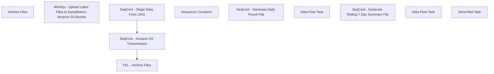

# SSIS Package: EasyMetricsExtract_LaborHours

**Project:** EasyMetricsExtract_LaborHours  
**Folder:** WMS  
**Server:** STL-SSIS-P-01  

## Connection Managers

| Name | Type | Server | Catalog | Connection (sanitized) |
|---|---|---|---|---|
| DailyInAndOutCsv | FLATFILE |  |  |  |
| IntegrationStaging | OLEDB | stl-ssis-p-01 | IntegrationStaging | Data Source=stl-ssis-p-01; Initial Catalog=IntegrationStaging; Provider=SQLNCLI11.1; Integrated Security=SSPI; Auto Translate=False |
| SMTP | SMTP |  |  |  |
| Summary7DayCsv | FLATFILE |  |  |  |
| dw | OLEDB | papamart | dw | Data Source=papamart; Initial Catalog=dw; Provider=SQLNCLI11.1; Integrated Security=SSPI; Auto Translate=False |

## Control Flow Tasks

| Task | Type |
|---|---|
| EasyMetricsExtract_LaborHours | Package |
| FEL - Archive Files | FOREACHLOOP |
| Archive Files | FileSystemTask |
| SeqCont - Amazon S3 Transmission | SEQUENCE |
| WinScp - Upload Labor Files to EasyMetrics Amazon S3 Bucket | ExecuteProcess |
| SeqCont - Stage Data From UKG | SEQUENCE |
| Sequence Container | SEQUENCE |
| SeqCont - Generate Daily Punch File | SEQUENCE |
| Data Flow Task | Pipeline |
| SeqCont - Generate Rolling 7 Day Summary File | SEQUENCE |
| Data Flow Task | Pipeline |
| Send Mail Task | SendMailTask |

## Control Flow Outline

```text
- Send Mail Task [SendMailTask]
- FEL - Archive Files [FOREACHLOOP]
  - Archive Files [FileSystemTask]
- SeqCont - Amazon S3 Transmission [SEQUENCE]
  - WinScp - Upload Labor Files to EasyMetrics Amazon S3 Bucket [ExecuteProcess]
- SeqCont - Stage Data From UKG [SEQUENCE]
  - Sequence Container [SEQUENCE]
    - SeqCont - Generate Daily Punch File [SEQUENCE]
      - Data Flow Task [Pipeline]
    - SeqCont - Generate Rolling 7 Day Summary File [SEQUENCE]
      - Data Flow Task [Pipeline]
```

## Architecture Diagram



## Variables

| Namespace | Name | Expression-bound |
|---|---|---|
| System | Propagate | No |
| User | ArchiveFilePath | Yes |
| User | DateTimeStamp | Yes |
| User | EndDate | Yes |
| User | EndDateAsDATE | Yes |
| User | FelFoundFileName | No |
| User | GetDate | Yes |
| User | GetDateAsDATE | Yes |
| User | StartDate | Yes |
| User | StartDateAsDATE | Yes |

### Expression-bound variable values

#### User::ArchiveFilePath

**Expression:**

```sql
"\\\\"+ @[$Package::IntegrationStaging_ServerName]+"\\" +@[$Package::FileDropPath]+"Archive"+"\\"
```

**Evaluated value:**

```sql
\\stl-ssis-p-01\\IntegrationStaging\EasyMetrics\LaborHours\Archive\
```

#### User::DateTimeStamp

**Expression:**

```sql
(DT_WSTR,4)DATEPART("yyyy",GetDate()) 
+ (DT_WSTR,4)DATEPART("mm",GetDate()) 
+ (DT_WSTR,4)DATEPART("dd",GetDate()) 
+ (DT_WSTR,4)DATEPART("hh",GetDate()) 
+ (DT_WSTR,4)DATEPART("mi",GetDate()) 
+ (DT_WSTR,4)DATEPART("ss",GetDate()) 
+ (DT_WSTR,4)DATEPART("ms",GetDate())
```

**Evaluated value:**

```sql
2023731165011900
```

#### User::EndDate

**Expression:**

```sql
dateadd("dd", @[$Package::DaysToInclude], @[User::StartDate])
```

**Evaluated value:**

```sql
7/31/2023
```

#### User::EndDateAsDATE

**Expression:**

```sql
(DT_WSTR, 4) datepart("year", @[User::EndDate])  + "-" +
right("0"+ (DT_WSTR, 2) datepart("mm", @[User::EndDate]),2)  + "-" +
right("0" +(DT_WSTR, 2) datepart("dd",  @[User::EndDate]),2)
```

**Evaluated value:**

```sql
2023-07-31
```

#### User::GetDate

**Expression:**

```sql
(DT_DATE)DATEDIFF("Day", (DT_DATE) 0, GETDATE())
```

**Evaluated value:**

```sql
7/31/2023
```

#### User::GetDateAsDATE

**Expression:**

```sql
(DT_WSTR, 4) datepart("year", @[User::GetDate])  + "-" +
right("0"+ (DT_WSTR, 2) datepart("mm", @[User::GetDate]),2)  + "-" +
right("0" +(DT_WSTR, 2) datepart("dd",  @[User::GetDate]),2)
```

**Evaluated value:**

```sql
2023-07-31
```

#### User::StartDate

**Expression:**

```sql
dateadd("dd", -@[$Package::DaysToGoBack] , @[User::GetDate] )
```

**Evaluated value:**

```sql
7/30/2023
```

#### User::StartDateAsDATE

**Expression:**

```sql
(DT_WSTR, 4) datepart("year", @[User::StartDate])  + "-" +
right("0"+ (DT_WSTR, 2) datepart("mm", @[User::StartDate]),2)  + "-" +
right("0" +(DT_WSTR, 2) datepart("dd",  @[User::StartDate]),2)
```

**Evaluated value:**

```sql
2023-07-30
```

## Execute SQL Tasks

_None detected._

## Data Flow: Sources

| Component | Source Object | Type | Data Flow Task | Connection | SQL Kind |
|---|---|---|---|---|---|
| OLE DB Source - DW |  | OLEDBSource | Data Flow Task | dw | SqlCommand |
| OLE DB Source - DW |  | OLEDBSource | Data Flow Task | dw | SqlCommand |

#### OLE DB Source - DW — SqlCommand

```sql
WITH BHSHours
AS
(
SELECT
	  -- emp.Emp_Name
	  --,emp.Emp_Fullname
	  substring(Emp_Fullname,charindex(',',Emp_Fullname)+2,len(Emp_Fullname)) as FirstName
	  ,substring(Emp_Fullname,	0,charindex(',',Emp_Fullname)) as LastName

	  ,det.Wrkd_Rate
	  ,dep.DEPT_ID
	  ,CAST(det.Wrkd_Work_Date AS DATE) 'PunchDate'
	  ,ht.Htype_Name
	  ,CAST(Wrkd_Minutes AS decimal)/60.00 AS 'PunchHours'
	  ,CAST(Wrkd_Start_Time AS TIME) AS 'rawInTime'
	  ,FORMAT(Wrkd_Start_Time, 'hh:mm:ss tt') AS 'InTime'
	  --,CAST(Wrkd_End_Time AS TIME) AS 'OutTime'
	  ,FORMAT(Wrkd_End_Time, 'hh:mm:ss tt') AS 'OutTime'
	  ,det.Job_ID
	  ,j.Job_Name
	  ,tc.TCODE_NAME
      ,[Wrks_Work_Date]
      ,[Paygrp_ID]
	  ,p.[PROJ_NAME] 
  FROM [dw].[dbo].[UTAWorkSummary] ws WITH(NOLOCK)
  INNER JOIN [dw].[dbo].[UTAEmployee] emp WITH(NOLOCK) ON ws.Emp_ID = emp.Emp_ID
  LEFT JOIN [dw].[dbo].[UTAWorkDetail] det WITH(NOLOCK)  ON ws.Wrks_ID = det.Wrks_ID
  LEFT JOIN [dw].[dbo].[UTADepartment] dep WITH(NOLOCK) ON det.Dept_ID = dep.DEPT_ID
  LEFT JOIN [dw].[dbo].[UTAHourType] ht WITH(NOLOCK) ON det.Htype_ID = ht.Htype_ID
  LEFT JOIN [dw].[dbo].[UTAJob] j WITH(NOLOCK) ON det.Job_ID = j.Job_ID
  LEFT JOIN [dw].[dbo].[UTATimeCode] tc WITH(NOLOCK) ON det.Tcode_ID = tc.TCODE_ID
  LEFT JOIN [dw].[dbo].[UTAProject] p WITH(NOLOCK) ON det.proj_ID = p.PROJ_ID
  WHERE 1=1
	AND Calcgrp_ID IN (10006, 10007) -- An Original Filter
	AND det.Wrkd_Work_Date IS NOT NULL -- An Original Filter
	AND Htype_Name NOT IN ('UNPAID') -- An Original Filter 
	--AND CAST(det.Wrkd_Work_Date AS DATE) = '2023-03-27'
	AND DATEDIFF(dd,det.Wrkd_Work_Date, getdate()-1) = 0 -- We want the previous day's punches 
	
)

-- PunchIn 
SELECT 
	
	cast (replace(LastName,'?','') as varchar (50)) as LastName -- Added 7/31/2023 per Issue Reported by Easy Metrics Developer 
      ,FirstName
	  ,Wrkd_Rate AS 'PayRate'
	  ,DEPT_ID AS 'Department'
	  ,PunchDate
	  ,Htype_Name AS 'Category'
	  ,InTime --as [Time]
	  ,null as  OutTime
	  ,Job_ID AS 'JobCode'
	  ,Job_Name AS 'JobName'
	  ,CASE
	    WHEN TCODE_NAME = 'HONEY' THEN 'PTO'
		WHEN TCODE_NAME = 'BD' THEN 'BIRTHDAY'
		WHEN TCODE_NAME = 'BRV' THEN 'BEREAVEMENT'
		ELSE TCODE_NAME
	   END AS 'TimeCode'
	  --,PunchHours AS 'Hours'
	  , null as 'Hours'
	  --,(Wrkd_Rate * PunchHours) AS 'Pay'
	  , null  as 'Pay'
	  , '1' as PunchTypeOrdinal -- This will not be mapped in the file ouput, this is for sorting only 
	  , rawInTime -- This will not be mapped in the file ouput, this is for sorting only 
  FROM BHSHours b
  where 1=1
  --and b.LastName like '%?%' -- For Spot Checking Special Characters -- Added 7/31/2023
-- Punch Out 
union 
SELECT 
	
	cast (replace(LastName,'?','') as varchar (50)) as LastName -- Added 7/31/2023 per Issue Reported by Easy Metrics Developer 
      ,FirstName
	  ,Wrkd_Rate AS 'PayRate'
	  ,DEPT_ID AS 'Department'
	  ,PunchDate
	  ,Htype_Name AS 'Category'
	  --,InTime --as [Time]
	  ,null as  InTime
	  ,OutTime
	  ,Job_ID AS 'JobCode'
	  ,Job_Name AS 'JobName'
	  ,CASE
	    WHEN TCODE_NAME = 'HONEY' THEN 'PTO'
		WHEN TCODE_NAME = 'BD' THEN 'BIRTHDAY'
		WHEN TCODE_NAME = 'BRV' THEN 'BEREAVEMENT'
		ELSE TCODE_NAME
	   END AS 'TimeCode'
	  ,PunchHours AS 'Hours'
	  ,(Wrkd_Rate * PunchHours) AS 'Pay'
	  , '2' as PunchTypeOrdinal -- This will not be mapped in the file ouput, this is for sorting only 
	  , rawInTime -- This will not be mapped in the file ouput, this is for sorting only 
  FROM BHSHours b
  where 1=1
  --and b.LastName like '%?%' -- For Spot Checking Special Characters -- Added 7/31/2023
  order by 1, 5 ,15, 14
```

#### OLE DB Source - DW — SqlCommand

```sql
WITH BHSHours
AS
(
SELECT
	  -- emp.Emp_Name
	  --,emp.Emp_Fullname
	  substring(Emp_Fullname,charindex(',',Emp_Fullname)+2,len(Emp_Fullname)) as FirstName
	  ,substring(Emp_Fullname,	0,charindex(',',Emp_Fullname)) as LastName

	  ,det.Wrkd_Rate
	  ,dep.DEPT_ID
	  ,CAST(det.Wrkd_Work_Date AS DATE) 'PunchDate'
	  ,ht.Htype_Name
	  ,CAST(Wrkd_Minutes AS decimal)/60.00 AS 'PunchHours'
	  ,CAST(Wrkd_Start_Time AS TIME) AS 'rawInTime'
	  ,FORMAT(Wrkd_Start_Time, 'hh:mm:ss tt') AS 'InTime'
	  --,CAST(Wrkd_End_Time AS TIME) AS 'OutTime'
	  ,FORMAT(Wrkd_End_Time, 'hh:mm:ss tt') AS 'OutTime'
	  ,det.Job_ID
	  ,j.Job_Name
	  ,tc.TCODE_NAME
      ,[Wrks_Work_Date]
      ,[Paygrp_ID]
	  ,p.[PROJ_NAME] 
  FROM [dw].[dbo].[UTAWorkSummary] ws WITH(NOLOCK)
  INNER JOIN [dw].[dbo].[UTAEmployee] emp WITH(NOLOCK) ON ws.Emp_ID = emp.Emp_ID
  LEFT JOIN [dw].[dbo].[UTAWorkDetail] det WITH(NOLOCK)  ON ws.Wrks_ID = det.Wrks_ID
  LEFT JOIN [dw].[dbo].[UTADepartment] dep WITH(NOLOCK) ON det.Dept_ID = dep.DEPT_ID
  LEFT JOIN [dw].[dbo].[UTAHourType] ht WITH(NOLOCK) ON det.Htype_ID = ht.Htype_ID
  LEFT JOIN [dw].[dbo].[UTAJob] j WITH(NOLOCK) ON det.Job_ID = j.Job_ID
  LEFT JOIN [dw].[dbo].[UTATimeCode] tc WITH(NOLOCK) ON det.Tcode_ID = tc.TCODE_ID
  LEFT JOIN [dw].[dbo].[UTAProject] p WITH(NOLOCK) ON det.proj_ID = p.PROJ_ID
  WHERE 1=1
	AND Calcgrp_ID IN (10006, 10007)-- An Original Filter
    AND det.Wrkd_Work_Date IS NOT NULL -- An Original Filter
    AND Htype_Name NOT IN ('UNPAID') -- An Original Filter 	
	AND CAST(det.Wrkd_Work_Date AS DATE) between CAST (GETDATE()-7 AS DATE) AND CAST (GETDATE()-1 AS DATE) -- Previous 7 days 
	
	
)
SELECT 
	cast (replace(LastName,'?','') as varchar (50)) as LastName -- Added 7/31/2023 per Issue Reported by Easy Metrics Developer 
      ,FirstName
	  ,Wrkd_Rate AS 'PayRate'
	  ,DEPT_ID AS 'Department'
	  ,PunchDate
	  ,Htype_Name AS 'Category'
	  ,CASE 
		 WHEN Htype_Name = 'REG' THEN PunchHours
		 ELSE 0.0
	   END AS 'NonOTHours'
	  ,CASE 
		 WHEN Htype_Name LIKE 'OT%' THEN PunchHours
		 ELSE 0.0
	   END AS 'OTHours'
	  --,rawInTime
	  ,InTime 
	  ,OutTime
	  ,Job_ID AS 'JobCode'
	  ,Job_Name AS 'JobName'
	  ,CASE
	    WHEN TCODE_NAME = 'HONEY' THEN 'PTO'
		WHEN TCODE_NAME = 'BD' THEN 'BIRTHDAY'
		WHEN TCODE_NAME = 'BRV' THEN 'BEREAVEMENT'
		ELSE TCODE_NAME
	   END AS 'TimeCode'
	  ,PunchHours AS 'Hours'
	  ,(Wrkd_Rate * PunchHours) AS 'Pay'
      ,Paygrp_ID AS 'PayGroup'
	  ,PROJ_NAME AS 'WorkArea'
	  , rawInTime -- Just used for Sorting 
  FROM BHSHours b
  where 1=1
  --and b.LastName like '%?%' -- For Spot Checking Special Characters -- Added 7/31/2023
  order by 1, 5, 18
```

## Data Flow: Destinations

| Component | Target Table | Type | Data Flow Task | Connection | SQL Kind |
|---|---|---|---|---|---|
| Flat File Destination - DailyInAndOutCsv |  | FlatFileDestination | Data Flow Task | DailyInAndOutCsv |  |
| Flat File Destination - Summary7DayCsv |  | FlatFileDestination | Data Flow Task | Summary7DayCsv |  |
