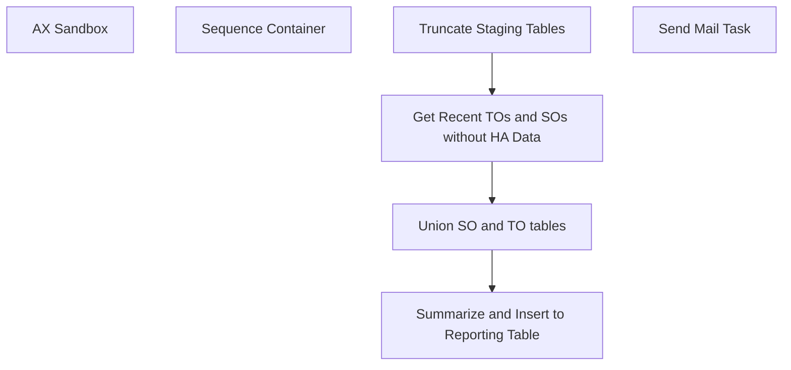

# SSIS Package: WMS_PreWaveRouting

**Project:** PreWaveRoutingReport  
**Folder:** WMS  
**Server:** STL-SSIS-P-01  

## Connection Managers

| Name | Type | Server | Catalog | Connection (sanitized) |
|---|---|---|---|---|
| Dynamics AX Connection Manager - Prod | DynamicsAX |  |  |  |
| Dynamics AX Connection Manager - Test 1 | DynamicsAX |  |  |  |
| IntegrationStaging | OLEDB | STL-SSIS-p-01 | IntegrationStaging | Data Source=STL-SSIS-p-01; Initial Catalog=IntegrationStaging; Provider=SQLNCLI11.1; Integrated Security=SSPI; Auto Translate=False |
| SMTP | SMTP |  |  |  |

## Control Flow Tasks

| Task | Type |
|---|---|
| WMS_PreWaveRouting | Package |
| AX Sandbox | Pipeline |
| Sequence Container | SEQUENCE |
| Get Recent TOs and SOs without HA Data | Pipeline |
| Summarize and Insert to Reporting Table | Pipeline |
| Truncate Staging Tables | ExecuteSQLTask |
| Union SO and TO tables | Pipeline |
| Send Mail Task | SendMailTask |

## Control Flow Outline

```text
- Send Mail Task [SendMailTask]
- AX Sandbox [Pipeline]
- Sequence Container [SEQUENCE]
  - Get Recent TOs and SOs without HA Data [Pipeline]
  - Summarize and Insert to Reporting Table [Pipeline]
  - Truncate Staging Tables [ExecuteSQLTask]
  - Union SO and TO tables [Pipeline]
```

## Architecture Diagram



## Variables

| Namespace | Name | Expression-bound |
|---|---|---|
| System | Propagate | No |
| User | DateTimeStamp | Yes |
| User | EndDate | Yes |
| User | EndDateAsDATE | Yes |
| User | GetDate | Yes |
| User | GetDateAsDATE | Yes |
| User | SalesOrderFilter | Yes |
| User | SalesOrderStartDateAsDate | Yes |
| User | StartDate | Yes |
| User | StartDateAsDATE | Yes |

### Expression-bound variable values

#### User::DateTimeStamp

**Expression:**

```sql
(DT_WSTR,4)DATEPART("yyyy",GetDate()) 
+ (DT_WSTR,4)DATEPART("mm",GetDate()) 
+ (DT_WSTR,4)DATEPART("dd",GetDate()) 
+ (DT_WSTR,4)DATEPART("hh",GetDate()) 
+ (DT_WSTR,4)DATEPART("mi",GetDate()) 
+ (DT_WSTR,4)DATEPART("ss",GetDate()) 
+ (DT_WSTR,4)DATEPART("ms",GetDate())
```

**Evaluated value:**

```sql
2020220152149873
```

#### User::EndDate

**Expression:**

```sql
dateadd("dd", @[$Package::DaysToInclude], @[User::StartDate])
```

**Evaluated value:**

```sql
2/11/2020
```

#### User::EndDateAsDATE

**Expression:**

```sql
(DT_WSTR, 4) datepart("year", @[User::EndDate])  + "-" + 
(DT_WSTR, 2) datepart("mm", @[User::EndDate])  + "-" + 
(DT_WSTR, 2) datepart("dd",  @[User::EndDate])
```

**Evaluated value:**

```sql
2020-2-11
```

#### User::GetDate

**Expression:**

```sql
(DT_DATE)DATEDIFF("Day", (DT_DATE) 0, GETDATE())
```

**Evaluated value:**

```sql
2/20/2020
```

#### User::GetDateAsDATE

**Expression:**

```sql
(DT_WSTR, 4) datepart("year", @[User::GetDate])  + "-" + 
(DT_WSTR, 2) datepart("mm", @[User::GetDate])  + "-" + 
(DT_WSTR, 2) datepart("dd",  @[User::GetDate])
```

**Evaluated value:**

```sql
2020-2-20
```

#### User::SalesOrderFilter

**Expression:**

```sql
"dataAreaId eq '1100' and ShippingWarehouseId eq '9980' and RequestedShippingDate ge " +   @[User::SalesOrderStartDateAsDate]
```

**Evaluated value:**

```sql
dataAreaId eq '1100' and ShippingWarehouseId eq '9980' and RequestedShippingDate ge 2020-02-10
```

#### User::SalesOrderStartDateAsDate

**Expression:**

```sql
(DT_WSTR, 4) datepart("year", @[User::StartDate])  + "-" +
right("0"+ (DT_WSTR, 2) datepart("mm", @[User::StartDate]),2)  + "-" + 
right("0" +(DT_WSTR, 2) datepart("dd",  @[User::StartDate]),2)
```

**Evaluated value:**

```sql
2020-02-10
```

#### User::StartDate

**Expression:**

```sql
dateadd("dd", -@[$Package::DaysToGoBack] , @[User::GetDate] )
```

**Evaluated value:**

```sql
2/10/2020
```

#### User::StartDateAsDATE

**Expression:**

```sql
(DT_WSTR, 4) datepart("year", @[User::StartDate])  + "-" + 
(DT_WSTR, 2) datepart("mm", @[User::StartDate])  + "-" + 
(DT_WSTR, 2) datepart("dd",  @[User::StartDate])
```

**Evaluated value:**

```sql
2020-2-10
```

## Execute SQL Tasks

### Truncate Staging Tables

**Path:** `Package\Sequence Container\Truncate Staging Tables`  
**Connection:** IntegrationStaging (STL-SSIS-p-01/IntegrationStaging)  

```sql
truncate table WMS.[PreWaveTransferOrderStage]
truncate table WMS.[PreWaveSalesOrderStage]
truncate table WMS.[PreWaveUnionSalesAndTransferOrdersSTage]
truncate TABLE WMS.[PreWaveRoutingReport]
```

## Data Flow: Sources

| Component | Source Object | Type | Data Flow Task | Connection | SQL Kind |
|---|---|---|---|---|---|
| Summarize Staged Data |  | OLEDBSource | Summarize and Insert to Reporting Table | IntegrationStaging | SqlCommand |
| OLE DB Source |  | OLEDBSource | Union SO and TO tables | IntegrationStaging |  |
| OLE DB Source 1 |  | OLEDBSource | Union SO and TO tables | IntegrationStaging |  |

#### Summarize Staged Data — SqlCommand

```sql
with uom_conv as (
select
    ProductNumber,
    BAG,BALE,BDL,BX,CS,IP,KT,LB,PK,PLT,RL,ROLL,[SET]
from
    (
        select
            ProductNumber,
            FromUnitSymbol,
            Factor as Qty
        from wms.ItemsUOM
        where Entity=1100
        and ToUnitSymbol='ea'
    ) as UOM
PIVOT
    (
        sum(QTy)
        for FromUnitSymbol in ([BAG],[BALE],[BDL],[BX],[CS],[ip],[KT],[lb],[PK],[PLT],[RL],[Roll],[SET])
    ) as pt
)


select O.OrderNumber,
--O.ShippingWarehouseId,
case when left(O.OrderNumber,2) <> 'TO'
	then coalesce (w.WarehouseID, o.ReceivingWarehouseId)
	else o.ReceivingWarehouseId
	end as ReceivingWarehouseId,
--O.ItemNumber,
--O.UnitSymbol, 
--u.CS as EachesInCase,
sum (O.OrderQuantity) as SumOrderQuantity,
case when o.UnitSymbol in ('Bale','CS')
	then cast(sum (O.OrderQuantity/1 )as int) 
	else cast(sum (O.OrderQuantity/isnull(u.cs,1))as int)
	end as CaseCount,
--sum (cast(o.OrderQuantity/isnull(v.StandardCaseQty,1) as numeric (13,4)) * v.StandardCaseWeight) as Weight, 
(cast (sum (cast(o.OrderQuantity/isnull(v.StandardCaseQty,1) as numeric (13,4)) * v.StandardCaseWeight) as Numeric (13,4)))as Weight,
--sum (cast(o.OrderQuantity/isnull(v.StandardCaseQty,1) as numeric (13,4)) * v.StandardCaseVolume) as Volume 
(cast (sum ((cast(o.OrderQuantity/isnull(v.StandardCaseQty,1) as numeric (13,4)) * v.StandardCaseVolume))as numeric (13,4)))as Volume
from WMS.[PreWaveUnionSalesAndTransferOrdersSTage] o
left join erp.vwWarehouseIDToLocationCode w on o.ReceivingWarehouseId=w.PrimaryAddressDescription and w.Entity = '1100' 
left join uom_conv u on u.ProductNumber=o.Itemnumber 
left join [WMS].[vwItemStandardCaseQuantityWeightVolume] V on v.ProductNumber=O.itemnumber
group by O.OrderNumber,
--O.ShippingWarehouseId,
case when left(O.OrderNumber,2) <> 'TO'	then coalesce (w.WarehouseID, o.ReceivingWarehouseId)	else o.ReceivingWarehouseId	end ,
--O.ItemNumber,
o.UnitSymbol
--u.CS
order by 1
```

## Data Flow: Destinations

| Component | Target Table | Type | Data Flow Task | Connection | SQL Kind |
|---|---|---|---|---|---|
| OLE DB Destination |  | OLEDBDestination | AX Sandbox | IntegrationStaging |  |
| OLE DB Destination 1 |  | OLEDBDestination | AX Sandbox | IntegrationStaging |  |
| OLE DB Destination 2 |  | OLEDBDestination | AX Sandbox | IntegrationStaging |  |
| Dest-PreWaveSalesOrderStage |  | OLEDBDestination | Get Recent TOs and SOs without HA Data | IntegrationStaging |  |
| Dest-PreWaveTransferOrderStage |  | OLEDBDestination | Get Recent TOs and SOs without HA Data | IntegrationStaging |  |
| WMS-PreWaveRoutingReport |  | OLEDBDestination | Summarize and Insert to Reporting Table | IntegrationStaging |  |
| OLE DB Destination |  | OLEDBDestination | Union SO and TO tables | IntegrationStaging |  |
