# SSIS Package: SalesAuditToDynamicsDimExtracts

**Project:** SalesAuditToDynamicsDimExtracts  
**Folder:** WMS  
**Server:** STL-SSIS-P-01  

## Architecture Diagram

```mermaid
flowchart TD
    subgraph Connections
        dw_conn(["dw [OLEDB]"])
        DWStaging_conn(["DWStaging [OLEDB]"])
        Dynamics_AX_Connection_Manager_conn(["Dynamics AX Connection Manager [DynamicsAX]"])
        IntegrationStaging_conn(["IntegrationStaging [OLEDB]"])
        SMTP_conn(["SMTP [SMTP]"])
    end
    subgraph ControlFlow
        SalesAuditToDynamicsDimExtracts_task["SalesAuditToDynamicsDimExtracts"]
        SeqCont___Dynamics_ODATA_Dims_task["SeqCont - Dynamics ODATA Dims"]
        SalesAuditToDynamicsDimExtracts_task --> SeqCont___Dynamics_ODATA_Dims_task
        Execute_SQL_Task___Truncate_Stage_task["Execute SQL Task - Truncate Stage"]
        SeqCont___Dynamics_ODATA_Dims_task --> Execute_SQL_Task___Truncate_Stage_task
        SeqCont___ODATA_to_Stage_task["SeqCont - ODATA to Stage"]
        Execute_SQL_Task___Truncate_Stage_task --> SeqCont___ODATA_to_Stage_task
        DFT____Tender_Type___OLD_task["DFT  - Tender Type - OLD"]
        SeqCont___ODATA_to_Stage_task --> DFT____Tender_Type___OLD_task
        DFT___Card_Type_task["DFT - Card Type"]
        DFT____Tender_Type___OLD_task --> DFT___Card_Type_task
        DFT___Operating_Unit___RetailStore_task["DFT - Operating Unit - RetailStore"]
        DFT___Card_Type_task --> DFT___Operating_Unit___RetailStore_task
        DFT___Tender_Type___New_task["DFT - Tender Type - New"]
        DFT___Operating_Unit___RetailStore_task --> DFT___Tender_Type___New_task
        SeqCont___Load__Card_and_Tender_Data_to_DW_task["SeqCont - Load  Card and Tender Data to DW"]
        DFT___Tender_Type___New_task --> SeqCont___Load__Card_and_Tender_Data_to_DW_task
        Data_Flow_Task___New_task["Data Flow Task - New"]
        SeqCont___Load__Card_and_Tender_Data_to_DW_task --> Data_Flow_Task___New_task
        Execute_SQL_Task___Truncate_task["Execute SQL Task - Truncate"]
        Data_Flow_Task___New_task --> Execute_SQL_Task___Truncate_task
        SeqCont___Merge_ODATA_Dims_task["SeqCont - Merge ODATA Dims"]
        Execute_SQL_Task___Truncate_task --> SeqCont___Merge_ODATA_Dims_task
        Execute_SQL_Task___CardType_Merge_task["Execute SQL Task - CardType Merge"]
        SeqCont___Merge_ODATA_Dims_task --> Execute_SQL_Task___CardType_Merge_task
        Execute_SQL_Task___RetailStore_Merge_task["Execute SQL Task - RetailStore Merge"]
        Execute_SQL_Task___CardType_Merge_task --> Execute_SQL_Task___RetailStore_Merge_task
        Execute_SQL_Task___TenderType_Merge___NEW_task["Execute SQL Task - TenderType Merge - NEW"]
        Execute_SQL_Task___RetailStore_Merge_task --> Execute_SQL_Task___TenderType_Merge___NEW_task
        Execute_SQL_Task___TenderType_Merge___OLD_task["Execute SQL Task - TenderType Merge - OLD"]
        Execute_SQL_Task___TenderType_Merge___NEW_task --> Execute_SQL_Task___TenderType_Merge___OLD_task
        SeqCont___Testing_and_Discovery___Last_used_Feb_7_2024_task["SeqCont - Testing and Discovery - Last used Feb 7 2024"]
        Execute_SQL_Task___TenderType_Merge___OLD_task --> SeqCont___Testing_and_Discovery___Last_used_Feb_7_2024_task
        Data_Flow_Task_task["Data Flow Task"]
        SeqCont___Testing_and_Discovery___Last_used_Feb_7_2024_task --> Data_Flow_Task_task
        Data_Flow_Task_1_task["Data Flow Task 1"]
        Data_Flow_Task_task --> Data_Flow_Task_1_task
        Execute_SQL_Task___Truncate_Stage_task["Execute SQL Task - Truncate Stage"]
        Data_Flow_Task_1_task --> Execute_SQL_Task___Truncate_Stage_task
        Send_Mail_Task_task["Send Mail Task"]
        Execute_SQL_Task___Truncate_Stage_task --> Send_Mail_Task_task
    end
```

## Connection Managers

| Name | Type |
|---|---|
| dw | OLEDB |
| DWStaging | OLEDB |
| Dynamics AX Connection Manager | DynamicsAX |
| IntegrationStaging | OLEDB |
| SMTP | SMTP |

## Control Flow Tasks

| Task | Type |
|---|---|
| SalesAuditToDynamicsDimExtracts | Microsoft.Package |
| SeqCont - Dynamics ODATA Dims | STOCK:SEQUENCE |
| Execute SQL Task - Truncate Stage | Microsoft.ExecuteSQLTask |
| SeqCont - ODATA to Stage | STOCK:SEQUENCE |
| DFT  - Tender Type - OLD | Microsoft.Pipeline |
| DFT - Card Type | Microsoft.Pipeline |
| DFT - Operating Unit - RetailStore | Microsoft.Pipeline |
| DFT - Tender Type - New | Microsoft.Pipeline |
| SeqCont - Load  Card and Tender Data to DW | STOCK:SEQUENCE |
| Data Flow Task - New | Microsoft.Pipeline |
| Execute SQL Task - Truncate | Microsoft.ExecuteSQLTask |
| SeqCont - Merge ODATA Dims | STOCK:SEQUENCE |
| Execute SQL Task - CardType Merge | Microsoft.ExecuteSQLTask |
| Execute SQL Task - RetailStore Merge | Microsoft.ExecuteSQLTask |
| Execute SQL Task - TenderType Merge - NEW | Microsoft.ExecuteSQLTask |
| Execute SQL Task - TenderType Merge - OLD | Microsoft.ExecuteSQLTask |
| SeqCont - Testing and Discovery - Last used Feb 7 2024 | STOCK:SEQUENCE |
| Data Flow Task | Microsoft.Pipeline |
| Data Flow Task 1 | Microsoft.Pipeline |
| Execute SQL Task - Truncate Stage | Microsoft.ExecuteSQLTask |
| Send Mail Task | Microsoft.SendMailTask |

## Data Flow: Sources

| Component | SQL Preview |
|---|---|
|  | with PartyDepositTenders as (  select distinct tender_code  from tender_dim where tender_desc like '%party%'  )  select  td.tender_code as TenderCode,  td.tender_desc as TenderDesc,  case when td.tender_code in ('604','605','606','608','609','611','614','619','630','631','632','635','637','642','650','651','695','697','698','699','1186','670','671','672','673','674') -- These Have Been Bucketed as |
|  | with PartyDepositTenders as (  select distinct tender_code  from tender_dim where tender_desc like '%party%'  )  select  td.tender_code as TenderCode,  td.tender_desc as TenderDesc,  case when td.tender_code in ('604','605','606','608','609','611','614','619','630','631','632','635','637','642','650','651','695','697','698','699','1187') -- These Have Been Bucketed as Card Tenders 	then '999' 	whe |
|  | with    --TenderTypes as (  --select [Name] as TenderTypeName,  --PaymentMethodNumber --from wms.RetailStoreTenderType --where len(PaymentMethodNumber) >= 3 -- Older configs Used single Digit --group by [Name],  --PaymentMethodNumber   --),  -- Replaced TenderTypes CTE with new source on 2/7/2024  TenderTypes as (  select [Name] as TenderTypeName,  PaymentMethodNumber from wms.RetailTenderType whe |

## Data Flow: Destinations

| Component | Destination |
|---|---|
|  | [WMS].[RetailStoreTenderTypeStage] |
|  | [WMS].[RetailTenderTypeCardStage] |
|  | [WMS].[RetailStoreStage] |
|  | [WMS].[RetailTenderTypeStage] |
|  | [dbo].[DynamicsTendersCardTypes] |
|  | [WMS].[RetailStoreTenderTypeTableStage] |
|  | [WMS].[RetailTenderTypeStage] |

