# SSIS Package: SalesAuditToDynamicsDimExtracts

**Project:** SalesAuditToDynamicsDimExtracts  
**Folder:** WMS  
**Server:** STL-SSIS-P-01  

## Connection Managers

| Name | Type | Server | Catalog | Connection (sanitized) |
|---|---|---|---|---|
| DWStaging | OLEDB | papamart | DWStaging | Data Source=papamart; Initial Catalog=DWStaging; Provider=SQLNCLI11.1; Integrated Security=SSPI; Auto Translate=False |
| Dynamics AX Connection Manager | DynamicsAX |  |  |  |
| IntegrationStaging | OLEDB | stl-ssis-p-01 | IntegrationStaging | Data Source=stl-ssis-p-01; Initial Catalog=IntegrationStaging; Provider=SQLNCLI11.1; Integrated Security=SSPI; Auto Translate=False |
| SMTP | SMTP |  |  |  |
| dw | OLEDB | papamart | dw | Data Source=papamart; Initial Catalog=dw; Provider=SQLNCLI11.1; Integrated Security=SSPI; Auto Translate=False |

## Control Flow Tasks

| Task | Type |
|---|---|
| SalesAuditToDynamicsDimExtracts | Package |
| SeqCont - Dynamics ODATA Dims | SEQUENCE |
| Execute SQL Task - Truncate Stage | ExecuteSQLTask |
| SeqCont - ODATA to Stage | SEQUENCE |
| DFT  - Tender Type - OLD | Pipeline |
| DFT - Card Type | Pipeline |
| DFT - Operating Unit - RetailStore | Pipeline |
| DFT - Tender Type - New | Pipeline |
| SeqCont - Load  Card and Tender Data to DW | SEQUENCE |
| Data Flow Task - New | Pipeline |
| Execute SQL Task - Truncate | ExecuteSQLTask |
| SeqCont - Merge ODATA Dims | SEQUENCE |
| Execute SQL Task - CardType Merge | ExecuteSQLTask |
| Execute SQL Task - RetailStore Merge | ExecuteSQLTask |
| Execute SQL Task - TenderType Merge - NEW | ExecuteSQLTask |
| Execute SQL Task - TenderType Merge - OLD | ExecuteSQLTask |
| SeqCont - Testing and Discovery - Last used Feb 7 2024 | SEQUENCE |
| Data Flow Task | Pipeline |
| Data Flow Task 1 | Pipeline |
| Execute SQL Task - Truncate Stage | ExecuteSQLTask |
| Send Mail Task | SendMailTask |

## Control Flow Outline

```text
- Send Mail Task [SendMailTask]
- SeqCont - Dynamics ODATA Dims [SEQUENCE]
  - Execute SQL Task - Truncate Stage [ExecuteSQLTask]
  - SeqCont - ODATA to Stage [SEQUENCE]
    - DFT  - Tender Type - OLD [Pipeline]
    - DFT - Card Type [Pipeline]
    - DFT - Operating Unit - RetailStore [Pipeline]
    - DFT - Tender Type - New [Pipeline]
- SeqCont - Load  Card and Tender Data to DW [SEQUENCE]
  - Data Flow Task - New [Pipeline]
  - Execute SQL Task - Truncate [ExecuteSQLTask]
- SeqCont - Merge ODATA Dims [SEQUENCE]
  - Execute SQL Task - CardType Merge [ExecuteSQLTask]
  - Execute SQL Task - RetailStore Merge [ExecuteSQLTask]
  - Execute SQL Task - TenderType Merge - NEW [ExecuteSQLTask]
  - Execute SQL Task - TenderType Merge - OLD [ExecuteSQLTask]
- SeqCont - Testing and Discovery - Last used Feb 7 2024 [SEQUENCE]
  - Data Flow Task [Pipeline]
  - Data Flow Task 1 [Pipeline]
  - Execute SQL Task - Truncate Stage [ExecuteSQLTask]
```

## Architecture Diagram

```mermaid
flowchart TD
    n_Package_SeqCont___Dynamics_ODATA_Dims["SeqCont - Dynamics ODATA Dims"]
    n_Package_SeqCont___Dynamics_ODATA_Dims_Execute_SQL_Task___Truncate_Stage["Execute SQL Task - Truncate Stage"]
    n_Package_SeqCont___Dynamics_ODATA_Dims_SeqCont___ODATA_to_Stage["SeqCont - ODATA to Stage"]
    n_Package_SeqCont___Dynamics_ODATA_Dims_SeqCont___ODATA_to_Stage_DFT____Tender_Type___OLD["DFT  - Tender Type - OLD"]
    n_Package_SeqCont___Dynamics_ODATA_Dims_SeqCont___ODATA_to_Stage_DFT___Card_Type["DFT - Card Type"]
    n_Package_SeqCont___Dynamics_ODATA_Dims_SeqCont___ODATA_to_Stage_DFT___Operating_Unit___RetailStore["DFT - Operating Unit - RetailStore"]
    n_Package_SeqCont___Dynamics_ODATA_Dims_SeqCont___ODATA_to_Stage_DFT___Tender_Type___New["DFT - Tender Type - New"]
    n_Package_SeqCont___Load__Card_and_Tender_Data_to_DW["SeqCont - Load  Card and Tender Data to DW"]
    n_Package_SeqCont___Load__Card_and_Tender_Data_to_DW_Data_Flow_Task___New["Data Flow Task - New"]
    n_Package_SeqCont___Load__Card_and_Tender_Data_to_DW_Execute_SQL_Task___Truncate["Execute SQL Task - Truncate"]
    n_Package_SeqCont___Merge_ODATA_Dims["SeqCont - Merge ODATA Dims"]
    n_Package_SeqCont___Merge_ODATA_Dims_Execute_SQL_Task___CardType_Merge["Execute SQL Task - CardType Merge"]
    n_Package_SeqCont___Merge_ODATA_Dims_Execute_SQL_Task___RetailStore_Merge["Execute SQL Task - RetailStore Merge"]
    n_Package_SeqCont___Merge_ODATA_Dims_Execute_SQL_Task___TenderType_Merge___NEW["Execute SQL Task - TenderType Merge - NEW"]
    n_Package_SeqCont___Merge_ODATA_Dims_Execute_SQL_Task___TenderType_Merge___OLD["Execute SQL Task - TenderType Merge - OLD"]
    n_Package_SeqCont___Testing_and_Discovery___Last_used_Feb_7_2024["SeqCont - Testing and Discovery - Last used Feb 7 2024"]
    n_Package_SeqCont___Testing_and_Discovery___Last_used_Feb_7_2024_Data_Flow_Task["Data Flow Task"]
    n_Package_SeqCont___Testing_and_Discovery___Last_used_Feb_7_2024_Data_Flow_Task_1["Data Flow Task 1"]
    n_Package_SeqCont___Testing_and_Discovery___Last_used_Feb_7_2024_Execute_SQL_Task___Truncate_Stage["Execute SQL Task - Truncate Stage"]
    n_Package_EventHandlers_OnError__Send_Mail_Task["Send Mail Task"]
    n_Package_SeqCont___Dynamics_ODATA_Dims_Execute_SQL_Task___Truncate_Stage --> n_Package_SeqCont___Dynamics_ODATA_Dims_SeqCont___ODATA_to_Stage
    n_Package_SeqCont___Load__Card_and_Tender_Data_to_DW_Execute_SQL_Task___Truncate --> n_Package_SeqCont___Load__Card_and_Tender_Data_to_DW_Data_Flow_Task___New
    n_Package_SeqCont___Testing_and_Discovery___Last_used_Feb_7_2024_Execute_SQL_Task___Truncate_Stage --> n_Package_SeqCont___Testing_and_Discovery___Last_used_Feb_7_2024_Data_Flow_Task
    n_Package_SeqCont___Dynamics_ODATA_Dims --> n_Package_SeqCont___Merge_ODATA_Dims
    n_Package_SeqCont___Merge_ODATA_Dims --> n_Package_SeqCont___Load__Card_and_Tender_Data_to_DW
```



## Variables

| Namespace | Name | Expression-bound |
|---|---|---|
| System | Propagate | No |
| User | DateTimeStamp | Yes |
| User | EndDate | Yes |
| User | EndDateAsDATE | Yes |
| User | GetDate | Yes |
| User | GetDateAsDATE | Yes |
| User | StartDate | Yes |
| User | StartDateAsDATE | Yes |

### Expression-bound variable values

#### User::DateTimeStamp

**Expression:**

```sql
(DT_WSTR,4)DATEPART("yyyy",GetDate()) 
+ (DT_WSTR,4)DATEPART("mm",GetDate()) 
+ (DT_WSTR,4)DATEPART("dd",GetDate()) 
+ (DT_WSTR,4)DATEPART("hh",GetDate()) 
+ (DT_WSTR,4)DATEPART("mi",GetDate()) 
+ (DT_WSTR,4)DATEPART("ss",GetDate()) 
+ (DT_WSTR,4)DATEPART("ms",GetDate())
```

**Evaluated value:**

```sql
202427171752707
```

#### User::EndDate

**Expression:**

```sql
dateadd("dd", @[$Package::DaysToInclude], @[User::StartDate])
```

**Evaluated value:**

```sql
2/7/2024
```

#### User::EndDateAsDATE

**Expression:**

```sql
(DT_WSTR, 4) datepart("year", @[User::EndDate])  + "-" +
right("0"+ (DT_WSTR, 2) datepart("mm", @[User::EndDate]),2)  + "-" +
right("0" +(DT_WSTR, 2) datepart("dd",  @[User::EndDate]),2)
```

**Evaluated value:**

```sql
2024-02-07
```

#### User::GetDate

**Expression:**

```sql
(DT_DATE)DATEDIFF("Day", (DT_DATE) 0, GETDATE())
```

**Evaluated value:**

```sql
2/7/2024
```

#### User::GetDateAsDATE

**Expression:**

```sql
(DT_WSTR, 4) datepart("year", @[User::GetDate])  + "-" +
right("0"+ (DT_WSTR, 2) datepart("mm", @[User::GetDate]),2)  + "-" +
right("0" +(DT_WSTR, 2) datepart("dd",  @[User::GetDate]),2)
```

**Evaluated value:**

```sql
2024-02-07
```

#### User::StartDate

**Expression:**

```sql
dateadd("dd", -@[$Package::DaysToGoBack] , @[User::GetDate] )
```

**Evaluated value:**

```sql
2/6/2024
```

#### User::StartDateAsDATE

**Expression:**

```sql
(DT_WSTR, 4) datepart("year", @[User::StartDate])  + "-" +
right("0"+ (DT_WSTR, 2) datepart("mm", @[User::StartDate]),2)  + "-" +
right("0" +(DT_WSTR, 2) datepart("dd",  @[User::StartDate]),2)
```

**Evaluated value:**

```sql
2024-02-06
```

## Execute SQL Tasks

### Execute SQL Task - Truncate Stage

**Path:** `Package\SeqCont - Dynamics ODATA Dims\Execute SQL Task - Truncate Stage`  
**Connection:** IntegrationStaging (stl-ssis-p-01/IntegrationStaging)  

```sql
truncate table WMS.[RetailStoreStage]
truncate table WMS.[RetailTenderTypeCardStage]
--truncate table WMS.[RetailStoreTenderTypeStage]
truncate table [WMS].[RetailTenderTypeStage]
```

### Execute SQL Task - Truncate

**Path:** `Package\SeqCont - Load  Card and Tender Data to DW\Execute SQL Task - Truncate`  
**Connection:** DWStaging (papamart/DWStaging)  

```sql
truncate table DynamicsTendersCardTypes
```

### Execute SQL Task - CardType Merge

**Path:** `Package\SeqCont - Merge ODATA Dims\Execute SQL Task - CardType Merge`  
**Connection:** IntegrationStaging (stl-ssis-p-01/IntegrationStaging)  

```sql
exec [WMS].[spMergeRetailTenderTypeCard]
```

### Execute SQL Task - RetailStore Merge

**Path:** `Package\SeqCont - Merge ODATA Dims\Execute SQL Task - RetailStore Merge`  
**Connection:** IntegrationStaging (stl-ssis-p-01/IntegrationStaging)  

```sql
exec [WMS].[spMergeRetailStore] 
```

### Execute SQL Task - TenderType Merge - NEW

**Path:** `Package\SeqCont - Merge ODATA Dims\Execute SQL Task - TenderType Merge - NEW`  
**Connection:** IntegrationStaging (stl-ssis-p-01/IntegrationStaging)  

```sql
exec [WMS].[spMergeRetailTenderType] 
```

### Execute SQL Task - TenderType Merge - OLD

**Path:** `Package\SeqCont - Merge ODATA Dims\Execute SQL Task - TenderType Merge - OLD`  
**Connection:** IntegrationStaging (stl-ssis-p-01/IntegrationStaging)  

```sql
exec [WMS].[spMergeRetailStoreTenderType]
```

### Execute SQL Task - Truncate Stage

**Path:** `Package\SeqCont - Testing and Discovery - Last used Feb 7 2024\Execute SQL Task - Truncate Stage`  
**Connection:** IntegrationStaging (stl-ssis-p-01/IntegrationStaging)  

```sql
truncate table wms.RetailStoreTenderTypeTableStage
```

## Data Flow: Sources

| Component | Source Object | Type | Data Flow Task | Connection | SQL Kind |
|---|---|---|---|---|---|
| OLE DB Source - DW Tender Dim Data - Non Party Deposit Tenders |  | OLEDBSource | Data Flow Task - New | dw | SqlCommand |
| OLE DB Source - DW Tender Dim Data - Party Deposit Tenders Only |  | OLEDBSource | Data Flow Task - New | dw | SqlCommand |
| OLE DB Source - Int Staging - Tender Type and Card Type |  | OLEDBSource | Data Flow Task - New | IntegrationStaging | SqlCommand |

#### OLE DB Source - DW Tender Dim Data - Non Party Deposit Tenders — SqlCommand

```sql
with PartyDepositTenders as (

select distinct tender_code 
from tender_dim
where tender_desc like '%party%'

)

select  td.tender_code as TenderCode, 
td.tender_desc as TenderDesc, 
case when td.tender_code in ('604','605','606','608','609','611','614','619','630','631','632','635','637','642','650','651','695','697','698','699','1186','670','671','672','673','674') -- These Have Been Bucketed as Card Tenders
	then '999'
	when pdt.tender_code is not null -- Party Deposits exist as an individual tender at each store in SA - in Dyn there will be a single tender 
	then '998'
	else td.tender_code end as PaymentMethodNumber
from tender_dim  td 
left  join PartyDepositTenders PDT on pdt.tender_code=td.tender_code
where td.tender_code not in ('-1',0)
and pdt.tender_code is null
order by cast (td.tender_code as int)
```

#### OLE DB Source - DW Tender Dim Data - Party Deposit Tenders Only — SqlCommand

```sql
with PartyDepositTenders as (

select distinct tender_code 
from tender_dim
where tender_desc like '%party%'

)

select  td.tender_code as TenderCode, 
td.tender_desc as TenderDesc, 
case when td.tender_code in ('604','605','606','608','609','611','614','619','630','631','632','635','637','642','650','651','695','697','698','699','1187') -- These Have Been Bucketed as Card Tenders
	then '999'
	when pdt.tender_code is not null -- Party Deposits exist as an individual tender at each store in SA - in Dyn there will be a single tender 
	then '998'
	else td.tender_code end as PaymentMethodNumber, 
	null as CardTypeName,
	null as CardTypeId 
from tender_dim  td 
left  join PartyDepositTenders PDT on pdt.tender_code=td.tender_code
where td.tender_code not in ('-1',0)
and pdt.tender_code is not null
order by cast (td.tender_code as int)
```

#### OLE DB Source - Int Staging - Tender Type and Card Type — SqlCommand

```sql
with  

--TenderTypes as (

--select [Name] as TenderTypeName, 
--PaymentMethodNumber
--from wms.RetailStoreTenderType
--where len(PaymentMethodNumber) >= 3 -- Older configs Used single Digit
--group by [Name], 
--PaymentMethodNumber


--), 
-- Replaced TenderTypes CTE with new source on 2/7/2024

TenderTypes as (

select [Name] as TenderTypeName, 
PaymentMethodNumber
from wms.RetailTenderType
where 1=1 
and len(PaymentMethodNumber) >= 3 -- Older configs Used single Digit
and PaymentMethodNumber <> '444' -- This has TEST in the name and we didn't have it before 2/7/2024
group by [Name], 
PaymentMethodNumber


), 


CardTypes as 
(

select case when [Name] = ''
	then CardTypeID else [Name] end as [CardTypeName], 
CardTypeId, 
'999' as PaymentMethodNumberId


from wms.RetailTenderTypeCard
where [Name] not in ('EuroCard', 'Loyalty Card','Gift Card')


), 

Summary1 as (

select tt.PaymentMethodNumber,
ct.CardTypeName, 
ct.CardTypeId, 
case 
when ct.CardTypeId = 'ALIPAY' then '650'
when ct.CardTypeId = 'AMAZONREC' then '631'
when ct.CardTypeId = 'AMEX-NOREF' then '697'
when ct.CardTypeId = 'AMEXPRESS' then '606'
when ct.CardTypeId = 'BABCHARGE' then '630'
when ct.CardTypeId = 'CANADACARD' then '698'
when ct.CardTypeId = 'CHINACARD' then '695'
when ct.CardTypeId = 'DEBIT' then '611'
when ct.CardTypeId = 'DISCOVER' then '608'
when ct.CardTypeId = 'FACEBOOK' then '635'
when ct.CardTypeId = 'GROUPON' then '1186'
when ct.CardTypeId = 'HOUSE' then '609'
when ct.CardTypeId = 'JCB' then '642'
when ct.CardTypeId = 'KLARNAREC' then '637'
when ct.CardTypeId = 'MAESTER' then '614'
when ct.CardTypeId = 'MALLCERT' then '619'
when ct.CardTypeId = 'MASTER' then '605'
when ct.CardTypeId = 'PAYPAL' then '632'
when ct.CardTypeId = 'UKCARD' then '699'
when ct.CardTypeId = 'VISA' then '604'
when ct.CardTypeId = 'WECHATPAY' then '651'
when ct.CardTypeId = 'ADYENVISA' then '670'
when ct.CardTypeId = 'ADYENMC'	then '671'
when ct.CardTypeId = 'ADYENDISC' then '672'
when ct.CardTypeId = 'ADYENAMEX' then '673'
when ct.CardTypeId = 'ADYENPP' then '674'
else tt.PaymentMethodNumber
end as 'BabTenderCode'
from TenderTypes TT
left join CardTypes CT  on tt.PaymentMethodNumber=ct.PaymentMethodNumberId

)

select
cast(PaymentMethodNumber	as	varchar	(50))	as	PaymentMethodNumber,
cast(CardTypeName	as	varchar	(50))	as	CardTypeName,
cast(CardTypeId	as	varchar	(50))	as	CardTypeId,
cast(BabTenderCode	as	varchar	(50))	as	BabTenderCode

from Summary1
order by 1
```

## Data Flow: Destinations

| Component | Target Table | Type | Data Flow Task | Connection | SQL Kind |
|---|---|---|---|---|---|
| OLE DB Destination - IntStaging - WmsRetailStoreTenderTypeStage |  | OLEDBDestination | DFT  - Tender Type - OLD | IntegrationStaging |  |
| OLE DB Destination - IntStaging - WMSRetailTenderTypeCardStage |  | OLEDBDestination | DFT - Card Type | IntegrationStaging |  |
| OLE DB Destination - IntStaging - WMS-RetailStoreStage |  | OLEDBDestination | DFT - Operating Unit - RetailStore | IntegrationStaging |  |
| IntStaging - WMS-RetailTenderTypeStage |  | OLEDBDestination | DFT - Tender Type - New | IntegrationStaging |  |
| OLE DB Destination - DWStaging - DynamicsTendersCardTypes |  | OLEDBDestination | Data Flow Task - New | DWStaging |  |
| OLE DB Destination |  | OLEDBDestination | Data Flow Task | IntegrationStaging |  |
| OLE DB Destination |  | OLEDBDestination | Data Flow Task 1 | IntegrationStaging |  |
