# SSIS Package: SalesAuditToDynamicsPackageAPI_Parallel

**Project:** SalesAuditToDynamicsPackageAPI_Parallel  
**Folder:** WMS  
**Server:** STL-SSIS-P-01  

## Architecture Diagram

```mermaid
flowchart TD
    subgraph Connections
        ArchiveFolder_conn(["ArchiveFolder [FILE]"])
        dw_conn(["dw [OLEDB]"])
        FileDiscounts_conn(["FileDiscounts [FLATFILE]"])
        FileHeaders_conn(["FileHeaders [FLATFILE]"])
        FileLines_conn(["FileLines [FLATFILE]"])
        FilePayments_conn(["FilePayments [FLATFILE]"])
        FileTaxes_conn(["FileTaxes [FLATFILE]"])
        GetBlobUrl_conn(["GetBlobUrl [HTTP (KingswaySoft)]"])
        GetStatus_conn(["GetStatus [HTTP (KingswaySoft)]"])
        IntegrationStaging_conn(["IntegrationStaging [OLEDB]"])
        PostTriggerImport_conn(["PostTriggerImport [HTTP (KingswaySoft)]"])
        SMTP_EMAIL_conn(["SMTP_EMAIL [SMTP]"])
        SQL_LOG_conn(["SQL_LOG [OLEDB]"])
        XML_FILES_conn(["XML FILES [FILE]"])
    end
    subgraph ControlFlow
        SalesAuditToDynamicsPackageAPI_Parallel_task["SalesAuditToDynamicsPackageAPI_Parallel"]
        SeqCont___File_Generation_task["SeqCont - File Generation"]
        SalesAuditToDynamicsPackageAPI_Parallel_task --> SeqCont___File_Generation_task
        FEL___File_Generation_task["FEL - File Generation"]
        SeqCont___File_Generation_task --> FEL___File_Generation_task
        Checks_for_Continue_task["Checks for Continue"]
        FEL___File_Generation_task --> Checks_for_Continue_task
        Foreach_Loop___Copy_Manifest_and_Header_Files_task["Foreach Loop - Copy Manifest and Header Files"]
        Checks_for_Continue_task --> Foreach_Loop___Copy_Manifest_and_Header_Files_task
        Copy_Manifest___Header_task["Copy Manifest & Header"]
        Foreach_Loop___Copy_Manifest_and_Header_Files_task --> Copy_Manifest___Header_task
        Foreach_Loop_Container_task["Foreach Loop Container"]
        Copy_Manifest___Header_task --> Foreach_Loop_Container_task
        Move_Zip_to_Company_Folder_task["Move Zip to Company Folder"]
        Foreach_Loop_Container_task --> Move_Zip_to_Company_Folder_task
        SeqCont___Generate_CSV_Files_task["SeqCont - Generate CSV Files"]
        Move_Zip_to_Company_Folder_task --> SeqCont___Generate_CSV_Files_task
        DFT___Discount_File_task["DFT - Discount File"]
        SeqCont___Generate_CSV_Files_task --> DFT___Discount_File_task
        DFT___Header_File_task["DFT - Header File"]
        DFT___Discount_File_task --> DFT___Header_File_task
        DFT___Payment_File_task["DFT - Payment File"]
        DFT___Header_File_task --> DFT___Payment_File_task
        DFT___Sales_Detail_File_task["DFT - Sales Detail File"]
        DFT___Payment_File_task --> DFT___Sales_Detail_File_task
        DFT___Tax_File_task["DFT - Tax File"]
        DFT___Sales_Detail_File_task --> DFT___Tax_File_task
        Zip_File_task["Zip File"]
        DFT___Tax_File_task --> Zip_File_task
        SeqCont___Load_Target_Trans_To_Ref_Table_task["SeqCont - Load Target Trans To Ref Table"]
        Zip_File_task --> SeqCont___Load_Target_Trans_To_Ref_Table_task
        Data_Flow_Task___Load_Target_Trans_task["Data Flow Task - Load Target Trans"]
        SeqCont___Load_Target_Trans_To_Ref_Table_task --> Data_Flow_Task___Load_Target_Trans_task
        Execute_SQL_Task_task["Execute SQL Task"]
        Data_Flow_Task___Load_Target_Trans_task --> Execute_SQL_Task_task
        Stage_Company_Entities___Files_task["Stage Company Entities - Files"]
        Execute_SQL_Task_task --> Stage_Company_Entities___Files_task
        SeqCont___Package_API_Transmission_task["SeqCont - Package API Transmission"]
        Stage_Company_Entities___Files_task --> SeqCont___Package_API_Transmission_task
        FEL___API_Transmission_by_Entity_task["FEL - API Transmission by Entity"]
        SeqCont___Package_API_Transmission_task --> FEL___API_Transmission_by_Entity_task
        Execute_SQL_Task___Check_Trigger_Response_task["Execute SQL Task - Check Trigger Response"]
        FEL___API_Transmission_by_Entity_task --> Execute_SQL_Task___Check_Trigger_Response_task
        Execute_SQL_Task___Update_Records_as_Exported_task["Execute SQL Task - Update Records as Exported"]
        Execute_SQL_Task___Check_Trigger_Response_task --> Execute_SQL_Task___Update_Records_as_Exported_task
        Foreach_Sales_Files_Upload_task["Foreach Sales Files Upload"]
        Execute_SQL_Task___Update_Records_as_Exported_task --> Foreach_Sales_Files_Upload_task
        Foreach_Loop_Container_task["Foreach Loop Container"]
        Foreach_Sales_Files_Upload_task --> Foreach_Loop_Container_task
        Archive_Files_task["Archive Files"]
        Foreach_Loop_Container_task --> Archive_Files_task
        azCopy_to_Blob_task["azCopy to Blob"]
        Archive_Files_task --> azCopy_to_Blob_task
        ProcessStatus_For_Loop_task["ProcessStatus For Loop"]
        azCopy_to_Blob_task --> ProcessStatus_For_Loop_task
        Get_Summary_Status_task["Get Summary Status"]
        ProcessStatus_For_Loop_task --> Get_Summary_Status_task
        Set_ProcessStatus_task["Set ProcessStatus"]
        Get_Summary_Status_task --> Set_ProcessStatus_task
        Wait_task["Wait"]
        Set_ProcessStatus_task --> Wait_task
        Set_BatchID___LoopCount_task["Set BatchID - LoopCount"]
        Wait_task --> Set_BatchID___LoopCount_task
        Set_RowsCount_task["Set RowsCount"]
        Set_BatchID___LoopCount_task --> Set_RowsCount_task
        Stage_Blob_URL_task["Stage Blob URL"]
        Set_RowsCount_task --> Stage_Blob_URL_task
        Trigger_Import_task["Trigger Import"]
        Stage_Blob_URL_task --> Trigger_Import_task
        Send_Mail_Task___Trigger_Import_Failed_task["Send Mail Task - Trigger Import Failed"]
        Trigger_Import_task --> Send_Mail_Task___Trigger_Import_Failed_task
        Set_Variable____RowsCountAPI_task["Set Variable -  RowsCountAPI"]
        Send_Mail_Task___Trigger_Import_Failed_task --> Set_Variable____RowsCountAPI_task
        Stage_Company_Entities_task["Stage Company Entities"]
        Set_Variable____RowsCountAPI_task --> Stage_Company_Entities_task
        Send_Email_onError_task["Send Email onError"]
        Stage_Company_Entities_task --> Send_Email_onError_task
    end
```

## Connection Managers

| Name | Type |
|---|---|
| ArchiveFolder | FILE |
| dw | OLEDB |
| FileDiscounts | FLATFILE |
| FileHeaders | FLATFILE |
| FileLines | FLATFILE |
| FilePayments | FLATFILE |
| FileTaxes | FLATFILE |
| GetBlobUrl | HTTP (KingswaySoft) |
| GetStatus | HTTP (KingswaySoft) |
| IntegrationStaging | OLEDB |
| PostTriggerImport | HTTP (KingswaySoft) |
| SMTP_EMAIL | SMTP |
| SQL_LOG | OLEDB |
| XML FILES | FILE |

## Control Flow Tasks

| Task | Type |
|---|---|
| SalesAuditToDynamicsPackageAPI_Parallel | Microsoft.Package |
| SeqCont - File Generation | STOCK:SEQUENCE |
| FEL - File Generation | STOCK:FOREACHLOOP |
| Checks for Continue | Microsoft.ExecuteSQLTask |
| Foreach Loop - Copy Manifest and Header Files | STOCK:FOREACHLOOP |
| Copy Manifest & Header | Microsoft.FileSystemTask |
| Foreach Loop Container | STOCK:FOREACHLOOP |
| Move Zip to Company Folder | Microsoft.FileSystemTask |
| SeqCont - Generate CSV Files | STOCK:SEQUENCE |
| DFT - Discount File | Microsoft.Pipeline |
| DFT - Header File | Microsoft.Pipeline |
| DFT - Payment File | Microsoft.Pipeline |
| DFT - Sales Detail File | Microsoft.Pipeline |
| DFT - Tax File | Microsoft.Pipeline |
| Zip File | Microsoft.ExecuteProcess |
| SeqCont - Load Target Trans To Ref Table | STOCK:SEQUENCE |
| Data Flow Task - Load Target Trans | Microsoft.Pipeline |
| Execute SQL Task | Microsoft.ExecuteSQLTask |
| Stage Company Entities - Files | Microsoft.ExecuteSQLTask |
| SeqCont - Package API Transmission | STOCK:SEQUENCE |
| FEL - API Transmission by Entity | STOCK:FOREACHLOOP |
| Execute SQL Task - Check Trigger Response | Microsoft.ExecuteSQLTask |
| Execute SQL Task - Update Records as Exported | Microsoft.ExecuteSQLTask |
| Foreach Sales Files Upload | STOCK:FOREACHLOOP |
| Foreach Loop Container | STOCK:FOREACHLOOP |
| Archive Files | Microsoft.FileSystemTask |
| azCopy to Blob | Microsoft.ExecuteProcess |
| ProcessStatus For Loop | STOCK:FORLOOP |
| Get Summary Status | Microsoft.Pipeline |
| Set ProcessStatus | Microsoft.ExecuteSQLTask |
| Wait | Microsoft.ExecuteSQLTask |
| Set BatchID - LoopCount | Microsoft.ExecuteSQLTask |
| Set RowsCount | Microsoft.ExecuteSQLTask |
| Stage Blob URL | Microsoft.Pipeline |
| Trigger Import | Microsoft.Pipeline |
| Send Mail Task - Trigger Import Failed | Microsoft.SendMailTask |
| Set Variable -  RowsCountAPI | Microsoft.ExecuteSQLTask |
| Stage Company Entities | Microsoft.ExecuteSQLTask |
| Send Email onError | Microsoft.SendMailTask |

## Data Flow: Sources

| Component | SQL Preview |
|---|---|
|  | -- Old Method Used CTE to Specify Target Transactions -- Now Building a Reference Table within the FEL  --with Transactions as ( --select distinct RetailTransactionId --from [dbo].[DynamicsTransactionHeaderFacts] (nolock)  --where IsCurrent = 1 --and CurrentSentDate is null  --and BatchID is null -- Unsure about this condition  --and Entity = ? ----and TransDate = '5-1-2022' -- Testing Purposes On |
|  | -- Old Method Used CTE to Specify Target Transactions -- Now Building a Reference Table within the FEL  --with Transactions as ( --select distinct RetailTransactionId --from [dbo].[DynamicsTransactionHeaderFacts] (nolock)  --where IsCurrent = 1 --and CurrentSentDate is null  --and BatchID is null -- Unsure about this condition  --and Entity = ? ----and TransDate = '5-1-2022' -- Testing Purposes On |
|  | -- Old Method Used CTE to Specify Target Transactions -- Now Building a Reference Table within the FEL  --with Transactions as ( --select distinct RetailTransactionId --from [dbo].[DynamicsTransactionHeaderFacts] (nolock)  --where IsCurrent = 1 --and CurrentSentDate is null  --and BatchID is null -- Unsure about this condition  --and Entity = ? ----and TransDate = '5-1-2022' -- Testing Purposes On |
|  | -- Old Method Used CTE to Specify Target Transactions -- Now Building a Reference Table within the FEL  --with Transactions as ( --select distinct RetailTransactionId --from [dbo].[DynamicsTransactionHeaderFacts] (nolock)  --where IsCurrent = 1 --and CurrentSentDate is null  --and BatchID is null -- Unsure about this condition  --and Entity = ? ----and TransDate = '5-1-2022' -- Testing Purposes On |
|  | -- Old Method Used CTE to Specify Target Transactions -- Now Building a Reference Table within the FEL  --with Transactions as ( --select distinct RetailTransactionId --from [dbo].[DynamicsTransactionHeaderFacts] (nolock)  --where IsCurrent = 1 --and CurrentSentDate is null  --and BatchID is null -- Unsure about this condition  --and Entity = ? ----and TransDate = '5-1-2022' -- Testing Purposes On |
|  | --select top 3600 RetailTransactionId, RetailReceiptId, Entity, TransDate -- We used for loadtesting purposes select RetailTransactionId, RetailReceiptId, Entity, TransDate from DynamicsTransactionHeaderFacts where ( 	( 		IsCurrent = 1 		and CurrentSentDate is null  		and BatchID is null 	) --  or  	( 		IsNegatedCurrent =1  		and NegativeSentDate is null  		and BatchID is null 	) -- These Represen |
|  | update l set  	l.StatusDate=getdate(),  	l.StatusResponse=?, 	l.Duration=convert(varchar, (getdate()-l.TriggerDate), 108) from wms.DynamicsPackageAPILog l where l.BatchID=? |
|  | select 'do nothing' as DoNothing |
|  | update wms.DynamicsPackageAPILog  set TriggerDate=getdate(), TriggerResponse=? where BatchID=? |

## Data Flow: Destinations

| Component | Destination |
|---|---|
|  | [dbo].[tmpDynamicsRetailTransactionIdExport] |
|  | [WMS].[DynamicsPackageAPILog] |

