# SSIS Package: Validation_DynamicsSalesData

**Project:** Validation_DynamicsSalesData  
**Folder:** WMS  
**Server:** STL-SSIS-P-01  

## Connection Managers

| Name | Type | Server | Catalog | Connection (sanitized) |
|---|---|---|---|---|
| BronzeDataLake | OLEDB | azsynapsewkstt3osb-ondemand.sql.azuresynapse.net | sqlmdwprodeus | Data Source=azsynapsewkstt3osb-ondemand.sql.azuresynapse.net; Initial Catalog=sqlmdwprodeus; Provider=SQLNCLI11.1; Auto Translate=False |
| Dynamics | DynamicsAX |  |  |  |
| GL_CsvFile | FLATFILE |  |  |  |
| IntegrationStaging | OLEDB | stl-ssis-p-01 | IntegrationStaging | Data Source=stl-ssis-p-01; Initial Catalog=IntegrationStaging; Provider=SQLNCLI11.1; Integrated Security=SSPI; Auto Translate=False |
| SMTP | SMTP |  |  |  |
| dw | OLEDB | papamart | dw | Data Source=papamart; Initial Catalog=dw; Provider=SQLNCLI11.1; Integrated Security=SSPI; Auto Translate=False |

## Control Flow Tasks

| Task | Type |
|---|---|
| Validation_DynamicsSalesData | Package |
| SeqCont - All Discount Data via DataLake | SEQUENCE |
| Data Flow Task  - Stage Data for PowerBI Reporting | Pipeline |
| For Loop Container | FORLOOP |
| Data Flow Task - Extract Dyn Data to DW | Pipeline |
| Execute SQL Task | ExecuteSQLTask |
| EXIT | ExpressionTask |
| RESET | ExpressionTask |
| WAIT | ExecuteSQLTask |
| SeqCont - Gift Card Discount Data via DataLake | SEQUENCE |
| For Loop Container | FORLOOP |
| Data Flow Task | Pipeline |
| Execute SQL Task - Truncate Stage | ExecuteSQLTask |
| EXIT | ExpressionTask |
| RESET | ExpressionTask |
| WAIT | ExecuteSQLTask |
| SeqCont - GL Reporting via DataLake | SEQUENCE |
| Data Flow Task | Pipeline |
| Truncate Stage | ExecuteSQLTask |
| Sequence Container | SEQUENCE |
| Data Flow Task - Capture Sales Line Records by Data and Store | Pipeline |
| Foreach Loop Container | FOREACHLOOP |
| Data Flow Task - Capture Discount Line Data by Order Number | Pipeline |
| Get Transaction Numbers | ExecuteSQLTask |
| Truncate Stage | ExecuteSQLTask |
| Send Mail Task | SendMailTask |

## Control Flow Outline

```text
- Send Mail Task [SendMailTask]
- SeqCont - All Discount Data via DataLake [SEQUENCE]
  - Data Flow Task  - Stage Data for PowerBI Reporting [Pipeline]
  - For Loop Container [FORLOOP]
    - Data Flow Task - Extract Dyn Data to DW [Pipeline]
    - EXIT [ExpressionTask]
    - Execute SQL Task [ExecuteSQLTask]
    - RESET [ExpressionTask]
    - WAIT [ExecuteSQLTask]
- SeqCont - GL Reporting via DataLake [SEQUENCE]
  - Data Flow Task [Pipeline]
  - Truncate Stage [ExecuteSQLTask]
- SeqCont - Gift Card Discount Data via DataLake [SEQUENCE]
  - For Loop Container [FORLOOP]
    - Data Flow Task [Pipeline]
    - EXIT [ExpressionTask]
    - Execute SQL Task - Truncate Stage [ExecuteSQLTask]
    - RESET [ExpressionTask]
    - WAIT [ExecuteSQLTask]
- Sequence Container [SEQUENCE]
  - Data Flow Task - Capture Sales Line Records by Data and Store [Pipeline]
  - Foreach Loop Container [FOREACHLOOP]
    - Data Flow Task - Capture Discount Line Data by Order Number [Pipeline]
  - Get Transaction Numbers [ExecuteSQLTask]
  - Truncate Stage [ExecuteSQLTask]
```

## Architecture Diagram

```mermaid
flowchart TD
    n_Package_SeqCont___All_Discount_Data_via_DataLake["SeqCont - All Discount Data via DataLake"]
    n_Package_SeqCont___All_Discount_Data_via_DataLake_Data_Flow_Task____Stage_Data_for_PowerBI_Reporting["Data Flow Task  - Stage Data for PowerBI Reporting"]
    n_Package_SeqCont___All_Discount_Data_via_DataLake_For_Loop_Container["For Loop Container"]
    n_Package_SeqCont___All_Discount_Data_via_DataLake_For_Loop_Container_Data_Flow_Task___Extract_Dyn_Data_to_DW["Data Flow Task - Extract Dyn Data to DW"]
    n_Package_SeqCont___All_Discount_Data_via_DataLake_For_Loop_Container_Execute_SQL_Task["Execute SQL Task"]
    n_Package_SeqCont___All_Discount_Data_via_DataLake_For_Loop_Container_EXIT["EXIT"]
    n_Package_SeqCont___All_Discount_Data_via_DataLake_For_Loop_Container_RESET["RESET"]
    n_Package_SeqCont___All_Discount_Data_via_DataLake_For_Loop_Container_WAIT["WAIT"]
    n_Package_SeqCont___Gift_Card_Discount_Data_via_DataLake["SeqCont - Gift Card Discount Data via DataLake"]
    n_Package_SeqCont___Gift_Card_Discount_Data_via_DataLake_For_Loop_Container["For Loop Container"]
    n_Package_SeqCont___Gift_Card_Discount_Data_via_DataLake_For_Loop_Container_Data_Flow_Task["Data Flow Task"]
    n_Package_SeqCont___Gift_Card_Discount_Data_via_DataLake_For_Loop_Container_Execute_SQL_Task___Truncate_Stage["Execute SQL Task - Truncate Stage"]
    n_Package_SeqCont___Gift_Card_Discount_Data_via_DataLake_For_Loop_Container_EXIT["EXIT"]
    n_Package_SeqCont___Gift_Card_Discount_Data_via_DataLake_For_Loop_Container_RESET["RESET"]
    n_Package_SeqCont___Gift_Card_Discount_Data_via_DataLake_For_Loop_Container_WAIT["WAIT"]
    n_Package_SeqCont___GL_Reporting_via_DataLake["SeqCont - GL Reporting via DataLake"]
    n_Package_SeqCont___GL_Reporting_via_DataLake_Data_Flow_Task["Data Flow Task"]
    n_Package_SeqCont___GL_Reporting_via_DataLake_Truncate_Stage["Truncate Stage"]
    n_Package_Sequence_Container["Sequence Container"]
    n_Package_Sequence_Container_Data_Flow_Task___Capture_Sales_Line_Records_by_Data_and_Store["Data Flow Task - Capture Sales Line Records by Data and Store"]
    n_Package_Sequence_Container_Foreach_Loop_Container["Foreach Loop Container"]
    n_Package_Sequence_Container_Foreach_Loop_Container_Data_Flow_Task___Capture_Discount_Line_Data_by_Order_Number["Data Flow Task - Capture Discount Line Data by Order Number"]
    n_Package_Sequence_Container_Get_Transaction_Numbers["Get Transaction Numbers"]
    n_Package_Sequence_Container_Truncate_Stage["Truncate Stage"]
    n_Package_EventHandlers_OnError__Send_Mail_Task["Send Mail Task"]
    n_Package_SeqCont___All_Discount_Data_via_DataLake_For_Loop_Container_Execute_SQL_Task --> n_Package_SeqCont___All_Discount_Data_via_DataLake_For_Loop_Container_Data_Flow_Task___Extract_Dyn_Data_to_DW
    n_Package_SeqCont___All_Discount_Data_via_DataLake_For_Loop_Container_Data_Flow_Task___Extract_Dyn_Data_to_DW --> n_Package_SeqCont___All_Discount_Data_via_DataLake_For_Loop_Container_EXIT
    n_Package_SeqCont___All_Discount_Data_via_DataLake_For_Loop_Container_Data_Flow_Task___Extract_Dyn_Data_to_DW --> n_Package_SeqCont___All_Discount_Data_via_DataLake_For_Loop_Container_WAIT
    n_Package_SeqCont___All_Discount_Data_via_DataLake_For_Loop_Container_WAIT --> n_Package_SeqCont___All_Discount_Data_via_DataLake_For_Loop_Container_RESET
    n_Package_SeqCont___All_Discount_Data_via_DataLake_For_Loop_Container --> n_Package_SeqCont___All_Discount_Data_via_DataLake_Data_Flow_Task____Stage_Data_for_PowerBI_Reporting
    n_Package_SeqCont___Gift_Card_Discount_Data_via_DataLake_For_Loop_Container_Execute_SQL_Task___Truncate_Stage --> n_Package_SeqCont___Gift_Card_Discount_Data_via_DataLake_For_Loop_Container_Data_Flow_Task
    n_Package_SeqCont___Gift_Card_Discount_Data_via_DataLake_For_Loop_Container_Data_Flow_Task --> n_Package_SeqCont___Gift_Card_Discount_Data_via_DataLake_For_Loop_Container_EXIT
    n_Package_SeqCont___Gift_Card_Discount_Data_via_DataLake_For_Loop_Container_Data_Flow_Task --> n_Package_SeqCont___Gift_Card_Discount_Data_via_DataLake_For_Loop_Container_WAIT
    n_Package_SeqCont___Gift_Card_Discount_Data_via_DataLake_For_Loop_Container_WAIT --> n_Package_SeqCont___Gift_Card_Discount_Data_via_DataLake_For_Loop_Container_RESET
    n_Package_SeqCont___GL_Reporting_via_DataLake_Truncate_Stage --> n_Package_SeqCont___GL_Reporting_via_DataLake_Data_Flow_Task
    n_Package_Sequence_Container_Truncate_Stage --> n_Package_Sequence_Container_Data_Flow_Task___Capture_Sales_Line_Records_by_Data_and_Store
    n_Package_Sequence_Container_Data_Flow_Task___Capture_Sales_Line_Records_by_Data_and_Store --> n_Package_Sequence_Container_Get_Transaction_Numbers
    n_Package_Sequence_Container_Get_Transaction_Numbers --> n_Package_Sequence_Container_Foreach_Loop_Container
    n_Package_SeqCont___Gift_Card_Discount_Data_via_DataLake --> n_Package_SeqCont___All_Discount_Data_via_DataLake
```



## Variables

| Namespace | Name | Expression-bound |
|---|---|---|
| System | Propagate | No |
| User | DateTimeStamp | Yes |
| User | EndDate | Yes |
| User | EndDateAsDATE | Yes |
| User | FEL_TransOrderNumber | No |
| User | GetDate | Yes |
| User | GetDateAsDATE | Yes |
| User | I | No |
| User | RetryCount | No |
| User | StartDate | Yes |
| User | StartDateAsDATE | Yes |
| User | TransactionNumberForLoop | No |
| User | UntilSuccess | No |

### Expression-bound variable values

#### User::DateTimeStamp

**Expression:**

```sql
(DT_WSTR,4)DATEPART("yyyy",GetDate()) 
+ (DT_WSTR,4)DATEPART("mm",GetDate()) 
+ (DT_WSTR,4)DATEPART("dd",GetDate()) 
+ (DT_WSTR,4)DATEPART("hh",GetDate()) 
+ (DT_WSTR,4)DATEPART("mi",GetDate()) 
+ (DT_WSTR,4)DATEPART("ss",GetDate()) 
+ (DT_WSTR,4)DATEPART("ms",GetDate())
```

**Evaluated value:**

```sql
2024221144312510
```

#### User::EndDate

**Expression:**

```sql
dateadd("dd", @[$Package::DaysToInclude], @[User::StartDate])
```

**Evaluated value:**

```sql
2/21/2024
```

#### User::EndDateAsDATE

**Expression:**

```sql
(DT_WSTR, 4) datepart("year", @[User::EndDate])  + "-" +
right("0"+ (DT_WSTR, 2) datepart("mm", @[User::EndDate]),2)  + "-" +
right("0" +(DT_WSTR, 2) datepart("dd",  @[User::EndDate]),2)
```

**Evaluated value:**

```sql
2024-02-21
```

#### User::GetDate

**Expression:**

```sql
(DT_DATE)DATEDIFF("Day", (DT_DATE) 0, GETDATE())
```

**Evaluated value:**

```sql
2/21/2024
```

#### User::GetDateAsDATE

**Expression:**

```sql
(DT_WSTR, 4) datepart("year", @[User::GetDate])  + "-" +
right("0"+ (DT_WSTR, 2) datepart("mm", @[User::GetDate]),2)  + "-" +
right("0" +(DT_WSTR, 2) datepart("dd",  @[User::GetDate]),2)
```

**Evaluated value:**

```sql
2024-02-21
```

#### User::StartDate

**Expression:**

```sql
dateadd("dd", -@[$Package::DaysToGoBack] , @[User::GetDate] )
```

**Evaluated value:**

```sql
2/20/2024
```

#### User::StartDateAsDATE

**Expression:**

```sql
(DT_WSTR, 4) datepart("year", @[User::StartDate])  + "-" +
right("0"+ (DT_WSTR, 2) datepart("mm", @[User::StartDate]),2)  + "-" +
right("0" +(DT_WSTR, 2) datepart("dd",  @[User::StartDate]),2)
```

**Evaluated value:**

```sql
2024-02-20
```

## Execute SQL Tasks

### Execute SQL Task

**Path:** `Package\SeqCont - All Discount Data via DataLake\For Loop Container\Execute SQL Task`  
**Connection:** dw (papamart/dw)  

```sql
truncate table BronzeDataLakeAllDiscountLineData
truncate table tmpDataLakeVsDynDiscounts
```

### WAIT

**Path:** `Package\SeqCont - All Discount Data via DataLake\For Loop Container\WAIT`  
**Connection:** dw (papamart/dw)  

```sql
WAITFOR DELAY '00:00:05'
```

### Truncate Stage

**Path:** `Package\SeqCont - GL Reporting via DataLake\Truncate Stage`  
**Connection:** dw (papamart/dw)  

```sql
truncate table BronzeDataLakeGeneralLedgerData
```

### Execute SQL Task - Truncate Stage

**Path:** `Package\SeqCont - Gift Card Discount Data via DataLake\For Loop Container\Execute SQL Task - Truncate Stage`  
**Connection:** dw (papamart/dw)  

```sql
truncate table BronzeDataLakeGiftCardDiscountData
```

### WAIT

**Path:** `Package\SeqCont - Gift Card Discount Data via DataLake\For Loop Container\WAIT`  
**Connection:** dw (papamart/dw)  

```sql
WAITFOR DELAY '00:00:05'
```

### Get Transaction Numbers

**Path:** `Package\Sequence Container\Get Transaction Numbers`  
**Connection:** IntegrationStaging (stl-ssis-p-01/IntegrationStaging)  

```sql
 select distinct TransactionNumber
 from  wms.DynamicsSalesLineDataStage (nolock) 
```

### Truncate Stage

**Path:** `Package\Sequence Container\Truncate Stage`  
**Connection:** IntegrationStaging (stl-ssis-p-01/IntegrationStaging)  

```sql
truncate table  wms.DynamicsSalesLineDataStage
truncate table wms.DynamicsDiscountLineDataStage
```

## Data Flow: Sources

| Component | Source Object | Type | Data Flow Task | Connection | SQL Kind |
|---|---|---|---|---|---|
| OLE DB Source - DW |  | OLEDBSource | Data Flow Task  - Stage Data for PowerBI Reporting | dw | SqlCommand |
| OLE DB Source - Bronze DataLake - All Discount Line Data |  | OLEDBSource | Data Flow Task - Extract Dyn Data to DW | BronzeDataLake | SqlCommand |
| OLE DB Source - Bronze Data Lake |  | OLEDBSource | Data Flow Task | BronzeDataLake | SqlCommand |
| OLE DB Source - Bronze Data Lake |  | OLEDBSource | Data Flow Task | BronzeDataLake | SqlCommand |

#### OLE DB Source - DW — SqlCommand

```sql
select 
hf.Entity,
hf.TransDate, 
hf.InventLocationId, 
bd.RetailTransactionId as DataLakeRetailTransactionId,
bd.Amount as DataLakeAmount, 
bd.DiscountOriginType as DatalakeDiscountOriginType, 
bd.PeriodicDiscountOfferId as DataLakePeriodicDiscountOfferId, 
df.RetailTransactionId,
df.Amount, 
df.DiscountOriginType, 
df.PeriodicDiscountOfferId, 
df.BatchID, 
df.CurrentSentDate,
df.InsertDate 

--into tmpDataLakeVsDynDiscounts
from DynamicsDiscountFacts df (nolock)
join DynamicsTransactionHeaderFacts hf (nolock) on hf.RetailTransactionId  = df.RetailTransactionId
left join BronzeDataLakeAllDiscountLineData bd (nolock) on bd.RetailTransactionId = hf.RetailTransactionId 
										and bd.LineNum = df.LineNum
										and bd.SaleLineNum = df.SaleLineNum
where 1=1
and hf.IsCurrent = 1
and hf.TransDate >= '11-26-2023'
and hf.IsInDynamics = 1
order by df.CurrentSentDate, df.Amount
```

#### OLE DB Source - Bronze DataLake - All Discount Line Data — SqlCommand

```sql
select 
cast (rt.businessDate as date) as TransactionDate, 
rt.store as InventLocationId, 
cast (dt.DiscountAmount as numeric (14,2)) as Amount, 
cast (dt.DiscountCost as numeric (14,2)) as DiscountCost,

case when dt.DiscountOriginType = '3' -- Manual 
	then 'Manual'
when dt.DiscountOriginType = '2' 
	then 'Periodic'
else 'uknonwn'
end as DiscountOriginType, 
dt.TerminalId as RetailTerminalId, 
rt.TransactionId as RetailTransactionId,
cast (dt.LineNum as int) as LineNum,
dt.StoreId as RetailStoreId, 
cast (dt.SaleLineNum as int) as SaleLineNum,
dt.PeriodicDiscountOfferId, 
dt.[DataAreaId] as Entity

from [dbo].[RetailTransactionDiscountTrans] dt
join [dbo].[RetailTransactionTable] rt  on dt.TransactionId = rt.TransactionId
where 1=1
and rt.businessdate >= '11-26-2023'
--and rt.store = '1004'
--and dt.[DataAreaId]  = '1100'
order by 2, 6
```

#### OLE DB Source - Bronze Data Lake — SqlCommand

```sql
select 
cast (rt.businessDate as date) as TransactionDate, 
rt.store as InventLocationId, 
rt.TransactionId as RetailTransactionId,
case when dt.DiscountOriginType = '3' -- Manual 
	then 'Manual'
when dt.DiscountOriginType = '2' 
	then 'Periodic'
else 'uknonwn'
end as DiscountOriginType, 
dt.PeriodicDiscountOfferId, 
cast (dt.DiscountAmount as numeric (14,2)) as Amount, 
dt.[DataAreaId] as Entity 
from [dbo].[RetailTransactionDiscountTrans] dt
join [dbo].[RetailTransactionTable] rt  on dt.TransactionId = rt.TransactionId
where 1=1
and dt.PeriodicDiscountOfferId = 'GiftCardDis'
and dt.DiscountOriginType = '3'
--and rt.TransactionId = '1001-1001Int-20231215-484597570_1'
```

#### OLE DB Source - Bronze Data Lake — SqlCommand

```sql
select 
substring(gl.LedgerAccount,8,4)  as InventLocationId,
ma.MainAccountId, 
ma.Name as MainAccountName, 
mc.AccountCategory,
cast (e.AccountingDate as Date) as AccountingDate, 
cast (e.DocumentDate as Date) as DocumentDate,
e.SubledgerVoucher as Voucher,
e.DocumentNumber , 
e.JournalNumber, 
e.SubledgerVoucherDataAreaId as Entity, 
gl.LedgerAccount, 
gl.PostingType,
gl.IsCredit, 
gl.AccountingCurrencyAmount, 
gl.ReportingCurrencyAmount, 
gl.TransactionCurrencyAmount, 
gl.TransactionCurrencyCode, 
gl.LastProcessedChange_DateTime as GLEntryProcessingDate 

from [dbo].[GeneralJournalEntry] e
join [dbo].[GeneralJournalAccountEntry] gl on  e.RECID = gl.GeneralJournalEntry
join [dbo].[MainAccount] ma on ma.MainAccountId = left(gl.LedgerAccount,6)
join [dbo].[MainAccountCategory] mc on mc.AccountCategoryRef=ma.AccountCategoryRef
where 1=1
and left (gl.LedgerAccount,1) = 4 -- Per Katie Screenshot 4*
and substring(gl.LedgerAccount,18,2) in ('10','11') -- Per Katie Screenshot Only Business Streams To Consider 
--and  cast (e.AccountingDate as date) between '11-26-2023' and '12-30-2023' -- Period 11 
--and  cast (e.AccountingDate as date) between '12-31-2023' and '02-03-2024' -- Period 12
and  cast (e.AccountingDate as date) between '11-26-2023' and '02-03-2024' -- Period 11 and Period 12 
and e.SubledgerVoucherDataAreaId in ('1100','1700','2110')
```

## Data Flow: Destinations

| Component | Target Table | Type | Data Flow Task | Connection | SQL Kind |
|---|---|---|---|---|---|
| OLE DB Destination - DW - tmpDataLakeVsDynDiscounts |  | OLEDBDestination | Data Flow Task  - Stage Data for PowerBI Reporting | dw |  |
| OLE DB Destination - DW - BronzeDataLakeAllDiscountLineData |  | OLEDBDestination | Data Flow Task - Extract Dyn Data to DW | dw |  |
| OLE DB Destination - DW - BronzeDataLakeGiftCardDiscountData |  | OLEDBDestination | Data Flow Task | dw |  |
| OLE DB Destination - DW - BronzeDataLakeGeneralLedgerData |  | OLEDBDestination | Data Flow Task | dw |  |
| OLE DB Destination |  | OLEDBDestination | Data Flow Task - Capture Sales Line Records by Data and Store | IntegrationStaging |  |
| OLE DB Destination |  | OLEDBDestination | Data Flow Task - Capture Discount Line Data by Order Number | IntegrationStaging |  |
