# SSIS Package: WMS_ASNCreate

**Project:** WMS_ASNCreate  
**Folder:** WMS  
**Server:** STL-SSIS-P-01  

## Connection Managers

| Name | Type | Server | Catalog | Connection (sanitized) |
|---|---|---|---|---|
| ASNCreate API | HTTP (KingswaySoft) |  |  |  |
| ASN_Create_txt | FLATFILE |  |  |  |
| IntegrationStaging | OLEDB | STL-SSIS-p-01 | IntegrationStaging | Data Source=STL-SSIS-p-01; Initial Catalog=IntegrationStaging; Provider=SQLNCLI11.1; Integrated Security=SSPI; Auto Translate=False |
| SMTP | SMTP |  |  |  |
| TPM | OLEDB | WMTPMDB | TPM2006 | Data Source=WMTPMDB; Initial Catalog=TPM2006; Provider=SQLNCLI10.1; Application Name=SSIS-WMS_ASNCreate-{0A83A49E-5698-48FB-B792-DF180A4B5139}WMTPMDB |

## Control Flow Tasks

| Task | Type |
|---|---|
| WMS_ASNCreate | Package |
| Data Flow ASN to API BAK 2022-12-8 | Pipeline |
| Manual | SEQUENCE |
| Merge to Final Table | ExecuteSQLTask |
| Pre Stage on TPM | ExecuteSQLTask |
| PreStage TPM | Pipeline |
| Stage TPM Data | Pipeline |
| Truncate Stage Table | ExecuteSQLTask |
| Sequence Container  - NEW | SEQUENCE |
| Email Summary | ExecuteSQLTask |
| Foreach Loop Container | FOREACHLOOP |
| Data Flow ASN to API | Pipeline |
| Execute SQL Task | ExecuteSQLTask |
| PreGroup ASNs | ExecuteSQLTask |
| Sequence Container  - NEW 1 | SEQUENCE |
| Foreach Loop Container | FOREACHLOOP |
| Data Flow ASN to API | Pipeline |
| Execute SQL Task | ExecuteSQLTask |
| PreGroup ASNs | ExecuteSQLTask |
| TPM Data Stage - NEW | SEQUENCE |
| Merge to Final Table | ExecuteSQLTask |
| Pre Stage on TPM | ExecuteSQLTask |
| PreStage TPM | Pipeline |
| Stage TPM Data | Pipeline |
| Truncate Stage Table | ExecuteSQLTask |
| Send Mail Task | SendMailTask |

## Control Flow Outline

```text
- Send Mail Task [SendMailTask]
- Data Flow ASN to API BAK 2022-12-8 [Pipeline]
- Manual [SEQUENCE]
  - Merge to Final Table [ExecuteSQLTask]
  - Pre Stage on TPM [ExecuteSQLTask]
  - PreStage TPM [Pipeline]
  - Stage TPM Data [Pipeline]
  - Truncate Stage Table [ExecuteSQLTask]
- Sequence Container  - NEW [SEQUENCE]
- Sequence Container  - NEW 1 [SEQUENCE]
  - Foreach Loop Container [FOREACHLOOP]
    - Data Flow ASN to API [Pipeline]
    - Execute SQL Task [ExecuteSQLTask]
  - PreGroup ASNs [ExecuteSQLTask]
  - Email Summary [ExecuteSQLTask]
  - Foreach Loop Container [FOREACHLOOP]
    - Data Flow ASN to API [Pipeline]
    - Execute SQL Task [ExecuteSQLTask]
  - PreGroup ASNs [ExecuteSQLTask]
- TPM Data Stage - NEW [SEQUENCE]
  - Merge to Final Table [ExecuteSQLTask]
  - Pre Stage on TPM [ExecuteSQLTask]
  - PreStage TPM [Pipeline]
  - Stage TPM Data [Pipeline]
  - Truncate Stage Table [ExecuteSQLTask]
```

## Architecture Diagram

```mermaid
flowchart TD
    n_Package_Data_Flow_ASN_to_API_BAK_2022_12_8["Data Flow ASN to API BAK 2022-12-8"]
    n_Package_Manual["Manual"]
    n_Package_Manual_Merge_to_Final_Table["Merge to Final Table"]
    n_Package_Manual_Pre_Stage_on_TPM["Pre Stage on TPM"]
    n_Package_Manual_PreStage_TPM["PreStage TPM"]
    n_Package_Manual_Stage_TPM_Data["Stage TPM Data"]
    n_Package_Manual_Truncate_Stage_Table["Truncate Stage Table"]
    n_Package_Sequence_Container____NEW["Sequence Container  - NEW"]
    n_Package_Sequence_Container____NEW_Email_Summary["Email Summary"]
    n_Package_Sequence_Container____NEW_Foreach_Loop_Container["Foreach Loop Container"]
    n_Package_Sequence_Container____NEW_Foreach_Loop_Container_Data_Flow_ASN_to_API["Data Flow ASN to API"]
    n_Package_Sequence_Container____NEW_Foreach_Loop_Container_Execute_SQL_Task["Execute SQL Task"]
    n_Package_Sequence_Container____NEW_PreGroup_ASNs["PreGroup ASNs"]
    n_Package_Sequence_Container____NEW_1["Sequence Container  - NEW 1"]
    n_Package_Sequence_Container____NEW_1_Foreach_Loop_Container["Foreach Loop Container"]
    n_Package_Sequence_Container____NEW_1_Foreach_Loop_Container_Data_Flow_ASN_to_API["Data Flow ASN to API"]
    n_Package_Sequence_Container____NEW_1_Foreach_Loop_Container_Execute_SQL_Task["Execute SQL Task"]
    n_Package_Sequence_Container____NEW_1_PreGroup_ASNs["PreGroup ASNs"]
    n_Package_TPM_Data_Stage___NEW["TPM Data Stage - NEW"]
    n_Package_TPM_Data_Stage___NEW_Merge_to_Final_Table["Merge to Final Table"]
    n_Package_TPM_Data_Stage___NEW_Pre_Stage_on_TPM["Pre Stage on TPM"]
    n_Package_TPM_Data_Stage___NEW_PreStage_TPM["PreStage TPM"]
    n_Package_TPM_Data_Stage___NEW_Stage_TPM_Data["Stage TPM Data"]
    n_Package_TPM_Data_Stage___NEW_Truncate_Stage_Table["Truncate Stage Table"]
    n_Package_EventHandlers_OnError__Send_Mail_Task["Send Mail Task"]
    n_Package_Manual_Truncate_Stage_Table --> n_Package_Manual_Pre_Stage_on_TPM
    n_Package_Manual_Pre_Stage_on_TPM --> n_Package_Manual_PreStage_TPM
    n_Package_Manual_PreStage_TPM --> n_Package_Manual_Stage_TPM_Data
    n_Package_Manual_Stage_TPM_Data --> n_Package_Manual_Merge_to_Final_Table
    n_Package_Sequence_Container____NEW_Foreach_Loop_Container_Data_Flow_ASN_to_API --> n_Package_Sequence_Container____NEW_Foreach_Loop_Container_Execute_SQL_Task
    n_Package_Sequence_Container____NEW_PreGroup_ASNs --> n_Package_Sequence_Container____NEW_Foreach_Loop_Container
    n_Package_Sequence_Container____NEW_Foreach_Loop_Container --> n_Package_Sequence_Container____NEW_Email_Summary
    n_Package_Sequence_Container____NEW_1_Foreach_Loop_Container_Data_Flow_ASN_to_API --> n_Package_Sequence_Container____NEW_1_Foreach_Loop_Container_Execute_SQL_Task
    n_Package_Sequence_Container____NEW_1_PreGroup_ASNs --> n_Package_Sequence_Container____NEW_1_Foreach_Loop_Container
    n_Package_TPM_Data_Stage___NEW_Truncate_Stage_Table --> n_Package_TPM_Data_Stage___NEW_Pre_Stage_on_TPM
    n_Package_TPM_Data_Stage___NEW_Pre_Stage_on_TPM --> n_Package_TPM_Data_Stage___NEW_PreStage_TPM
    n_Package_TPM_Data_Stage___NEW_PreStage_TPM --> n_Package_TPM_Data_Stage___NEW_Stage_TPM_Data
    n_Package_TPM_Data_Stage___NEW_Stage_TPM_Data --> n_Package_TPM_Data_Stage___NEW_Merge_to_Final_Table
    n_Package_TPM_Data_Stage___NEW --> n_Package_Sequence_Container____NEW
```



## Variables

| Namespace | Name | Expression-bound |
|---|---|---|
| System | Propagate | No |
| User | ASNPreGroup | No |
| User | DateTimeStamp | Yes |
| User | EndDate | Yes |
| User | EndDateAsDATE | Yes |
| User | GetDate | Yes |
| User | GetDateAsDATE | Yes |
| User | OnDemandASN | No |
| User | PO | No |
| User | SQL_ASN_API | Yes |
| User | SQL_ASN_GROUPED | Yes |
| User | SQL_OnDemand | Yes |
| User | Shipment | No |
| User | ShipmentNumber | No |
| User | ShipmentNumbers | No |
| User | StartDate | Yes |
| User | StartDateAsDATE | Yes |
| User | VendorAccount | No |

### Expression-bound variable values

#### User::DateTimeStamp

**Expression:**

```sql
(DT_WSTR,4)DATEPART("yyyy",GetDate()) 
+ (DT_WSTR,4)DATEPART("mm",GetDate()) 
+ (DT_WSTR,4)DATEPART("dd",GetDate()) 
+ (DT_WSTR,4)DATEPART("hh",GetDate()) 
+ (DT_WSTR,4)DATEPART("mi",GetDate()) 
+ (DT_WSTR,4)DATEPART("ss",GetDate()) 
+ (DT_WSTR,4)DATEPART("ms",GetDate())
```

**Evaluated value:**

```sql
2023511135797
```

#### User::EndDate

**Expression:**

```sql
dateadd("dd", @[$Package::DaysToInclude], @[User::StartDate])
```

**Evaluated value:**

```sql
5/1/2023
```

#### User::EndDateAsDATE

**Expression:**

```sql
(DT_WSTR, 4) datepart("year", @[User::EndDate])  + "-" + 
(DT_WSTR, 2) datepart("mm", @[User::EndDate])  + "-" + 
(DT_WSTR, 2) datepart("dd",  @[User::EndDate])
```

**Evaluated value:**

```sql
2023-5-1
```

#### User::GetDate

**Expression:**

```sql
(DT_DATE)DATEDIFF("Day", (DT_DATE) 0, GETDATE())
```

**Evaluated value:**

```sql
5/1/2023
```

#### User::GetDateAsDATE

**Expression:**

```sql
(DT_WSTR, 4) datepart("year", @[User::GetDate])  + "-" + 
(DT_WSTR, 2) datepart("mm", @[User::GetDate])  + "-" + 
(DT_WSTR, 2) datepart("dd",  @[User::GetDate])
```

**Evaluated value:**

```sql
2023-5-1
```

#### User::SQL_ASN_API

**Expression:**

```sql
"select * from wms.vwASNtoDynamicsAPI 
where Shipment ='" + @[User::Shipment] + "'"
```

**Evaluated value:**

```sql
select * from wms.vwASNtoDynamicsAPI 
where Shipment ='0'
```

#### User::SQL_ASN_GROUPED

**Expression:**

```sql
"select * from wms.vwASNtoDynamicsAPI 
where Shipment ='" + @[User::Shipment] + "' and po_nbr = '" + @[User::PO] + "' and VendorAccountNumber = '" + @[User::VendorAccount] + "'"
```

**Evaluated value:**

```sql
select * from wms.vwASNtoDynamicsAPI 
where Shipment ='0' and po_nbr = '1234567' and VendorAccountNumber = '12345-1'
```

#### User::SQL_OnDemand

**Expression:**

```sql
"select * from wms.vwASNtoDynamicsAPI_OnDemand 
where Shipment ='" + @[User::Shipment] + "'"
```

**Evaluated value:**

```sql
select * from wms.vwASNtoDynamicsAPI_OnDemand 
where Shipment ='0'
```

#### User::StartDate

**Expression:**

```sql
dateadd("dd", -@[$Package::DaysToGoBack] , @[User::GetDate] )
```

**Evaluated value:**

```sql
4/30/2023
```

#### User::StartDateAsDATE

**Expression:**

```sql
(DT_WSTR, 4) datepart("year", @[User::StartDate])  + "-" + 
(DT_WSTR, 2) datepart("mm", @[User::StartDate])  + "-" + 
(DT_WSTR, 2) datepart("dd",  @[User::StartDate])
```

**Evaluated value:**

```sql
2023-4-30
```

## Execute SQL Tasks

### Merge to Final Table

**Path:** `Package\Manual\Merge to Final Table`  
**Connection:** IntegrationStaging (STL-SSIS-p-01/IntegrationStaging)  

```sql
exec [WMS].[spMergeASN_TPMToDynamics]
```

### Pre Stage on TPM

**Path:** `Package\Manual\Pre Stage on TPM`  
**Connection:** TPM (WMTPMDB/TPM2006)  

```sql

--DISTINCT PO'S SHIPPED IN PAST 7 DAYS
IF (Object_ID('tempdb..#PO') IS NOT NULL) DROP TABLE #PO;
select 
	oh.[order] PONumber
into #PO
from lpnheader lh (nolock)
join ordershipmentlpn osh (nolock) on osh.lpnhdrid = lh.id
join shipmentheader sh (nolock) on sh.id = osh.shipmenthdrid
join orderheader oh (nolock) on oh.id = osh.orderhdrid
join LpnDetail ld (nolock) on ld.LPNHdrId=lh.id
join OrderDetail od (nolock) on od.id = ld.OrderDtlId and od.OrderHdrId = ld.OrderHdrId 
where 1=1
--and oh.ShipToID in (13)
and sh.status = '90'
--and cast(lh.lpn as int) between 22662621 and 22662692
and datediff(dd,sh.StatusDatetime, getdate()) <= 365
group by 
	oh.[order]


--ASN'S FOR PO'S THAT WERE SHIPPED IN PAST 90 DAYS, MAY INCLUDE ASN'S SHIPPED MORE THAN 90 DAYS AGO
IF (Object_ID('TPM2006..DynamicsASNSummaryXX') IS NOT NULL) DROP TABLE DynamicsASNSummaryXX;
select 
	cast(oh.[order] as nvarchar(20)) as PONumber, 
	cast(od.OrderLine as int) as LineNumber, 
	cast(sum(ld.Qty) as int) TotalLineQty,
	od.ItemID
into DynamicsASNSummaryXX
from lpnheader lh (nolock)
join ordershipmentlpn osh (nolock) on osh.lpnhdrid = lh.id
join shipmentheader sh (nolock) on sh.id = osh.shipmenthdrid
join orderheader oh (nolock) on oh.id = osh.orderhdrid
join LpnDetail ld (nolock) on ld.LPNHdrId=lh.id
join OrderDetail od (nolock) on od.id = ld.OrderDtlId and od.OrderHdrId = ld.OrderHdrId 
where 1=1
--and oh.ShipToID in (13)
and sh.status = '90'
and exists (select x.PONumber from #PO X where x.PONumber=oh.[order])
group by 
	cast(oh.[order] as nvarchar(20)), 
	cast(od.OrderLine as int),
	od.ItemID
order by 
	cast(oh.[order] as nvarchar(20)), 
	cast(od.OrderLine as int),
	od.ItemID
```

### Truncate Stage Table

**Path:** `Package\Manual\Truncate Stage Table`  
**Connection:** IntegrationStaging (STL-SSIS-p-01/IntegrationStaging)  

```sql
TRUNCATE TABLE ASN_TPMToDynamicsPreStageXX
TRUNCATE TABLE ASN_TPMToDynamicsStageXX
TRUNCATE TABLE ASNDudsXX
```

### Execute SQL Task

**Path:** `Package\Sequence Container  - NEW 1\Foreach Loop Container\Execute SQL Task`  
**Connection:** IntegrationStaging (STL-SSIS-p-01/IntegrationStaging)  

> ⚠️ `SqlStatementSource` is overridden at runtime by a property expression (shown below); the static SQL may not be what executes.

**Static SqlStatementSource:**

```sql
update WMS.ASN_TPMToDynamics
set SentTo365 = getdate(),
BatchID = '{C7439F68-C661-4B27-AEB9-E7C484611068}'
Where Shipment= '0'
```

**Property expression (runtime override):**

```sql
"update WMS.ASN_TPMToDynamics
set SentTo365 = getdate(),
BatchID = '" + @[System::ExecutionInstanceGUID] + "'
Where Shipment= '" + @[User::Shipment]  + "'"
```

### PreGroup ASNs

**Path:** `Package\Sequence Container  - NEW 1\PreGroup ASNs`  
**Connection:** IntegrationStaging (STL-SSIS-p-01/IntegrationStaging)  

```sql
select
 Shipment
from wms.vwASNtoDynamicsAPI
where shipment='SH0000000948'
group by
 Shipment
```

### Email Summary

**Path:** `Package\Sequence Container  - NEW\Email Summary`  
**Connection:** IntegrationStaging (STL-SSIS-p-01/IntegrationStaging)  

> ⚠️ `SqlStatementSource` is overridden at runtime by a property expression (shown below); the static SQL may not be what executes.

**Static SqlStatementSource:**

```sql
exec WMS.spEmailASNExportSummary '{C7439F68-C661-4B27-AEB9-E7C484611068}'
```

**Property expression (runtime override):**

```sql
"exec WMS.spEmailASNExportSummary '" +  @[System::ExecutionInstanceGUID] + "'"
```

### Execute SQL Task

**Path:** `Package\Sequence Container  - NEW\Foreach Loop Container\Execute SQL Task`  
**Connection:** IntegrationStaging (STL-SSIS-p-01/IntegrationStaging)  

> ⚠️ `SqlStatementSource` is overridden at runtime by a property expression (shown below); the static SQL may not be what executes.

**Static SqlStatementSource:**

```sql
update WMS.ASN_TPMToDynamics
set SentTo365 = getdate(),
BatchID = '{C7439F68-C661-4B27-AEB9-E7C484611068}'
Where Shipment= '0'
```

**Property expression (runtime override):**

```sql
"update WMS.ASN_TPMToDynamics
set SentTo365 = getdate(),
BatchID = '" + @[System::ExecutionInstanceGUID] + "'
Where Shipment= '" + @[User::Shipment]  + "'"
```

### PreGroup ASNs

**Path:** `Package\Sequence Container  - NEW\PreGroup ASNs`  
**Connection:** IntegrationStaging (STL-SSIS-p-01/IntegrationStaging)  

```sql
select
 Shipment
from wms.vwASNtoDynamicsAPI
group by
 Shipment
```

### Merge to Final Table

**Path:** `Package\TPM Data Stage - NEW\Merge to Final Table`  
**Connection:** IntegrationStaging (STL-SSIS-p-01/IntegrationStaging)  

```sql
exec [WMS].[spMergeASN_TPMToDynamics]
```

### Pre Stage on TPM

**Path:** `Package\TPM Data Stage - NEW\Pre Stage on TPM`  
**Connection:** TPM (WMTPMDB/TPM2006)  

```sql

--DISTINCT PO'S SHIPPED IN PAST 7 DAYS
IF (Object_ID('tempdb..#PO') IS NOT NULL) DROP TABLE #PO;
select 
	oh.[order] PONumber
into #PO
from lpnheader lh (nolock)
join ordershipmentlpn osh (nolock) on osh.lpnhdrid = lh.id
join shipmentheader sh (nolock) on sh.id = osh.shipmenthdrid
join orderheader oh (nolock) on oh.id = osh.orderhdrid
join LpnDetail ld (nolock) on ld.LPNHdrId=lh.id
join OrderDetail od (nolock) on od.id = ld.OrderDtlId and od.OrderHdrId = ld.OrderHdrId 
where 1=1
--and (oh.ShipToID in (980,13) or oh.ShipToID between 1 and 700 or oh.ShipToID between 2000 and 2999)
and (oh.ShipToID in (980,13) or oh.ShipToID between 1 and 700 or oh.ShipToID between 2000 and 2969 or oh.ShipToID between 2971 and 2999)--  Modified 5/1/2023 -- 2970 Should not have been included as part of Retail Inventory 
and sh.status = '90'
and datediff(dd,sh.StatusDatetime, getdate()) <= 7
group by 
	oh.[order]


--ASN'S FOR PO'S THAT WERE SHIPPED IN PAST 90 DAYS, MAY INCLUDE ASN'S SHIPPED MORE THAN 90 DAYS AGO
IF (Object_ID('TPM2006..DynamicsASNSummary') IS NOT NULL) DROP TABLE DynamicsASNSummary;
select 
	cast(oh.[order] as nvarchar(20)) as PONumber, 
	cast(od.OrderLine as int) as LineNumber, 
	cast(sum(ld.Qty) as int) TotalLineQty,
	od.ItemID
into DynamicsASNSummary
from lpnheader lh (nolock)
join ordershipmentlpn osh (nolock) on osh.lpnhdrid = lh.id
join shipmentheader sh (nolock) on sh.id = osh.shipmenthdrid
join orderheader oh (nolock) on oh.id = osh.orderhdrid
join LpnDetail ld (nolock) on ld.LPNHdrId=lh.id
join OrderDetail od (nolock) on od.id = ld.OrderDtlId and od.OrderHdrId = ld.OrderHdrId 
where 1=1
--and (oh.ShipToID in (980,13) or oh.ShipToID between 1 and 700 or oh.ShipToID between 2000 and 2999)
and (oh.ShipToID in (980,13) or oh.ShipToID between 1 and 700 or oh.ShipToID between 2000 and 2969 or oh.ShipToID between 2971 and 2999)--  Modified 5/1/2023 -- 2970 Should not have been included as part of Retail Inventory 
and sh.status = '90'
and exists (select x.PONumber from #PO X where x.PONumber=oh.[order])
--and cast(lh.lpn as int) between 20649955 and 20650484
group by 
	cast(oh.[order] as nvarchar(20)), 
	cast(od.OrderLine as int),
	od.ItemID
order by 
	cast(oh.[order] as nvarchar(20)), 
	cast(od.OrderLine as int),
	od.ItemID
```

### Truncate Stage Table

**Path:** `Package\TPM Data Stage - NEW\Truncate Stage Table`  
**Connection:** IntegrationStaging (STL-SSIS-p-01/IntegrationStaging)  

```sql
TRUNCATE TABLE WMS.ASN_TPMToDynamicsPreStage
TRUNCATE TABLE WMS.ASN_TPMToDynamicsStage
TRUNCATE TABLE WMS.ASNDuds
```

## Data Flow: Sources

| Component | Source Object | Type | Data Flow Task | Connection | SQL Kind |
|---|---|---|---|---|---|
| ASN_TPMToDynamics |  | OLEDBSource | Data Flow ASN to API BAK 2022-12-8 | IntegrationStaging | SqlCommand |
| TPM LineQty |  | OLEDBSource | PreStage TPM | TPM | SqlCommand |
| TPM LineQty |  | OLEDBSource | Stage TPM Data | IntegrationStaging | SqlCommand |
| TPM LPNS |  | OLEDBSource | Stage TPM Data | TPM | SqlCommand |
| ASN_TPMToDynamics |  | OLEDBSource | Data Flow ASN to API | IntegrationStaging | SqlCommand |
| ASN_TPMToDynamics |  | OLEDBSource | Data Flow ASN to API | IntegrationStaging | SqlCommand |
| TPM LineQty |  | OLEDBSource | PreStage TPM | TPM | SqlCommand |
| TPM LineQty |  | OLEDBSource | Stage TPM Data | IntegrationStaging | SqlCommand |
| TPM LPNS |  | OLEDBSource | Stage TPM Data | TPM | SqlCommand |

#### ASN_TPMToDynamics — SqlCommand

```sql
select *
from wms.vwASNtoDynamicsAPI 
where shipment = ?
```

#### TPM LineQty — SqlCommand

```sql
select *
from DynamicsASNSummaryXX
```

#### TPM LineQty — SqlCommand

```sql
select 
	PONumber,
	LineNumber,
	ItemID,
	sum(TotalLineQty) TotalLineQty,
	row_number() over(partition by PONumber, ItemID, sum(TotalLineQty) order by LineNumber) as SequenceNumber
from ASN_TPMToDynamicsPreStageXX
group by 
	PONumber,
	LineNumber,
	ItemID
order by PONumber, LineNumber
```

#### TPM LPNS — SqlCommand

```sql
select 
	sh.shipment, 
	lh.lpn, 
	od.ItemId, 
	cast(oh.[order] as nvarchar(20)) as PO_nbr, 
	cast(od.OrderLine as int) as Po_Shipment_Line_nbr, 
	cast(ld.Qty as int) as Qty,
	'ea' as Unit,
	sh.Vehicle
from lpnheader lh (nolock)
join ordershipmentlpn osh (nolock) on osh.lpnhdrid = lh.id
join shipmentheader sh (nolock) on sh.id = osh.shipmenthdrid
join orderheader oh (nolock) on oh.id = osh.orderhdrid
join LpnDetail ld (nolock) on ld.LPNHdrId=lh.id
join OrderDetail od (nolock) on od.id = ld.OrderDtlId and od.OrderHdrId = ld.OrderHdrId 
where 1=1
--and oh.ShipToID in (13)
and sh.status = '90'
and datediff(dd,sh.StatusDatetime, getdate()) <= 365
--and cast(lh.lpn as int) between 22662621 and 22662692
order by 
	cast(oh.[order] as nvarchar(20)), 
	cast(od.OrderLine as int)
```

#### TPM LineQty — SqlCommand

```sql
select *
from DynamicsASNSummary
```

#### TPM LineQty — SqlCommand

```sql
select 
	PONumber,
	LineNumber,
	ItemID,
	sum(TotalLineQty) TotalLineQty,
	row_number() over(partition by PONumber, ItemID, sum(TotalLineQty) order by LineNumber) as SequenceNumber
from WMS.ASN_TPMToDynamicsPreStage
group by 
	PONumber,
	LineNumber,
	ItemID
order by PONumber, LineNumber
```

#### TPM LPNS — SqlCommand

```sql
select 
	sh.shipment, 
	lh.lpn, 
	od.ItemId, 
	cast(oh.[order] as nvarchar(20)) as PO_nbr, 
	cast(od.OrderLine as int) as Po_Shipment_Line_nbr, 
	cast(ld.Qty as int) as Qty,
	'ea' as Unit,
	sh.Vehicle
from lpnheader lh (nolock)
join ordershipmentlpn osh (nolock) on osh.lpnhdrid = lh.id
join shipmentheader sh (nolock) on sh.id = osh.shipmenthdrid
join orderheader oh (nolock) on oh.id = osh.orderhdrid
join LpnDetail ld (nolock) on ld.LPNHdrId=lh.id
join OrderDetail od (nolock) on od.id = ld.OrderDtlId and od.OrderHdrId = ld.OrderHdrId 
where 1=1
--and oh.ShipToID in (980,13) -- Replaced with Below on 4/11/2023
--and (oh.ShipToID in (980,13) or oh.ShipToID between 1 and 700 or oh.ShipToID between 2000 and 2999)
and (oh.ShipToID in (980,13) or oh.ShipToID between 1 and 700 or oh.ShipToID between 2000 and 2969 or oh.ShipToID between 2971 and 2999)--  Modified 5/1/2023 -- 2970 Should not have been included as part of Retail Inventory 
and datediff(dd, sh.StatusDatetime, getdate()) <= 60 
and sh.status = '90'
--and cast(lh.lpn as int) between 22663168 and 22663317 -- Removed on 4/11/2023
order by 
	cast(oh.[order] as nvarchar(20)), 
	cast(od.OrderLine as int)
```

## Data Flow: Destinations

| Component | Target Table | Type | Data Flow Task | Connection | SQL Kind |
|---|---|---|---|---|---|
| Dynamics API Log |  | OLEDBDestination | Data Flow ASN to API BAK 2022-12-8 | IntegrationStaging |  |
| DynamicsAPILog |  | OLEDBDestination | Data Flow ASN to API BAK 2022-12-8 | IntegrationStaging |  |
| ASN_TPMToDynamicsPreStageXX |  | OLEDBDestination | PreStage TPM | IntegrationStaging |  |
| ASNDudsXX |  | OLEDBDestination | Stage TPM Data | IntegrationStaging |  |
| ASN_TPMToDynamicsStageXX |  | OLEDBDestination | Stage TPM Data | IntegrationStaging |  |
| TPMToDynamicsStageXX |  | OLEDBDestination | Stage TPM Data | IntegrationStaging |  |
| Dynamics API Log |  | OLEDBDestination | Data Flow ASN to API | IntegrationStaging |  |
| DynamicsAPILog |  | OLEDBDestination | Data Flow ASN to API | IntegrationStaging |  |
| Flat File Destination |  | FlatFileDestination | Data Flow ASN to API | ASN_Create_txt |  |
| ASN_TPMToDynamicsPreStage |  | OLEDBDestination | PreStage TPM | IntegrationStaging |  |
| ASNDuds |  | OLEDBDestination | Stage TPM Data | IntegrationStaging |  |
| ASN_TPMToDynamicsStage |  | OLEDBDestination | Stage TPM Data | IntegrationStaging |  |
| TPMToDynamicsStage |  | OLEDBDestination | Stage TPM Data | IntegrationStaging |  |
