# SSIS Package: WMS_ASNCreate

**Project:** WMS_ASNCreate  
**Folder:** WMS  
**Server:** STL-SSIS-P-01  

## Architecture Diagram

```mermaid
flowchart TD
    subgraph Connections
        ASNCreate_API_conn(["ASNCreate API [HTTP (KingswaySoft)]"])
        ASN_Create_txt_conn(["ASN_Create_txt [FLATFILE]"])
        IntegrationStaging_conn(["IntegrationStaging [OLEDB]"])
        SMTP_conn(["SMTP [SMTP]"])
        TPM_conn(["TPM [OLEDB]"])
    end
    subgraph ControlFlow
        WMS_ASNCreate_task["WMS_ASNCreate"]
        Data_Flow_ASN_to_API_BAK_2022_12_8_task["Data Flow ASN to API BAK 2022-12-8"]
        WMS_ASNCreate_task --> Data_Flow_ASN_to_API_BAK_2022_12_8_task
        Manual_task["Manual"]
        Data_Flow_ASN_to_API_BAK_2022_12_8_task --> Manual_task
        Merge_to_Final_Table_task["Merge to Final Table"]
        Manual_task --> Merge_to_Final_Table_task
        Pre_Stage_on_TPM_task["Pre Stage on TPM"]
        Merge_to_Final_Table_task --> Pre_Stage_on_TPM_task
        PreStage_TPM_task["PreStage TPM"]
        Pre_Stage_on_TPM_task --> PreStage_TPM_task
        Stage_TPM_Data_task["Stage TPM Data"]
        PreStage_TPM_task --> Stage_TPM_Data_task
        Truncate_Stage_Table_task["Truncate Stage Table"]
        Stage_TPM_Data_task --> Truncate_Stage_Table_task
        Sequence_Container____NEW_task["Sequence Container  - NEW"]
        Truncate_Stage_Table_task --> Sequence_Container____NEW_task
        Email_Summary_task["Email Summary"]
        Sequence_Container____NEW_task --> Email_Summary_task
        Foreach_Loop_Container_task["Foreach Loop Container"]
        Email_Summary_task --> Foreach_Loop_Container_task
        Data_Flow_ASN_to_API_task["Data Flow ASN to API"]
        Foreach_Loop_Container_task --> Data_Flow_ASN_to_API_task
        Execute_SQL_Task_task["Execute SQL Task"]
        Data_Flow_ASN_to_API_task --> Execute_SQL_Task_task
        PreGroup_ASNs_task["PreGroup ASNs"]
        Execute_SQL_Task_task --> PreGroup_ASNs_task
        Sequence_Container____NEW_1_task["Sequence Container  - NEW 1"]
        PreGroup_ASNs_task --> Sequence_Container____NEW_1_task
        Foreach_Loop_Container_task["Foreach Loop Container"]
        Sequence_Container____NEW_1_task --> Foreach_Loop_Container_task
        Data_Flow_ASN_to_API_task["Data Flow ASN to API"]
        Foreach_Loop_Container_task --> Data_Flow_ASN_to_API_task
        Execute_SQL_Task_task["Execute SQL Task"]
        Data_Flow_ASN_to_API_task --> Execute_SQL_Task_task
        PreGroup_ASNs_task["PreGroup ASNs"]
        Execute_SQL_Task_task --> PreGroup_ASNs_task
        TPM_Data_Stage___NEW_task["TPM Data Stage - NEW"]
        PreGroup_ASNs_task --> TPM_Data_Stage___NEW_task
        Merge_to_Final_Table_task["Merge to Final Table"]
        TPM_Data_Stage___NEW_task --> Merge_to_Final_Table_task
        Pre_Stage_on_TPM_task["Pre Stage on TPM"]
        Merge_to_Final_Table_task --> Pre_Stage_on_TPM_task
        PreStage_TPM_task["PreStage TPM"]
        Pre_Stage_on_TPM_task --> PreStage_TPM_task
        Stage_TPM_Data_task["Stage TPM Data"]
        PreStage_TPM_task --> Stage_TPM_Data_task
        Truncate_Stage_Table_task["Truncate Stage Table"]
        Stage_TPM_Data_task --> Truncate_Stage_Table_task
        Send_Mail_Task_task["Send Mail Task"]
        Truncate_Stage_Table_task --> Send_Mail_Task_task
    end
```

## Connection Managers

| Name | Type |
|---|---|
| ASNCreate API | HTTP (KingswaySoft) |
| ASN_Create_txt | FLATFILE |
| IntegrationStaging | OLEDB |
| SMTP | SMTP |
| TPM | OLEDB |

## Control Flow Tasks

| Task | Type |
|---|---|
| WMS_ASNCreate | Microsoft.Package |
| Data Flow ASN to API BAK 2022-12-8 | Microsoft.Pipeline |
| Manual | STOCK:SEQUENCE |
| Merge to Final Table | Microsoft.ExecuteSQLTask |
| Pre Stage on TPM | Microsoft.ExecuteSQLTask |
| PreStage TPM | Microsoft.Pipeline |
| Stage TPM Data | Microsoft.Pipeline |
| Truncate Stage Table | Microsoft.ExecuteSQLTask |
| Sequence Container  - NEW | STOCK:SEQUENCE |
| Email Summary | Microsoft.ExecuteSQLTask |
| Foreach Loop Container | STOCK:FOREACHLOOP |
| Data Flow ASN to API | Microsoft.Pipeline |
| Execute SQL Task | Microsoft.ExecuteSQLTask |
| PreGroup ASNs | Microsoft.ExecuteSQLTask |
| Sequence Container  - NEW 1 | STOCK:SEQUENCE |
| Foreach Loop Container | STOCK:FOREACHLOOP |
| Data Flow ASN to API | Microsoft.Pipeline |
| Execute SQL Task | Microsoft.ExecuteSQLTask |
| PreGroup ASNs | Microsoft.ExecuteSQLTask |
| TPM Data Stage - NEW | STOCK:SEQUENCE |
| Merge to Final Table | Microsoft.ExecuteSQLTask |
| Pre Stage on TPM | Microsoft.ExecuteSQLTask |
| PreStage TPM | Microsoft.Pipeline |
| Stage TPM Data | Microsoft.Pipeline |
| Truncate Stage Table | Microsoft.ExecuteSQLTask |
| Send Mail Task | Microsoft.SendMailTask |

## Data Flow: Sources

| Component | SQL Preview |
|---|---|
|  | select * from wms.vwASNtoDynamicsAPI  where shipment = ? |
|  | select * from DynamicsASNSummaryXX |
|  | select LPN from wms.asn_tpmtoDynamics with (nolock) |
|  | select 	cast(h.PurchaseOrderNumber as nvarchar(20)) as po_no from ERP.PurchaseOrderHeader h with (nolock)  join ERP.PurchaseOrderLines l with (nolock)  	on h.PurchaseOrderNumber = l.PurchaseOrderNumber 	and h.ConfirmationNumber = l.ConfirmationNumber 	and h.Entity = l.Entity 	and h.Iscurrent = 1 	and l.IsCurrent = 1  join wms.ItemMaster im with (nolock)   	on l.ItemID = im.ProductNumber  	and l.En |
|  | select  	cast(PONumber as nvarchar(20)) as PONumber, 	cast(POLineNumber as int) as POLineNumber, 	cast(ItemNumber as nvarchar(6)) as ItemNumber, 	sum(Quantity) Qty, row_number() over(partition by PONumber, ItemNumber, sum(Quantity) order by POLineNumber) as SequenceNumber from wms.PurchaseOrderMerchToDynamics where Quantity <> 0 group by  	PONumber, 	POLineNumber, 	ItemNumber |
|  | select  	cast(PONumber as nvarchar(20)) as PONumber, 	cast(POLineNumber as int) as POLineNumber, 	cast(ItemNumber as nvarchar(6)) as ItemNumber, 	sum(Quantity) Qty from wms.PurchaseOrderMerchToDynamics where Quantity <> 0 group by  	PONumber, 	POLineNumber, 	ItemNumber |
|  | select  	PONumber, 	LineNumber, 	ItemID, 	sum(TotalLineQty) TotalLineQty, 	row_number() over(partition by PONumber, ItemID, sum(TotalLineQty) order by LineNumber) as SequenceNumber from ASN_TPMToDynamicsPreStageXX group by  	PONumber, 	LineNumber, 	ItemID order by PONumber, LineNumber |
|  | select  	sh.shipment,  	lh.lpn,  	od.ItemId,  	cast(oh.[order] as nvarchar(20)) as PO_nbr,  	cast(od.OrderLine as int) as Po_Shipment_Line_nbr,  	cast(ld.Qty as int) as Qty, 	'ea' as Unit, 	sh.Vehicle from lpnheader lh (nolock) join ordershipmentlpn osh (nolock) on osh.lpnhdrid = lh.id join shipmentheader sh (nolock) on sh.id = osh.shipmenthdrid join orderheader oh (nolock) on oh.id = osh.orderhdr |
|  | select * from wms.vwASNtoDynamicsAPI  where shipment = ? |
|  | select * from wms.vwASNtoDynamicsAPI  where shipment = ? |
|  | select * from DynamicsASNSummary |
|  | select 	cast(h.PurchaseOrderNumber as nvarchar(20)) as po_no from ERP.PurchaseOrderHeader h with (nolock)  join ERP.PurchaseOrderLines l with (nolock)  	on h.PurchaseOrderNumber = l.PurchaseOrderNumber 	and h.ConfirmationNumber = l.ConfirmationNumber 	and h.Entity = l.Entity 	and h.Iscurrent = 1 	and l.IsCurrent = 1  join wms.ItemMaster im with (nolock)   	on l.ItemID = im.ProductNumber  	and l.En |
|  | select  	cast(PONumber as nvarchar(20)) as PONumber, 	cast(POLineNumber as int) as POLineNumber, 	cast(ItemNumber as nvarchar(6)) as ItemNumber, 	sum(Quantity) Qty, row_number() over(partition by PONumber, ItemNumber, sum(Quantity) order by POLineNumber) as SequenceNumber from wms.PurchaseOrderMerchToDynamics where Quantity <> 0 group by  	PONumber, 	POLineNumber, 	ItemNumber |
|  | select  	cast(PONumber as nvarchar(20)) as PONumber, 	cast(POLineNumber as int) as POLineNumber, 	cast(ItemNumber as nvarchar(6)) as ItemNumber, 	sum(Quantity) Qty from wms.PurchaseOrderMerchToDynamics where Quantity <> 0 group by  	PONumber, 	POLineNumber, 	ItemNumber |
|  | select  	PONumber, 	LineNumber, 	ItemID, 	sum(TotalLineQty) TotalLineQty, 	row_number() over(partition by PONumber, ItemID, sum(TotalLineQty) order by LineNumber) as SequenceNumber from WMS.ASN_TPMToDynamicsPreStage group by  	PONumber, 	LineNumber, 	ItemID order by PONumber, LineNumber |
|  | select  	sh.shipment,  	lh.lpn,  	od.ItemId,  	cast(oh.[order] as nvarchar(20)) as PO_nbr,  	cast(od.OrderLine as int) as Po_Shipment_Line_nbr,  	cast(ld.Qty as int) as Qty, 	'ea' as Unit, 	sh.Vehicle from lpnheader lh (nolock) join ordershipmentlpn osh (nolock) on osh.lpnhdrid = lh.id join shipmentheader sh (nolock) on sh.id = osh.shipmenthdrid join orderheader oh (nolock) on oh.id = osh.orderhdr |

## Data Flow: Destinations

| Component | Destination |
|---|---|
|  | [WMS].[vwASNtoDynamicsAPI] |
|  | [WMS].[DynamicsAPILog] |
|  | [WMS].[DynamicsAPILog] |
|  | [ASN_TPMToDynamicsPreStageXX] |
|  | [tpmuser].[DynamicsASNSummary] |
|  | [ASNDudsXX] |
|  | [ASN_TPMToDynamicsStageXX] |
|  | [TPMToDynamicsStageXX] |
|  | [WMS].[vwASNtoDynamicsAPI] |
|  | [WMS].[DynamicsAPILog] |
|  | [WMS].[DynamicsAPILog] |
|  | [WMS].[vwASNtoDynamicsAPI] |
|  | [WMS].[ASN_TPMToDynamicsPreStage] |
|  | [tpmuser].[DynamicsASNSummary] |
|  | [WMS].[ASNDuds] |
|  | [WMS].[ASN_TPMToDynamicsStage] |
|  | [WMS].[ASN_TPMToDynamicsStage] |

