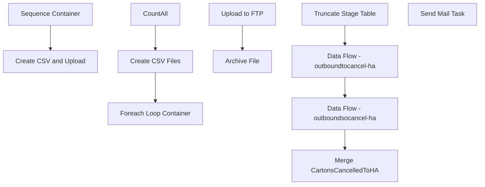

# SSIS Package: WMS_CartonsCancelledToHA

**Project:** WMS_CartonsCancelledToHA  
**Folder:** WMS  
**Server:** STL-SSIS-P-01  

## Connection Managers

| Name | Type | Server | Catalog | Connection (sanitized) |
|---|---|---|---|---|
| Archive | FILE |  |  |  |
| Azure Service Bus | Azure Service Bus (KingswaySoft) |  |  |  |
| Cancelled File | FLATFILE |  |  |  |
| CartonCancelFolder | FILE |  |  |  |
| HA_FTP | FTP |  |  |  |
| IntegrationStaging | OLEDB | STL-SSIS-p-01 | IntegrationStaging | Data Source=STL-SSIS-p-01; Initial Catalog=IntegrationStaging; Provider=SQLNCLI11.1; Integrated Security=SSPI; Auto Translate=False |
| SMTP | SMTP |  |  |  |

## Control Flow Tasks

| Task | Type |
|---|---|
| WMS_CartonsCancelledToHA | Package |
| Create CSV and Upload | SEQUENCE |
| CountAll | ExecuteSQLTask |
| Create CSV Files | Pipeline |
| Foreach Loop Container | FOREACHLOOP |
| Archive File | FileSystemTask |
| Upload to FTP | FtpTask |
| Sequence Container | SEQUENCE |
| Data Flow - outboundsocancel-ha | Pipeline |
| Data Flow - outboundtocancel-ha | Pipeline |
| Merge CartonsCancelledToHA | ExecuteSQLTask |
| Truncate Stage Table | ExecuteSQLTask |
| Send Mail Task | SendMailTask |

## Control Flow Outline

```text
- Send Mail Task [SendMailTask]
- Create CSV and Upload [SEQUENCE]
  - CountAll [ExecuteSQLTask]
  - Create CSV Files [Pipeline]
  - Foreach Loop Container [FOREACHLOOP]
    - Archive File [FileSystemTask]
    - Upload to FTP [FtpTask]
- Sequence Container [SEQUENCE]
  - Data Flow - outboundsocancel-ha [Pipeline]
  - Data Flow - outboundtocancel-ha [Pipeline]
  - Merge CartonsCancelledToHA [ExecuteSQLTask]
  - Truncate Stage Table [ExecuteSQLTask]
```

## Architecture Diagram



## Variables

| Namespace | Name | Expression-bound |
|---|---|---|
| System | Propagate | No |
| User | CartonCancelFileNameWithTimeStamp | Yes |
| User | CartonCancelledFileName | No |
| User | CountAll | No |
| User | DateTimeStamp | Yes |
| User | EndDate | Yes |
| User | EndDateAsDATE | Yes |
| User | GetDate | Yes |
| User | GetDateAsDATE | Yes |
| User | StartDate | Yes |
| User | StartDateAsDATE | Yes |

### Expression-bound variable values

#### User::CartonCancelFileNameWithTimeStamp

**Expression:**

```sql
"\\\\" + @[$Package::IntegrationStaging_ServerName]  + "\\IntegrationStaging\\HA\\CartonCancelled\\cancelled" +    @[User::DateTimeStamp] + ".csv"
```

**Evaluated value:**

```sql
\\STL-SSIS-p-01\IntegrationStaging\HA\CartonCancelled\cancelled2020217135739483.csv
```

#### User::DateTimeStamp

**Expression:**

```sql
(DT_WSTR,4)DATEPART("yyyy",GetDate()) 
+ (DT_WSTR,4)DATEPART("mm",GetDate()) 
+ (DT_WSTR,4)DATEPART("dd",GetDate()) 
+ (DT_WSTR,4)DATEPART("hh",GetDate()) 
+ (DT_WSTR,4)DATEPART("mi",GetDate()) 
+ (DT_WSTR,4)DATEPART("ss",GetDate()) 
+ (DT_WSTR,4)DATEPART("ms",GetDate())
```

**Evaluated value:**

```sql
2020217135739487
```

#### User::EndDate

**Expression:**

```sql
dateadd("dd", @[$Package::DaysToInclude], @[User::StartDate])
```

**Evaluated value:**

```sql
2/17/2020
```

#### User::EndDateAsDATE

**Expression:**

```sql
(DT_WSTR, 4) datepart("year", @[User::EndDate])  + "-" + 
(DT_WSTR, 2) datepart("mm", @[User::EndDate])  + "-" + 
(DT_WSTR, 2) datepart("dd",  @[User::EndDate])
```

**Evaluated value:**

```sql
2020-2-17
```

#### User::GetDate

**Expression:**

```sql
(DT_DATE)DATEDIFF("Day", (DT_DATE) 0, GETDATE())
```

**Evaluated value:**

```sql
2/17/2020
```

#### User::GetDateAsDATE

**Expression:**

```sql
(DT_WSTR, 4) datepart("year", @[User::GetDate])  + "-" + 
(DT_WSTR, 2) datepart("mm", @[User::GetDate])  + "-" + 
(DT_WSTR, 2) datepart("dd",  @[User::GetDate])
```

**Evaluated value:**

```sql
2020-2-17
```

#### User::StartDate

**Expression:**

```sql
dateadd("dd", -@[$Package::DaysToGoBack] , @[User::GetDate] )
```

**Evaluated value:**

```sql
2/16/2020
```

#### User::StartDateAsDATE

**Expression:**

```sql
(DT_WSTR, 4) datepart("year", @[User::StartDate])  + "-" + 
(DT_WSTR, 2) datepart("mm", @[User::StartDate])  + "-" + 
(DT_WSTR, 2) datepart("dd",  @[User::StartDate])
```

**Evaluated value:**

```sql
2020-2-16
```

## Execute SQL Tasks

### CountAll

**Path:** `Package\Create CSV and Upload\CountAll`  
**Connection:** IntegrationStaging (STL-SSIS-p-01/IntegrationStaging)  

```sql
select count(*) as CountAll
from wms.CartonsCancelledToHA
where SentToHa is NULL
```

### Merge CartonsCancelledToHA

**Path:** `Package\Sequence Container\Merge CartonsCancelledToHA`  
**Connection:** IntegrationStaging (STL-SSIS-p-01/IntegrationStaging)  

```sql
exec [WMS].[spMergeCartonsCancelledToHA]
```

### Truncate Stage Table

**Path:** `Package\Sequence Container\Truncate Stage Table`  
**Connection:** IntegrationStaging (STL-SSIS-p-01/IntegrationStaging)  

```sql
Truncate table wms.CartonsCancelledToHAStage
```

## Data Flow: Sources

| Component | Source Object | Type | Data Flow Task | Connection | SQL Kind |
|---|---|---|---|---|---|
| CartonsCancelledToHA |  | OLEDBSource | Create CSV Files | IntegrationStaging | SqlCommand |

#### CartonsCancelledToHA — SqlCommand

```sql
select distinct 
containerId 
from wms.CartonsCancelledToHA
where SentToHa is NULL
```

## Data Flow: Destinations

| Component | Target Table | Type | Data Flow Task | Connection | SQL Kind |
|---|---|---|---|---|---|
| export to csv |  | FlatFileDestination | Create CSV Files | Cancelled File |  |
| CartonsCancelledToHAStage |  | OLEDBDestination | Data Flow - outboundsocancel-ha | IntegrationStaging |  |
| CartonsCancelledToHAStage |  | OLEDBDestination | Data Flow - outboundtocancel-ha | IntegrationStaging |  |
