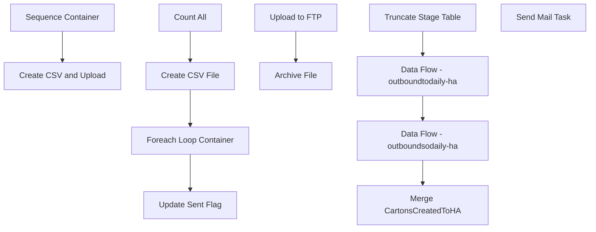

# SSIS Package: WMS_CartonsCreatedToHA

**Project:** WMS_CartonsCreatedToHA  
**Folder:** WMS  
**Server:** STL-SSIS-P-01  

## Connection Managers

| Name | Type | Server | Catalog | Connection (sanitized) |
|---|---|---|---|---|
| Archive | FILE |  |  |  |
| Azure Service Bus | Azure Service Bus (KingswaySoft) |  |  |  |
| CartonCreate | FILE |  |  |  |
| HA_FTP | FTP |  |  |  |
| IntegrationStaging | OLEDB | STL-SSIS-p-01 | IntegrationStaging | Data Source=STL-SSIS-p-01; Initial Catalog=IntegrationStaging; Provider=SQLNCLI11.1; Integrated Security=SSPI; Auto Translate=False |
| NightlySummaryFile | FLATFILE |  |  |  |
| SMTP | SMTP |  |  |  |

## Control Flow Tasks

| Task | Type |
|---|---|
| WMS_CartonsCreatedToHA | Package |
| Create CSV and Upload | SEQUENCE |
| Count All | ExecuteSQLTask |
| Create CSV File | Pipeline |
| Foreach Loop Container | FOREACHLOOP |
| Archive File | FileSystemTask |
| Upload to FTP | FtpTask |
| Update Sent Flag | ExecuteSQLTask |
| Sequence Container | SEQUENCE |
| Data Flow - outboundsodaily-ha | Pipeline |
| Data Flow - outboundtodaily-ha | Pipeline |
| Merge CartonsCreatedToHA | ExecuteSQLTask |
| Truncate Stage Table | ExecuteSQLTask |
| Send Mail Task | SendMailTask |

## Control Flow Outline

```text
- Send Mail Task [SendMailTask]
- Create CSV and Upload [SEQUENCE]
  - Count All [ExecuteSQLTask]
  - Create CSV File [Pipeline]
  - Foreach Loop Container [FOREACHLOOP]
    - Archive File [FileSystemTask]
    - Upload to FTP [FtpTask]
  - Update Sent Flag [ExecuteSQLTask]
- Sequence Container [SEQUENCE]
  - Data Flow - outboundsodaily-ha [Pipeline]
  - Data Flow - outboundtodaily-ha [Pipeline]
  - Merge CartonsCreatedToHA [ExecuteSQLTask]
  - Truncate Stage Table [ExecuteSQLTask]
```

## Architecture Diagram



## Variables

| Namespace | Name | Expression-bound |
|---|---|---|
| System | Propagate | No |
| User | CountAll | No |
| User | DateTimeStamp | Yes |
| User | EndDate | Yes |
| User | EndDateAsDATE | Yes |
| User | GetDate | Yes |
| User | GetDateAsDATE | Yes |
| User | NightlySumFileName | No |
| User | NightlySumFileNameWithTimeStamp | Yes |
| User | StartDate | Yes |
| User | StartDateAsDATE | Yes |

### Expression-bound variable values

#### User::DateTimeStamp

**Expression:**

```sql
(DT_WSTR,4)DATEPART("yyyy",GetDate()) 
+ (DT_WSTR,4)DATEPART("mm",GetDate()) 
+ (DT_WSTR,4)DATEPART("dd",GetDate()) 
+ (DT_WSTR,4)DATEPART("hh",GetDate()) 
+ (DT_WSTR,4)DATEPART("mi",GetDate()) 
+ (DT_WSTR,4)DATEPART("ss",GetDate()) 
+ (DT_WSTR,4)DATEPART("ms",GetDate())
```

**Evaluated value:**

```sql
20201026112357307
```

#### User::EndDate

**Expression:**

```sql
dateadd("dd", @[$Package::DaysToInclude], @[User::StartDate])
```

**Evaluated value:**

```sql
10/26/2020
```

#### User::EndDateAsDATE

**Expression:**

```sql
(DT_WSTR, 4) datepart("year", @[User::EndDate])  + "-" + 
(DT_WSTR, 2) datepart("mm", @[User::EndDate])  + "-" + 
(DT_WSTR, 2) datepart("dd",  @[User::EndDate])
```

**Evaluated value:**

```sql
2020-10-26
```

#### User::GetDate

**Expression:**

```sql
(DT_DATE)DATEDIFF("Day", (DT_DATE) 0, GETDATE())
```

**Evaluated value:**

```sql
10/26/2020
```

#### User::GetDateAsDATE

**Expression:**

```sql
(DT_WSTR, 4) datepart("year", @[User::GetDate])  + "-" + 
(DT_WSTR, 2) datepart("mm", @[User::GetDate])  + "-" + 
(DT_WSTR, 2) datepart("dd",  @[User::GetDate])
```

**Evaluated value:**

```sql
2020-10-26
```

#### User::NightlySumFileNameWithTimeStamp

**Expression:**

```sql
"\\\\" + @[$Package::IntegrationStaging_ServerName]  + "\\IntegrationStaging\\HA\\CartonCreate\\Nightly_summary" +  @[User::DateTimeStamp] + ".csv"
```

**Evaluated value:**

```sql
\\STL-SSIS-p-01\IntegrationStaging\HA\CartonCreate\Nightly_summary20201026112357307.csv
```

#### User::StartDate

**Expression:**

```sql
dateadd("dd", -@[$Package::DaysToGoBack] , @[User::GetDate] )
```

**Evaluated value:**

```sql
10/25/2020
```

#### User::StartDateAsDATE

**Expression:**

```sql
(DT_WSTR, 4) datepart("year", @[User::StartDate])  + "-" + 
(DT_WSTR, 2) datepart("mm", @[User::StartDate])  + "-" + 
(DT_WSTR, 2) datepart("dd",  @[User::StartDate])
```

**Evaluated value:**

```sql
2020-10-25
```

## Execute SQL Tasks

### Count All

**Path:** `Package\Create CSV and Upload\Count All`  
**Connection:** IntegrationStaging (STL-SSIS-p-01/IntegrationStaging)  

```sql
select 
   count(*) as CountAll
from [WMS].[CartonsCreatedToHA] 
Where Warehouse in ('9980', '8175')
and sentToHA is NULL
```

### Update Sent Flag

**Path:** `Package\Create CSV and Upload\Update Sent Flag`  
**Connection:** IntegrationStaging (STL-SSIS-p-01/IntegrationStaging)  

```sql
Update [WMS].[CartonsCreatedToHA] 
set [SentToHA] = getdate()
Where SentToHA is NULL
```

### Merge CartonsCreatedToHA

**Path:** `Package\Sequence Container\Merge CartonsCreatedToHA`  
**Connection:** IntegrationStaging (STL-SSIS-p-01/IntegrationStaging)  

```sql
exec [WMS].[spMergeCartonsCreatedToHA]
```

### Truncate Stage Table

**Path:** `Package\Sequence Container\Truncate Stage Table`  
**Connection:** IntegrationStaging (STL-SSIS-p-01/IntegrationStaging)  

```sql
Truncate table wms.CartonsCreatedToHAStage
```

## Data Flow: Sources

| Component | Source Object | Type | Data Flow Task | Connection | SQL Kind |
|---|---|---|---|---|---|
| OLE DB Source |  | OLEDBSource | Create CSV File | IntegrationStaging | SqlCommand |

#### OLE DB Source — SqlCommand

```sql
select 
    [waveId],
	sum([numberOfContainers]) as numberOfContainers,
	 [releasedDateAndTime]
from [WMS].[CartonsCreatedToHA] 
Where Warehouse in ('9980', '8175')
--and cast([InsertDate] as Date) = cast(Getdate() as date)
and SentToHA is NULL
group by waveID, releasedDateAndTime
order by [releasedDateAndTime]
```

## Data Flow: Destinations

| Component | Target Table | Type | Data Flow Task | Connection | SQL Kind |
|---|---|---|---|---|---|
| Flat File Destination |  | FlatFileDestination | Create CSV File | NightlySummaryFile |  |
| CartonsCreatedToHAStage |  | OLEDBDestination | Data Flow - outboundsodaily-ha | IntegrationStaging |  |
| CartonsCreatedToHAStage |  | OLEDBDestination | Data Flow - outboundtodaily-ha | IntegrationStaging |  |
