# SSIS Package: WMS_CartonsCreatedToHA

**Project:** WMS_CartonsCreatedToHA  
**Folder:** WMS  
**Server:** STL-SSIS-P-01  

## Architecture Diagram

```mermaid
flowchart TD
    subgraph Connections
        Archive_conn(["Archive [FILE]"])
        Azure_Service_Bus_conn(["Azure Service Bus [Azure Service Bus (KingswaySoft)]"])
        CartonCreate_conn(["CartonCreate [FILE]"])
        HA_FTP_conn(["HA_FTP [FTP]"])
        IntegrationStaging_conn(["IntegrationStaging [OLEDB]"])
        NightlySummaryFile_conn(["NightlySummaryFile [FLATFILE]"])
        SMTP_conn(["SMTP [SMTP]"])
    end
    subgraph ControlFlow
        WMS_CartonsCreatedToHA_task["WMS_CartonsCreatedToHA"]
        Create_CSV_and_Upload_task["Create CSV and Upload"]
        WMS_CartonsCreatedToHA_task --> Create_CSV_and_Upload_task
        Count_All_task["Count All"]
        Create_CSV_and_Upload_task --> Count_All_task
        Create_CSV_File_task["Create CSV File"]
        Count_All_task --> Create_CSV_File_task
        Foreach_Loop_Container_task["Foreach Loop Container"]
        Create_CSV_File_task --> Foreach_Loop_Container_task
        Archive_File_task["Archive File"]
        Foreach_Loop_Container_task --> Archive_File_task
        Upload_to_FTP_task["Upload to FTP"]
        Archive_File_task --> Upload_to_FTP_task
        Update_Sent_Flag_task["Update Sent Flag"]
        Upload_to_FTP_task --> Update_Sent_Flag_task
        Sequence_Container_task["Sequence Container"]
        Update_Sent_Flag_task --> Sequence_Container_task
        Data_Flow___outboundsodaily_ha_task["Data Flow - outboundsodaily-ha"]
        Sequence_Container_task --> Data_Flow___outboundsodaily_ha_task
        Data_Flow___outboundtodaily_ha_task["Data Flow - outboundtodaily-ha"]
        Data_Flow___outboundsodaily_ha_task --> Data_Flow___outboundtodaily_ha_task
        Merge_CartonsCreatedToHA_task["Merge CartonsCreatedToHA"]
        Data_Flow___outboundtodaily_ha_task --> Merge_CartonsCreatedToHA_task
        Truncate_Stage_Table_task["Truncate Stage Table"]
        Merge_CartonsCreatedToHA_task --> Truncate_Stage_Table_task
        Send_Mail_Task_task["Send Mail Task"]
        Truncate_Stage_Table_task --> Send_Mail_Task_task
    end
```

## Connection Managers

| Name | Type |
|---|---|
| Archive | FILE |
| Azure Service Bus | Azure Service Bus (KingswaySoft) |
| CartonCreate | FILE |
| HA_FTP | FTP |
| IntegrationStaging | OLEDB |
| NightlySummaryFile | FLATFILE |
| SMTP | SMTP |

## Control Flow Tasks

| Task | Type |
|---|---|
| WMS_CartonsCreatedToHA | Microsoft.Package |
| Create CSV and Upload | STOCK:SEQUENCE |
| Count All | Microsoft.ExecuteSQLTask |
| Create CSV File | Microsoft.Pipeline |
| Foreach Loop Container | STOCK:FOREACHLOOP |
| Archive File | Microsoft.FileSystemTask |
| Upload to FTP | Microsoft.FtpTask |
| Update Sent Flag | Microsoft.ExecuteSQLTask |
| Sequence Container | STOCK:SEQUENCE |
| Data Flow - outboundsodaily-ha | Microsoft.Pipeline |
| Data Flow - outboundtodaily-ha | Microsoft.Pipeline |
| Merge CartonsCreatedToHA | Microsoft.ExecuteSQLTask |
| Truncate Stage Table | Microsoft.ExecuteSQLTask |
| Send Mail Task | Microsoft.SendMailTask |

## Data Flow: Sources

| Component | SQL Preview |
|---|---|
|  | select      [waveId], 	sum([numberOfContainers]) as numberOfContainers, 	 [releasedDateAndTime] from [WMS].[CartonsCreatedToHA]  Where Warehouse in ('9980', '8175') --and cast([InsertDate] as Date) = cast(Getdate() as date) and SentToHA is NULL group by waveID, releasedDateAndTime order by [releasedDateAndTime] |

## Data Flow: Destinations

| Component | Destination |
|---|---|
|  | [WMS].[CartonsCreatedToHAStage] |
|  | [WMS].[CartonsCreatedToHAStage] |

