# SSIS Package: WMS_CartonsDetailToHA

**Project:** WMS_CartonsCreatedToHA  
**Folder:** WMS  
**Server:** STL-SSIS-P-01  

## Architecture Diagram

```mermaid
flowchart TD
    subgraph Connections
        Archive_conn(["Archive [FILE]"])
        Azure_Service_Bus_conn(["Azure Service Bus [Azure Service Bus (KingswaySoft)]"])
        CartonSummary_conn(["CartonSummary [FILE]"])
        carton_summary_conn(["carton_summary [FLATFILE]"])
        HA_FTP_conn(["HA_FTP [FTP]"])
        IntegrationStaging_conn(["IntegrationStaging [OLEDB]"])
        SMTP_conn(["SMTP [SMTP]"])
    end
    subgraph ControlFlow
        WMS_CartonsDetailToHA_task["WMS_CartonsDetailToHA"]
        Create_CSV_and_Upload_to_FTP_task["Create CSV and Upload to FTP"]
        WMS_CartonsDetailToHA_task --> Create_CSV_and_Upload_to_FTP_task
        CountAll_task["CountAll"]
        Create_CSV_and_Upload_to_FTP_task --> CountAll_task
        Create_CSV_task["Create CSV"]
        CountAll_task --> Create_CSV_task
        Foreach_Loop_Container_task["Foreach Loop Container"]
        Create_CSV_task --> Foreach_Loop_Container_task
        Archive_Files_task["Archive Files"]
        Foreach_Loop_Container_task --> Archive_Files_task
        Upload_to_FTP_task["Upload to FTP"]
        Archive_Files_task --> Upload_to_FTP_task
        Update_Sent_Flag_task["Update Sent Flag"]
        Upload_to_FTP_task --> Update_Sent_Flag_task
        Data_Flow___outboundtoship_ha_task["Data Flow - outboundtoship-ha"]
        Update_Sent_Flag_task --> Data_Flow___outboundtoship_ha_task
        Data_Flow___outboundtoship_ha_1_task["Data Flow - outboundtoship-ha 1"]
        Data_Flow___outboundtoship_ha_task --> Data_Flow___outboundtoship_ha_1_task
        SEQ___Download_from_Service_Bus_task["SEQ - Download from Service Bus"]
        Data_Flow___outboundtoship_ha_1_task --> SEQ___Download_from_Service_Bus_task
        Data_Flow___outboundsoship_ha_task["Data Flow - outboundsoship-ha"]
        SEQ___Download_from_Service_Bus_task --> Data_Flow___outboundsoship_ha_task
        Data_Flow___outboundtoship_ha_task["Data Flow - outboundtoship-ha"]
        Data_Flow___outboundsoship_ha_task --> Data_Flow___outboundtoship_ha_task
        Merge_to_Final_Table_task["Merge to Final Table"]
        Data_Flow___outboundtoship_ha_task --> Merge_to_Final_Table_task
        Truncate_Stage_Table_task["Truncate Stage Table"]
        Merge_to_Final_Table_task --> Truncate_Stage_Table_task
        SEQ___Download_from_Service_Bus___OLD_task["SEQ - Download from Service Bus - OLD"]
        Truncate_Stage_Table_task --> SEQ___Download_from_Service_Bus___OLD_task
        Data_Flow___outboundsoship_ha_task["Data Flow - outboundsoship-ha"]
        SEQ___Download_from_Service_Bus___OLD_task --> Data_Flow___outboundsoship_ha_task
        Data_Flow___outboundtoship_ha_task["Data Flow - outboundtoship-ha"]
        Data_Flow___outboundsoship_ha_task --> Data_Flow___outboundtoship_ha_task
        Merge_to_Final_Table_task["Merge to Final Table"]
        Data_Flow___outboundtoship_ha_task --> Merge_to_Final_Table_task
        Truncate_Stage_Table_task["Truncate Stage Table"]
        Merge_to_Final_Table_task --> Truncate_Stage_Table_task
        Send_Mail_Task_task["Send Mail Task"]
        Truncate_Stage_Table_task --> Send_Mail_Task_task
    end
```

## Connection Managers

| Name | Type |
|---|---|
| Archive | FILE |
| Azure Service Bus | Azure Service Bus (KingswaySoft) |
| CartonSummary | FILE |
| carton_summary | FLATFILE |
| HA_FTP | FTP |
| IntegrationStaging | OLEDB |
| SMTP | SMTP |

## Control Flow Tasks

| Task | Type |
|---|---|
| WMS_CartonsDetailToHA | Microsoft.Package |
| Create CSV and Upload to FTP | STOCK:SEQUENCE |
| CountAll | Microsoft.ExecuteSQLTask |
| Create CSV | Microsoft.Pipeline |
| Foreach Loop Container | STOCK:FOREACHLOOP |
| Archive Files | Microsoft.FileSystemTask |
| Upload to FTP | Microsoft.FtpTask |
| Update Sent Flag | Microsoft.ExecuteSQLTask |
| Data Flow - outboundtoship-ha | Microsoft.Pipeline |
| Data Flow - outboundtoship-ha 1 | Microsoft.Pipeline |
| SEQ - Download from Service Bus | STOCK:SEQUENCE |
| Data Flow - outboundsoship-ha | Microsoft.Pipeline |
| Data Flow - outboundtoship-ha | Microsoft.Pipeline |
| Merge to Final Table | Microsoft.ExecuteSQLTask |
| Truncate Stage Table | Microsoft.ExecuteSQLTask |
| SEQ - Download from Service Bus - OLD | STOCK:SEQUENCE |
| Data Flow - outboundsoship-ha | Microsoft.Pipeline |
| Data Flow - outboundtoship-ha | Microsoft.Pipeline |
| Merge to Final Table | Microsoft.ExecuteSQLTask |
| Truncate Stage Table | Microsoft.ExecuteSQLTask |
| Send Mail Task | Microsoft.SendMailTask |

## Data Flow: Sources

| Component | SQL Preview |
|---|---|
|  | Select 	[waveId], 	[description], 	[containerId], 	[grossWeight], 	[length] , 	[width] , 	[height], 	--[totalQuantityContainer], 	[totalQuantity] as totalQuantityContainer, 	[shipTo] , 	replace([deliveryName],',', '') as DeliveryName, 	[city], 	[state] , 	[zip] , 	[country], 	[deliveryDescription], 	[modeOfDelivery] from wms.CartonsSummaryToHA where warehouse in ('9980', '8175') and [SentToHA] is  |

## Data Flow: Destinations

| Component | Destination |
|---|---|
|  | [WMS].[CartonsSummaryToHAStage] |
|  | [OutboundShipHACartonStage] |
|  | [OutboundShipHAItemStage] |
|  | [OutboundShipHAShipmentStage] |
|  | [WMS].[CartonsSummaryToHAStage] |
|  | [WMS].[CartonsSummaryToHAStage] |
|  | [WMS].[CartonsSummaryToHAStage] |
|  | [WMS].[CartonsSummaryToHAStage] |

