# SSIS Package: WMS_CartonsDetailToHA

**Project:** WMS_CartonsCreatedToHA  
**Folder:** WMS  
**Server:** STL-SSIS-P-01  

## Connection Managers

| Name | Type | Server | Catalog | Connection (sanitized) |
|---|---|---|---|---|
| Archive | FILE |  |  |  |
| Azure Service Bus | Azure Service Bus (KingswaySoft) |  |  |  |
| CartonSummary | FILE |  |  |  |
| HA_FTP | FTP |  |  |  |
| IntegrationStaging | OLEDB | STL-SSIS-P-01 | IntegrationStaging | Data Source=STL-SSIS-P-01; Initial Catalog=IntegrationStaging; Provider=SQLNCLI11.1; Integrated Security=SSPI; Auto Translate=False |
| SMTP | SMTP |  |  |  |
| carton_summary | FLATFILE |  |  |  |

## Control Flow Tasks

| Task | Type |
|---|---|
| WMS_CartonsDetailToHA | Package |
| Create CSV and Upload to FTP | SEQUENCE |
| CountAll | ExecuteSQLTask |
| Create CSV | Pipeline |
| Foreach Loop Container | FOREACHLOOP |
| Archive Files | FileSystemTask |
| Upload to FTP | FtpTask |
| Update Sent Flag | ExecuteSQLTask |
| Data Flow - outboundtoship-ha | Pipeline |
| Data Flow - outboundtoship-ha 1 | Pipeline |
| SEQ - Download from Service Bus | SEQUENCE |
| Data Flow - outboundsoship-ha | Pipeline |
| Data Flow - outboundtoship-ha | Pipeline |
| Merge to Final Table | ExecuteSQLTask |
| Truncate Stage Table | ExecuteSQLTask |
| SEQ - Download from Service Bus - OLD | SEQUENCE |
| Data Flow - outboundsoship-ha | Pipeline |
| Data Flow - outboundtoship-ha | Pipeline |
| Merge to Final Table | ExecuteSQLTask |
| Truncate Stage Table | ExecuteSQLTask |
| Send Mail Task | SendMailTask |

## Control Flow Outline

```text
- Send Mail Task [SendMailTask]
- Create CSV and Upload to FTP [SEQUENCE]
  - CountAll [ExecuteSQLTask]
  - Create CSV [Pipeline]
  - Foreach Loop Container [FOREACHLOOP]
    - Archive Files [FileSystemTask]
    - Upload to FTP [FtpTask]
  - Update Sent Flag [ExecuteSQLTask]
- Data Flow - outboundtoship-ha [Pipeline]
- Data Flow - outboundtoship-ha 1 [Pipeline]
- SEQ - Download from Service Bus [SEQUENCE]
- SEQ - Download from Service Bus - OLD [SEQUENCE]
  - Data Flow - outboundsoship-ha [Pipeline]
  - Data Flow - outboundtoship-ha [Pipeline]
  - Merge to Final Table [ExecuteSQLTask]
  - Truncate Stage Table [ExecuteSQLTask]
  - Data Flow - outboundsoship-ha [Pipeline]
  - Data Flow - outboundtoship-ha [Pipeline]
  - Merge to Final Table [ExecuteSQLTask]
  - Truncate Stage Table [ExecuteSQLTask]
```

## Architecture Diagram

```mermaid
flowchart TD
    n_Package_Create_CSV_and_Upload_to_FTP["Create CSV and Upload to FTP"]
    n_Package_Create_CSV_and_Upload_to_FTP_CountAll["CountAll"]
    n_Package_Create_CSV_and_Upload_to_FTP_Create_CSV["Create CSV"]
    n_Package_Create_CSV_and_Upload_to_FTP_Foreach_Loop_Container["Foreach Loop Container"]
    n_Package_Create_CSV_and_Upload_to_FTP_Foreach_Loop_Container_Archive_Files["Archive Files"]
    n_Package_Create_CSV_and_Upload_to_FTP_Foreach_Loop_Container_Upload_to_FTP["Upload to FTP"]
    n_Package_Create_CSV_and_Upload_to_FTP_Update_Sent_Flag["Update Sent Flag"]
    n_Package_Data_Flow___outboundtoship_ha["Data Flow - outboundtoship-ha"]
    n_Package_Data_Flow___outboundtoship_ha_1["Data Flow - outboundtoship-ha 1"]
    n_Package_SEQ___Download_from_Service_Bus["SEQ - Download from Service Bus"]
    n_Package_SEQ___Download_from_Service_Bus_Data_Flow___outboundsoship_ha["Data Flow - outboundsoship-ha"]
    n_Package_SEQ___Download_from_Service_Bus_Data_Flow___outboundtoship_ha["Data Flow - outboundtoship-ha"]
    n_Package_SEQ___Download_from_Service_Bus_Merge_to_Final_Table["Merge to Final Table"]
    n_Package_SEQ___Download_from_Service_Bus_Truncate_Stage_Table["Truncate Stage Table"]
    n_Package_SEQ___Download_from_Service_Bus___OLD["SEQ - Download from Service Bus - OLD"]
    n_Package_SEQ___Download_from_Service_Bus___OLD_Data_Flow___outboundsoship_ha["Data Flow - outboundsoship-ha"]
    n_Package_SEQ___Download_from_Service_Bus___OLD_Data_Flow___outboundtoship_ha["Data Flow - outboundtoship-ha"]
    n_Package_SEQ___Download_from_Service_Bus___OLD_Merge_to_Final_Table["Merge to Final Table"]
    n_Package_SEQ___Download_from_Service_Bus___OLD_Truncate_Stage_Table["Truncate Stage Table"]
    n_Package_EventHandlers_OnError__Send_Mail_Task["Send Mail Task"]
    n_Package_Create_CSV_and_Upload_to_FTP_Foreach_Loop_Container_Upload_to_FTP --> n_Package_Create_CSV_and_Upload_to_FTP_Foreach_Loop_Container_Archive_Files
    n_Package_Create_CSV_and_Upload_to_FTP_Create_CSV --> n_Package_Create_CSV_and_Upload_to_FTP_Update_Sent_Flag
    n_Package_Create_CSV_and_Upload_to_FTP_Update_Sent_Flag --> n_Package_Create_CSV_and_Upload_to_FTP_Foreach_Loop_Container
    n_Package_Create_CSV_and_Upload_to_FTP_CountAll --> n_Package_Create_CSV_and_Upload_to_FTP_Create_CSV
    n_Package_SEQ___Download_from_Service_Bus_Data_Flow___outboundtoship_ha --> n_Package_SEQ___Download_from_Service_Bus_Data_Flow___outboundsoship_ha
    n_Package_SEQ___Download_from_Service_Bus_Truncate_Stage_Table --> n_Package_SEQ___Download_from_Service_Bus_Data_Flow___outboundtoship_ha
    n_Package_SEQ___Download_from_Service_Bus_Data_Flow___outboundsoship_ha --> n_Package_SEQ___Download_from_Service_Bus_Merge_to_Final_Table
    n_Package_SEQ___Download_from_Service_Bus___OLD_Data_Flow___outboundtoship_ha --> n_Package_SEQ___Download_from_Service_Bus___OLD_Data_Flow___outboundsoship_ha
    n_Package_SEQ___Download_from_Service_Bus___OLD_Truncate_Stage_Table --> n_Package_SEQ___Download_from_Service_Bus___OLD_Data_Flow___outboundtoship_ha
    n_Package_SEQ___Download_from_Service_Bus___OLD_Data_Flow___outboundsoship_ha --> n_Package_SEQ___Download_from_Service_Bus___OLD_Merge_to_Final_Table
    n_Package_SEQ___Download_from_Service_Bus --> n_Package_Create_CSV_and_Upload_to_FTP
```



## Variables

| Namespace | Name | Expression-bound |
|---|---|---|
| System | Propagate | No |
| User | CartonSummaryFile | No |
| User | CartonSummaryFileWithTimeStamp | Yes |
| User | CountAll | No |
| User | DateTimeStamp | Yes |
| User | EndDate | Yes |
| User | EndDateAsDATE | Yes |
| User | GetDate | Yes |
| User | GetDateAsDATE | Yes |
| User | StartDate | Yes |
| User | StartDateAsDATE | Yes |

### Expression-bound variable values

#### User::CartonSummaryFileWithTimeStamp

**Expression:**

```sql
"\\\\" + @[$Package::IntegrationStaging_ServerName] + "\\IntegrationStaging\\HA\\CartonSummary\\carton_summary" +  @[User::DateTimeStamp] + ".csv"
```

**Evaluated value:**

```sql
\\STL-SSIS-P-01\IntegrationStaging\HA\CartonSummary\carton_summary2020102611172997.csv
```

#### User::DateTimeStamp

**Expression:**

```sql
(DT_WSTR,4)DATEPART("yyyy",GetDate()) 
+ (DT_WSTR,4)DATEPART("mm",GetDate()) 
+ (DT_WSTR,4)DATEPART("dd",GetDate()) 
+ (DT_WSTR,4)DATEPART("hh",GetDate()) 
+ (DT_WSTR,4)DATEPART("mi",GetDate()) 
+ (DT_WSTR,4)DATEPART("ss",GetDate()) 
+ (DT_WSTR,4)DATEPART("ms",GetDate())
```

**Evaluated value:**

```sql
2020102611172997
```

#### User::EndDate

**Expression:**

```sql
dateadd("dd", @[$Package::DaysToInclude], @[User::StartDate])
```

**Evaluated value:**

```sql
10/26/2020
```

#### User::EndDateAsDATE

**Expression:**

```sql
(DT_WSTR, 4) datepart("year", @[User::EndDate])  + "-" + 
(DT_WSTR, 2) datepart("mm", @[User::EndDate])  + "-" + 
(DT_WSTR, 2) datepart("dd",  @[User::EndDate])
```

**Evaluated value:**

```sql
2020-10-26
```

#### User::GetDate

**Expression:**

```sql
(DT_DATE)DATEDIFF("Day", (DT_DATE) 0, GETDATE())
```

**Evaluated value:**

```sql
10/26/2020
```

#### User::GetDateAsDATE

**Expression:**

```sql
(DT_WSTR, 4) datepart("year", @[User::GetDate])  + "-" + 
(DT_WSTR, 2) datepart("mm", @[User::GetDate])  + "-" + 
(DT_WSTR, 2) datepart("dd",  @[User::GetDate])
```

**Evaluated value:**

```sql
2020-10-26
```

#### User::StartDate

**Expression:**

```sql
dateadd("dd", -@[$Package::DaysToGoBack] , @[User::GetDate] )
```

**Evaluated value:**

```sql
10/25/2020
```

#### User::StartDateAsDATE

**Expression:**

```sql
(DT_WSTR, 4) datepart("year", @[User::StartDate])  + "-" + 
(DT_WSTR, 2) datepart("mm", @[User::StartDate])  + "-" + 
(DT_WSTR, 2) datepart("dd",  @[User::StartDate])
```

**Evaluated value:**

```sql
2020-10-25
```

## Execute SQL Tasks

### CountAll

**Path:** `Package\Create CSV and Upload to FTP\CountAll`  
**Connection:** IntegrationStaging (STL-SSIS-P-01/IntegrationStaging)  

```sql
Select count(*) as countAll
from wms.CartonsSummaryToHA
where warehouse in ('9980', '8175')
and [SentToHA] is null
```

### Update Sent Flag

**Path:** `Package\Create CSV and Upload to FTP\Update Sent Flag`  
**Connection:** IntegrationStaging (STL-SSIS-P-01/IntegrationStaging)  

```sql
Update [WMS].[CartonsSummaryToHA]
Set [SentToHA] = Getdate()
where [SentToHA] is null

```

### Merge to Final Table

**Path:** `Package\SEQ - Download from Service Bus - OLD\Merge to Final Table`  
**Connection:** IntegrationStaging (STL-SSIS-P-01/IntegrationStaging)  

```sql
exec [WMS].[spMergeCartonsSummaryToHA]
```

### Truncate Stage Table

**Path:** `Package\SEQ - Download from Service Bus - OLD\Truncate Stage Table`  
**Connection:** IntegrationStaging (STL-SSIS-P-01/IntegrationStaging)  

```sql
Truncate table wms.CartonsSummaryToHAStage

```

### Merge to Final Table

**Path:** `Package\SEQ - Download from Service Bus\Merge to Final Table`  
**Connection:** IntegrationStaging (STL-SSIS-P-01/IntegrationStaging)  

```sql
exec [WMS].[spMergeCartonsSummaryToHA]
```

### Truncate Stage Table

**Path:** `Package\SEQ - Download from Service Bus\Truncate Stage Table`  
**Connection:** IntegrationStaging (STL-SSIS-P-01/IntegrationStaging)  

```sql
Truncate table wms.CartonsSummaryToHAStage

```

## Data Flow: Sources

| Component | Source Object | Type | Data Flow Task | Connection | SQL Kind |
|---|---|---|---|---|---|
| CartonsSummaryToHA |  | OLEDBSource | Create CSV | IntegrationStaging | SqlCommand |

#### CartonsSummaryToHA — SqlCommand

```sql
Select
	[waveId],
	[description],
	[containerId],
	[grossWeight],
	[length] ,
	[width] ,
	[height],
	--[totalQuantityContainer],
	[totalQuantity] as totalQuantityContainer,
	[shipTo] ,
	replace([deliveryName],',', '') as DeliveryName,
	[city],
	[state] ,
	[zip] ,
	[country],
	[deliveryDescription],
	[modeOfDelivery]
from wms.CartonsSummaryToHA
where warehouse in ('9980', '8175')
and [SentToHA] is null
order by ShipTo, WaveID, ContainerID, Description
```

## Data Flow: Destinations

| Component | Target Table | Type | Data Flow Task | Connection | SQL Kind |
|---|---|---|---|---|---|
| carton_summary csv |  | FlatFileDestination | Create CSV | carton_summary |  |
| CartonsSummaryToHAStage |  | OLEDBDestination | Data Flow - outboundtoship-ha | IntegrationStaging |  |
| OutboundShipHACartonStage |  | OLEDBDestination | Data Flow - outboundtoship-ha 1 | IntegrationStaging |  |
| OutboundShipHAItemStage |  | OLEDBDestination | Data Flow - outboundtoship-ha 1 | IntegrationStaging |  |
| OutboundShipHAShipmentStage |  | OLEDBDestination | Data Flow - outboundtoship-ha 1 | IntegrationStaging |  |
| CartonSummaryToHA |  | OLEDBDestination | Data Flow - outboundsoship-ha | IntegrationStaging |  |
| CartonsSummaryToHAStage |  | OLEDBDestination | Data Flow - outboundtoship-ha | IntegrationStaging |  |
| CartonSummaryToHA |  | OLEDBDestination | Data Flow - outboundsoship-ha | IntegrationStaging |  |
| CartonsSummaryToHAStage |  | OLEDBDestination | Data Flow - outboundtoship-ha | IntegrationStaging |  |
