# SSIS Package: WMS_CostcoPurchaseOrdersToDynamics

**Project:** WMS_CostcoPurchaseOrdersToDynamics  
**Folder:** WMS  
**Server:** STL-SSIS-P-01  

## Connection Managers

| Name | Type | Server | Catalog | Connection (sanitized) |
|---|---|---|---|---|
| GiftCardMstrData | OLEDB | kodiak | GiftCardMstrData | Data Source=kodiak; Initial Catalog=GiftCardMstrData; Provider=SQLNCLI11.1; Integrated Security=SSPI; Auto Translate=False |
| IntegrationStaging | OLEDB | STL-SSIS-P-01 | IntegrationStaging | Data Source=STL-SSIS-P-01; Initial Catalog=IntegrationStaging; Provider=SQLNCLI11.1; Integrated Security=SSPI; Auto Translate=False |
| PO_CSV | FLATFILE |  |  |  |
| SMTP_EMAIL | SMTP |  |  |  |
| createSO API | HTTP (KingswaySoft) |  |  |  |

## Control Flow Tasks

| Task | Type |
|---|---|
| WMS_CostcoPurchaseOrdersToDynamics | Package |
| SEQ - PO CSV INGESTION | SEQUENCE |
| Insert POs into GiftCardMstrDB | ExecuteSQLTask |
| Merge GiftCard Detail | ExecuteSQLTask |
| Merge GiftCard Header | ExecuteSQLTask |
| PO CSV For Each Loop | FOREACHLOOP |
| PO CSV DataFlow | Pipeline |
| Stage PO Data to IntegrationStaging | Pipeline |
| Truncate CSV Stage | ExecuteSQLTask |
| Update PO Status in GiftCardMstrDB | Pipeline |
| SEQ - Push to Dynamics | SEQUENCE |
| Email Summary | ExecuteSQLTask |
| Foreach Loop Container | FOREACHLOOP |
| DataFlow createSO API | Pipeline |
| Set Transmitted | ExecuteSQLTask |
| PreStage Costco Order Numbers | ExecuteSQLTask |
| Stage Purchase Orders | SEQUENCE |
| FTP Get Files | ExecuteProcess |
| Insert POs into GiftCardMstrDB | ExecuteSQLTask |
| Merge GiftCard Detail | ExecuteSQLTask |
| Merge GiftCard Header | ExecuteSQLTask |
| Stage PO Data to IntegrationStaging | Pipeline |
| Truncate Stage | ExecuteSQLTask |
| Update PO Status in GiftCardMstrDB | Pipeline |
| Send Email onError | SendMailTask |

## Control Flow Outline

```text
- Send Email onError [SendMailTask]
- SEQ - PO CSV INGESTION [SEQUENCE]
  - Insert POs into GiftCardMstrDB [ExecuteSQLTask]
  - Merge GiftCard Detail [ExecuteSQLTask]
  - Merge GiftCard Header [ExecuteSQLTask]
  - PO CSV For Each Loop [FOREACHLOOP]
    - PO CSV DataFlow [Pipeline]
  - Stage PO Data to IntegrationStaging [Pipeline]
  - Truncate CSV Stage [ExecuteSQLTask]
  - Update PO Status in GiftCardMstrDB [Pipeline]
- SEQ - Push to Dynamics [SEQUENCE]
  - Email Summary [ExecuteSQLTask]
  - Foreach Loop Container [FOREACHLOOP]
    - DataFlow createSO API [Pipeline]
    - Set Transmitted [ExecuteSQLTask]
  - PreStage Costco Order Numbers [ExecuteSQLTask]
- Stage Purchase Orders [SEQUENCE]
  - FTP Get Files [ExecuteProcess]
  - Insert POs into GiftCardMstrDB [ExecuteSQLTask]
  - Merge GiftCard Detail [ExecuteSQLTask]
  - Merge GiftCard Header [ExecuteSQLTask]
  - Stage PO Data to IntegrationStaging [Pipeline]
  - Truncate Stage [ExecuteSQLTask]
  - Update PO Status in GiftCardMstrDB [Pipeline]
```

## Architecture Diagram

```mermaid
flowchart TD
    n_Package_SEQ___PO_CSV_INGESTION["SEQ - PO CSV INGESTION"]
    n_Package_SEQ___PO_CSV_INGESTION_Insert_POs_into_GiftCardMstrDB["Insert POs into GiftCardMstrDB"]
    n_Package_SEQ___PO_CSV_INGESTION_Merge_GiftCard_Detail["Merge GiftCard Detail"]
    n_Package_SEQ___PO_CSV_INGESTION_Merge_GiftCard_Header["Merge GiftCard Header"]
    n_Package_SEQ___PO_CSV_INGESTION_PO_CSV_For_Each_Loop["PO CSV For Each Loop"]
    n_Package_SEQ___PO_CSV_INGESTION_PO_CSV_For_Each_Loop_PO_CSV_DataFlow["PO CSV DataFlow"]
    n_Package_SEQ___PO_CSV_INGESTION_Stage_PO_Data_to_IntegrationStaging["Stage PO Data to IntegrationStaging"]
    n_Package_SEQ___PO_CSV_INGESTION_Truncate_CSV_Stage["Truncate CSV Stage"]
    n_Package_SEQ___PO_CSV_INGESTION_Update_PO_Status_in_GiftCardMstrDB["Update PO Status in GiftCardMstrDB"]
    n_Package_SEQ___Push_to_Dynamics["SEQ - Push to Dynamics"]
    n_Package_SEQ___Push_to_Dynamics_Email_Summary["Email Summary"]
    n_Package_SEQ___Push_to_Dynamics_Foreach_Loop_Container["Foreach Loop Container"]
    n_Package_SEQ___Push_to_Dynamics_Foreach_Loop_Container_DataFlow_createSO_API["DataFlow createSO API"]
    n_Package_SEQ___Push_to_Dynamics_Foreach_Loop_Container_Set_Transmitted["Set Transmitted"]
    n_Package_SEQ___Push_to_Dynamics_PreStage_Costco_Order_Numbers["PreStage Costco Order Numbers"]
    n_Package_Stage_Purchase_Orders["Stage Purchase Orders"]
    n_Package_Stage_Purchase_Orders_FTP_Get_Files["FTP Get Files"]
    n_Package_Stage_Purchase_Orders_Insert_POs_into_GiftCardMstrDB["Insert POs into GiftCardMstrDB"]
    n_Package_Stage_Purchase_Orders_Merge_GiftCard_Detail["Merge GiftCard Detail"]
    n_Package_Stage_Purchase_Orders_Merge_GiftCard_Header["Merge GiftCard Header"]
    n_Package_Stage_Purchase_Orders_Stage_PO_Data_to_IntegrationStaging["Stage PO Data to IntegrationStaging"]
    n_Package_Stage_Purchase_Orders_Truncate_Stage["Truncate Stage"]
    n_Package_Stage_Purchase_Orders_Update_PO_Status_in_GiftCardMstrDB["Update PO Status in GiftCardMstrDB"]
    n_Package_EventHandlers_OnError__Send_Email_onError["Send Email onError"]
    n_Package_SEQ___PO_CSV_INGESTION_Truncate_CSV_Stage --> n_Package_SEQ___PO_CSV_INGESTION_PO_CSV_For_Each_Loop
    n_Package_SEQ___PO_CSV_INGESTION_PO_CSV_For_Each_Loop --> n_Package_SEQ___PO_CSV_INGESTION_Insert_POs_into_GiftCardMstrDB
    n_Package_SEQ___PO_CSV_INGESTION_Insert_POs_into_GiftCardMstrDB --> n_Package_SEQ___PO_CSV_INGESTION_Stage_PO_Data_to_IntegrationStaging
    n_Package_SEQ___PO_CSV_INGESTION_Stage_PO_Data_to_IntegrationStaging --> n_Package_SEQ___PO_CSV_INGESTION_Update_PO_Status_in_GiftCardMstrDB
    n_Package_SEQ___PO_CSV_INGESTION_Update_PO_Status_in_GiftCardMstrDB --> n_Package_SEQ___PO_CSV_INGESTION_Merge_GiftCard_Header
    n_Package_SEQ___PO_CSV_INGESTION_Merge_GiftCard_Header --> n_Package_SEQ___PO_CSV_INGESTION_Merge_GiftCard_Detail
    n_Package_SEQ___Push_to_Dynamics_Foreach_Loop_Container_DataFlow_createSO_API --> n_Package_SEQ___Push_to_Dynamics_Foreach_Loop_Container_Set_Transmitted
    n_Package_SEQ___Push_to_Dynamics_PreStage_Costco_Order_Numbers --> n_Package_SEQ___Push_to_Dynamics_Foreach_Loop_Container
    n_Package_SEQ___Push_to_Dynamics_Foreach_Loop_Container --> n_Package_SEQ___Push_to_Dynamics_Email_Summary
    n_Package_Stage_Purchase_Orders_Truncate_Stage --> n_Package_Stage_Purchase_Orders_FTP_Get_Files
    n_Package_Stage_Purchase_Orders_Insert_POs_into_GiftCardMstrDB --> n_Package_Stage_Purchase_Orders_Stage_PO_Data_to_IntegrationStaging
    n_Package_Stage_Purchase_Orders_FTP_Get_Files --> n_Package_Stage_Purchase_Orders_Insert_POs_into_GiftCardMstrDB
    n_Package_Stage_Purchase_Orders_Stage_PO_Data_to_IntegrationStaging --> n_Package_Stage_Purchase_Orders_Update_PO_Status_in_GiftCardMstrDB
    n_Package_Stage_Purchase_Orders_Update_PO_Status_in_GiftCardMstrDB --> n_Package_Stage_Purchase_Orders_Merge_GiftCard_Header
    n_Package_Stage_Purchase_Orders_Merge_GiftCard_Header --> n_Package_Stage_Purchase_Orders_Merge_GiftCard_Detail
    n_Package_Stage_Purchase_Orders --> n_Package_SEQ___Push_to_Dynamics
```



## Variables

| Namespace | Name | Expression-bound |
|---|---|---|
| System | Propagate | No |
| User | CSVFileForLoop | No |
| User | CostcoPONumberForLoop | No |
| User | CostcoPONumbersForLoop | No |
| User | FTPStageDirectory | No |
| User | WinSCP | Yes |
| User | WinSCPLog | Yes |
| User | WinSCPscript | Yes |

### Expression-bound variable values

#### User::WinSCP

**Expression:**

```sql
"\\\\stl-ssis-p-01\\C$\\Program Files (x86)\\WinSCP\\winscp.exe"
```

**Evaluated value:**

```sql
\\stl-ssis-p-01\C$\Program Files (x86)\WinSCP\winscp.exe
```

#### User::WinSCPLog

**Expression:**

```sql
" /log=\"\\\\stl-ssis-p-01\\IntegrationStaging\\ERP\\Costco\\FTP\\FTPLog\\Download.log\""
```

**Evaluated value:**

```sql
 /log="\\stl-ssis-p-01\IntegrationStaging\ERP\Costco\FTP\FTPLog\Download.log"
```

#### User::WinSCPscript

**Expression:**

```sql
" /script=\\\\STL-SSIS-P-01\\IntegrationStaging\\ERP\\Costco\\FTP\\GetPurchaseOrders.txt"
```

**Evaluated value:**

```sql
 /script=\\STL-SSIS-P-01\IntegrationStaging\ERP\Costco\FTP\GetPurchaseOrders.txt
```

## Execute SQL Tasks

### Insert POs into GiftCardMstrDB

**Path:** `Package\SEQ - PO CSV INGESTION\Insert POs into GiftCardMstrDB`  
**Connection:** GiftCardMstrData (kodiak/GiftCardMstrData)  

```sql
exec spSPS_InsertPurchaseOrders_fromCSVSource
```

### Merge GiftCard Detail

**Path:** `Package\SEQ - PO CSV INGESTION\Merge GiftCard Detail`  
**Connection:** IntegrationStaging (STL-SSIS-P-01/IntegrationStaging)  

```sql
exec ERP.spMergeCostcoInboundPODetail
```

### Merge GiftCard Header

**Path:** `Package\SEQ - PO CSV INGESTION\Merge GiftCard Header`  
**Connection:** IntegrationStaging (STL-SSIS-P-01/IntegrationStaging)  

```sql
exec ERP.spMergeCostcoInboundPOHeader

```

### Truncate CSV Stage

**Path:** `Package\SEQ - PO CSV INGESTION\Truncate CSV Stage`  
**Connection:** GiftCardMstrData (kodiak/GiftCardMstrData)  

```sql
TRUNCATE TABLE CostcoCSVPOHeaderStage
TRUNCATE TABLE CostcoCSVPODetailStage
```

### Email Summary

**Path:** `Package\SEQ - Push to Dynamics\Email Summary`  
**Connection:** IntegrationStaging (STL-SSIS-P-01/IntegrationStaging)  

> ⚠️ `SqlStatementSource` is overridden at runtime by a property expression (shown below); the static SQL may not be what executes.

**Static SqlStatementSource:**

```sql
exec WMS.spEmailCostcoPOExport '{737B1D82-D33B-4DF9-A433-60862E7B9965}'
```

**Property expression (runtime override):**

```sql
"exec WMS.spEmailCostcoPOExport '" +  @[System::ExecutionInstanceGUID] + "'"
```

### Set Transmitted

**Path:** `Package\SEQ - Push to Dynamics\Foreach Loop Container\Set Transmitted`  
**Connection:** IntegrationStaging (STL-SSIS-P-01/IntegrationStaging)  

> ⚠️ `SqlStatementSource` is overridden at runtime by a property expression (shown below); the static SQL may not be what executes.

**Static SqlStatementSource:**

```sql
update ERP.CostcoInboundPOHeader
set Transmitted = 1
where CustomerRequisitionNumber = ''
```

**Property expression (runtime override):**

```sql
"update ERP.CostcoInboundPOHeader
set Transmitted = 1
where CustomerRequisitionNumber = '" + @[User::CostcoPONumberForLoop] + "'"
```

### PreStage Costco Order Numbers

**Path:** `Package\SEQ - Push to Dynamics\PreStage Costco Order Numbers`  
**Connection:** IntegrationStaging (STL-SSIS-P-01/IntegrationStaging)  

```sql
select distinct CUSTOMERREQUISITIONNUMBER
from ERP.CostcoInboundPOHeader with (nolock)
where Transmitted=0

```

### Insert POs into GiftCardMstrDB

**Path:** `Package\Stage Purchase Orders\Insert POs into GiftCardMstrDB`  
**Connection:** GiftCardMstrData (kodiak/GiftCardMstrData)  

```sql
exec spSPS_InsertPurchaseOrders
waitfor delay '00:01:00'
```

### Merge GiftCard Detail

**Path:** `Package\Stage Purchase Orders\Merge GiftCard Detail`  
**Connection:** IntegrationStaging (STL-SSIS-P-01/IntegrationStaging)  

```sql
exec ERP.spMergeCostcoInboundPODetail
```

### Merge GiftCard Header

**Path:** `Package\Stage Purchase Orders\Merge GiftCard Header`  
**Connection:** IntegrationStaging (STL-SSIS-P-01/IntegrationStaging)  

```sql
exec ERP.spMergeCostcoInboundPOHeader

```

### Truncate Stage

**Path:** `Package\Stage Purchase Orders\Truncate Stage`  
**Connection:** IntegrationStaging (STL-SSIS-P-01/IntegrationStaging)  

```sql
TRUNCATE TABLE ERP.CostcoInboundPOHeaderStage
TRUNCATE TABLE ERP.CostcoInboundPODetailStage
```

## Data Flow: Sources

| Component | Source Object | Type | Data Flow Task | Connection | SQL Kind |
|---|---|---|---|---|---|
| PO_CSV |  | FlatFileSource | PO CSV DataFlow | PO_CSV |  |
| PO Header |  | OLEDBSource | Stage PO Data to IntegrationStaging | GiftCardMstrData | SqlCommand |
| PO Lines |  | OLEDBSource | Stage PO Data to IntegrationStaging | GiftCardMstrData | SqlCommand |
| CostcoInboundPOHeaderStage |  | OLEDBSource | Update PO Status in GiftCardMstrDB | IntegrationStaging |  |
| vwCostcoPOtoDynamicsSO |  | OLEDBSource | DataFlow createSO API | IntegrationStaging | SqlCommand |
| PO Header |  | OLEDBSource | Stage PO Data to IntegrationStaging | GiftCardMstrData | SqlCommand |
| PO Lines |  | OLEDBSource | Stage PO Data to IntegrationStaging | GiftCardMstrData | SqlCommand |
| CostcoInboundPOHeaderStage |  | OLEDBSource | Update PO Status in GiftCardMstrDB | IntegrationStaging |  |

#### PO Header — SqlCommand

```sql
select distinct 
                   PurchaseOrderID,
	CUSTOMERREQUISITIONNUMBER,
	CUSTOMERSORDERREFERENCE,
	INVOICECUSTOMERACCOUNTNUMBER,
	ORDERINGCUSTOMERACCOUNTNUMBER,
	REQUESTEDSHIPPINGDATE,
	DELIVERYADDRESSDESCRIPTION,
	DELIVERYADDRESSNAME,
	DELIVERYADDRESSSTREET,
	DELIVERYADDRESSCITY,
	DELIVERYADDRESSSTATEID,
	DELIVERYADDRESSZIPCODE,
	DELIVERYADDRESSCOUNTRYREGIONID
from vwCostcoPO_ERPStage
```

#### PO Lines — SqlCommand

```sql
select 
PurchaseOrderID,	
CUSTOMERREQUISITIONNUMBER,
	CUSTOMERSLINENUMBER,
	ITEMNUMBER,
	ORDEREDSALESQUANTITY,
	SALESPRICE,
	SALESUNITSYMBOL
from vwCostcoPO_ERPStage
```

#### vwCostcoPOtoDynamicsSO — SqlCommand

```sql
select *
from wms.vwCostcoPOtoDynamicsSO 
where eCommOrderRefNum = ?
```

## Data Flow: Destinations

| Component | Target Table | Type | Data Flow Task | Connection | SQL Kind |
|---|---|---|---|---|---|
| CostcoCSVPODetailStage |  | OLEDBDestination | PO CSV DataFlow | GiftCardMstrData |  |
| CostcoCSVPOHeaderStage |  | OLEDBDestination | PO CSV DataFlow | GiftCardMstrData |  |
| CostcoInboundPODetailStage |  | OLEDBDestination | Stage PO Data to IntegrationStaging | IntegrationStaging |  |
| CostcoInboundPOHeaderStage |  | OLEDBDestination | Stage PO Data to IntegrationStaging | IntegrationStaging |  |
| GiftCardMstrDB PurchaseOrderStatus |  | OLEDBDestination | Update PO Status in GiftCardMstrDB | GiftCardMstrData |  |
| DynamicsAPILog |  | OLEDBDestination | DataFlow createSO API | IntegrationStaging |  |
| CostcoInboundPODetailStage |  | OLEDBDestination | Stage PO Data to IntegrationStaging | IntegrationStaging |  |
| CostcoInboundPOHeaderStage |  | OLEDBDestination | Stage PO Data to IntegrationStaging | IntegrationStaging |  |
| GiftCardMstrDB PurchaseOrderStatus |  | OLEDBDestination | Update PO Status in GiftCardMstrDB | GiftCardMstrData |  |
