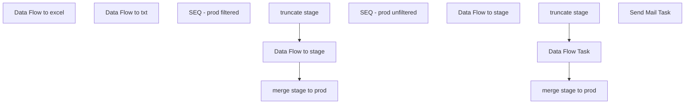

# SSIS Package: WMS_CycleCountETL

**Project:** WMS_CycleCountETL  
**Folder:** WMS  
**Server:** STL-SSIS-P-01  

## Connection Managers

| Name | Type | Server | Catalog | Connection (sanitized) |
|---|---|---|---|---|
| Cache OrderLine | CACHE |  |  |  |
| Dynamics AX Connection Manager | DynamicsAX |  |  |  |
| Excel Connection Manager | EXCEL | \\stl-ssis-p-01\IntegrationStaging\temp\cycleCount.xlsx |  | Provider=Microsoft.ACE.OLEDB.12.0; Data Source=\\stl-ssis-p-01\IntegrationStaging\temp\cycleCount.xlsx; Extended Properties="EXCEL 12.0 XML; HDR=YES" |
| Flat File Connection Manager | FLATFILE |  |  |  |
| IntegrationStaging | OLEDB | STL-SSIS-P-01 | IntegrationStaging | Data Source=STL-SSIS-P-01; Initial Catalog=IntegrationStaging; Provider=SQLNCLI11.1; Integrated Security=SSPI; Auto Translate=False |
| SMTP | SMTP |  |  |  |
| cycleCount.txt | FILE |  |  |  |
| cycleCount.xlsx | FILE |  |  |  |
| papamart.DWStaging | OLEDB | papamart | DWStaging | Data Source=papamart; Initial Catalog=DWStaging; Provider=SQLNCLI11.1; Integrated Security=SSPI; Auto Translate=False |
| papamart.dw | OLEDB | papamart | dw | Data Source=papamart; Initial Catalog=dw; Provider=SQLNCLI11.1; Integrated Security=SSPI; Auto Translate=False |

## Control Flow Tasks

| Task | Type |
|---|---|
| WMS_CycleCountETL | Package |
| Data Flow to excel | Pipeline |
| Data Flow to txt | Pipeline |
| SEQ - prod filtered | SEQUENCE |
| Data Flow to stage | Pipeline |
| merge stage to prod | ExecuteSQLTask |
| truncate stage | ExecuteSQLTask |
| SEQ - prod unfiltered | SEQUENCE |
| Data Flow Task | Pipeline |
| Data Flow to stage | Pipeline |
| merge stage to prod | ExecuteSQLTask |
| truncate stage | ExecuteSQLTask |
| Send Mail Task | SendMailTask |

## Control Flow Outline

```text
- Send Mail Task [SendMailTask]
- Data Flow to excel [Pipeline]
- Data Flow to txt [Pipeline]
- SEQ - prod filtered [SEQUENCE]
  - Data Flow to stage [Pipeline]
  - merge stage to prod [ExecuteSQLTask]
  - truncate stage [ExecuteSQLTask]
- SEQ - prod unfiltered [SEQUENCE]
  - Data Flow Task [Pipeline]
  - Data Flow to stage [Pipeline]
  - merge stage to prod [ExecuteSQLTask]
  - truncate stage [ExecuteSQLTask]
```

## Architecture Diagram



## Variables

| Namespace | Name | Expression-bound |
|---|---|---|
| System | Propagate | No |
| User | DateTimeStamp | Yes |
| User | EndDate | Yes |
| User | EndDateAsDATE | Yes |
| User | GetDate | Yes |
| User | GetDateAsDATE | Yes |
| User | StartDate | Yes |
| User | StartDateAsDATE | Yes |

### Expression-bound variable values

#### User::DateTimeStamp

**Expression:**

```sql
(DT_WSTR,4)DATEPART("yyyy",GetDate()) 
+ (DT_WSTR,4)DATEPART("mm",GetDate()) 
+ (DT_WSTR,4)DATEPART("dd",GetDate()) 
+ (DT_WSTR,4)DATEPART("hh",GetDate()) 
+ (DT_WSTR,4)DATEPART("mi",GetDate()) 
+ (DT_WSTR,4)DATEPART("ss",GetDate()) 
+ (DT_WSTR,4)DATEPART("ms",GetDate())
```

**Evaluated value:**

```sql
202221514418207
```

#### User::EndDate

**Expression:**

```sql
dateadd("dd", @[$Package::DaysToInclude], @[User::StartDate])
```

**Evaluated value:**

```sql
2/9/2022
```

#### User::EndDateAsDATE

**Expression:**

```sql
(DT_WSTR, 4) datepart("year", @[User::EndDate])  + "-" + 
(DT_WSTR, 2) datepart("mm", @[User::EndDate])  + "-" + 
(DT_WSTR, 2) datepart("dd",  @[User::EndDate])
```

**Evaluated value:**

```sql
2022-2-9
```

#### User::GetDate

**Expression:**

```sql
(DT_DATE)DATEDIFF("Day", (DT_DATE) 0, GETDATE())
```

**Evaluated value:**

```sql
2/15/2022
```

#### User::GetDateAsDATE

**Expression:**

```sql
(DT_WSTR, 4) datepart("year", @[User::GetDate])  + "-" + 
(DT_WSTR, 2) datepart("mm", @[User::GetDate])  + "-" + 
(DT_WSTR, 2) datepart("dd",  @[User::GetDate])
```

**Evaluated value:**

```sql
2022-2-15
```

#### User::StartDate

**Expression:**

```sql
dateadd("dd", -@[$Package::DaysToGoBack] , @[User::GetDate] )
```

**Evaluated value:**

```sql
2/8/2022
```

#### User::StartDateAsDATE

**Expression:**

```sql
(DT_WSTR, 4) datepart("year", @[User::StartDate])  + "-" +
right("0"+ (DT_WSTR, 2) datepart("mm", @[User::StartDate]),2)  + "-" +
right("0" +(DT_WSTR, 2) datepart("dd",  @[User::StartDate]),2)
```

**Evaluated value:**

```sql
2022-02-08
```

## Execute SQL Tasks

### merge stage to prod

**Path:** `Package\SEQ - prod filtered\merge stage to prod`  
**Connection:** papamart.DWStaging (papamart/DWStaging)  

```sql
exec [dbo].[spMergeWMScycleCounts]
```

### truncate stage

**Path:** `Package\SEQ - prod filtered\truncate stage`  
**Connection:** papamart.DWStaging (papamart/DWStaging)  

```sql
 truncate table [dbo].[WMS_cycleCount_stage]
```

### merge stage to prod

**Path:** `Package\SEQ - prod unfiltered\merge stage to prod`  
**Connection:** papamart.DWStaging (papamart/DWStaging)  

```sql
exec [dbo].[spMergeWMScycleCounts]
```

### truncate stage

**Path:** `Package\SEQ - prod unfiltered\truncate stage`  
**Connection:** papamart.DWStaging (papamart/DWStaging)  

```sql
 truncate table [dbo].[WMS_cycleCount_stage]
```

## Data Flow: Sources

_None detected._

## Data Flow: Destinations

| Component | Target Table | Type | Data Flow Task | Connection | SQL Kind |
|---|---|---|---|---|---|
| Flat File Destination |  | FlatFileDestination | Data Flow to txt | Flat File Connection Manager |  |
| OLE DB Destination |  | OLEDBDestination | Data Flow to stage | papamart.DWStaging |  |
| OLE DB Destination |  | OLEDBDestination | Data Flow Task | papamart.DWStaging |  |
| OLE DB Destination |  | OLEDBDestination | Data Flow to stage | papamart.DWStaging |  |
