# SSIS Package: WMS_DuplicateWebOrderDetection

**Project:** WMS_DuplicateWebOrderDetection  
**Folder:** WMS  
**Server:** STL-SSIS-P-01  

## Architecture Diagram

```mermaid
flowchart TD
    subgraph Connections
        Dynamics_AX_Connection_Manager_1_conn(["Dynamics AX Connection Manager 1 [DynamicsAX]"])
        IntegrationStaging_conn(["IntegrationStaging [OLEDB]"])
        SMTP_conn(["SMTP [SMTP]"])
    end
    subgraph ControlFlow
        WMS_DuplicateWebOrderDetection_task["WMS_DuplicateWebOrderDetection"]
        Sequence_Container_task["Sequence Container"]
        WMS_DuplicateWebOrderDetection_task --> Sequence_Container_task
        Data_Flow_Task___Load_Stage_task["Data Flow Task - Load Stage"]
        Sequence_Container_task --> Data_Flow_Task___Load_Stage_task
        Execute_SQL_Task___spMergeDuplicateWebOrderDetection_task["Execute SQL Task - spMergeDuplicateWebOrderDetection"]
        Data_Flow_Task___Load_Stage_task --> Execute_SQL_Task___spMergeDuplicateWebOrderDetection_task
        Execute_SQL_Task___Truncate_Stage_task["Execute SQL Task - Truncate Stage"]
        Execute_SQL_Task___spMergeDuplicateWebOrderDetection_task --> Execute_SQL_Task___Truncate_Stage_task
        Sequence_Container_1___Testing_task["Sequence Container 1 - Testing"]
        Execute_SQL_Task___Truncate_Stage_task --> Sequence_Container_1___Testing_task
        Data_Flow_Task_task["Data Flow Task"]
        Sequence_Container_1___Testing_task --> Data_Flow_Task_task
        Data_Flow_Task_1_task["Data Flow Task 1"]
        Data_Flow_Task_task --> Data_Flow_Task_1_task
        Send_Mail_Task_task["Send Mail Task"]
        Data_Flow_Task_1_task --> Send_Mail_Task_task
    end
```

## Connection Managers

| Name | Type |
|---|---|
| Dynamics AX Connection Manager 1 | DynamicsAX |
| IntegrationStaging | OLEDB |
| SMTP | SMTP |

## Control Flow Tasks

| Task | Type |
|---|---|
| WMS_DuplicateWebOrderDetection | Microsoft.Package |
| Sequence Container | STOCK:SEQUENCE |
| Data Flow Task - Load Stage | Microsoft.Pipeline |
| Execute SQL Task - spMergeDuplicateWebOrderDetection | Microsoft.ExecuteSQLTask |
| Execute SQL Task - Truncate Stage | Microsoft.ExecuteSQLTask |
| Sequence Container 1 - Testing | STOCK:SEQUENCE |
| Data Flow Task | Microsoft.Pipeline |
| Data Flow Task 1 | Microsoft.Pipeline |
| Send Mail Task | Microsoft.SendMailTask |

## Data Flow: Sources

| Component | SQL Preview |
|---|---|
|  | select a.WebOrderNumber, SalesOrderNumber  from wms.AgedWebOrdersInDynamics a (nolock)  where WebOrderNumber is not null  --join DupOrders D (nolock) on a.WebOrderNumber=d.WebOrderNumber group by a.WebOrderNumber, SalesOrderNumber order by 1, 2 |
|  | With DupOrders as ( select distinct 	WebOrderNumber 	--, count (distinct substring(ResponseBody,charindex('sales order SO', ResponseBody)+12, 12))  from wms.DynamicsAPILog with (nolock) where 1=1 and HttpResponseURL like 'https://buildabear.operations.dynamics.com%' and IntegrationName = 'WM Import OMS' and ResponseBody is not null and substring(ResponseBody, charindex('hasErrors', ResponseBody)+1 |
|  | With DupOrders as ( select distinct WebOrderNumber from wms.AgedWebOrdersInDynamics where WebOrderNumber is not null  group by WebOrderNumber having count(distinct SalesOrderNumber) > 1 )   select a.WebOrderNumber, SalesOrderNumber  from wms.AgedWebOrdersInDynamics a (nolock)  join DupOrders D (nolock) on a.WebOrderNumber=d.WebOrderNumber group by a.WebOrderNumber, SalesOrderNumber order by 1, 2 |

## Data Flow: Destinations

| Component | Destination |
|---|---|
|  | [WMS].[DuplicateWebOrderDetectionStage] |

