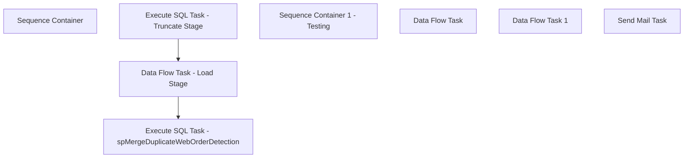

# SSIS Package: WMS_DuplicateWebOrderDetection

**Project:** WMS_DuplicateWebOrderDetection  
**Folder:** WMS  
**Server:** STL-SSIS-P-01  

## Connection Managers

| Name | Type | Server | Catalog | Connection (sanitized) |
|---|---|---|---|---|
| Dynamics AX Connection Manager 1 | DynamicsAX |  |  |  |
| IntegrationStaging | OLEDB | stl-ssis-p-01 | IntegrationStaging | Data Source=stl-ssis-p-01; Initial Catalog=IntegrationStaging; Provider=SQLNCLI11.1; Integrated Security=SSPI; Auto Translate=False |
| SMTP | SMTP |  |  |  |

## Control Flow Tasks

| Task | Type |
|---|---|
| WMS_DuplicateWebOrderDetection | Package |
| Sequence Container | SEQUENCE |
| Data Flow Task - Load Stage | Pipeline |
| Execute SQL Task - spMergeDuplicateWebOrderDetection | ExecuteSQLTask |
| Execute SQL Task - Truncate Stage | ExecuteSQLTask |
| Sequence Container 1 - Testing | SEQUENCE |
| Data Flow Task | Pipeline |
| Data Flow Task 1 | Pipeline |
| Send Mail Task | SendMailTask |

## Control Flow Outline

```text
- Send Mail Task [SendMailTask]
- Sequence Container [SEQUENCE]
- Sequence Container 1 - Testing [SEQUENCE]
  - Data Flow Task [Pipeline]
  - Data Flow Task 1 [Pipeline]
  - Data Flow Task - Load Stage [Pipeline]
  - Execute SQL Task - Truncate Stage [ExecuteSQLTask]
  - Execute SQL Task - spMergeDuplicateWebOrderDetection [ExecuteSQLTask]
```

## Architecture Diagram



## Variables

| Namespace | Name | Expression-bound |
|---|---|---|
| System | Propagate | No |
| User | DateTimeStamp | Yes |
| User | EndDate | Yes |
| User | EndDateAsDATE | Yes |
| User | GetDate | Yes |
| User | GetDateAsDATE | Yes |
| User | SqlAPISourceString | Yes |
| User | StartDate | Yes |
| User | StartDateAsDATE | Yes |

### Expression-bound variable values

#### User::DateTimeStamp

**Expression:**

```sql
(DT_WSTR,4)DATEPART("yyyy",GetDate()) 
+ (DT_WSTR,4)DATEPART("mm",GetDate()) 
+ (DT_WSTR,4)DATEPART("dd",GetDate()) 
+ (DT_WSTR,4)DATEPART("hh",GetDate()) 
+ (DT_WSTR,4)DATEPART("mi",GetDate()) 
+ (DT_WSTR,4)DATEPART("ss",GetDate()) 
+ (DT_WSTR,4)DATEPART("ms",GetDate())
```

**Evaluated value:**

```sql
20211117141417247
```

#### User::EndDate

**Expression:**

```sql
dateadd("dd", @[$Package::DaysToInclude], @[User::StartDate])
```

**Evaluated value:**

```sql
10/4/2021
```

#### User::EndDateAsDATE

**Expression:**

```sql
(DT_WSTR, 4) datepart("year", @[User::EndDate])  + "-" +
right("0"+ (DT_WSTR, 2) datepart("mm", @[User::EndDate]),2)  + "-" +
right("0" +(DT_WSTR, 2) datepart("dd",  @[User::EndDate]),2)
```

**Evaluated value:**

```sql
2021-10-04
```

#### User::GetDate

**Expression:**

```sql
(DT_DATE)DATEDIFF("Day", (DT_DATE) 0, GETDATE())
```

**Evaluated value:**

```sql
11/17/2021
```

#### User::GetDateAsDATE

**Expression:**

```sql
(DT_WSTR, 4) datepart("year", @[User::GetDate])  + "-" +
right("0"+ (DT_WSTR, 2) datepart("mm", @[User::GetDate]),2)  + "-" +
right("0" +(DT_WSTR, 2) datepart("dd",  @[User::GetDate]),2)
```

**Evaluated value:**

```sql
2021-11-17
```

#### User::SqlAPISourceString

**Expression:**

```sql
"With DupOrders as (
select distinct 	WebOrderNumber
	--, count (distinct substring(ResponseBody,charindex('sales order SO', ResponseBody)+12, 12))

from wms.DynamicsAPILog with (nolock)
where 1=1
and HttpResponseURL like 'https://buildabear.operations.dynamics.com%'
and IntegrationName = 'WM Import OMS'
and ResponseBody is not null
and substring(ResponseBody, charindex('hasErrors', ResponseBody)+11, 5) = 'false'
and isnumeric(right(substring(ResponseBody,charindex('sales order SO', ResponseBody)+12, 12),10)) = 1
and DATEDIFF(dd,InsertDate,getdate()) < "+ 
 (DT_WSTR, 3) @[$Package::DaysToGoBack] +
"
group by  WebOrderNumber
having count (distinct substring(ResponseBody,charindex('sales order SO', ResponseBody)+12, 12)) > 1 


)

select api.WebOrderNumber,
(substring(ResponseBody,charindex('sales order SO', ResponseBody)+12, 12)) as SalesOrderNumber
from wms.DynamicsAPILog api with (nolock)
join DupOrders Do on do.WebOrderNumber=api.WebOrderNumber
where 1=1
group by api.WebOrderNumber,
(substring(ResponseBody,charindex('sales order SO', ResponseBody)+12, 12)) 
order by 1
"
```

**Evaluated value:**

```sql
With DupOrders as (
select distinct 	WebOrderNumber
	--, count (distinct substring(ResponseBody,charindex('sales order SO', ResponseBody)+12, 12))

from wms.DynamicsAPILog with (nolock)
where 1=1
and HttpResponseURL like 'https://buildabear.operations.dynamics.com%'
and IntegrationName = 'WM Import OMS'
and ResponseBody is not null
and substring(ResponseBody, charindex('hasErrors', ResponseBody)+11, 5) = 'false'
and isnumeric(right(substring(ResponseBody,charindex('sales order SO', ResponseBody)+12, 12),10)) = 1
and DATEDIFF(dd,InsertDate,getdate()) < 45
group by  WebOrderNumber
having count (distinct substring(ResponseBody,charindex('sales order SO', ResponseBody)+12, 12)) > 1 


)

select api.WebOrderNumber,
(substring(ResponseBody,charindex('sales order SO', ResponseBody)+12, 12)) as SalesOrderNumber
from wms.DynamicsAPILog api with (nolock)
join DupOrders Do on do.WebOrderNumber=api.WebOrderNumber
where 1=1
group by api.WebOrderNumber,
(substring(ResponseBody,charindex('sales order SO', ResponseBody)+12, 12)) 
order by 1

```

#### User::StartDate

**Expression:**

```sql
dateadd("dd", -@[$Package::DaysToGoBack] , @[User::GetDate] )
```

**Evaluated value:**

```sql
10/3/2021
```

#### User::StartDateAsDATE

**Expression:**

```sql
(DT_WSTR, 4) datepart("year", @[User::StartDate])  + "-" +
right("0"+ (DT_WSTR, 2) datepart("mm", @[User::StartDate]),2)  + "-" +
right("0" +(DT_WSTR, 2) datepart("dd",  @[User::StartDate]),2)
```

**Evaluated value:**

```sql
2021-10-03
```

## Execute SQL Tasks

### Execute SQL Task - Truncate Stage

**Path:** `Package\Sequence Container\Execute SQL Task - Truncate Stage`  
**Connection:** IntegrationStaging (stl-ssis-p-01/IntegrationStaging)  

```sql
truncate table WMS.[DuplicateWebOrderDetectionStage]
```

### Execute SQL Task - spMergeDuplicateWebOrderDetection

**Path:** `Package\Sequence Container\Execute SQL Task - spMergeDuplicateWebOrderDetection`  
**Connection:** IntegrationStaging (stl-ssis-p-01/IntegrationStaging)  

```sql
EXEC [WMS].[spMergeDuplicateWebOrderDetection]
```

## Data Flow: Sources

| Component | Source Object | Type | Data Flow Task | Connection | SQL Kind |
|---|---|---|---|---|---|
| OLE DB Source - API Log |  | OLEDBSource | Data Flow Task - Load Stage | IntegrationStaging | SqlCommand |
| OLE DB Source - AgedWebOrdersInDynamics |  | OLEDBSource | Data Flow Task 1 | IntegrationStaging | SqlCommand |

#### OLE DB Source - API Log — SqlCommand

```sql
With DupOrders as (
select distinct 	WebOrderNumber
	--, count (distinct substring(ResponseBody,charindex('sales order SO', ResponseBody)+12, 12))

from wms.DynamicsAPILog with (nolock)
where 1=1
and HttpResponseURL like 'https://buildabear.operations.dynamics.com%'
and IntegrationName = 'WM Import OMS'
and ResponseBody is not null
and substring(ResponseBody, charindex('hasErrors', ResponseBody)+11, 5) = 'false'
and isnumeric(right(substring(ResponseBody,charindex('sales order SO', ResponseBody)+12, 12),10)) = 1
--and DATEDIFF(dd,InsertDate,getdate()) < 45
group by  WebOrderNumber
having count (distinct substring(ResponseBody,charindex('sales order SO', ResponseBody)+12, 12)) > 1 


)

select api.WebOrderNumber,
(substring(ResponseBody,charindex('sales order SO', ResponseBody)+12, 12)) as SalesOrderNumber
from wms.DynamicsAPILog api with (nolock)
join DupOrders Do on do.WebOrderNumber=api.WebOrderNumber
where 1=1
group by api.WebOrderNumber,
(substring(ResponseBody,charindex('sales order SO', ResponseBody)+12, 12)) 
order by 1
```

#### OLE DB Source - AgedWebOrdersInDynamics — SqlCommand

```sql
With DupOrders as (
select distinct WebOrderNumber
from wms.AgedWebOrdersInDynamics
where WebOrderNumber is not null 
group by WebOrderNumber
having count(distinct SalesOrderNumber) > 1
)


select a.WebOrderNumber, SalesOrderNumber 
from wms.AgedWebOrdersInDynamics a (nolock) 
join DupOrders D (nolock) on a.WebOrderNumber=d.WebOrderNumber
group by a.WebOrderNumber, SalesOrderNumber
order by 1, 2
```

## Data Flow: Destinations

| Component | Target Table | Type | Data Flow Task | Connection | SQL Kind |
|---|---|---|---|---|---|
| OLE DB Destination - DuplicateWebOrderDetectionStage |  | OLEDBDestination | Data Flow Task - Load Stage | IntegrationStaging |  |
