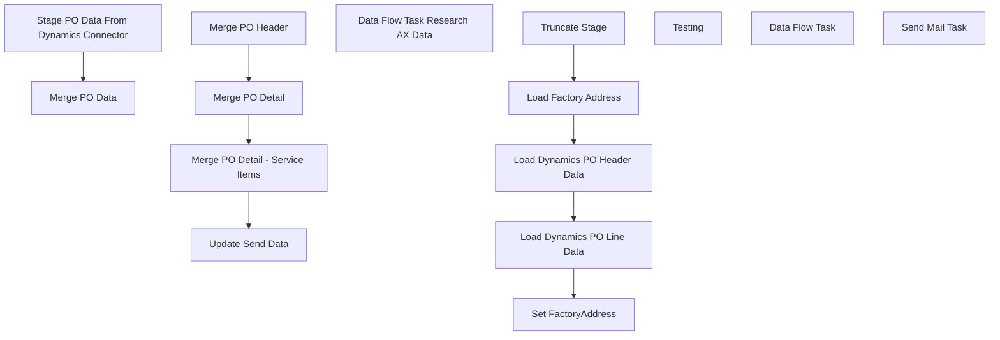

# SSIS Package: WMS_DynamicsPurchaseOrderExtract

**Project:** WMS_DynamicsPurchaseOrderExtract  
**Folder:** WMS  
**Server:** STL-SSIS-P-01  

## Connection Managers

| Name | Type | Server | Catalog | Connection (sanitized) |
|---|---|---|---|---|
| Dynamics AX Connection Manager | DynamicsAX |  |  |  |
| IntegrationStaging | OLEDB | stl-ssis-p-01 | IntegrationStaging | Data Source=stl-ssis-p-01; Initial Catalog=IntegrationStaging; Provider=SQLNCLI11.1; Integrated Security=SSPI; Auto Translate=False |
| SMTP | SMTP |  |  |  |
| me_01 | OLEDB | bedrockdb02 | me_01 | Data Source=bedrockdb02; Initial Catalog=me_01; Provider=SQLNCLI11.1; Integrated Security=SSPI; Auto Translate=False |

## Control Flow Tasks

| Task | Type |
|---|---|
| WMS_DynamicsPurchaseOrderExtract | Package |
| Merge PO Data | SEQUENCE |
| Merge PO Detail | ExecuteSQLTask |
| Merge PO Detail - Service Items | ExecuteSQLTask |
| Merge PO Header | ExecuteSQLTask |
| Update Send Data | ExecuteSQLTask |
| Stage PO Data From Dynamics Connector | SEQUENCE |
| Data Flow Task Research AX Data | Pipeline |
| Load Dynamics PO Header Data | Pipeline |
| Load Dynamics PO Line Data | Pipeline |
| Load Factory Address | Pipeline |
| Set FactoryAddress | ExecuteSQLTask |
| Truncate Stage | ExecuteSQLTask |
| Testing | SEQUENCE |
| Data Flow Task | Pipeline |
| Send Mail Task | SendMailTask |

## Control Flow Outline

```text
- Send Mail Task [SendMailTask]
- Merge PO Data [SEQUENCE]
  - Merge PO Detail [ExecuteSQLTask]
  - Merge PO Detail - Service Items [ExecuteSQLTask]
  - Merge PO Header [ExecuteSQLTask]
  - Update Send Data [ExecuteSQLTask]
- Stage PO Data From Dynamics Connector [SEQUENCE]
  - Data Flow Task Research AX Data [Pipeline]
  - Load Dynamics PO Header Data [Pipeline]
  - Load Dynamics PO Line Data [Pipeline]
  - Load Factory Address [Pipeline]
  - Set FactoryAddress [ExecuteSQLTask]
  - Truncate Stage [ExecuteSQLTask]
- Testing [SEQUENCE]
  - Data Flow Task [Pipeline]
```

## Architecture Diagram



## Variables

| Namespace | Name | Expression-bound |
|---|---|---|
| System | Propagate | No |
| User | DateTimeStamp | Yes |
| User | EndDate | Yes |
| User | EndDateAsDATE | Yes |
| User | GetDate | Yes |
| User | GetDateAsDATE | Yes |
| User | StartDate | Yes |
| User | StartDateAsDATE | Yes |

### Expression-bound variable values

#### User::DateTimeStamp

**Expression:**

```sql
(DT_WSTR,4)DATEPART("yyyy",GetDate()) 
+ (DT_WSTR,4)DATEPART("mm",GetDate()) 
+ (DT_WSTR,4)DATEPART("dd",GetDate()) 
+ (DT_WSTR,4)DATEPART("hh",GetDate()) 
+ (DT_WSTR,4)DATEPART("mi",GetDate()) 
+ (DT_WSTR,4)DATEPART("ss",GetDate()) 
+ (DT_WSTR,4)DATEPART("ms",GetDate())
```

**Evaluated value:**

```sql
2021929173344610
```

#### User::EndDate

**Expression:**

```sql
dateadd("dd", @[$Package::DaysToInclude], @[User::StartDate])
```

**Evaluated value:**

```sql
9/29/2021
```

#### User::EndDateAsDATE

**Expression:**

```sql
(DT_WSTR, 4) datepart("year", @[User::EndDate])  + "-" +
right("0"+ (DT_WSTR, 2) datepart("mm", @[User::EndDate]),2)  + "-" +
right("0" +(DT_WSTR, 2) datepart("dd",  @[User::EndDate]),2)
```

**Evaluated value:**

```sql
2021-09-29
```

#### User::GetDate

**Expression:**

```sql
(DT_DATE)DATEDIFF("Day", (DT_DATE) 0, GETDATE())
```

**Evaluated value:**

```sql
9/29/2021
```

#### User::GetDateAsDATE

**Expression:**

```sql
(DT_WSTR, 4) datepart("year", @[User::GetDate])  + "-" + 
(DT_WSTR, 2) datepart("mm", @[User::GetDate])  + "-" + 
(DT_WSTR, 2) datepart("dd",  @[User::GetDate])
```

**Evaluated value:**

```sql
2021-9-29
```

#### User::StartDate

**Expression:**

```sql
dateadd("dd", -@[$Package::DaysToGoBack] , @[User::GetDate] )
```

**Evaluated value:**

```sql
9/19/2021
```

#### User::StartDateAsDATE

**Expression:**

```sql
(DT_WSTR, 4) datepart("year", @[User::StartDate])  + "-" +
right("0"+ (DT_WSTR, 2) datepart("mm", @[User::StartDate]),2)  + "-" +
right("0" +(DT_WSTR, 2) datepart("dd",  @[User::StartDate]),2)
```

**Evaluated value:**

```sql
2021-09-19
```

## Execute SQL Tasks

### Merge PO Detail

**Path:** `Package\Merge PO Data\Merge PO Detail`  
**Connection:** IntegrationStaging (stl-ssis-p-01/IntegrationStaging)  

```sql
exec ERP.spMergePurchaseOrderLines
```

### Merge PO Detail - Service Items

**Path:** `Package\Merge PO Data\Merge PO Detail - Service Items`  
**Connection:** IntegrationStaging (stl-ssis-p-01/IntegrationStaging)  

```sql
exec [ERP].[spMergePurchaseOrderLinesServiceItems]
```

### Merge PO Header

**Path:** `Package\Merge PO Data\Merge PO Header`  
**Connection:** IntegrationStaging (stl-ssis-p-01/IntegrationStaging)  

```sql
exec ERP.spMergePurchaseOrderHeader
```

### Update Send Data

**Path:** `Package\Merge PO Data\Update Send Data`  
**Connection:** IntegrationStaging (stl-ssis-p-01/IntegrationStaging)  

```sql
exec ERP.spPurchaseOrderUpdateSendData
```

### Set FactoryAddress

**Path:** `Package\Stage PO Data From Dynamics Connector\Set FactoryAddress`  
**Connection:** IntegrationStaging (stl-ssis-p-01/IntegrationStaging)  

```sql
exec ERP.spPurchaseOrderFactoryAddress
```

### Truncate Stage

**Path:** `Package\Stage PO Data From Dynamics Connector\Truncate Stage`  
**Connection:** IntegrationStaging (stl-ssis-p-01/IntegrationStaging)  

```sql
TRUNCATE TABLE ERP.PurchaseOrderHeaderStage
TRUNCATE TABLE ERP.PurchaseOrderLinesStage
TRUNCATE TABLE ERP.FactoryAddress
```

## Data Flow: Sources

| Component | Source Object | Type | Data Flow Task | Connection | SQL Kind |
|---|---|---|---|---|---|
| WmsItemMasterProducts |  | OLEDBSource | Load Dynamics PO Line Data | IntegrationStaging | SqlCommand |
| FactoryAddress_me_01 |  | OLEDBSource | Load Factory Address | me_01 |  |

#### WmsItemMasterProducts — SqlCommand

```sql
select cast (ProductNumber as varchar) as ProductNumber, 
cast (ProductName as varchar) as ProductName
from [WMS].[ItemMasterProducts] (nolock) 
order by 1
```

## Data Flow: Destinations

| Component | Target Table | Type | Data Flow Task | Connection | SQL Kind |
|---|---|---|---|---|---|
| WMSTestDynamicsPersonnel |  | OLEDBDestination | Data Flow Task Research AX Data | IntegrationStaging |  |
| WMSTestDynamicsPurchaseOrderDetail |  | OLEDBDestination | Data Flow Task Research AX Data | IntegrationStaging |  |
| WMSTestDynamicsPurchaseOrderHeader |  | OLEDBDestination | Data Flow Task Research AX Data | IntegrationStaging |  |
| WMSTestPurchaseOrderConfirmationHeader |  | OLEDBDestination | Data Flow Task Research AX Data | IntegrationStaging |  |
| WMSTestPurchaseOrderConfirmationLine |  | OLEDBDestination | Data Flow Task Research AX Data | IntegrationStaging |  |
| ErpPurchaserOrderHeaderStage |  | OLEDBDestination | Load Dynamics PO Header Data | IntegrationStaging |  |
| ErpPurchaseOrderHeaderLineStage |  | OLEDBDestination | Load Dynamics PO Line Data | IntegrationStaging |  |
| FactoryAddress_erp |  | OLEDBDestination | Load Factory Address | IntegrationStaging |  |
| OLE DB Destination |  | OLEDBDestination | Data Flow Task | IntegrationStaging |  |
