# SSIS Package: WMS_DynamicsTransferOrderSalesOrderExtract

**Project:** WMS_DynamicsTransferAndSalesOrderExtract  
**Folder:** WMS  
**Server:** STL-SSIS-P-01  

## Connection Managers

| Name | Type | Server | Catalog | Connection (sanitized) |
|---|---|---|---|---|
| Azure Service Bus | Azure Service Bus (KingswaySoft) |  |  |  |
| BearData | OLEDB | Kodiak | BearData | Data Source=Kodiak; Initial Catalog=BearData; Provider=SQLNCLI11.1; Integrated Security=SSPI; Auto Translate=False |
| IntegrationStaging | OLEDB | stl-ssis-p-01 | IntegrationStaging | Data Source=stl-ssis-p-01; Initial Catalog=IntegrationStaging; Provider=SQLNCLI11.1; Integrated Security=SSPI; Auto Translate=False |
| SMTP | SMTP |  |  |  |

## Control Flow Tasks

| Task | Type |
|---|---|
| WMS_DynamicsTransferOrderSalesOrderExtract | Package |
| SeqCont - New | SEQUENCE |
| Data Flow - OutboundSOExport | Pipeline |
| Data Flow - OutboundTOExport | Pipeline |
| Merge Address Dim | ExecuteSQLTask |
| Merge Header and  Detail Rows | SEQUENCE |
| Merge Distribution Detail | ExecuteSQLTask |
| Merge Distribution Header | ExecuteSQLTask |
| Truncate Tables | ExecuteSQLTask |
| SeqCont - Original | SEQUENCE |
| Data Flow - OutboundSOExport | Pipeline |
| Data Flow - OutboundSOExport  - NO line number | Pipeline |
| Data Flow - OutboundTOExport | Pipeline |
| Data Flow - OutboundTOExport - no line number | Pipeline |
| Merge Address Dim | ExecuteSQLTask |
| Merge Header and  Detail Rows | SEQUENCE |
| Merge Distribution Detail | ExecuteSQLTask |
| Merge Distribution Header | ExecuteSQLTask |
| Truncate Tables | ExecuteSQLTask |
| Send Mail Task | SendMailTask |

## Control Flow Outline

```text
- Send Mail Task [SendMailTask]
- SeqCont - New [SEQUENCE]
  - Data Flow - OutboundSOExport [Pipeline]
  - Data Flow - OutboundTOExport [Pipeline]
  - Merge Address Dim [ExecuteSQLTask]
  - Merge Header and  Detail Rows [SEQUENCE]
    - Merge Distribution Detail [ExecuteSQLTask]
    - Merge Distribution Header [ExecuteSQLTask]
  - Truncate Tables [ExecuteSQLTask]
- SeqCont - Original [SEQUENCE]
  - Data Flow - OutboundSOExport [Pipeline]
  - Data Flow - OutboundSOExport  - NO line number [Pipeline]
  - Data Flow - OutboundTOExport [Pipeline]
  - Data Flow - OutboundTOExport - no line number [Pipeline]
  - Merge Address Dim [ExecuteSQLTask]
  - Merge Header and  Detail Rows [SEQUENCE]
    - Merge Distribution Detail [ExecuteSQLTask]
    - Merge Distribution Header [ExecuteSQLTask]
  - Truncate Tables [ExecuteSQLTask]
```

## Architecture Diagram

```mermaid
flowchart TD
    n_Package_SeqCont___New["SeqCont - New"]
    n_Package_SeqCont___New_Data_Flow___OutboundSOExport["Data Flow - OutboundSOExport"]
    n_Package_SeqCont___New_Data_Flow___OutboundTOExport["Data Flow - OutboundTOExport"]
    n_Package_SeqCont___New_Merge_Address_Dim["Merge Address Dim"]
    n_Package_SeqCont___New_Merge_Header_and__Detail_Rows["Merge Header and  Detail Rows"]
    n_Package_SeqCont___New_Merge_Header_and__Detail_Rows_Merge_Distribution_Detail["Merge Distribution Detail"]
    n_Package_SeqCont___New_Merge_Header_and__Detail_Rows_Merge_Distribution_Header["Merge Distribution Header"]
    n_Package_SeqCont___New_Truncate_Tables["Truncate Tables"]
    n_Package_SeqCont___Original["SeqCont - Original"]
    n_Package_SeqCont___Original_Data_Flow___OutboundSOExport["Data Flow - OutboundSOExport"]
    n_Package_SeqCont___Original_Data_Flow___OutboundSOExport____NO_line_number["Data Flow - OutboundSOExport  - NO line number"]
    n_Package_SeqCont___Original_Data_Flow___OutboundTOExport["Data Flow - OutboundTOExport"]
    n_Package_SeqCont___Original_Data_Flow___OutboundTOExport___no_line_number["Data Flow - OutboundTOExport - no line number"]
    n_Package_SeqCont___Original_Merge_Address_Dim["Merge Address Dim"]
    n_Package_SeqCont___Original_Merge_Header_and__Detail_Rows["Merge Header and  Detail Rows"]
    n_Package_SeqCont___Original_Merge_Header_and__Detail_Rows_Merge_Distribution_Detail["Merge Distribution Detail"]
    n_Package_SeqCont___Original_Merge_Header_and__Detail_Rows_Merge_Distribution_Header["Merge Distribution Header"]
    n_Package_SeqCont___Original_Truncate_Tables["Truncate Tables"]
    n_Package_EventHandlers_OnError__Send_Mail_Task["Send Mail Task"]
    n_Package_SeqCont___New_Truncate_Tables --> n_Package_SeqCont___New_Data_Flow___OutboundTOExport
    n_Package_SeqCont___New_Data_Flow___OutboundTOExport --> n_Package_SeqCont___New_Data_Flow___OutboundSOExport
    n_Package_SeqCont___New_Data_Flow___OutboundSOExport --> n_Package_SeqCont___New_Merge_Address_Dim
    n_Package_SeqCont___New_Merge_Address_Dim --> n_Package_SeqCont___New_Merge_Header_and__Detail_Rows
    n_Package_SeqCont___Original_Truncate_Tables --> n_Package_SeqCont___Original_Data_Flow___OutboundTOExport
    n_Package_SeqCont___Original_Data_Flow___OutboundTOExport --> n_Package_SeqCont___Original_Data_Flow___OutboundSOExport
    n_Package_SeqCont___Original_Data_Flow___OutboundSOExport --> n_Package_SeqCont___Original_Merge_Address_Dim
    n_Package_SeqCont___Original_Merge_Address_Dim --> n_Package_SeqCont___Original_Merge_Header_and__Detail_Rows
```



## Variables

| Namespace | Name | Expression-bound |
|---|---|---|
| System | Propagate | No |
| User | DateTimeStamp | Yes |
| User | EndDate | Yes |
| User | EndDateAsDATE | Yes |
| User | GetDate | Yes |
| User | GetDateAsDATE | Yes |
| User | StartDate | Yes |
| User | StartDateAsDATE | Yes |

### Expression-bound variable values

#### User::DateTimeStamp

**Expression:**

```sql
(DT_WSTR,4)DATEPART("yyyy",GetDate()) 
+ (DT_WSTR,4)DATEPART("mm",GetDate()) 
+ (DT_WSTR,4)DATEPART("dd",GetDate()) 
+ (DT_WSTR,4)DATEPART("hh",GetDate()) 
+ (DT_WSTR,4)DATEPART("mi",GetDate()) 
+ (DT_WSTR,4)DATEPART("ss",GetDate()) 
+ (DT_WSTR,4)DATEPART("ms",GetDate())
```

**Evaluated value:**

```sql
2025111413135920
```

#### User::EndDate

**Expression:**

```sql
dateadd("dd", @[$Package::DaysToInclude], @[User::StartDate])
```

**Evaluated value:**

```sql
11/14/2025
```

#### User::EndDateAsDATE

**Expression:**

```sql
(DT_WSTR, 4) datepart("year", @[User::EndDate])  + "-" + 
(DT_WSTR, 2) datepart("mm", @[User::EndDate])  + "-" + 
(DT_WSTR, 2) datepart("dd",  @[User::EndDate])
```

**Evaluated value:**

```sql
2025-11-14
```

#### User::GetDate

**Expression:**

```sql
(DT_DATE)DATEDIFF("Day", (DT_DATE) 0, GETDATE())
```

**Evaluated value:**

```sql
11/14/2025
```

#### User::GetDateAsDATE

**Expression:**

```sql
(DT_WSTR, 4) datepart("year", @[User::GetDate])  + "-" + 
(DT_WSTR, 2) datepart("mm", @[User::GetDate])  + "-" + 
(DT_WSTR, 2) datepart("dd",  @[User::GetDate])
```

**Evaluated value:**

```sql
2025-11-14
```

#### User::StartDate

**Expression:**

```sql
dateadd("dd", -@[$Package::DaysToGoBack] , @[User::GetDate] )
```

**Evaluated value:**

```sql
11/13/2025
```

#### User::StartDateAsDATE

**Expression:**

```sql
(DT_WSTR, 4) datepart("year", @[User::StartDate])  + "-" + 
(DT_WSTR, 2) datepart("mm", @[User::StartDate])  + "-" + 
(DT_WSTR, 2) datepart("dd",  @[User::StartDate])
```

**Evaluated value:**

```sql
2025-11-13
```

## Execute SQL Tasks

### Merge Address Dim

**Path:** `Package\SeqCont - New\Merge Address Dim`  
**Connection:** IntegrationStaging (stl-ssis-p-01/IntegrationStaging)  

```sql
exec [ERP].[spMergeDistributionAddressDim]
```

### Merge Distribution Detail

**Path:** `Package\SeqCont - New\Merge Header and  Detail Rows\Merge Distribution Detail`  
**Connection:** IntegrationStaging (stl-ssis-p-01/IntegrationStaging)  

```sql
exec ERP.spMergeDistributiondDetail
```

### Merge Distribution Header

**Path:** `Package\SeqCont - New\Merge Header and  Detail Rows\Merge Distribution Header`  
**Connection:** IntegrationStaging (stl-ssis-p-01/IntegrationStaging)  

```sql
exec ERP.spMergeDistributionHeader
```

### Truncate Tables

**Path:** `Package\SeqCont - New\Truncate Tables`  
**Connection:** IntegrationStaging (stl-ssis-p-01/IntegrationStaging)  

```sql
TRUNCATE TABLE ERP.DistributionHeaderStage
TRUNCATE TABLE ERP.DistributionDetailStage
TRUNCATE TABLE ERP.DistributionAddressDimStage

```

### Merge Address Dim

**Path:** `Package\SeqCont - Original\Merge Address Dim`  
**Connection:** IntegrationStaging (stl-ssis-p-01/IntegrationStaging)  

```sql
exec [ERP].[spMergeDistributionAddressDim]
```

### Merge Distribution Detail

**Path:** `Package\SeqCont - Original\Merge Header and  Detail Rows\Merge Distribution Detail`  
**Connection:** IntegrationStaging (stl-ssis-p-01/IntegrationStaging)  

```sql
exec ERP.spMergeDistributiondDetail
```

### Merge Distribution Header

**Path:** `Package\SeqCont - Original\Merge Header and  Detail Rows\Merge Distribution Header`  
**Connection:** IntegrationStaging (stl-ssis-p-01/IntegrationStaging)  

```sql
exec ERP.spMergeDistributionHeader
```

### Truncate Tables

**Path:** `Package\SeqCont - Original\Truncate Tables`  
**Connection:** IntegrationStaging (stl-ssis-p-01/IntegrationStaging)  

```sql
TRUNCATE TABLE ERP.DistributionHeaderStage
TRUNCATE TABLE ERP.DistributionDetailStage
TRUNCATE TABLE ERP.DistributionAddressDimStage

```

## Data Flow: Sources

_None detected._

## Data Flow: Destinations

| Component | Target Table | Type | Data Flow Task | Connection | SQL Kind |
|---|---|---|---|---|---|
| DistributionAddressDimStage |  | OLEDBDestination | Data Flow - OutboundSOExport | IntegrationStaging |  |
| DistributionDetailStage |  | OLEDBDestination | Data Flow - OutboundSOExport | IntegrationStaging |  |
| DistributionHeaderStage |  | OLEDBDestination | Data Flow - OutboundSOExport | IntegrationStaging |  |
| DistributionDetailStage |  | OLEDBDestination | Data Flow - OutboundTOExport | IntegrationStaging |  |
| DistributionHeaderStage |  | OLEDBDestination | Data Flow - OutboundTOExport | IntegrationStaging |  |
| DistributionAddressDimStage |  | OLEDBDestination | Data Flow - OutboundSOExport | IntegrationStaging |  |
| DistributionDetailStage |  | OLEDBDestination | Data Flow - OutboundSOExport | IntegrationStaging |  |
| DistributionHeaderStage |  | OLEDBDestination | Data Flow - OutboundSOExport | IntegrationStaging |  |
| DistributionAddressDimStage |  | OLEDBDestination | Data Flow - OutboundSOExport  - NO line number | IntegrationStaging |  |
| DistributionDetailStage |  | OLEDBDestination | Data Flow - OutboundSOExport  - NO line number | IntegrationStaging |  |
| DistributionHeaderStage |  | OLEDBDestination | Data Flow - OutboundSOExport  - NO line number | IntegrationStaging |  |
| DistributionDetailStage |  | OLEDBDestination | Data Flow - OutboundTOExport | IntegrationStaging |  |
| DistributionHeaderStage |  | OLEDBDestination | Data Flow - OutboundTOExport | IntegrationStaging |  |
| DistributionDetailStage |  | OLEDBDestination | Data Flow - OutboundTOExport - no line number | IntegrationStaging |  |
| DistributionHeaderStage |  | OLEDBDestination | Data Flow - OutboundTOExport - no line number | IntegrationStaging |  |
