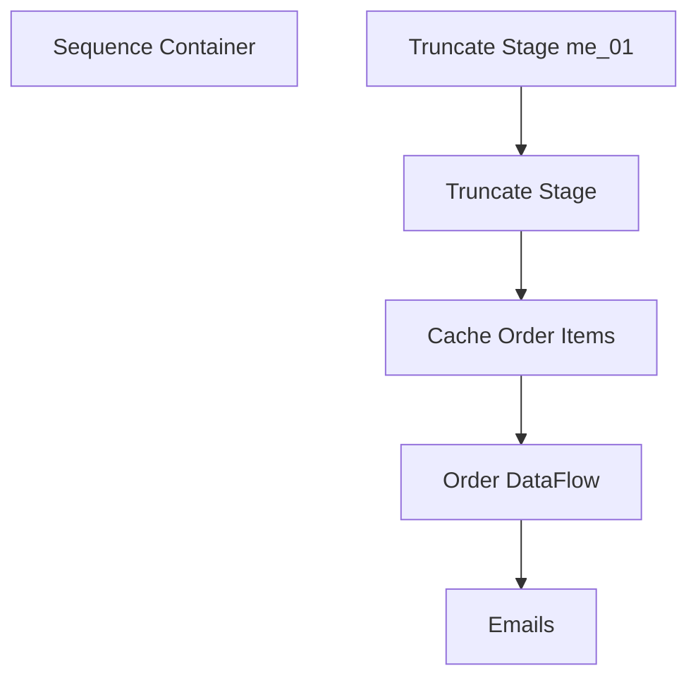

# SSIS Package: WMS_EmailDistributionsCreatedToday

**Project:** WMS_EmailDistributionsCreatedToday  
**Folder:** WMS  
**Server:** STL-SSIS-P-01  

## Connection Managers

| Name | Type | Server | Catalog | Connection (sanitized) |
|---|---|---|---|---|
| Cache - OrderItems | CACHE |  |  |  |
| Dynamics AX Connection Manager | DynamicsAX |  |  |  |
| IntegrationStaging | OLEDB | stl-ssis-p-01 | IntegrationStaging | Data Source=stl-ssis-p-01; Initial Catalog=IntegrationStaging; Provider=SQLNCLI11.1; Integrated Security=SSPI; Auto Translate=False |
| SMTP | SMTP |  |  |  |
| me_01 | OLEDB | bedrockdb02 | me_01 | Data Source=bedrockdb02; Initial Catalog=me_01; Provider=SQLNCLI11.1; Integrated Security=SSPI; Auto Translate=False |

## Control Flow Tasks

| Task | Type |
|---|---|
| WMS_EmailDistributionsCreatedToday | Package |
| Sequence Container | SEQUENCE |
| Cache Order Items | Pipeline |
| Emails | ExecuteSQLTask |
| Order DataFlow | Pipeline |
| Truncate Stage | ExecuteSQLTask |
| Truncate Stage me_01 | ExecuteSQLTask |

## Control Flow Outline

```text
- Sequence Container [SEQUENCE]
  - Cache Order Items [Pipeline]
  - Emails [ExecuteSQLTask]
  - Order DataFlow [Pipeline]
  - Truncate Stage [ExecuteSQLTask]
  - Truncate Stage me_01 [ExecuteSQLTask]
```

## Architecture Diagram



## Variables

| Namespace | Name | Expression-bound |
|---|---|---|
| System | Propagate | No |
| User | DateTimeStamp | Yes |
| User | EndDate | Yes |
| User | EndDateAsDATE | Yes |
| User | GetDate | Yes |
| User | GetDateAsDATE | Yes |
| User | StartDate | Yes |
| User | StartDateAsDATE | Yes |
| User | attachmentPath | Yes |
| User | rowCount | No |

### Expression-bound variable values

#### User::DateTimeStamp

**Expression:**

```sql
(DT_WSTR,4)DATEPART("yyyy",GetDate()) 
+ (DT_WSTR,4)DATEPART("mm",GetDate()) 
+ (DT_WSTR,4)DATEPART("dd",GetDate()) 
+ (DT_WSTR,4)DATEPART("hh",GetDate()) 
+ (DT_WSTR,4)DATEPART("mi",GetDate()) 
+ (DT_WSTR,4)DATEPART("ss",GetDate()) 
+ (DT_WSTR,4)DATEPART("ms",GetDate())
```

**Evaluated value:**

```sql
202151215375827
```

#### User::EndDate

**Expression:**

```sql
dateadd("dd", @[$Package::DaysToInclude], @[User::StartDate])
```

**Evaluated value:**

```sql
5/12/2021
```

#### User::EndDateAsDATE

**Expression:**

```sql
(DT_WSTR, 4) datepart("year", @[User::EndDate])  + "-" +
right("0"+ (DT_WSTR, 2) datepart("mm", @[User::EndDate]),2)  + "-" +
right("0" +(DT_WSTR, 2) datepart("dd",  @[User::EndDate]),2)
```

**Evaluated value:**

```sql
2021-05-12
```

#### User::GetDate

**Expression:**

```sql
(DT_DATE)DATEDIFF("Day", (DT_DATE) 0, GETDATE())
```

**Evaluated value:**

```sql
5/12/2021
```

#### User::GetDateAsDATE

**Expression:**

```sql
(DT_WSTR, 4) datepart("year", @[User::GetDate])  + "-" +
right("0"+ (DT_WSTR, 2) datepart("mm", @[User::GetDate]),2)  + "-" +
right("0" +(DT_WSTR, 2) datepart("dd",  @[User::GetDate]),2)
```

**Evaluated value:**

```sql
2021-05-12
```

#### User::StartDate

**Expression:**

```sql
dateadd("dd", -@[$Package::DaysToGoBack] , @[User::GetDate] )
```

**Evaluated value:**

```sql
5/5/2021
```

#### User::StartDateAsDATE

**Expression:**

```sql
(DT_WSTR, 4) datepart("year", @[User::StartDate])  + "-" +
right("0"+ (DT_WSTR, 2) datepart("mm", @[User::StartDate]),2)  + "-" +
right("0" +(DT_WSTR, 2) datepart("dd",  @[User::StartDate]),2)
```

**Evaluated value:**

```sql
2021-05-05
```

#### User::attachmentPath

**Expression:**

```sql
"\\\\stl-ssis-p-01\\d$\\IntegrationStaging\\WM\\Production\\items_without_HTS_or_COI_CA_Distros.xlsx"
```

**Evaluated value:**

```sql
\\stl-ssis-p-01\d$\IntegrationStaging\WM\Production\items_without_HTS_or_COI_CA_Distros.xlsx
```

## Execute SQL Tasks

### Emails

**Path:** `Package\Sequence Container\Emails`  
**Connection:** me_01 (bedrockdb02/me_01)  

```sql
--Exec spMerchandisingSelectStoreDistributions


--Added to only export this report at the 515 pm run


if convert(varchar, getdate(), 108) >= '19:30:00'


Begin


--Print 'hello'


Exec bedrockdb02.me_01.dbo.spMerchandisingSelectStoreDistributions


End
```

### Truncate Stage

**Path:** `Package\Sequence Container\Truncate Stage`  
**Connection:** IntegrationStaging (stl-ssis-p-01/IntegrationStaging)  

```sql
TRUNCATE TABLE tmpDynamicsOrderItems
```

### Truncate Stage me_01

**Path:** `Package\Sequence Container\Truncate Stage me_01`  
**Connection:** me_01 (bedrockdb02/me_01)  

```sql
TRUNCATE TABLE tmpSupplyOrdersStaged

```

## Data Flow: Sources

| Component | Source Object | Type | Data Flow Task | Connection | SQL Kind |
|---|---|---|---|---|---|
| tmpDynamicsOrderItems |  | OLEDBSource | Order DataFlow | IntegrationStaging |  |

## Data Flow: Destinations

| Component | Target Table | Type | Data Flow Task | Connection | SQL Kind |
|---|---|---|---|---|---|
| tmpDynamicsOrderItems |  | OLEDBDestination | Cache Order Items | IntegrationStaging |  |
| tmpSupplyOrdersStaged |  | OLEDBDestination | Order DataFlow | me_01 |  |
