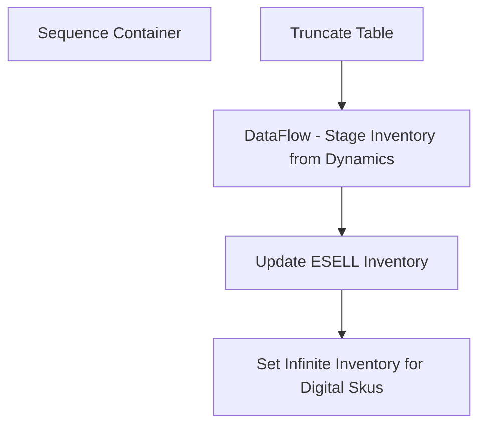

# SSIS Package: WMS_EnterpriseSellingInventoryFromWMS

**Project:** WMS_EnterpriseSellingInventoryFromWMS  
**Folder:** WMS  
**Server:** STL-SSIS-P-01  

## Connection Managers

| Name | Type | Server | Catalog | Connection (sanitized) |
|---|---|---|---|---|
| ESELL | OLEDB | bedrocktestdb02 | esell | Data Source=bedrocktestdb02; Initial Catalog=esell; Provider=SQLOLEDB.1; Integrated Security=SSPI; Application Name=SSIS-Package-{E6634B4A-0D01-4B76-8AC5-356EAAD26B38}bedrocktestdb02.esell; Auto Translate=False |
| Integration Staging | OLEDB | stl-ssis-t-01 | IntegrationStaging | Data Source=stl-ssis-t-01; Initial Catalog=IntegrationStaging; Provider=SQLNCLI11.1; Integrated Security=SSPI; Auto Translate=False |

## Control Flow Tasks

| Task | Type |
|---|---|
| WMS_EnterpriseSellingInventoryFromWMS | Package |
| Sequence Container | SEQUENCE |
| DataFlow - Stage Inventory from Dynamics | Pipeline |
| Set Infinite Inventory for Digital Skus | ExecuteSQLTask |
| Truncate Table | ExecuteSQLTask |
| Update ESELL Inventory | ExecuteSQLTask |

## Control Flow Outline

```text
- Sequence Container [SEQUENCE]
  - DataFlow - Stage Inventory from Dynamics [Pipeline]
  - Set Infinite Inventory for Digital Skus [ExecuteSQLTask]
  - Truncate Table [ExecuteSQLTask]
  - Update ESELL Inventory [ExecuteSQLTask]
```

## Architecture Diagram



## Variables

_None detected._

## Execute SQL Tasks

### Set Infinite Inventory for Digital Skus

**Path:** `Package\Sequence Container\Set Infinite Inventory for Digital Skus`  
**Connection:** ESELL (bedrocktestdb02/esell)  

```sql
exec spUpdateDigitalSoundsInfiniteInventory
```

### Truncate Table

**Path:** `Package\Sequence Container\Truncate Table`  
**Connection:** ESELL (bedrocktestdb02/esell)  

```sql
Truncate table WMSInventoryStageFromDynamics
```

### Update ESELL Inventory

**Path:** `Package\Sequence Container\Update ESELL Inventory`  
**Connection:** ESELL (bedrocktestdb02/esell)  

```sql
update es
set es.qty = isnull(wms.Quantity,0)
from esell.outlet_sku_xref es
join esell.sku sku with (nolock) on es.sku_id = sku.sku_id
left join WMSInventoryStageFromDynamics as wms
    on
    case
        when left(cast(sku.product_id as varchar(6)),1) = '1'
            then concat('0', right(cast(sku.product_id as varchar(6)),5))
        else cast(sku.product_id as varchar(6))
    end = wms.sku
where right(es.outlet_id, 4) in ('0013')

```

## Data Flow: Sources

| Component | Source Object | Type | Data Flow Task | Connection | SQL Kind |
|---|---|---|---|---|---|
| WMS Inventory Source |  | OLEDBSource | DataFlow - Stage Inventory from Dynamics | Integration Staging | SqlCommand |

#### WMS Inventory Source — SqlCommand

```sql
select     cast(ItemNumber as varchar(6)) as SKU,     (AvailableOnHandQuantity - OnOrderQuantity) as Quantity from WMS.WarehouseOnHand where 1=1 and InventoryWarehouseID in ('1013') and isnumeric(left(ItemNumber,1)) = 1
```

## Data Flow: Destinations

| Component | Target Table | Type | Data Flow Task | Connection | SQL Kind |
|---|---|---|---|---|---|
| WMSInventoryStageFromDynamics |  | OLEDBDestination | DataFlow - Stage Inventory from Dynamics | ESELL |  |
