# SSIS Package: WMS_EnterpriseSellingInventoryFromWMS

**Project:** WMS_EnterpriseSellingInventoryFromWMS  
**Folder:** WMS  
**Server:** STL-SSIS-P-01  

## Architecture Diagram

```mermaid
flowchart TD
    subgraph Connections
        ESELL_conn(["ESELL [OLEDB]"])
        Integration_Staging_conn(["Integration Staging [OLEDB]"])
    end
    subgraph ControlFlow
        WMS_EnterpriseSellingInventoryFromWMS_task["WMS_EnterpriseSellingInventoryFromWMS"]
        Sequence_Container_task["Sequence Container"]
        WMS_EnterpriseSellingInventoryFromWMS_task --> Sequence_Container_task
        DataFlow___Stage_Inventory_from_Dynamics_task["DataFlow - Stage Inventory from Dynamics"]
        Sequence_Container_task --> DataFlow___Stage_Inventory_from_Dynamics_task
        Set_Infinite_Inventory_for_Digital_Skus_task["Set Infinite Inventory for Digital Skus"]
        DataFlow___Stage_Inventory_from_Dynamics_task --> Set_Infinite_Inventory_for_Digital_Skus_task
        Truncate_Table_task["Truncate Table"]
        Set_Infinite_Inventory_for_Digital_Skus_task --> Truncate_Table_task
        Update_ESELL_Inventory_task["Update ESELL Inventory"]
        Truncate_Table_task --> Update_ESELL_Inventory_task
    end
```

## Connection Managers

| Name | Type |
|---|---|
| ESELL | OLEDB |
| Integration Staging | OLEDB |

## Control Flow Tasks

| Task | Type |
|---|---|
| WMS_EnterpriseSellingInventoryFromWMS | Microsoft.Package |
| Sequence Container | STOCK:SEQUENCE |
| DataFlow - Stage Inventory from Dynamics | Microsoft.Pipeline |
| Set Infinite Inventory for Digital Skus | Microsoft.ExecuteSQLTask |
| Truncate Table | Microsoft.ExecuteSQLTask |
| Update ESELL Inventory | Microsoft.ExecuteSQLTask |

## Data Flow: Sources

| Component | SQL Preview |
|---|---|
|  | select     cast(ItemNumber as varchar(6)) as SKU,     (AvailableOnHandQuantity - OnOrderQuantity) as Quantity from WMS.WarehouseOnHand where 1=1 and InventoryWarehouseID in ('1013') and isnumeric(left(ItemNumber,1)) = 1 |

## Data Flow: Destinations

| Component | Destination |
|---|---|
|  | [dbo].[WMSInventoryStageFromDynamics] |

