# SSIS Package: WMS_InboundShipmentLoad3PL

**Project:** WMS_InboundShipmentLoad3PL  
**Folder:** WMS  
**Server:** STL-SSIS-P-01  

## Connection Managers

| Name | Type | Server | Catalog | Connection (sanitized) |
|---|---|---|---|---|
| InboundShipmentCreateAPI | HTTP (KingswaySoft) |  |  |  |
| IntegrationStaging | OLEDB | STL-SSIS-P-01 | IntegrationStaging | Data Source=STL-SSIS-P-01; Initial Catalog=IntegrationStaging; Provider=SQLNCLI11.1; Integrated Security=SSPI; Auto Translate=False |
| JSON_FILE | FLATFILE |  |  |  |
| SMTP_EMAIL | SMTP |  |  |  |
| SQL_LOG | OLEDB | stl-ssis-p-01 | msdb | Data Source=stl-ssis-p-01; Initial Catalog=msdb; Provider=SQLNCLI11.1; Integrated Security=SSPI; Auto Translate=False |
| me_01 | OLEDB | bedrockdb02 | me_01 | Data Source=bedrockdb02; Initial Catalog=me_01; Provider=SQLNCLI11.1; Integrated Security=SSPI; Auto Translate=False |

## Control Flow Tasks

| Task | Type |
|---|---|
| WMS_InboundShipmentLoad3PL | Package |
| SeqCont - InboundShipmentLoad Create API JSON and Transmit | SEQUENCE |
| Execute SQL Task - CleanUp Troubleshooting and Error Tables | ExecuteSQLTask |
| SeqCont - Aptos Lines | SEQUENCE |
| Aptos Transfer Order Number Stage | ExecuteSQLTask |
| FEL - InboundShipment API - Aptos Lines | FOREACHLOOP |
| Set Batch ID and Export Flag | ExecuteSQLTask |
| ShipmentLoad API - Aptos Source Lines | Pipeline |
| SeqCont - Non Aptos Lines | SEQUENCE |
| FEL - InboundShipment API - Non Aptos Lines | FOREACHLOOP |
| Set Batch ID and Export Flag | ExecuteSQLTask |
| ShipmentLoad API - Dynamics Source Lines | Pipeline |
| Non Aptos Transfer Order Number Stage | ExecuteSQLTask |
| SeqCont - Load Pilot Store List - Automated | SEQUENCE |
| Data Flow Task | Pipeline |
| Execute SQL Task - Truncate tmpPilotStoreList | ExecuteSQLTask |
| SeqCont - Load Pilot Store List - Manual | SEQUENCE |
| Data Flow Task | Pipeline |
| Execute SQL Task | ExecuteSQLTask |
| Stage Shipment Data | SEQUENCE |
| SeqCont - Stage Shipments and Merge | SEQUENCE |
| Merge - WMS - spMergeInboundShipmentLoad | ExecuteSQLTask |
| SeqCont - PreStage Shipments | SEQUENCE |
| Execute SQL Task - Truncate Stage | ExecuteSQLTask |
| PreStage Shipments UK Warehouse | Pipeline |
| PreStage Shipments West Coast Warehouse | Pipeline |
| SeqCont - Truncate and Load Reference Tables | SEQUENCE |
| Data Flow Task - Load  Ref Table | Pipeline |
| Execute SQL Task - Truncate Ref Table | ExecuteSQLTask |
| Send Email onError | SendMailTask |

## Control Flow Outline

```text
- Send Email onError [SendMailTask]
- SeqCont - InboundShipmentLoad Create API JSON and Transmit [SEQUENCE]
  - Execute SQL Task - CleanUp Troubleshooting and Error Tables [ExecuteSQLTask]
  - SeqCont - Aptos Lines [SEQUENCE]
    - Aptos Transfer Order Number Stage [ExecuteSQLTask]
    - FEL - InboundShipment API - Aptos Lines [FOREACHLOOP]
      - Set Batch ID and Export Flag [ExecuteSQLTask]
      - ShipmentLoad API - Aptos Source Lines [Pipeline]
  - SeqCont - Non Aptos Lines [SEQUENCE]
    - FEL - InboundShipment API - Non Aptos Lines [FOREACHLOOP]
      - Set Batch ID and Export Flag [ExecuteSQLTask]
      - ShipmentLoad API - Dynamics Source Lines [Pipeline]
    - Non Aptos Transfer Order Number Stage [ExecuteSQLTask]
- SeqCont - Load Pilot Store List - Automated [SEQUENCE]
  - Data Flow Task [Pipeline]
  - Execute SQL Task - Truncate tmpPilotStoreList [ExecuteSQLTask]
- SeqCont - Load Pilot Store List - Manual [SEQUENCE]
  - Data Flow Task [Pipeline]
  - Execute SQL Task [ExecuteSQLTask]
- Stage Shipment Data [SEQUENCE]
  - SeqCont - Stage Shipments and Merge [SEQUENCE]
    - Merge - WMS - spMergeInboundShipmentLoad [ExecuteSQLTask]
    - SeqCont - PreStage Shipments [SEQUENCE]
      - Execute SQL Task - Truncate Stage [ExecuteSQLTask]
      - PreStage Shipments UK Warehouse [Pipeline]
      - PreStage Shipments West Coast Warehouse [Pipeline]
    - SeqCont - Truncate and Load Reference Tables [SEQUENCE]
      - Data Flow Task - Load  Ref Table [Pipeline]
      - Execute SQL Task - Truncate Ref Table [ExecuteSQLTask]
```

## Architecture Diagram

```mermaid
flowchart TD
    n_Package_SeqCont___InboundShipmentLoad_Create_API_JSON_and_Transmit["SeqCont - InboundShipmentLoad Create API JSON and Transmit"]
    n_Package_SeqCont___InboundShipmentLoad_Create_API_JSON_and_Transmit_Execute_SQL_Task___CleanUp_Troubleshooting_and_Error_Tables["Execute SQL Task - CleanUp Troubleshooting and Error Tables"]
    n_Package_SeqCont___InboundShipmentLoad_Create_API_JSON_and_Transmit_SeqCont___Aptos_Lines["SeqCont - Aptos Lines"]
    n_Package_SeqCont___InboundShipmentLoad_Create_API_JSON_and_Transmit_SeqCont___Aptos_Lines_Aptos_Transfer_Order_Number_Stage["Aptos Transfer Order Number Stage"]
    n_Package_SeqCont___InboundShipmentLoad_Create_API_JSON_and_Transmit_SeqCont___Aptos_Lines_FEL___InboundShipment_API___Aptos_Lines["FEL - InboundShipment API - Aptos Lines"]
    n_Package_SeqCont___InboundShipmentLoad_Create_API_JSON_and_Transmit_SeqCont___Aptos_Lines_FEL___InboundShipment_API___Aptos_Lines_Set_Batch_ID_and_Export_Flag["Set Batch ID and Export Flag"]
    n_Package_SeqCont___InboundShipmentLoad_Create_API_JSON_and_Transmit_SeqCont___Aptos_Lines_FEL___InboundShipment_API___Aptos_Lines_ShipmentLoad_API___Aptos_Source_Lines["ShipmentLoad API - Aptos Source Lines"]
    n_Package_SeqCont___InboundShipmentLoad_Create_API_JSON_and_Transmit_SeqCont___Non_Aptos_Lines["SeqCont - Non Aptos Lines"]
    n_Package_SeqCont___InboundShipmentLoad_Create_API_JSON_and_Transmit_SeqCont___Non_Aptos_Lines_FEL___InboundShipment_API___Non_Aptos_Lines["FEL - InboundShipment API - Non Aptos Lines"]
    n_Package_SeqCont___InboundShipmentLoad_Create_API_JSON_and_Transmit_SeqCont___Non_Aptos_Lines_FEL___InboundShipment_API___Non_Aptos_Lines_Set_Batch_ID_and_Export_Flag["Set Batch ID and Export Flag"]
    n_Package_SeqCont___InboundShipmentLoad_Create_API_JSON_and_Transmit_SeqCont___Non_Aptos_Lines_FEL___InboundShipment_API___Non_Aptos_Lines_ShipmentLoad_API___Dynamics_Source_Lines["ShipmentLoad API - Dynamics Source Lines"]
    n_Package_SeqCont___InboundShipmentLoad_Create_API_JSON_and_Transmit_SeqCont___Non_Aptos_Lines_Non_Aptos_Transfer_Order_Number_Stage["Non Aptos Transfer Order Number Stage"]
    n_Package_SeqCont___Load_Pilot_Store_List___Automated["SeqCont - Load Pilot Store List - Automated"]
    n_Package_SeqCont___Load_Pilot_Store_List___Automated_Data_Flow_Task["Data Flow Task"]
    n_Package_SeqCont___Load_Pilot_Store_List___Automated_Execute_SQL_Task___Truncate_tmpPilotStoreList["Execute SQL Task - Truncate tmpPilotStoreList"]
    n_Package_SeqCont___Load_Pilot_Store_List___Manual["SeqCont - Load Pilot Store List - Manual"]
    n_Package_SeqCont___Load_Pilot_Store_List___Manual_Data_Flow_Task["Data Flow Task"]
    n_Package_SeqCont___Load_Pilot_Store_List___Manual_Execute_SQL_Task["Execute SQL Task"]
    n_Package_Stage_Shipment_Data["Stage Shipment Data"]
    n_Package_Stage_Shipment_Data_SeqCont___Stage_Shipments_and_Merge["SeqCont - Stage Shipments and Merge"]
    n_Package_Stage_Shipment_Data_SeqCont___Stage_Shipments_and_Merge_Merge___WMS___spMergeInboundShipmentLoad["Merge - WMS - spMergeInboundShipmentLoad"]
    n_Package_Stage_Shipment_Data_SeqCont___Stage_Shipments_and_Merge_SeqCont___PreStage_Shipments["SeqCont - PreStage Shipments"]
    n_Package_Stage_Shipment_Data_SeqCont___Stage_Shipments_and_Merge_SeqCont___PreStage_Shipments_Execute_SQL_Task___Truncate_Stage["Execute SQL Task - Truncate Stage"]
    n_Package_Stage_Shipment_Data_SeqCont___Stage_Shipments_and_Merge_SeqCont___PreStage_Shipments_PreStage_Shipments_UK_Warehouse["PreStage Shipments UK Warehouse"]
    n_Package_Stage_Shipment_Data_SeqCont___Stage_Shipments_and_Merge_SeqCont___PreStage_Shipments_PreStage_Shipments_West_Coast_Warehouse["PreStage Shipments West Coast Warehouse"]
    n_Package_Stage_Shipment_Data_SeqCont___Stage_Shipments_and_Merge_SeqCont___Truncate_and_Load_Reference_Tables["SeqCont - Truncate and Load Reference Tables"]
    n_Package_Stage_Shipment_Data_SeqCont___Stage_Shipments_and_Merge_SeqCont___Truncate_and_Load_Reference_Tables_Data_Flow_Task___Load__Ref_Table["Data Flow Task - Load  Ref Table"]
    n_Package_Stage_Shipment_Data_SeqCont___Stage_Shipments_and_Merge_SeqCont___Truncate_and_Load_Reference_Tables_Execute_SQL_Task___Truncate_Ref_Table["Execute SQL Task - Truncate Ref Table"]
    n_Package_EventHandlers_OnError__Send_Email_onError["Send Email onError"]
    n_Package_SeqCont___InboundShipmentLoad_Create_API_JSON_and_Transmit_SeqCont___Aptos_Lines_FEL___InboundShipment_API___Aptos_Lines_ShipmentLoad_API___Aptos_Source_Lines --> n_Package_SeqCont___InboundShipmentLoad_Create_API_JSON_and_Transmit_SeqCont___Aptos_Lines_FEL___InboundShipment_API___Aptos_Lines_Set_Batch_ID_and_Export_Flag
    n_Package_SeqCont___InboundShipmentLoad_Create_API_JSON_and_Transmit_SeqCont___Aptos_Lines_Aptos_Transfer_Order_Number_Stage --> n_Package_SeqCont___InboundShipmentLoad_Create_API_JSON_and_Transmit_SeqCont___Aptos_Lines_FEL___InboundShipment_API___Aptos_Lines
    n_Package_SeqCont___InboundShipmentLoad_Create_API_JSON_and_Transmit_SeqCont___Non_Aptos_Lines_FEL___InboundShipment_API___Non_Aptos_Lines_ShipmentLoad_API___Dynamics_Source_Lines --> n_Package_SeqCont___InboundShipmentLoad_Create_API_JSON_and_Transmit_SeqCont___Non_Aptos_Lines_FEL___InboundShipment_API___Non_Aptos_Lines_Set_Batch_ID_and_Export_Flag
    n_Package_SeqCont___InboundShipmentLoad_Create_API_JSON_and_Transmit_SeqCont___Non_Aptos_Lines_Non_Aptos_Transfer_Order_Number_Stage --> n_Package_SeqCont___InboundShipmentLoad_Create_API_JSON_and_Transmit_SeqCont___Non_Aptos_Lines_FEL___InboundShipment_API___Non_Aptos_Lines
    n_Package_SeqCont___InboundShipmentLoad_Create_API_JSON_and_Transmit_SeqCont___Aptos_Lines --> n_Package_SeqCont___InboundShipmentLoad_Create_API_JSON_and_Transmit_SeqCont___Non_Aptos_Lines
    n_Package_SeqCont___InboundShipmentLoad_Create_API_JSON_and_Transmit_Execute_SQL_Task___CleanUp_Troubleshooting_and_Error_Tables --> n_Package_SeqCont___InboundShipmentLoad_Create_API_JSON_and_Transmit_SeqCont___Aptos_Lines
    n_Package_SeqCont___Load_Pilot_Store_List___Automated_Execute_SQL_Task___Truncate_tmpPilotStoreList --> n_Package_SeqCont___Load_Pilot_Store_List___Automated_Data_Flow_Task
    n_Package_SeqCont___Load_Pilot_Store_List___Manual_Execute_SQL_Task --> n_Package_SeqCont___Load_Pilot_Store_List___Manual_Data_Flow_Task
    n_Package_Stage_Shipment_Data_SeqCont___Stage_Shipments_and_Merge_SeqCont___PreStage_Shipments_PreStage_Shipments_West_Coast_Warehouse --> n_Package_Stage_Shipment_Data_SeqCont___Stage_Shipments_and_Merge_SeqCont___PreStage_Shipments_PreStage_Shipments_UK_Warehouse
    n_Package_Stage_Shipment_Data_SeqCont___Stage_Shipments_and_Merge_SeqCont___PreStage_Shipments_Execute_SQL_Task___Truncate_Stage --> n_Package_Stage_Shipment_Data_SeqCont___Stage_Shipments_and_Merge_SeqCont___PreStage_Shipments_PreStage_Shipments_West_Coast_Warehouse
    n_Package_Stage_Shipment_Data_SeqCont___Stage_Shipments_and_Merge_SeqCont___Truncate_and_Load_Reference_Tables_Execute_SQL_Task___Truncate_Ref_Table --> n_Package_Stage_Shipment_Data_SeqCont___Stage_Shipments_and_Merge_SeqCont___Truncate_and_Load_Reference_Tables_Data_Flow_Task___Load__Ref_Table
    n_Package_Stage_Shipment_Data_SeqCont___Stage_Shipments_and_Merge_SeqCont___PreStage_Shipments --> n_Package_Stage_Shipment_Data_SeqCont___Stage_Shipments_and_Merge_Merge___WMS___spMergeInboundShipmentLoad
    n_Package_Stage_Shipment_Data_SeqCont___Stage_Shipments_and_Merge_SeqCont___Truncate_and_Load_Reference_Tables --> n_Package_Stage_Shipment_Data_SeqCont___Stage_Shipments_and_Merge_SeqCont___PreStage_Shipments
    n_Package_Stage_Shipment_Data --> n_Package_SeqCont___InboundShipmentLoad_Create_API_JSON_and_Transmit
    n_Package_SeqCont___Load_Pilot_Store_List___Automated --> n_Package_Stage_Shipment_Data
```



## Variables

| Namespace | Name | Expression-bound |
|---|---|---|
| System | Propagate | No |
| User | AptosTransferNumberInLoop | No |
| User | AptosTransferNumberStage | No |
| User | BatchID | No |
| User | DateTimeStamp | Yes |
| User | DynamicsShipmentNumberInLoop | No |
| User | DynamicsShipmentNumberStage | No |
| User | EndDate | Yes |
| User | EndDateAsDATE | Yes |
| User | GetDate | Yes |
| User | GetDateAsDATE | Yes |
| User | JSON_GetBlobURL | Yes |
| User | JSON_GetSummaryStatus | Yes |
| User | LoopCount | No |
| User | ProcessStatus | No |
| User | RowsCount | No |
| User | RunControlFlag | No |
| User | SalesOrderInvoiceStage | Yes |
| User | SqlStringPreStageClipper | Yes |
| User | SqlStringPreStageWestCoast | Yes |
| User | StartDate | Yes |
| User | StartDateAsDATE | Yes |
| User | TransferNumberInLoop | No |
| User | TransferOrderNumberStage | No |

### Expression-bound variable values

#### User::DateTimeStamp

**Expression:**

```sql
(DT_WSTR,4)DATEPART("yyyy",GetDate()) 
+ (DT_WSTR,4)DATEPART("mm",GetDate()) 
+ (DT_WSTR,4)DATEPART("dd",GetDate()) 
+ (DT_WSTR,4)DATEPART("hh",GetDate()) 
+ (DT_WSTR,4)DATEPART("mi",GetDate()) 
+ (DT_WSTR,4)DATEPART("ss",GetDate()) 
+ (DT_WSTR,4)DATEPART("ms",GetDate())
```

**Evaluated value:**

```sql
2023103011583310
```

#### User::EndDate

**Expression:**

```sql
dateadd("dd", @[$Package::DaysToInclude], @[User::StartDate])
```

**Evaluated value:**

```sql
10/1/2023
```

#### User::EndDateAsDATE

**Expression:**

```sql
(DT_WSTR, 4) datepart("year", @[User::EndDate])  + "-" +
right("0"+ (DT_WSTR, 2) datepart("mm", @[User::EndDate]),2)  + "-" +
right("0" +(DT_WSTR, 2) datepart("dd",  @[User::EndDate]),2)
```

**Evaluated value:**

```sql
2023-10-01
```

#### User::GetDate

**Expression:**

```sql
(DT_DATE)DATEDIFF("Day", (DT_DATE) 0, GETDATE())
```

**Evaluated value:**

```sql
10/30/2023
```

#### User::GetDateAsDATE

**Expression:**

```sql
(DT_WSTR, 4) datepart("year", @[User::GetDate])  + "-" +
right("0"+ (DT_WSTR, 2) datepart("mm", @[User::GetDate]),2)  + "-" +
right("0" +(DT_WSTR, 2) datepart("dd",  @[User::GetDate]),2)
```

**Evaluated value:**

```sql
2023-10-30
```

#### User::JSON_GetBlobURL

**Expression:**

```sql
"
{
    \"uniqueFileName\":\"" + @[User::BatchID] + "\"
}
"
```

**Evaluated value:**

```sql

{
    "uniqueFileName":"5ECF043F-9E41-46F7-9FE9-0634BCE2C644"
}

```

#### User::JSON_GetSummaryStatus

**Expression:**

```sql
"
{
    \"executionId\":\"" + @[User::BatchID] + "\"
}
"
```

**Evaluated value:**

```sql

{
    "executionId":"5ECF043F-9E41-46F7-9FE9-0634BCE2C644"
}

```

#### User::SalesOrderInvoiceStage

**Expression:**

```sql
"\\\\" +  @[$Package::IntegrationStaging_ServerName] + "\\IntegrationStaging\\ERP\\" +  @[$Package::ERP_ShipmentInvoicePackageEnvironment] + "\\Outbound\\D365\\ShipmentInvoices\\SalesOrderInvoice\\" +  @[User::Entity] + "\\"
```

**Evaluated value:**

```sql
\\STL-SSIS-T-01\IntegrationStaging\ERP\TEST1\Outbound\D365\ShipmentInvoices\SalesOrderInvoice\2110\
```

#### User::SqlStringPreStageClipper

**Expression:**

```sql
"with ShipmentData as (
select 
cast (ship_date as date) ship_date, 
--ship_date, 
cast(shipment as varchar(10)) as [3PLDocumentNumber],
'BestServe' as DeliveryTerms,
u.style_code as ItemNumber, 
sum (sent_qty*-1) as TransferQuantity, 
'ea' as UOM, 
u.distribution_number as BABAptosDistroNumber, 
--distribution_line as BABAptosDistroLineNumber, 
'AVAIL' as InventoryStatus,
carton_nbr as LicensePlate,
carton_nbr as ContainerID, 
cast(Location_code as varchar (4)) as AptosLocationCode, 
isnull(e.rec_type,'1') as rec_type,
case when left(distribution_number, 2) in ('SO','TO')
	then 'Dynamics'
	else 'Aptos'
end as OrderCreateSource
from ERP_DynamicsShipmentStage_UK  u (nolock) 
join tmpPilotStoreList psl on u.location_code=psl.LocationCode
left join tmpRecTypeLookupUk E on u.shipment=e.document_number 
	and u.location_code=e.destid
	and u.style_code=e.style_code 
where datediff(dd, ship_date, getdate()) <= " + 
(DT_WSTR, 3) @[$Package::DaysToGoBack] 
+  
"
and sent_qty <> 0 
and carton_nbr is not null -- Assume this will be needed but remarking out until we have fresh sample data 
group by 
cast (ship_date as date), 
--ship_date, 
shipment, 
u.style_code, 
u.distribution_number, 
distribution_line, 
carton_nbr, 
Location_code, 
e.rec_type
) , 

ERDMatrix as (
select cast(location_code as varchar(4))as ErdMatrixLocationCode , 
cast (rec_type as varchar(10)) as rec_type, 
--cast ([days] as int) as  [days]
days

from erd_matrix (nolock) 
where left(location_code,1) = '2'
)

select sd.*, 
e.days, 
				case when upper(datename(dw,getdate())) = 'MONDAY' and e.days > 4 or upper(datename(dw,getdate())) = 'TUESDAY' and e.days > 3
			or upper(datename(dw,getdate())) = 'WEDNESDAY' and e.days > 2 or upper(datename(dw,getdate())) = 'THURSDAY' and e.days > 1
			or upper(datename(dw,getdate())) = 'FRIDAY'
				then convert(varchar(10), getdate() + e.days + 2,101)
			when upper(datename(dw,getdate())) = 'MONDAY' and e.rec_type in (55,89,1005)
				then convert(varchar(10), getdate() + e.days + 5,101)
			when upper(datename(dw,getdate())) = 'TUESDAY' and e.rec_type in (55,89,1005)
				then convert(varchar(10), getdate() + e.days + 4,101)
			when upper(datename(dw,getdate())) = 'WEDNESDAY' and e.rec_type in (55,89,1005)
				then convert(varchar(10), getdate() + e.days + 3,101)
			when upper(datename(dw,getdate())) = 'THURSDAY' and e.rec_type in (55,89,1005)
				then convert(varchar(10), getdate() + e.days + 2,101)
			when upper(datename(dw,getdate())) = 'FRIDAY' and e.rec_type in (55,89,1005)
				then convert(varchar(10), getdate() + e.days + 1,101)
			else
				 convert(varchar, getdate() + isnull(e.days,7),101)
			end as ExpectedReceiptDate

from ShipmentData sd 
left join ERDMatrix e on e.ErdMatrixLocationCode=sd.AptosLocationCode and e.rec_type=sd.rec_type
"
```

**Evaluated value:**

```sql
with ShipmentData as (
select 
cast (ship_date as date) ship_date, 
--ship_date, 
cast(shipment as varchar(10)) as [3PLDocumentNumber],
'BestServe' as DeliveryTerms,
u.style_code as ItemNumber, 
sum (sent_qty*-1) as TransferQuantity, 
'ea' as UOM, 
u.distribution_number as BABAptosDistroNumber, 
--distribution_line as BABAptosDistroLineNumber, 
'AVAIL' as InventoryStatus,
carton_nbr as LicensePlate,
carton_nbr as ContainerID, 
cast(Location_code as varchar (4)) as AptosLocationCode, 
isnull(e.rec_type,'1') as rec_type,
case when left(distribution_number, 2) in ('SO','TO')
	then 'Dynamics'
	else 'Aptos'
end as OrderCreateSource
from ERP_DynamicsShipmentStage_UK  u (nolock) 
join tmpPilotStoreList psl on u.location_code=psl.LocationCode
left join tmpRecTypeLookupUk E on u.shipment=e.document_number 
	and u.location_code=e.destid
	and u.style_code=e.style_code 
where datediff(dd, ship_date, getdate()) <= 30
and sent_qty <> 0 
and carton_nbr is not null -- Assume this will be needed but remarking out until we have fresh sample data 
group by 
cast (ship_date as date), 
--ship_date, 
shipment, 
u.style_code, 
u.distribution_number, 
distribution_line, 
carton_nbr, 
Location_code, 
e.rec_type
) , 

ERDMatrix as (
select cast(location_code as varchar(4))as ErdMatrixLocationCode , 
cast (rec_type as varchar(10)) as rec_type, 
--cast ([days] as int) as  [days]
days

from erd_matrix (nolock) 
where left(location_code,1) = '2'
)

select sd.*, 
e.days, 
				case when upper(datename(dw,getdate())) = 'MONDAY' and e.days > 4 or upper(datename(dw,getdate())) = 'TUESDAY' and e.days > 3
			or upper(datename(dw,getdate())) = 'WEDNESDAY' and e.days > 2 or upper(datename(dw,getdate())) = 'THURSDAY' and e.days > 1
			or upper(datename(dw,getdate())) = 'FRIDAY'
				then convert(varchar(10), getdate() + e.days + 2,101)
			when upper(datename(dw,getdate())) = 'MONDAY' and e.rec_type in (55,89,1005)
				then convert(varchar(10), getdate() + e.days + 5,101)
			when upper(datename(dw,getdate())) = 'TUESDAY' and e.rec_type in (55,89,1005)
				then convert(varchar(10), getdate() + e.days + 4,101)
			when upper(datename(dw,getdate())) = 'WEDNESDAY' and e.rec_type in (55,89,1005)
				then convert(varchar(10), getdate() + e.days + 3,101)
			when upper(datename(dw,getdate())) = 'THURSDAY' and e.rec_type in (55,89,1005)
				then convert(varchar(10), getdate() + e.days + 2,101)
			when upper(datename(dw,getdate())) = 'FRIDAY' and e.rec_type in (55,89,1005)
				then convert(varchar(10), getdate() + e.days + 1,101)
			else
				 convert(varchar, getdate() + isnull(e.days,7),101)
			end as ExpectedReceiptDate

from ShipmentData sd 
left join ERDMatrix e on e.ErdMatrixLocationCode=sd.AptosLocationCode and e.rec_type=sd.rec_type

```

#### User::SqlStringPreStageWestCoast

**Expression:**

```sql
"with ShipmentData as (

select cast (ship_date as date) ShipDate, 
document_no as [3PLDocumentNumber], 
'BestServe' as DeliveryTerms,
style_code as ItemNumber, 
sum (shipped_qty) as TransferQuantity, 
'ea' as UOM, 
distribution_no as BABAptosDistroNumber, 
--distribution_line as BABAptosDistroLineNumber, 
'AVAIL' as InventoryStatus,
license_plate as LicensePlate, 
carton_no as ContainerID, 
case when left(distribution_no, 2) in ('SO','TO')
	then 'Dynamics'
	else 'Aptos'
end as OrderCreateSource, 
	   
	   datepart(dw, cast (ship_date as date)) day_shipped,
	   case when fi.rec_type in ('1','6','8','9','56','61','1006') then isnull(we.truck_960,7)--truck
			when fi.rec_type in ('54','58','80','81','82','83','84','1004') then isnull(we.ground_960,7)--ground
			when fi.rec_type in ('51','52','73','85','86','1001','1002') then '1'--1 day
			when fi.rec_type in ('53','74','87','1003','57','1007','62') then '2'--2 day -- includes courier and intnl priority
			when fi.rec_type in ('60','88','1010') then '3'--3 day
			when fi.rec_type in ('55','89','1005') then datediff(dd, datepart(dw, cast (ship_date as date)),7) -- saturday
			when fi.rec_type in ('63') then isnull(we.intnl_econ_960,5)--Intl Economy -- santiago will provide list by store, what's not provided will be 5 days
			when fi.rec_type in ('64','65') then '30'--30
			when fi.rec_type = '3' then isnull(we.supplySecond_960,7)
			when fi.rec_type = '7' then isnull(we.supplyThird_960,7)
			else 7
		end as transit_days

from ERP_DynamicsShipmentStage_WC FI (nolock) 
join rec_type rt (nolock) on fi.rec_type = rt.rectype
left join whse_erd we (nolock) on fi.location_code = we.location_code
join tmpPilotStoreList psl on fi.location_code=psl.LocationCode
where datediff(dd, ship_date, getdate()) <= " + 
 (DT_WSTR, 3) @[$Package::DaysToGoBack] 
+
 "
and shipped_qty <> 0 
and  license_plate is not null 
group by cast (ship_date as date), 
document_no, 
style_code, 
distribution_no, 
distribution_line, 
license_plate, 
carton_no, 
fi.rec_type, 
we.truck_960, 
we.ground_960, 
we.intnl_econ_960, 
we.supplySecond_960, 
we.supplyThird_960
) 


select 
sd.ShipDate, 
sd.[3PLDocumentNumber], 
sd.DeliveryTerms, 
sd.ItemNumber, 
sd.TransferQuantity, 
sd.UOM, 
sd.BABAptosDistroNumber, 
sd.InventoryStatus, 
sd.LicensePlate, 
sd.ContainerID, 
sd.OrderCreateSource, 
sd.day_shipped as DayOfWeekShipped, 
sd.transit_days as TransitDays,
cast (
case when (datepart(dw, ShipDate) = 2 and transit_days > 4)
			or (datepart(dw, ShipDate) = 3 and transit_days > 3)
			or (datepart(dw, ShipDate) = 4 and transit_days > 2)
			or (datepart(dw, ShipDate) = 5 and transit_days > 1)
			or (datepart(dw, ShipDate) = 6)
		then convert(varchar, dateadd(day, (transit_days + 2), cast(ShipDate as datetime)), 101)
	when transit_days is NULL then convert(varchar, dateadd(day, (7), cast(ShipDate as datetime)), 101)
	else convert(varchar, dateadd(day, (transit_days), cast(ShipDate as datetime)), 101)
end as date) as ExpectedReceiptDate
from ShipmentData SD
"
```

**Evaluated value:**

```sql
with ShipmentData as (

select cast (ship_date as date) ShipDate, 
document_no as [3PLDocumentNumber], 
'BestServe' as DeliveryTerms,
style_code as ItemNumber, 
sum (shipped_qty) as TransferQuantity, 
'ea' as UOM, 
distribution_no as BABAptosDistroNumber, 
--distribution_line as BABAptosDistroLineNumber, 
'AVAIL' as InventoryStatus,
license_plate as LicensePlate, 
carton_no as ContainerID, 
case when left(distribution_no, 2) in ('SO','TO')
	then 'Dynamics'
	else 'Aptos'
end as OrderCreateSource, 
	   
	   datepart(dw, cast (ship_date as date)) day_shipped,
	   case when fi.rec_type in ('1','6','8','9','56','61','1006') then isnull(we.truck_960,7)--truck
			when fi.rec_type in ('54','58','80','81','82','83','84','1004') then isnull(we.ground_960,7)--ground
			when fi.rec_type in ('51','52','73','85','86','1001','1002') then '1'--1 day
			when fi.rec_type in ('53','74','87','1003','57','1007','62') then '2'--2 day -- includes courier and intnl priority
			when fi.rec_type in ('60','88','1010') then '3'--3 day
			when fi.rec_type in ('55','89','1005') then datediff(dd, datepart(dw, cast (ship_date as date)),7) -- saturday
			when fi.rec_type in ('63') then isnull(we.intnl_econ_960,5)--Intl Economy -- santiago will provide list by store, what's not provided will be 5 days
			when fi.rec_type in ('64','65') then '30'--30
			when fi.rec_type = '3' then isnull(we.supplySecond_960,7)
			when fi.rec_type = '7' then isnull(we.supplyThird_960,7)
			else 7
		end as transit_days

from ERP_DynamicsShipmentStage_WC FI (nolock) 
join rec_type rt (nolock) on fi.rec_type = rt.rectype
left join whse_erd we (nolock) on fi.location_code = we.location_code
join tmpPilotStoreList psl on fi.location_code=psl.LocationCode
where datediff(dd, ship_date, getdate()) <= 30
and shipped_qty <> 0 
and  license_plate is not null 
group by cast (ship_date as date), 
document_no, 
style_code, 
distribution_no, 
distribution_line, 
license_plate, 
carton_no, 
fi.rec_type, 
we.truck_960, 
we.ground_960, 
we.intnl_econ_960, 
we.supplySecond_960, 
we.supplyThird_960
) 


select 
sd.ShipDate, 
sd.[3PLDocumentNumber], 
sd.DeliveryTerms, 
sd.ItemNumber, 
sd.TransferQuantity, 
sd.UOM, 
sd.BABAptosDistroNumber, 
sd.InventoryStatus, 
sd.LicensePlate, 
sd.ContainerID, 
sd.OrderCreateSource, 
sd.day_shipped as DayOfWeekShipped, 
sd.transit_days as TransitDays,
cast (
case when (datepart(dw, ShipDate) = 2 and transit_days > 4)
			or (datepart(dw, ShipDate) = 3 and transit_days > 3)
			or (datepart(dw, ShipDate) = 4 and transit_days > 2)
			or (datepart(dw, ShipDate) = 5 and transit_days > 1)
			or (datepart(dw, ShipDate) = 6)
		then convert(varchar, dateadd(day, (transit_days + 2), cast(ShipDate as datetime)), 101)
	when transit_days is NULL then convert(varchar, dateadd(day, (7), cast(ShipDate as datetime)), 101)
	else convert(varchar, dateadd(day, (transit_days), cast(ShipDate as datetime)), 101)
end as date) as ExpectedReceiptDate
from ShipmentData SD

```

#### User::StartDate

**Expression:**

```sql
dateadd("dd", -@[$Package::DaysToGoBack] , @[User::GetDate] )
```

**Evaluated value:**

```sql
9/30/2023
```

#### User::StartDateAsDATE

**Expression:**

```sql
(DT_WSTR, 4) datepart("year", @[User::StartDate])  + "-" +
right("0"+ (DT_WSTR, 2) datepart("mm", @[User::StartDate]),2)  + "-" +
right("0" +(DT_WSTR, 2) datepart("dd",  @[User::StartDate]),2)
```

**Evaluated value:**

```sql
2023-09-30
```

## Execute SQL Tasks

### Execute SQL Task - CleanUp Troubleshooting and Error Tables

**Path:** `Package\SeqCont - InboundShipmentLoad Create API JSON and Transmit\Execute SQL Task - CleanUp Troubleshooting and Error Tables`  
**Connection:** IntegrationStaging (STL-SSIS-P-01/IntegrationStaging)  

```sql
set nocount on 

-- Clean Up Troubleshoot Table Entries Older Than 90 Days  
-- The JSON field eats up a lot of database space 

delete 
from wms.tmpInboundShipmentLoad3PL_Troubleshoot
where 1=1
and
(
datediff(dd,InsertDate,getdate()) >= 90

or 
InsertDate is null 

)


--Clean Up Error Table Entries 
--This should be less frequent so I just have this queued up in case we need it in the future 
/*
delete 
from  wms.tmpInboundShipmentLoad3PL_Error
where 1=1
and
(
datediff(dd,InsertDate,getdate()) >= 90

or 
InsertDate is null 

)
*/

```

### Aptos Transfer Order Number Stage

**Path:** `Package\SeqCont - InboundShipmentLoad Create API JSON and Transmit\SeqCont - Aptos Lines\Aptos Transfer Order Number Stage`  
**Connection:** IntegrationStaging (STL-SSIS-P-01/IntegrationStaging)  

```sql
with LegacyExport as (
select 
Entity, 
OrderRef as Orderid 
from erp.ShipmentInvoice (nolock) 
where 1=1
and InsertDate > '04-01-2023' -- Retail Inventory Begin Date 
and Transmitted = 1
group by 
Entity, 
OrderRef
 
)

select l.OrderId 
from wms.InboundShipmentLoad L (nolock)
left join LegacyExport le on le.Orderid =l.OrderId
				and le.Entity = l.Entity
where 1=1
and l.BatchID is null 
and l.SentDate is null 
and l.OrderCreateSource = 'Aptos'
and l.BABAptosDistroLineNumber is not null 
and le.Orderid is null -- Ensures Not to Allow TO Data That Previously Went Via Legacy ERP Shipment Invoice Job -- Added 6/1/2023
--and AptosShipmentNumber = '2900146466' -- Testing Only 
--and  l.OrderId  <> 'TO0000231396' -- Testing Only 
--and l.OrderId not in ('TO0000231396','TO0000231392') -- Temp Added on 10/16/2023 these were causing the API all to timeout 
group by l.OrderId
order by 1 desc

```

### Set Batch ID and Export Flag

**Path:** `Package\SeqCont - InboundShipmentLoad Create API JSON and Transmit\SeqCont - Aptos Lines\FEL - InboundShipment API - Aptos Lines\Set Batch ID and Export Flag`  
**Connection:** IntegrationStaging (STL-SSIS-P-01/IntegrationStaging)  

> ⚠️ `SqlStatementSource` is overridden at runtime by a property expression (shown below); the static SQL may not be what executes.

**Static SqlStatementSource:**

```sql
update isl
set 
	isl.SentDate=getdate(),
	isl.BatchID = '{1165991C-EC3D-44A7-92F3-8790CF2D750B}' 
from wms.InboundShipmentLoad isl 
where 
	isl.SentDate is NULL 
	and isl.OrderId = 'TO0000025275'
```

**Property expression (runtime override):**

```sql
"update isl
set 
	isl.SentDate=getdate(),
	isl.BatchID = '" +  @[System::ExecutionInstanceGUID] + "' 
from wms.InboundShipmentLoad isl 
where 
	isl.SentDate is NULL 
	and isl.OrderId = '" +  @[User::AptosTransferNumberInLoop] + "'"
```

### Set Batch ID and Export Flag

**Path:** `Package\SeqCont - InboundShipmentLoad Create API JSON and Transmit\SeqCont - Non Aptos Lines\FEL - InboundShipment API - Non Aptos Lines\Set Batch ID and Export Flag`  
**Connection:** IntegrationStaging (STL-SSIS-P-01/IntegrationStaging)  

> ⚠️ `SqlStatementSource` is overridden at runtime by a property expression (shown below); the static SQL may not be what executes.

**Static SqlStatementSource:**

```sql
update isl
set 
	isl.SentDate=getdate(),
	isl.BatchID = '{1165991C-EC3D-44A7-92F3-8790CF2D750B}' 
from wms.InboundShipmentLoad isl 
where 
	isl.SentDate is NULL 
	and isl.OrderId = ''
```

**Property expression (runtime override):**

```sql
"update isl
set 
	isl.SentDate=getdate(),
	isl.BatchID = '" +  @[System::ExecutionInstanceGUID] + "' 
from wms.InboundShipmentLoad isl 
where 
	isl.SentDate is NULL 
	and isl.OrderId = '" +  @[User::DynamicsShipmentNumberInLoop] + "'"
```

### Non Aptos Transfer Order Number Stage

**Path:** `Package\SeqCont - InboundShipmentLoad Create API JSON and Transmit\SeqCont - Non Aptos Lines\Non Aptos Transfer Order Number Stage`  
**Connection:** IntegrationStaging (STL-SSIS-P-01/IntegrationStaging)  

```sql
with LegacyExport as (
select 
Entity, 
OrderRef as Orderid 
from erp.ShipmentInvoice (nolock) 
where 1=1
and InsertDate > '04-01-2023' -- Retail Inventory Begin Date 
and Transmitted = 1
group by 
Entity, 
OrderRef
 
)

select l.OrderId 
from wms.InboundShipmentLoad L (nolock)
left join LegacyExport le on le.Orderid =l.OrderId
				and le.Entity = l.Entity
where 1=1
and l.BatchID is null 
and l.SentDate is null 
and l.OrderCreateSource = 'Dynamics'
and le.Orderid is null -- Ensures Not to Allow TO Data That Previously Went Via Legacy ERP Shipment Invoice Job -- Added 6/1/2023
--and AptosShipmentNumber = '2900146466' -- Testing Only 
--and l.OrderId = 'TO0000206577' -- Testing Only 
group by l.OrderId
order by 1 desc

```

### Execute SQL Task - Truncate tmpPilotStoreList

**Path:** `Package\SeqCont - Load Pilot Store List - Automated\Execute SQL Task - Truncate tmpPilotStoreList`  
**Connection:** me_01 (bedrockdb02/me_01)  

```sql
truncate table [tmpPilotStoreList]

```

### Execute SQL Task

**Path:** `Package\SeqCont - Load Pilot Store List - Manual\Execute SQL Task`  
**Connection:** me_01 (bedrockdb02/me_01)  

```sql
truncate table [tmpPilotStoreList]

```

### Merge - WMS - spMergeInboundShipmentLoad

**Path:** `Package\Stage Shipment Data\SeqCont - Stage Shipments and Merge\Merge - WMS - spMergeInboundShipmentLoad`  
**Connection:** IntegrationStaging (STL-SSIS-P-01/IntegrationStaging)  

```sql
exec [WMS].[spMergeInboundShipmentLoad]
```

### Execute SQL Task - Truncate Stage

**Path:** `Package\Stage Shipment Data\SeqCont - Stage Shipments and Merge\SeqCont - PreStage Shipments\Execute SQL Task - Truncate Stage`  
**Connection:** IntegrationStaging (STL-SSIS-P-01/IntegrationStaging)  

```sql
TRUNCATE TABLE WMS.[InboundShipmentLoadStage]
```

### Execute SQL Task - Truncate Ref Table

**Path:** `Package\Stage Shipment Data\SeqCont - Stage Shipments and Merge\SeqCont - Truncate and Load Reference Tables\Execute SQL Task - Truncate Ref Table`  
**Connection:** me_01 (bedrockdb02/me_01)  

```sql
TRUNCATE TABLE tmpRecTypeLookupUk
```

## Data Flow: Sources

| Component | Source Object | Type | Data Flow Task | Connection | SQL Kind |
|---|---|---|---|---|---|
| OLE DB Source - IntStaging - wms - inboundshipmentLoad |  | OLEDBSource | ShipmentLoad API - Aptos Source Lines | IntegrationStaging | SqlCommand |
| OLE DB Source - wms_inboundShipmentLoad |  | OLEDBSource | ShipmentLoad API - Dynamics Source Lines | IntegrationStaging | SqlCommand |
| OLE DB Source - IntStaging - ERPwWarehouseIDToLocationCodeRetailInventory |  | OLEDBSource | Data Flow Task | IntegrationStaging | SqlCommand |
| OLE DB Source - me_01 - location list |  | OLEDBSource | Data Flow Task | me_01 | SqlCommand |
| OLE DB Source - me_01 -  from ERP_DynamicsShipmentStage_UK |  | OLEDBSource | PreStage Shipments UK Warehouse | me_01 | SqlCommand |
| OLE DB Source - me_01 - ERP_DynamicsShipmentStage_WC |  | OLEDBSource | PreStage Shipments West Coast Warehouse | me_01 | SqlCommand |
| OLE DB Source - IntStaging - DynamicsTo3PLOrderExport |  | OLEDBSource | Data Flow Task - Load  Ref Table | IntegrationStaging | SqlCommand |

#### OLE DB Source - IntStaging - wms - inboundshipmentLoad — SqlCommand

```sql
select ShipDate, 
ExpectedReceiptDate as ReceiptDate, 
AptosShipmentNumber, 
DeliveryTerms, 
ModeOfDelivery, 
ToWarehouse, 
FromWarehouse, 
Entity as Company, 
OrderId as TransferOrderNumber,
ItemNumber, 
TransferQuantity, 
uom as InventoryUnit, 
BABAptosDistroNumber as AptosDistroNumber, 
BABAptosDistroLineNumber as AptosDistroLineNumber, 
InventoryStatus, 
LicensePlate,
ParentLicensePlate
from wms.inboundshipmentLoad 
where BatchId is null 
and SentDate is null 
and BABAptosDistroLineNumber is not null 
--and OrderId = 'TO0000025275'
and Orderid = ?
```

#### OLE DB Source - wms_inboundShipmentLoad — SqlCommand

```sql
-- Old Code - Replaced 20220909
-- Need to do conversion for supplies 
/*
select ShipDate, 
ExpectedReceiptDate as ReceiptDate, 
null AptosShipmentNumber, 
--AptosShipmentNumber, 
DeliveryTerms, 
ModeOfDelivery, 
ToWarehouse, 
FromWarehouse, 
Entity as Company, 
OrderId as TransferOrderNumber,
ItemNumber, 
TransferQuantity, 
uom as InventoryUnit, 
null as AptosDistroNumber, 
null as AptosDistroLineNumber, 
--BABAptosDistroNumber as AptosDistroNumber, 
--BABAptosDistroLineNumber as AptosDistroLineNumber, 
InventoryStatus, 
LicensePlate
from wms.inboundshipmentLoad 
where BatchId is null 
and SentDate is null 
--and OrderId = 'TO0000025317'
and Orderid = ?
*/

-- New Code 


with MaxPicklistId as (
select ORDERID, Entity, max(PicklistId) as MaxPickListId
from erp.DistributionHeader h
where datediff(dd,ReleaseDate,getdate()) <= 90
group by ORDERID, Entity 
) 


select i.ShipDate, 
i.ExpectedReceiptDate as ReceiptDate, 
null AptosShipmentNumber, 
i.DeliveryTerms, 
i.ModeOfDelivery, 
i.ToWarehouse, 
i.FromWarehouse, 
i.Entity as Company, 
i.OrderId as TransferOrderNumber,
i.ItemNumber, 
i.TransferQuantity/isnull(uom.Factor,1) as  TransferQuantity, 
d.uom as InventoryUnit, 
null as AptosDistroNumber, 
null as AptosDistroLineNumber, 
i.InventoryStatus, 
i.LicensePlate, 
i.ParentLicensePlate
from wms.inboundshipmentLoad i
join MaxPicklistId m on m.ORDERID=i.OrderId and m.Entity=i.Entity
join erp.DistributionDetail  d on d.ORDERID=i.OrderId and d.PICKLISTID=m.MaxPickListId and d.Entity=i.Entity and d.ITEMNUMBER=i.ItemNumber
left join wms.ItemsUOM uom with (nolock) 
	on d.ItemNumber = uom.ProductNumber
	and d.UOM = uom.FromUnitSymbol
	and d.Entity = uom.Entity
	and uom.ToUnitSymbol = 'wmea'
where BatchId is null 
and SentDate is null 
--and OrderId = 'TO0000025317'
and i.Orderid = ?
```

#### OLE DB Source - IntStaging - ERPwWarehouseIDToLocationCodeRetailInventory — SqlCommand

```sql
select distinct cast (LocationCode  as nvarchar (20)) as LocationCode 
from erp.vwWarehouseIDToLocationCodeRetailInventory
```

#### OLE DB Source - me_01 - location list — SqlCommand

```sql
select location_code as LocationCode
from location
--where location_code in ('0001','0016','0026','0064','0066','0094','0104','0105','0125','0138','0156','0168','0175','0200','0239','0244','0256','0257','0295','0337','0345','0404','0415','0521','2006','2036','2063') -- Testing Store List
where location_code in ('0001','0002','0102','0105','0167','0183','0212','0221','0278','0286','0415','0521','0534') -- Pilot Group 1 Store List 
	--or 	location_code in ('0001') -- Pilot Group 2 Store List -- Added these as needed 
group by location_code
order by 1
```

#### OLE DB Source - me_01 -  from ERP_DynamicsShipmentStage_UK — SqlCommand

```sql
with ShipmentData as (
select 
cast (ship_date as date) ship_date, 
--ship_date, 
cast(shipment as varchar(10)) as [3PLDocumentNumber],
'BestServe' as DeliveryTerms,
u.style_code as ItemNumber, 
sum (sent_qty*-1) as TransferQuantity, 
'ea' as UOM, 
u.distribution_number as BABAptosDistroNumber, 
--distribution_line as BABAptosDistroLineNumber, 
'AVAIL' as InventoryStatus,
carton_nbr as LicensePlate,
carton_nbr as ContainerID, 
cast(Location_code as varchar (4)) as AptosLocationCode, 
isnull(e.rec_type,'1') as rec_type 
from ERP_DynamicsShipmentStage_UK  u (nolock) 
join tmpPilotStoreList psl on u.location_code=psl.LocationCode
left join tmpRecTypeLookupUk E on u.shipment=e.document_number 
	and u.location_code=e.destid
	and u.style_code=e.style_code 
where datediff(dd, ship_date, getdate()) <= 7 -- Shipment Invoice the value was 1, thinking 3 may be helpful for late data, merge handling anyway Remarking out For testing 
and sent_qty <> 0 
and carton_nbr is not null -- Assume this will be needed but remarking out until we have fresh sample data 
group by 
cast (ship_date as date), 
--ship_date, 
shipment, 
u.style_code, 
u.distribution_number, 
distribution_line, 
carton_nbr, 
Location_code, 
e.rec_type
) , 

ERDMatrix as (
select cast(location_code as varchar(4))as ErdMatrixLocationCode , 
cast (rec_type as varchar(10)) as rec_type, 
--cast ([days] as int) as  [days]
days

from erd_matrix (nolock) 
where left(location_code,1) = '2'
)

select sd.*, 
e.days, 
				case when upper(datename(dw,getdate())) = 'MONDAY' and e.days > 4 or upper(datename(dw,getdate())) = 'TUESDAY' and e.days > 3
			or upper(datename(dw,getdate())) = 'WEDNESDAY' and e.days > 2 or upper(datename(dw,getdate())) = 'THURSDAY' and e.days > 1
			or upper(datename(dw,getdate())) = 'FRIDAY'
				then convert(varchar(10), getdate() + e.days + 2,101)
			when upper(datename(dw,getdate())) = 'MONDAY' and e.rec_type in (55,89,1005)
				then convert(varchar(10), getdate() + e.days + 5,101)
			when upper(datename(dw,getdate())) = 'TUESDAY' and e.rec_type in (55,89,1005)
				then convert(varchar(10), getdate() + e.days + 4,101)
			when upper(datename(dw,getdate())) = 'WEDNESDAY' and e.rec_type in (55,89,1005)
				then convert(varchar(10), getdate() + e.days + 3,101)
			when upper(datename(dw,getdate())) = 'THURSDAY' and e.rec_type in (55,89,1005)
				then convert(varchar(10), getdate() + e.days + 2,101)
			when upper(datename(dw,getdate())) = 'FRIDAY' and e.rec_type in (55,89,1005)
				then convert(varchar(10), getdate() + e.days + 1,101)
			else
				 convert(varchar, getdate() + isnull(e.days,7),101)
			end as ExpectedReceiptDate

from ShipmentData sd 
left join ERDMatrix e on e.ErdMatrixLocationCode=sd.AptosLocationCode and e.rec_type=sd.rec_type
```

#### OLE DB Source - me_01 - ERP_DynamicsShipmentStage_WC — SqlCommand

```sql
with ShipmentData as (

select cast (ship_date as date) ShipDate, 
document_no as [3PLDocumentNumber], 
'BestServe' as DeliveryTerms,
style_code as ItemNumber, 
sum (shipped_qty) as TransferQuantity, 
'ea' as UOM, 
distribution_no as BABAptosDistroNumber, 
--distribution_line as BABAptosDistroLineNumber, 
'AVAIL' as InventoryStatus,
license_plate as LicensePlate, 
carton_no as ContainerID, 
case when left(distribution_no, 2) in ('SO','TO')
	then 'Dynamics'
	else 'Aptos'
end as OrderCreateSource, 
	   
	   datepart(dw, cast (ship_date as date)) day_shipped,
	   case when fi.rec_type in ('1','6','8','9','56','61','1006') then isnull(we.truck_960,7)--truck
			when fi.rec_type in ('54','58','80','81','82','83','84','1004') then isnull(we.ground_960,7)--ground
			when fi.rec_type in ('51','52','73','85','86','1001','1002') then '1'--1 day
			when fi.rec_type in ('53','74','87','1003','57','1007','62') then '2'--2 day -- includes courier and intnl priority
			when fi.rec_type in ('60','88','1010') then '3'--3 day
			when fi.rec_type in ('55','89','1005') then datediff(dd, datepart(dw, cast (ship_date as date)),7) -- saturday
			when fi.rec_type in ('63') then isnull(we.intnl_econ_960,5)--Intl Economy -- santiago will provide list by store, what's not provided will be 5 days
			when fi.rec_type in ('64','65') then '30'--30
			when fi.rec_type = '3' then isnull(we.supplySecond_960,7)
			when fi.rec_type = '7' then isnull(we.supplyThird_960,7)
			else 7
		end as transit_days

from ERP_DynamicsShipmentStage_WC FI (nolock) 
join rec_type rt (nolock) on fi.rec_type = rt.rectype
left join whse_erd we (nolock) on fi.location_code = we.location_code
join tmpPilotStoreList psl on fi.location_code=psl.LocationCode
where datediff(dd, ship_date, getdate()) <= 3 -- Shipment Invoice the value was 1, thinking 3 may be helpful for late data, merge handling anyway Remarking out For testing 
and shipped_qty <> 0 
and  license_plate is not null 
group by cast (ship_date as date), 
document_no, 
style_code, 
distribution_no, 
distribution_line, 
license_plate, 
carton_no, 
fi.rec_type, 
we.truck_960, 
we.ground_960, 
we.intnl_econ_960, 
we.supplySecond_960, 
we.supplyThird_960
) 


select 
sd.ShipDate, 
sd.[3PLDocumentNumber], 
sd.DeliveryTerms, 
sd.ItemNumber, 
sd.TransferQuantity, 
sd.UOM, 
sd.BABAptosDistroNumber, 
sd.InventoryStatus, 
sd.LicensePlate, 
sd.ContainerID, 
sd.OrderCreateSource, 
sd.day_shipped as DayOfWeekShipped, 
sd.transit_days as TransitDays,
cast (
case when (datepart(dw, ShipDate) = 2 and transit_days > 4)
			or (datepart(dw, ShipDate) = 3 and transit_days > 3)
			or (datepart(dw, ShipDate) = 4 and transit_days > 2)
			or (datepart(dw, ShipDate) = 5 and transit_days > 1)
			or (datepart(dw, ShipDate) = 6)
		then convert(varchar, dateadd(day, (transit_days + 2), cast(ShipDate as datetime)), 101)
	when transit_days is NULL then convert(varchar, dateadd(day, (7), cast(ShipDate as datetime)), 101)
	else convert(varchar, dateadd(day, (transit_days), cast(ShipDate as datetime)), 101)
end as date) as ExpectedReceiptDate
from ShipmentData SD
```

#### OLE DB Source - IntStaging - DynamicsTo3PLOrderExport — SqlCommand

```sql
select document_number, destid, style_code, rec_type
from wms.DynamicsTo3PLOrderExport E (nolock) 
where e.sourceid = '2970'
and DATEDIFF(d,e.ExportDate,getdate()) < 60
group by document_number, destid, style_code, rec_type
```

## Data Flow: Destinations

| Component | Target Table | Type | Data Flow Task | Connection | SQL Kind |
|---|---|---|---|---|---|
| OLE DB Destination - DynamicsAPILog |  | OLEDBDestination | ShipmentLoad API - Aptos Source Lines | IntegrationStaging |  |
| OLE DB Destination - tmpInboundShipmentLoad3PL_Error |  | OLEDBDestination | ShipmentLoad API - Aptos Source Lines | IntegrationStaging |  |
| OLE DB Destination - tmpInboundShipmentLoad3PL_Troubleshoot |  | OLEDBDestination | ShipmentLoad API - Aptos Source Lines | IntegrationStaging |  |
| OLE DB Destination - DynamicsAPILog |  | OLEDBDestination | ShipmentLoad API - Dynamics Source Lines | IntegrationStaging |  |
| OLE DB Destination - tmpInboundShipmentLoad3PL_Error |  | OLEDBDestination | ShipmentLoad API - Dynamics Source Lines | IntegrationStaging |  |
| OLE DB Destination - tmpInboundShipmentLoad3PL_Troubleshoot |  | OLEDBDestination | ShipmentLoad API - Dynamics Source Lines | IntegrationStaging |  |
| OLE DB Destination - me_01 - tmpPilotStoreList |  | OLEDBDestination | Data Flow Task | me_01 |  |
| OLE DB Destination - me_01 - tmpPilotStoreList |  | OLEDBDestination | Data Flow Task | me_01 |  |
| OLE DB Destination - IntStaging - InboundShipmentLoadStage |  | OLEDBDestination | PreStage Shipments UK Warehouse | IntegrationStaging |  |
| OLE DB Destination - IntStaging - WMS-InboundShipmentLoadStage |  | OLEDBDestination | PreStage Shipments West Coast Warehouse | IntegrationStaging |  |
| OLE DB Destination - Me_01 - tmpRecTypeLookupUk |  | OLEDBDestination | Data Flow Task - Load  Ref Table | me_01 |  |
