# SSIS Package: WMS_InboundShipmentLoad3PL

**Project:** WMS_InboundShipmentLoad3PL  
**Folder:** WMS  
**Server:** STL-SSIS-P-01  

## Architecture Diagram

```mermaid
flowchart TD
    subgraph Connections
        InboundShipmentCreateAPI_conn(["InboundShipmentCreateAPI [HTTP (KingswaySoft)]"])
        IntegrationStaging_conn(["IntegrationStaging [OLEDB]"])
        JSON_FILE_conn(["JSON_FILE [FLATFILE]"])
        me_01_conn(["me_01 [OLEDB]"])
        SMTP_EMAIL_conn(["SMTP_EMAIL [SMTP]"])
        SQL_LOG_conn(["SQL_LOG [OLEDB]"])
    end
    subgraph ControlFlow
        WMS_InboundShipmentLoad3PL_task["WMS_InboundShipmentLoad3PL"]
        SeqCont___InboundShipmentLoad_Create_API_JSON_and_Transmit_task["SeqCont - InboundShipmentLoad Create API JSON and Transmit"]
        WMS_InboundShipmentLoad3PL_task --> SeqCont___InboundShipmentLoad_Create_API_JSON_and_Transmit_task
        Execute_SQL_Task___CleanUp_Troubleshooting_and_Error_Tables_task["Execute SQL Task - CleanUp Troubleshooting and Error Tables"]
        SeqCont___InboundShipmentLoad_Create_API_JSON_and_Transmit_task --> Execute_SQL_Task___CleanUp_Troubleshooting_and_Error_Tables_task
        SeqCont___Aptos_Lines_task["SeqCont - Aptos Lines"]
        Execute_SQL_Task___CleanUp_Troubleshooting_and_Error_Tables_task --> SeqCont___Aptos_Lines_task
        Aptos_Transfer_Order_Number_Stage_task["Aptos Transfer Order Number Stage"]
        SeqCont___Aptos_Lines_task --> Aptos_Transfer_Order_Number_Stage_task
        FEL___InboundShipment_API___Aptos_Lines_task["FEL - InboundShipment API - Aptos Lines"]
        Aptos_Transfer_Order_Number_Stage_task --> FEL___InboundShipment_API___Aptos_Lines_task
        Set_Batch_ID_and_Export_Flag_task["Set Batch ID and Export Flag"]
        FEL___InboundShipment_API___Aptos_Lines_task --> Set_Batch_ID_and_Export_Flag_task
        ShipmentLoad_API___Aptos_Source_Lines_task["ShipmentLoad API - Aptos Source Lines"]
        Set_Batch_ID_and_Export_Flag_task --> ShipmentLoad_API___Aptos_Source_Lines_task
        SeqCont___Non_Aptos_Lines_task["SeqCont - Non Aptos Lines"]
        ShipmentLoad_API___Aptos_Source_Lines_task --> SeqCont___Non_Aptos_Lines_task
        FEL___InboundShipment_API___Non_Aptos_Lines_task["FEL - InboundShipment API - Non Aptos Lines"]
        SeqCont___Non_Aptos_Lines_task --> FEL___InboundShipment_API___Non_Aptos_Lines_task
        Set_Batch_ID_and_Export_Flag_task["Set Batch ID and Export Flag"]
        FEL___InboundShipment_API___Non_Aptos_Lines_task --> Set_Batch_ID_and_Export_Flag_task
        ShipmentLoad_API___Dynamics_Source_Lines_task["ShipmentLoad API - Dynamics Source Lines"]
        Set_Batch_ID_and_Export_Flag_task --> ShipmentLoad_API___Dynamics_Source_Lines_task
        Non_Aptos_Transfer_Order_Number_Stage_task["Non Aptos Transfer Order Number Stage"]
        ShipmentLoad_API___Dynamics_Source_Lines_task --> Non_Aptos_Transfer_Order_Number_Stage_task
        SeqCont___Load_Pilot_Store_List___Automated_task["SeqCont - Load Pilot Store List - Automated"]
        Non_Aptos_Transfer_Order_Number_Stage_task --> SeqCont___Load_Pilot_Store_List___Automated_task
        Data_Flow_Task_task["Data Flow Task"]
        SeqCont___Load_Pilot_Store_List___Automated_task --> Data_Flow_Task_task
        Execute_SQL_Task___Truncate_tmpPilotStoreList_task["Execute SQL Task - Truncate tmpPilotStoreList"]
        Data_Flow_Task_task --> Execute_SQL_Task___Truncate_tmpPilotStoreList_task
        SeqCont___Load_Pilot_Store_List___Manual_task["SeqCont - Load Pilot Store List - Manual"]
        Execute_SQL_Task___Truncate_tmpPilotStoreList_task --> SeqCont___Load_Pilot_Store_List___Manual_task
        Data_Flow_Task_task["Data Flow Task"]
        SeqCont___Load_Pilot_Store_List___Manual_task --> Data_Flow_Task_task
        Execute_SQL_Task_task["Execute SQL Task"]
        Data_Flow_Task_task --> Execute_SQL_Task_task
        Stage_Shipment_Data_task["Stage Shipment Data"]
        Execute_SQL_Task_task --> Stage_Shipment_Data_task
        SeqCont___Stage_Shipments_and_Merge_task["SeqCont - Stage Shipments and Merge"]
        Stage_Shipment_Data_task --> SeqCont___Stage_Shipments_and_Merge_task
        Merge___WMS___spMergeInboundShipmentLoad_task["Merge - WMS - spMergeInboundShipmentLoad"]
        SeqCont___Stage_Shipments_and_Merge_task --> Merge___WMS___spMergeInboundShipmentLoad_task
        SeqCont___PreStage_Shipments_task["SeqCont - PreStage Shipments"]
        Merge___WMS___spMergeInboundShipmentLoad_task --> SeqCont___PreStage_Shipments_task
        Execute_SQL_Task___Truncate_Stage_task["Execute SQL Task - Truncate Stage"]
        SeqCont___PreStage_Shipments_task --> Execute_SQL_Task___Truncate_Stage_task
        PreStage_Shipments_UK_Warehouse_task["PreStage Shipments UK Warehouse"]
        Execute_SQL_Task___Truncate_Stage_task --> PreStage_Shipments_UK_Warehouse_task
        PreStage_Shipments_West_Coast_Warehouse_task["PreStage Shipments West Coast Warehouse"]
        PreStage_Shipments_UK_Warehouse_task --> PreStage_Shipments_West_Coast_Warehouse_task
        SeqCont___Truncate_and_Load_Reference_Tables_task["SeqCont - Truncate and Load Reference Tables"]
        PreStage_Shipments_West_Coast_Warehouse_task --> SeqCont___Truncate_and_Load_Reference_Tables_task
        Data_Flow_Task___Load__Ref_Table_task["Data Flow Task - Load  Ref Table"]
        SeqCont___Truncate_and_Load_Reference_Tables_task --> Data_Flow_Task___Load__Ref_Table_task
        Execute_SQL_Task___Truncate_Ref_Table_task["Execute SQL Task - Truncate Ref Table"]
        Data_Flow_Task___Load__Ref_Table_task --> Execute_SQL_Task___Truncate_Ref_Table_task
        Send_Email_onError_task["Send Email onError"]
        Execute_SQL_Task___Truncate_Ref_Table_task --> Send_Email_onError_task
    end
```

## Connection Managers

| Name | Type |
|---|---|
| InboundShipmentCreateAPI | HTTP (KingswaySoft) |
| IntegrationStaging | OLEDB |
| JSON_FILE | FLATFILE |
| me_01 | OLEDB |
| SMTP_EMAIL | SMTP |
| SQL_LOG | OLEDB |

## Control Flow Tasks

| Task | Type |
|---|---|
| WMS_InboundShipmentLoad3PL | Microsoft.Package |
| SeqCont - InboundShipmentLoad Create API JSON and Transmit | STOCK:SEQUENCE |
| Execute SQL Task - CleanUp Troubleshooting and Error Tables | Microsoft.ExecuteSQLTask |
| SeqCont - Aptos Lines | STOCK:SEQUENCE |
| Aptos Transfer Order Number Stage | Microsoft.ExecuteSQLTask |
| FEL - InboundShipment API - Aptos Lines | STOCK:FOREACHLOOP |
| Set Batch ID and Export Flag | Microsoft.ExecuteSQLTask |
| ShipmentLoad API - Aptos Source Lines | Microsoft.Pipeline |
| SeqCont - Non Aptos Lines | STOCK:SEQUENCE |
| FEL - InboundShipment API - Non Aptos Lines | STOCK:FOREACHLOOP |
| Set Batch ID and Export Flag | Microsoft.ExecuteSQLTask |
| ShipmentLoad API - Dynamics Source Lines | Microsoft.Pipeline |
| Non Aptos Transfer Order Number Stage | Microsoft.ExecuteSQLTask |
| SeqCont - Load Pilot Store List - Automated | STOCK:SEQUENCE |
| Data Flow Task | Microsoft.Pipeline |
| Execute SQL Task - Truncate tmpPilotStoreList | Microsoft.ExecuteSQLTask |
| SeqCont - Load Pilot Store List - Manual | STOCK:SEQUENCE |
| Data Flow Task | Microsoft.Pipeline |
| Execute SQL Task | Microsoft.ExecuteSQLTask |
| Stage Shipment Data | STOCK:SEQUENCE |
| SeqCont - Stage Shipments and Merge | STOCK:SEQUENCE |
| Merge - WMS - spMergeInboundShipmentLoad | Microsoft.ExecuteSQLTask |
| SeqCont - PreStage Shipments | STOCK:SEQUENCE |
| Execute SQL Task - Truncate Stage | Microsoft.ExecuteSQLTask |
| PreStage Shipments UK Warehouse | Microsoft.Pipeline |
| PreStage Shipments West Coast Warehouse | Microsoft.Pipeline |
| SeqCont - Truncate and Load Reference Tables | STOCK:SEQUENCE |
| Data Flow Task - Load  Ref Table | Microsoft.Pipeline |
| Execute SQL Task - Truncate Ref Table | Microsoft.ExecuteSQLTask |
| Send Email onError | Microsoft.SendMailTask |

## Data Flow: Sources

| Component | SQL Preview |
|---|---|
|  | select ShipDate,  ExpectedReceiptDate as ReceiptDate,  AptosShipmentNumber,  DeliveryTerms,  ModeOfDelivery,  ToWarehouse,  FromWarehouse,  Entity as Company,  OrderId as TransferOrderNumber, ItemNumber,  TransferQuantity,  uom as InventoryUnit,  BABAptosDistroNumber as AptosDistroNumber,  BABAptosDistroLineNumber as AptosDistroLineNumber,  InventoryStatus,  LicensePlate, ParentLicensePlate from w |
|  | -- Old Code - Replaced 20220909 -- Need to do conversion for supplies  /* select ShipDate,  ExpectedReceiptDate as ReceiptDate,  null AptosShipmentNumber,  --AptosShipmentNumber,  DeliveryTerms,  ModeOfDelivery,  ToWarehouse,  FromWarehouse,  Entity as Company,  OrderId as TransferOrderNumber, ItemNumber,  TransferQuantity,  uom as InventoryUnit,  null as AptosDistroNumber,  null as AptosDistroLin |
|  | select distinct cast (LocationCode  as nvarchar (20)) as LocationCode  from erp.vwWarehouseIDToLocationCodeRetailInventory |
|  | select location_code as LocationCode from location --where location_code in ('0001','0016','0026','0064','0066','0094','0104','0105','0125','0138','0156','0168','0175','0200','0239','0244','0256','0257','0295','0337','0345','0404','0415','0521','2006','2036','2063') -- Testing Store List where location_code in ('0001','0002','0102','0105','0167','0183','0212','0221','0278','0286','0415','0521','05 |
|  | select document_number as AptosShipmentNumber, distribution_number, distribution_line_number, style_code, 'Aptos' as OrderCreateSource from store_shipment_export where  warehouse in ('2970') and distribution_number <> 'DynamicsTo3PLOrdrExp' and DATEDIFF(dd,release_date,getdate()) <= 90 --and document_number = '2900146603' group by document_number, distribution_number, distribution_line_number, sty |
|  | select  cast (h.Entity as varchar(4)) as Entity,  h.FROMWAREHOUSE, h.TOWAREHOUSE, h.Orderid, h.OrderCreateSource, h.AptosShipmentNumber, h.MODEOFDELIVERY,  cast(e.document_number as varchar(10)) as [3PLDocumentNumber],  e.style_code,  e.distribution_number, -- Added 3/6/2023 to Account for TOs that have identical values other than TO number  e.ref_field_1-- Added 3/6/2023 to Account for TOs that h |
|  | with ShipmentData as ( select  cast (ship_date as date) ship_date,  --ship_date,  cast(shipment as varchar(10)) as [3PLDocumentNumber], 'BestServe' as DeliveryTerms, u.style_code as ItemNumber,  sum (sent_qty*-1) as TransferQuantity,  'ea' as UOM,  u.distribution_number as BABAptosDistroNumber,  --distribution_line as BABAptosDistroLineNumber,  'AVAIL' as InventoryStatus, carton_nbr as LicensePlat |
|  | select document_number as AptosShipmentNumber, distribution_number, distribution_line_number, style_code, 'Aptos' as OrderCreateSource from store_shipment_export where  warehouse in ('0960','2970') and distribution_number <> 'DynamicsTo3PLOrdrExp' and DATEDIFF(dd,release_date,getdate()) <= 120 --and document_number = '2900146603' group by document_number, distribution_number, distribution_line_num |
|  | select cast (h.Entity as varchar(4)) as Entity, h.FROMWAREHOUSE, h.TOWAREHOUSE, h.Orderid, h.OrderCreateSource, h.AptosShipmentNumber, h.MODEOFDELIVERY, cast(e.document_number as varchar(10)) as [3PLDocumentNumber],  e.style_code,  e.distribution_number, -- Added 3/6/2023 to Account for TOs that have identical values other than TO number  e.ref_field_1-- Added 3/6/2023 to Account for TOs that have |
|  | with ShipmentData as (  select cast (ship_date as date) ShipDate,  document_no as [3PLDocumentNumber],  'BestServe' as DeliveryTerms, style_code as ItemNumber,  sum (shipped_qty) as TransferQuantity,  'ea' as UOM,  distribution_no as BABAptosDistroNumber,  --distribution_line as BABAptosDistroLineNumber,  'AVAIL' as InventoryStatus, license_plate as LicensePlate,  carton_no as ContainerID,  case w |
|  | select document_number, destid, style_code, rec_type from wms.DynamicsTo3PLOrderExport E (nolock)  where e.sourceid = '2970' and DATEDIFF(d,e.ExportDate,getdate()) < 60 group by document_number, destid, style_code, rec_type |

## Data Flow: Destinations

| Component | Destination |
|---|---|
|  | [WMS].[DynamicsAPILog] |
|  | [WMS].[tmpInboundShipmentLoad3PL_Error] |
|  | [WMS].[tmpInboundShipmentLoad3PL_Troubleshoot] |
|  | [WMS].[DynamicsAPILog] |
|  | [WMS].[tmpInboundShipmentLoad3PL_Error] |
|  | [WMS].[tmpInboundShipmentLoad3PL_Troubleshoot] |
|  | [dbo].[tmpPilotStoreList] |
|  | [dbo].[ADStage] |
|  | [dbo].[tmpPilotStoreList] |
|  | [WMS].[InboundShipmentLoadStage] |
|  | [WMS].[InboundShipmentLoadStage] |
|  | [dbo].[tmpRecTypeLookupUk] |

