# SSIS Package: WMS_InventoryAdjustments_3PLtoDynamics

**Project:** WMS_InventoryAdjustments_3PLtoDynamics  
**Folder:** WMS  
**Server:** STL-SSIS-P-01  

## Architecture Diagram

```mermaid
flowchart TD
    subgraph Connections
        ArchiveFolder_conn(["ArchiveFolder [FILE]"])
        GetBlobUrl_conn(["GetBlobUrl [HTTP (KingswaySoft)]"])
        GetStatus_conn(["GetStatus [HTTP (KingswaySoft)]"])
        IntegrationStaging_conn(["IntegrationStaging [OLEDB]"])
        InventoryAdjustmentXML_conn(["InventoryAdjustmentXML [FLATFILE]"])
        ME_01_conn(["ME_01 [OLEDB]"])
        PostTriggerImport_conn(["PostTriggerImport [HTTP (KingswaySoft)]"])
        SMTP_EMAIL_conn(["SMTP_EMAIL [SMTP]"])
        SQL_LOG_conn(["SQL_LOG [OLEDB]"])
        XML_FILES_conn(["XML FILES [FILE]"])
    end
    subgraph ControlFlow
        WMS_InventoryAdjustments_3PLtoDynamics_task["WMS_InventoryAdjustments_3PLtoDynamics"]
        File_Generation_and_Move_task["File Generation and Move"]
        WMS_InventoryAdjustments_3PLtoDynamics_task --> File_Generation_and_Move_task
        Foreach_Loop___Per_Entity_task["Foreach Loop - Per Entity"]
        File_Generation_and_Move_task --> Foreach_Loop___Per_Entity_task
        DataFlow_XML_File_task["DataFlow XML File"]
        Foreach_Loop___Per_Entity_task --> DataFlow_XML_File_task
        DataFlow_XML_File_withCosts_task["DataFlow XML File withCosts"]
        DataFlow_XML_File_task --> DataFlow_XML_File_withCosts_task
        Foreach_Loop___Copy_Manifest_and_Header_Files_task["Foreach Loop - Copy Manifest and Header Files"]
        DataFlow_XML_File_withCosts_task --> Foreach_Loop___Copy_Manifest_and_Header_Files_task
        Copy_Manifest___Header_task["Copy Manifest & Header"]
        Foreach_Loop___Copy_Manifest_and_Header_Files_task --> Copy_Manifest___Header_task
        Foreach_ReleasedProductCreation_task["Foreach ReleasedProductCreation"]
        Copy_Manifest___Header_task --> Foreach_ReleasedProductCreation_task
        Foreach_Loop_Container_task["Foreach Loop Container"]
        Foreach_ReleasedProductCreation_task --> Foreach_Loop_Container_task
        Archive_Files_task["Archive Files"]
        Foreach_Loop_Container_task --> Archive_Files_task
        azCopy_to_Blob_task["azCopy to Blob"]
        Archive_Files_task --> azCopy_to_Blob_task
        ProcessStatus_For_Loop_task["ProcessStatus For Loop"]
        azCopy_to_Blob_task --> ProcessStatus_For_Loop_task
        Get_Summary_Status_task["Get Summary Status"]
        ProcessStatus_For_Loop_task --> Get_Summary_Status_task
        Set_ProcessStatus_task["Set ProcessStatus"]
        Get_Summary_Status_task --> Set_ProcessStatus_task
        Wait_30_Seconds_task["Wait 30 Seconds"]
        Set_ProcessStatus_task --> Wait_30_Seconds_task
        Set_BatchID___LoopCount_task["Set BatchID - LoopCount"]
        Wait_30_Seconds_task --> Set_BatchID___LoopCount_task
        Set_RowsCount_task["Set RowsCount"]
        Set_BatchID___LoopCount_task --> Set_RowsCount_task
        Stage_Blob_URL_task["Stage Blob URL"]
        Set_RowsCount_task --> Stage_Blob_URL_task
        Trigger_Import_task["Trigger Import"]
        Stage_Blob_URL_task --> Trigger_Import_task
        SetExported_task["SetExported"]
        Trigger_Import_task --> SetExported_task
        Zip_File_task["Zip File"]
        SetExported_task --> Zip_File_task
        Stage_Company_Entities_task["Stage Company Entities"]
        Zip_File_task --> Stage_Company_Entities_task
        Get_Summary_Status___MANUALLY_BY_BATCH_ID_task["Get Summary Status - MANUALLY BY BATCH ID"]
        Stage_Company_Entities_task --> Get_Summary_Status___MANUALLY_BY_BATCH_ID_task
        Stage_Data_task["Stage Data"]
        Get_Summary_Status___MANUALLY_BY_BATCH_ID_task --> Stage_Data_task
        Merge_WarehouseInventoryAdjustment_task["Merge WarehouseInventoryAdjustment"]
        Stage_Data_task --> Merge_WarehouseInventoryAdjustment_task
        Stage_3PL_Adj_task["Stage 3PL Adj"]
        Merge_WarehouseInventoryAdjustment_task --> Stage_3PL_Adj_task
        Truncate_Stage_task["Truncate Stage"]
        Stage_3PL_Adj_task --> Truncate_Stage_task
        Send_Email_onError_task["Send Email onError"]
        Truncate_Stage_task --> Send_Email_onError_task
    end
```

## Connection Managers

| Name | Type |
|---|---|
| ArchiveFolder | FILE |
| GetBlobUrl | HTTP (KingswaySoft) |
| GetStatus | HTTP (KingswaySoft) |
| IntegrationStaging | OLEDB |
| InventoryAdjustmentXML | FLATFILE |
| ME_01 | OLEDB |
| PostTriggerImport | HTTP (KingswaySoft) |
| SMTP_EMAIL | SMTP |
| SQL_LOG | OLEDB |
| XML FILES | FILE |

## Control Flow Tasks

| Task | Type |
|---|---|
| WMS_InventoryAdjustments_3PLtoDynamics | Microsoft.Package |
| File Generation and Move | STOCK:SEQUENCE |
| Foreach Loop - Per Entity | STOCK:FOREACHLOOP |
| DataFlow XML File | Microsoft.Pipeline |
| DataFlow XML File withCosts | Microsoft.Pipeline |
| Foreach Loop - Copy Manifest and Header Files | STOCK:FOREACHLOOP |
| Copy Manifest & Header | Microsoft.FileSystemTask |
| Foreach ReleasedProductCreation | STOCK:FOREACHLOOP |
| Foreach Loop Container | STOCK:FOREACHLOOP |
| Archive Files | Microsoft.FileSystemTask |
| azCopy to Blob | Microsoft.ExecuteProcess |
| ProcessStatus For Loop | STOCK:FORLOOP |
| Get Summary Status | Microsoft.Pipeline |
| Set ProcessStatus | Microsoft.ExecuteSQLTask |
| Wait 30 Seconds | Microsoft.ExecuteSQLTask |
| Set BatchID - LoopCount | Microsoft.ExecuteSQLTask |
| Set RowsCount | Microsoft.ExecuteSQLTask |
| Stage Blob URL | Microsoft.Pipeline |
| Trigger Import | Microsoft.Pipeline |
| SetExported | Microsoft.ExecuteSQLTask |
| Zip File | Microsoft.ExecuteProcess |
| Stage Company Entities | Microsoft.ExecuteSQLTask |
| Get Summary Status - MANUALLY BY BATCH ID | Microsoft.Pipeline |
| Stage Data | STOCK:SEQUENCE |
| Merge WarehouseInventoryAdjustment | Microsoft.ExecuteSQLTask |
| Stage 3PL Adj | Microsoft.Pipeline |
| Truncate Stage | Microsoft.ExecuteSQLTask |
| Send Email onError | Microsoft.SendMailTask |

## Data Flow: Sources

| Component | SQL Preview |
|---|---|
|  | with  InventoryMultiple as 	( 		select uom.ProductNumber, uom.InventoryMultiple, uom.entity  		from ERP.vwItemMasterUOM uom  		join WMS.ItemMaster im with (nolock) on uom.ProductNumber=im.ItemNumber and uom.Entity=im.Entity 		where im.NecessaryProductionWorkingTimeSchedulingPropertyId in ('Supplies','Merch') 	), InvAdj as 	( 		select  			concat( 				replace(a.AdjustmentDate, '-', ''), 				a.Wareho |
|  | with  InventoryMultiple as 	( 		select uom.ProductNumber, uom.InventoryMultiple, uom.entity  		from ERP.vwItemMasterUOM uom  		join WMS.ItemMaster im with (nolock) on uom.ProductNumber=im.ItemNumber and uom.Entity=im.Entity 		where im.NecessaryProductionWorkingTimeSchedulingPropertyId in ('Supplies','Merch') 	), InvAdj as 	( 		select  			concat( 				replace(a.AdjustmentDate, '-', ''), 				a.Wareho |
|  | update l set  	l.StatusDate=getdate(),  	l.StatusResponse=?, 	l.Duration=convert(varchar, (getdate()-l.TriggerDate), 108) from wms.DynamicsPackageAPILog l where l.BatchID=? |
|  | select 'do nothing' as DoNothing |
|  | update wms.DynamicsPackageAPILog  set TriggerDate=getdate(), TriggerResponse=? where BatchID=? |
|  | select cast(' {     "executionId":"{98DA859E-D7C3-4C56-AD79-CC65972955E3}" } ' as varchar(100)) as Command, cast('{98DA859E-D7C3-4C56-AD79-CC65972955E3}' as varchar(50)) as BatchID, getdate() as InsertDate |
|  | update l set  	l.StatusDate=getdate(),  	l.StatusResponse=?, 	l.Duration=convert(varchar, (getdate()-l.TriggerDate), 108) from wms.DynamicsPackageAPILog l where l.BatchID=? |
|  | select 	cast( 			case  				when LocationCode = '0960' 					then '1100' 				when LocationCode = '2970'  					then '2110'  				when LocationCode in ('3970','3980','9942','8502','8505') 					then '3001' 			end as nvarchar(4) 		) as Entity, 	LocationCode, 	Style,  	style as ItemID,  	sum(Qty) as Qty, 	Description, 	cast(InsertDate as Date) as AdjustmentDate from ERP_InventoryAdjustmentLog with (nolock |
|  | select WarehouseID, LocationCode, Entity from erp.vwWarehouseIDToLocationCode  where LocationCode in ('0960','2970','2970','3970','9942','3980','8502') |

## Data Flow: Destinations

| Component | Destination |
|---|---|
|  | [WMS].[DynamicsPackageAPILog] |
|  | [ERP].[WarehouseInventoryAdjustmentStage] |

