# SSIS Package: WMS_InventorySync

**Project:** WMS_InventorySync  
**Folder:** WMS  
**Server:** STL-SSIS-P-01  

## Architecture Diagram

```mermaid
flowchart TD
    subgraph Connections
        Dynamics_AX_Connection_Manager_conn(["Dynamics AX Connection Manager [DynamicsAX]"])
        IntegrationStaging_conn(["IntegrationStaging [OLEDB]"])
        ME_01_conn(["ME_01 [OLEDB]"])
        SMTP_conn(["SMTP [SMTP]"])
    end
    subgraph ControlFlow
        WMS_InventorySync_task["WMS_InventorySync"]
        ALL_WarehouseOnHand_task["ALL WarehouseOnHand"]
        WMS_InventorySync_task --> ALL_WarehouseOnHand_task
        SEQ___Stage_and_Merge_Inventory_task["SEQ - Stage and Merge Inventory"]
        ALL_WarehouseOnHand_task --> SEQ___Stage_and_Merge_Inventory_task
        Merge_NonWarehouseOnHand_task["Merge NonWarehouseOnHand"]
        SEQ___Stage_and_Merge_Inventory_task --> Merge_NonWarehouseOnHand_task
        Merge_WarehouseOnHand_task["Merge WarehouseOnHand"]
        Merge_NonWarehouseOnHand_task --> Merge_WarehouseOnHand_task
        Merge_WarehouseOnHand9980_task["Merge WarehouseOnHand9980"]
        Merge_WarehouseOnHand_task --> Merge_WarehouseOnHand9980_task
        Seq___Aptos_Destinations_task["Seq - Aptos Destinations"]
        Merge_WarehouseOnHand9980_task --> Seq___Aptos_Destinations_task
        Inv_1013_task["Inv 1013"]
        Seq___Aptos_Destinations_task --> Inv_1013_task
        Inv_9980_task["Inv 9980"]
        Inv_1013_task --> Inv_9980_task
        Inv_Non_Whse_task["Inv Non Whse"]
        Inv_9980_task --> Inv_Non_Whse_task
        SEQ___Inventory_Dataflows_task["SEQ - Inventory Dataflows"]
        Inv_Non_Whse_task --> SEQ___Inventory_Dataflows_task
        Inv_1013_task["Inv 1013"]
        SEQ___Inventory_Dataflows_task --> Inv_1013_task
        Inv_8010_task["Inv 8010"]
        Inv_1013_task --> Inv_8010_task
        Inv_8175_task["Inv 8175"]
        Inv_8010_task --> Inv_8175_task
        Inv_8502_task["Inv 8502"]
        Inv_8175_task --> Inv_8502_task
        Inv_8505_task["Inv 8505"]
        Inv_8502_task --> Inv_8505_task
        Inv_9940_task["Inv 9940"]
        Inv_8505_task --> Inv_9940_task
        Inv_9941_task["Inv 9941"]
        Inv_9940_task --> Inv_9941_task
        Inv_9960_task["Inv 9960"]
        Inv_9941_task --> Inv_9960_task
        Inv_9970_task["Inv 9970"]
        Inv_9960_task --> Inv_9970_task
        Inv_9980_task["Inv 9980"]
        Inv_9970_task --> Inv_9980_task
        Truncate_Stage_task["Truncate Stage"]
        Inv_9980_task --> Truncate_Stage_task
        SeqCont___Stage_and_Merge_Inventory_Data_to_Merch_Server_task["SeqCont - Stage and Merge Inventory Data to Merch Server"]
        Truncate_Stage_task --> SeqCont___Stage_and_Merge_Inventory_Data_to_Merch_Server_task
        SEQ___Stage_Inventory_to_Merch_Server_task["SEQ - Stage Inventory to Merch Server"]
        SeqCont___Stage_and_Merge_Inventory_Data_to_Merch_Server_task --> SEQ___Stage_Inventory_to_Merch_Server_task
        DataFlow___Stage_NonWhse_Inventory_to_Merch_task["DataFlow - Stage NonWhse Inventory to Merch"]
        SEQ___Stage_Inventory_to_Merch_Server_task --> DataFlow___Stage_NonWhse_Inventory_to_Merch_task
        DataFlow___Stage_Whse_Inventory_to_Merch_task["DataFlow - Stage Whse Inventory to Merch"]
        DataFlow___Stage_NonWhse_Inventory_to_Merch_task --> DataFlow___Stage_Whse_Inventory_to_Merch_task
        Truncate_Stage_task["Truncate Stage"]
        DataFlow___Stage_Whse_Inventory_to_Merch_task --> Truncate_Stage_task
        SeqCont___Execute_Merges_task["SeqCont - Execute Merges"]
        Truncate_Stage_task --> SeqCont___Execute_Merges_task
        spMergeDynamicsWMSInventory_task["spMergeDynamicsWMSInventory"]
        SeqCont___Execute_Merges_task --> spMergeDynamicsWMSInventory_task
        spMergeDynamicsWMSNonWhseInventory_task["spMergeDynamicsWMSNonWhseInventory"]
        spMergeDynamicsWMSInventory_task --> spMergeDynamicsWMSNonWhseInventory_task
        Send_Mail_Task_task["Send Mail Task"]
        spMergeDynamicsWMSNonWhseInventory_task --> Send_Mail_Task_task
    end
```

## Connection Managers

| Name | Type |
|---|---|
| Dynamics AX Connection Manager | DynamicsAX |
| IntegrationStaging | OLEDB |
| ME_01 | OLEDB |
| SMTP | SMTP |

## Control Flow Tasks

| Task | Type |
|---|---|
| WMS_InventorySync | Microsoft.Package |
| ALL WarehouseOnHand | Microsoft.Pipeline |
| SEQ - Stage and Merge Inventory | STOCK:SEQUENCE |
| Merge NonWarehouseOnHand | Microsoft.ExecuteSQLTask |
| Merge WarehouseOnHand | Microsoft.ExecuteSQLTask |
| Merge WarehouseOnHand9980 | Microsoft.ExecuteSQLTask |
| Seq - Aptos Destinations | STOCK:SEQUENCE |
| Inv 1013 | Microsoft.Pipeline |
| Inv 9980 | Microsoft.Pipeline |
| Inv Non Whse | Microsoft.Pipeline |
| SEQ - Inventory Dataflows | STOCK:SEQUENCE |
| Inv 1013 | Microsoft.Pipeline |
| Inv 8010 | Microsoft.Pipeline |
| Inv 8175 | Microsoft.Pipeline |
| Inv 8502 | Microsoft.Pipeline |
| Inv 8505 | Microsoft.Pipeline |
| Inv 9940 | Microsoft.Pipeline |
| Inv 9941 | Microsoft.Pipeline |
| Inv 9960 | Microsoft.Pipeline |
| Inv 9970 | Microsoft.Pipeline |
| Inv 9980 | Microsoft.Pipeline |
| Truncate Stage | Microsoft.ExecuteSQLTask |
| SeqCont - Stage and Merge Inventory Data to Merch Server | STOCK:SEQUENCE |
| SEQ - Stage Inventory to Merch Server | STOCK:SEQUENCE |
| DataFlow - Stage NonWhse Inventory to Merch | Microsoft.Pipeline |
| DataFlow - Stage Whse Inventory to Merch | Microsoft.Pipeline |
| Truncate Stage | Microsoft.ExecuteSQLTask |
| SeqCont - Execute Merges | STOCK:SEQUENCE |
| spMergeDynamicsWMSInventory | Microsoft.ExecuteSQLTask |
| spMergeDynamicsWMSNonWhseInventory | Microsoft.ExecuteSQLTask |
| Send Mail Task | Microsoft.SendMailTask |

## Data Flow: Sources

| Component | SQL Preview |
|---|---|
|  | select  	cast(style_code as varchar(6)) as Style, cast(short_desc as varchar(100)) as SKUDescription from style s (nolock) where s.active_flag = 1 |
|  | with InventoryLocations as 	( 		select d.InventLocationId 		from WMS.NonWarehouseOnHand d 		where d.dataAreaId in (1100, 1700, 2110) 		and d.InventLocationId not in ('9980', '9960', '9970') 		and isnumeric(d.InventLocationId)=1 		and left(InventLocationId,1) in ('1', '2') 		group by d.InventLocationId 	), LocationCodes as 	( 		select i.InventLocationId, w.LocationCode 		from InventoryLocations i 	 |
|  | select  	cast(style_code as varchar(6)) as Style, cast(short_desc as varchar(100)) as SKUDescription from style s (nolock) where s.active_flag = 1 |
|  | with Inventory9980 as  	( 		select  			cast(replace(replace(InventLocationID, '9980', '0980'), '1013', '0013') as varchar(4)) as LocationCode, 			cast(ItemId as varchar(6)) as StyleCode, 			cast(sum (ReservedNoLocation + AvailNoWork + Picked) as bigint) as Qty,  			getdate() as LoadDate 		from wms.WarehouseOnHand9980 		where 1=1 		and InventLocationId in ('9980','1013') 		and isnumeric(left(ItemId |

## Data Flow: Destinations

| Component | Destination |
|---|---|
|  | [WarehouseOnHandTEST] |
|  | [WMS].[WarehouseOnHand9980Stage] |
|  | [WMS].[WarehouseOnHand9980Stage] |
|  | [WMS].[NonWarehouseOnHandStage] |
|  | [WMS].[WarehouseOnHandStage] |
|  | [WMS].[WarehouseOnHandStage] |
|  | [WMS].[WarehouseOnHandStage] |
|  | [WMS].[WarehouseOnHandStage] |
|  | [WMS].[WarehouseOnHandStage] |
|  | [WMS].[WarehouseOnHandStage] |
|  | [WMS].[WarehouseOnHandStage] |
|  | [WMS].[WarehouseOnHandStage] |
|  | [WMS].[WarehouseOnHandStage] |
|  | [WMS].[WarehouseOnHandStage] |
|  | [DynamicsWMSNonWhseInventoryStage] |
|  | [dbo].[DynamicsWMSInventoryStage] |

