# SSIS Package: WMS_InventorySync

**Project:** WMS_InventorySync  
**Folder:** WMS  
**Server:** STL-SSIS-P-01  

## Connection Managers

| Name | Type | Server | Catalog | Connection (sanitized) |
|---|---|---|---|---|
| Dynamics AX Connection Manager | DynamicsAX |  |  |  |
| IntegrationStaging | OLEDB | STL-SSIS-p-01 | IntegrationStaging | Data Source=STL-SSIS-p-01; Initial Catalog=IntegrationStaging; Provider=SQLNCLI11.1; Integrated Security=SSPI; Auto Translate=False |
| ME_01 | OLEDB | bedrockdb02 | me_01 | Data Source=bedrockdb02; Initial Catalog=me_01; Provider=SQLNCLI11.1; Integrated Security=SSPI; Auto Translate=False |
| SMTP | SMTP |  |  |  |

## Control Flow Tasks

| Task | Type |
|---|---|
| WMS_InventorySync | Package |
| ALL WarehouseOnHand | Pipeline |
| SEQ - Stage and Merge Inventory | SEQUENCE |
| Merge NonWarehouseOnHand | ExecuteSQLTask |
| Merge WarehouseOnHand | ExecuteSQLTask |
| Merge WarehouseOnHand9980 | ExecuteSQLTask |
| Seq - Aptos Destinations | SEQUENCE |
| Inv 1013 | Pipeline |
| Inv 9980 | Pipeline |
| Inv Non Whse | Pipeline |
| SEQ - Inventory Dataflows | SEQUENCE |
| Inv 1013 | Pipeline |
| Inv 8010 | Pipeline |
| Inv 8175 | Pipeline |
| Inv 8502 | Pipeline |
| Inv 8505 | Pipeline |
| Inv 9940 | Pipeline |
| Inv 9941 | Pipeline |
| Inv 9960 | Pipeline |
| Inv 9970 | Pipeline |
| Inv 9980 | Pipeline |
| Truncate Stage | ExecuteSQLTask |
| SeqCont - Stage and Merge Inventory Data to Merch Server | SEQUENCE |
| SEQ - Stage Inventory to Merch Server | SEQUENCE |
| DataFlow - Stage NonWhse Inventory to Merch | Pipeline |
| DataFlow - Stage Whse Inventory to Merch | Pipeline |
| Truncate Stage | ExecuteSQLTask |
| SeqCont - Execute Merges | SEQUENCE |
| spMergeDynamicsWMSInventory | ExecuteSQLTask |
| spMergeDynamicsWMSNonWhseInventory | ExecuteSQLTask |
| Send Mail Task | SendMailTask |

## Control Flow Outline

```text
- Send Mail Task [SendMailTask]
- ALL WarehouseOnHand [Pipeline]
- SEQ - Stage and Merge Inventory [SEQUENCE]
  - Merge NonWarehouseOnHand [ExecuteSQLTask]
  - Merge WarehouseOnHand [ExecuteSQLTask]
  - Merge WarehouseOnHand9980 [ExecuteSQLTask]
  - SEQ - Inventory Dataflows [SEQUENCE]
    - Inv 1013 [Pipeline]
    - Inv 8010 [Pipeline]
    - Inv 8175 [Pipeline]
    - Inv 8502 [Pipeline]
    - Inv 8505 [Pipeline]
    - Inv 9940 [Pipeline]
    - Inv 9941 [Pipeline]
    - Inv 9960 [Pipeline]
    - Inv 9970 [Pipeline]
    - Inv 9980 [Pipeline]
  - Seq - Aptos Destinations [SEQUENCE]
    - Inv 1013 [Pipeline]
    - Inv 9980 [Pipeline]
    - Inv Non Whse [Pipeline]
  - Truncate Stage [ExecuteSQLTask]
- SeqCont - Stage and Merge Inventory Data to Merch Server [SEQUENCE]
  - SEQ - Stage Inventory to Merch Server [SEQUENCE]
    - DataFlow - Stage NonWhse Inventory to Merch [Pipeline]
    - DataFlow - Stage Whse Inventory to Merch [Pipeline]
    - Truncate Stage [ExecuteSQLTask]
  - SeqCont - Execute Merges [SEQUENCE]
    - spMergeDynamicsWMSInventory [ExecuteSQLTask]
    - spMergeDynamicsWMSNonWhseInventory [ExecuteSQLTask]
```

## Architecture Diagram

```mermaid
flowchart TD
    n_Package_ALL_WarehouseOnHand["ALL WarehouseOnHand"]
    n_Package_SEQ___Stage_and_Merge_Inventory["SEQ - Stage and Merge Inventory"]
    n_Package_SEQ___Stage_and_Merge_Inventory_Merge_NonWarehouseOnHand["Merge NonWarehouseOnHand"]
    n_Package_SEQ___Stage_and_Merge_Inventory_Merge_WarehouseOnHand["Merge WarehouseOnHand"]
    n_Package_SEQ___Stage_and_Merge_Inventory_Merge_WarehouseOnHand9980["Merge WarehouseOnHand9980"]
    n_Package_SEQ___Stage_and_Merge_Inventory_Seq___Aptos_Destinations["Seq - Aptos Destinations"]
    n_Package_SEQ___Stage_and_Merge_Inventory_Seq___Aptos_Destinations_Inv_1013["Inv 1013"]
    n_Package_SEQ___Stage_and_Merge_Inventory_Seq___Aptos_Destinations_Inv_9980["Inv 9980"]
    n_Package_SEQ___Stage_and_Merge_Inventory_Seq___Aptos_Destinations_Inv_Non_Whse["Inv Non Whse"]
    n_Package_SEQ___Stage_and_Merge_Inventory_SEQ___Inventory_Dataflows["SEQ - Inventory Dataflows"]
    n_Package_SEQ___Stage_and_Merge_Inventory_SEQ___Inventory_Dataflows_Inv_1013["Inv 1013"]
    n_Package_SEQ___Stage_and_Merge_Inventory_SEQ___Inventory_Dataflows_Inv_8010["Inv 8010"]
    n_Package_SEQ___Stage_and_Merge_Inventory_SEQ___Inventory_Dataflows_Inv_8175["Inv 8175"]
    n_Package_SEQ___Stage_and_Merge_Inventory_SEQ___Inventory_Dataflows_Inv_8502["Inv 8502"]
    n_Package_SEQ___Stage_and_Merge_Inventory_SEQ___Inventory_Dataflows_Inv_8505["Inv 8505"]
    n_Package_SEQ___Stage_and_Merge_Inventory_SEQ___Inventory_Dataflows_Inv_9940["Inv 9940"]
    n_Package_SEQ___Stage_and_Merge_Inventory_SEQ___Inventory_Dataflows_Inv_9941["Inv 9941"]
    n_Package_SEQ___Stage_and_Merge_Inventory_SEQ___Inventory_Dataflows_Inv_9960["Inv 9960"]
    n_Package_SEQ___Stage_and_Merge_Inventory_SEQ___Inventory_Dataflows_Inv_9970["Inv 9970"]
    n_Package_SEQ___Stage_and_Merge_Inventory_SEQ___Inventory_Dataflows_Inv_9980["Inv 9980"]
    n_Package_SEQ___Stage_and_Merge_Inventory_Truncate_Stage["Truncate Stage"]
    n_Package_SeqCont___Stage_and_Merge_Inventory_Data_to_Merch_Server["SeqCont - Stage and Merge Inventory Data to Merch Server"]
    n_Package_SeqCont___Stage_and_Merge_Inventory_Data_to_Merch_Server_SEQ___Stage_Inventory_to_Merch_Server["SEQ - Stage Inventory to Merch Server"]
    n_Package_SeqCont___Stage_and_Merge_Inventory_Data_to_Merch_Server_SEQ___Stage_Inventory_to_Merch_Server_DataFlow___Stage_NonWhse_Inventory_to_Merch["DataFlow - Stage NonWhse Inventory to Merch"]
    n_Package_SeqCont___Stage_and_Merge_Inventory_Data_to_Merch_Server_SEQ___Stage_Inventory_to_Merch_Server_DataFlow___Stage_Whse_Inventory_to_Merch["DataFlow - Stage Whse Inventory to Merch"]
    n_Package_SeqCont___Stage_and_Merge_Inventory_Data_to_Merch_Server_SEQ___Stage_Inventory_to_Merch_Server_Truncate_Stage["Truncate Stage"]
    n_Package_SeqCont___Stage_and_Merge_Inventory_Data_to_Merch_Server_SeqCont___Execute_Merges["SeqCont - Execute Merges"]
    n_Package_SeqCont___Stage_and_Merge_Inventory_Data_to_Merch_Server_SeqCont___Execute_Merges_spMergeDynamicsWMSInventory["spMergeDynamicsWMSInventory"]
    n_Package_SeqCont___Stage_and_Merge_Inventory_Data_to_Merch_Server_SeqCont___Execute_Merges_spMergeDynamicsWMSNonWhseInventory["spMergeDynamicsWMSNonWhseInventory"]
    n_Package_EventHandlers_OnError__Send_Mail_Task["Send Mail Task"]
    n_Package_SEQ___Stage_and_Merge_Inventory_Seq___Aptos_Destinations_Inv_9980 --> n_Package_SEQ___Stage_and_Merge_Inventory_Seq___Aptos_Destinations_Inv_1013
    n_Package_SEQ___Stage_and_Merge_Inventory_Seq___Aptos_Destinations_Inv_1013 --> n_Package_SEQ___Stage_and_Merge_Inventory_Seq___Aptos_Destinations_Inv_Non_Whse
    n_Package_SEQ___Stage_and_Merge_Inventory_SEQ___Inventory_Dataflows_Inv_9980 --> n_Package_SEQ___Stage_and_Merge_Inventory_SEQ___Inventory_Dataflows_Inv_1013
    n_Package_SEQ___Stage_and_Merge_Inventory_SEQ___Inventory_Dataflows_Inv_1013 --> n_Package_SEQ___Stage_and_Merge_Inventory_SEQ___Inventory_Dataflows_Inv_8175
    n_Package_SEQ___Stage_and_Merge_Inventory_SEQ___Inventory_Dataflows_Inv_8175 --> n_Package_SEQ___Stage_and_Merge_Inventory_SEQ___Inventory_Dataflows_Inv_9970
    n_Package_SEQ___Stage_and_Merge_Inventory_SEQ___Inventory_Dataflows_Inv_9970 --> n_Package_SEQ___Stage_and_Merge_Inventory_SEQ___Inventory_Dataflows_Inv_9960
    n_Package_SEQ___Stage_and_Merge_Inventory_SEQ___Inventory_Dataflows_Inv_9960 --> n_Package_SEQ___Stage_and_Merge_Inventory_SEQ___Inventory_Dataflows_Inv_9940
    n_Package_SEQ___Stage_and_Merge_Inventory_SEQ___Inventory_Dataflows_Inv_9940 --> n_Package_SEQ___Stage_and_Merge_Inventory_SEQ___Inventory_Dataflows_Inv_8010
    n_Package_SEQ___Stage_and_Merge_Inventory_SEQ___Inventory_Dataflows_Inv_8010 --> n_Package_SEQ___Stage_and_Merge_Inventory_SEQ___Inventory_Dataflows_Inv_9941
    n_Package_SEQ___Stage_and_Merge_Inventory_SEQ___Inventory_Dataflows_Inv_9941 --> n_Package_SEQ___Stage_and_Merge_Inventory_SEQ___Inventory_Dataflows_Inv_8502
    n_Package_SEQ___Stage_and_Merge_Inventory_SEQ___Inventory_Dataflows_Inv_8502 --> n_Package_SEQ___Stage_and_Merge_Inventory_SEQ___Inventory_Dataflows_Inv_8505
    n_Package_SEQ___Stage_and_Merge_Inventory_Truncate_Stage --> n_Package_SEQ___Stage_and_Merge_Inventory_SEQ___Inventory_Dataflows
    n_Package_SEQ___Stage_and_Merge_Inventory_SEQ___Inventory_Dataflows --> n_Package_SEQ___Stage_and_Merge_Inventory_Merge_WarehouseOnHand
    n_Package_SEQ___Stage_and_Merge_Inventory_Truncate_Stage --> n_Package_SEQ___Stage_and_Merge_Inventory_Seq___Aptos_Destinations
    n_Package_SEQ___Stage_and_Merge_Inventory_Seq___Aptos_Destinations --> n_Package_SEQ___Stage_and_Merge_Inventory_Merge_WarehouseOnHand9980
    n_Package_SEQ___Stage_and_Merge_Inventory_Merge_WarehouseOnHand9980 --> n_Package_SEQ___Stage_and_Merge_Inventory_Merge_NonWarehouseOnHand
    n_Package_SeqCont___Stage_and_Merge_Inventory_Data_to_Merch_Server_SEQ___Stage_Inventory_to_Merch_Server_Truncate_Stage --> n_Package_SeqCont___Stage_and_Merge_Inventory_Data_to_Merch_Server_SEQ___Stage_Inventory_to_Merch_Server_DataFlow___Stage_Whse_Inventory_to_Merch
    n_Package_SeqCont___Stage_and_Merge_Inventory_Data_to_Merch_Server_SEQ___Stage_Inventory_to_Merch_Server_DataFlow___Stage_Whse_Inventory_to_Merch --> n_Package_SeqCont___Stage_and_Merge_Inventory_Data_to_Merch_Server_SEQ___Stage_Inventory_to_Merch_Server_DataFlow___Stage_NonWhse_Inventory_to_Merch
    n_Package_SeqCont___Stage_and_Merge_Inventory_Data_to_Merch_Server_SEQ___Stage_Inventory_to_Merch_Server --> n_Package_SeqCont___Stage_and_Merge_Inventory_Data_to_Merch_Server_SeqCont___Execute_Merges
    n_Package_SEQ___Stage_and_Merge_Inventory --> n_Package_SeqCont___Stage_and_Merge_Inventory_Data_to_Merch_Server
```



## Variables

| Namespace | Name | Expression-bound |
|---|---|---|
| System | Propagate | No |
| User | DateTimeStamp | Yes |
| User | EndDate | Yes |
| User | EndDateAsDATE | Yes |
| User | GetDate | Yes |
| User | GetDateAsDATE | Yes |
| User | StartDate | Yes |
| User | StartDateAsDATE | Yes |

### Expression-bound variable values

#### User::DateTimeStamp

**Expression:**

```sql
(DT_WSTR,4)DATEPART("yyyy",GetDate()) 
+ (DT_WSTR,4)DATEPART("mm",GetDate()) 
+ (DT_WSTR,4)DATEPART("dd",GetDate()) 
+ (DT_WSTR,4)DATEPART("hh",GetDate()) 
+ (DT_WSTR,4)DATEPART("mi",GetDate()) 
+ (DT_WSTR,4)DATEPART("ss",GetDate()) 
+ (DT_WSTR,4)DATEPART("ms",GetDate())
```

**Evaluated value:**

```sql
202382917199223
```

#### User::EndDate

**Expression:**

```sql
dateadd("dd", @[$Package::DaysToInclude], @[User::StartDate])
```

**Evaluated value:**

```sql
8/29/2023
```

#### User::EndDateAsDATE

**Expression:**

```sql
(DT_WSTR, 4) datepart("year", @[User::EndDate])  + "-" + 
(DT_WSTR, 2) datepart("mm", @[User::EndDate])  + "-" + 
(DT_WSTR, 2) datepart("dd",  @[User::EndDate])
```

**Evaluated value:**

```sql
2023-8-29
```

#### User::GetDate

**Expression:**

```sql
(DT_DATE)DATEDIFF("Day", (DT_DATE) 0, GETDATE())
```

**Evaluated value:**

```sql
8/29/2023
```

#### User::GetDateAsDATE

**Expression:**

```sql
(DT_WSTR, 4) datepart("year", @[User::GetDate])  + "-" + 
(DT_WSTR, 2) datepart("mm", @[User::GetDate])  + "-" + 
(DT_WSTR, 2) datepart("dd",  @[User::GetDate])
```

**Evaluated value:**

```sql
2023-8-29
```

#### User::StartDate

**Expression:**

```sql
dateadd("dd", -@[$Package::DaysToGoBack] , @[User::GetDate] )
```

**Evaluated value:**

```sql
8/28/2023
```

#### User::StartDateAsDATE

**Expression:**

```sql
(DT_WSTR, 4) datepart("year", @[User::StartDate])  + "-" + 
(DT_WSTR, 2) datepart("mm", @[User::StartDate])  + "-" + 
(DT_WSTR, 2) datepart("dd",  @[User::StartDate])
```

**Evaluated value:**

```sql
2023-8-28
```

## Execute SQL Tasks

### Merge NonWarehouseOnHand

**Path:** `Package\SEQ - Stage and Merge Inventory\Merge NonWarehouseOnHand`  
**Connection:** IntegrationStaging (STL-SSIS-p-01/IntegrationStaging)  

```sql
exec [WMS].[spMergeNonWarehouseOnHand]
```

### Merge WarehouseOnHand

**Path:** `Package\SEQ - Stage and Merge Inventory\Merge WarehouseOnHand`  
**Connection:** IntegrationStaging (STL-SSIS-p-01/IntegrationStaging)  

```sql
exec WMS.spMergeWarehouseOnHand
```

### Merge WarehouseOnHand9980

**Path:** `Package\SEQ - Stage and Merge Inventory\Merge WarehouseOnHand9980`  
**Connection:** IntegrationStaging (STL-SSIS-p-01/IntegrationStaging)  

```sql
exec [WMS].[spMergeWarehouseOnHand9980]
```

### Truncate Stage

**Path:** `Package\SEQ - Stage and Merge Inventory\Truncate Stage`  
**Connection:** IntegrationStaging (STL-SSIS-p-01/IntegrationStaging)  

```sql
TRUNCATE TABLE WMS.WarehouseOnHandStage
TRUNCATE TABLE WMS.WarehouseOnHand9980Stage
TRUNCATE TABLE WMS.NonWarehouseOnHandStage
```

### Truncate Stage

**Path:** `Package\SeqCont - Stage and Merge Inventory Data to Merch Server\SEQ - Stage Inventory to Merch Server\Truncate Stage`  
**Connection:** ME_01 (bedrockdb02/me_01)  

```sql
TRUNCATE TABLE DynamicsWMSInventoryStage
TRUNCATE TABLE DynamicsWMSNonWhseInventoryStage
```

### spMergeDynamicsWMSInventory

**Path:** `Package\SeqCont - Stage and Merge Inventory Data to Merch Server\SeqCont - Execute Merges\spMergeDynamicsWMSInventory`  
**Connection:** ME_01 (bedrockdb02/me_01)  

```sql
exec spMergeDynamicsWMSInventory
```

### spMergeDynamicsWMSNonWhseInventory

**Path:** `Package\SeqCont - Stage and Merge Inventory Data to Merch Server\SeqCont - Execute Merges\spMergeDynamicsWMSNonWhseInventory`  
**Connection:** ME_01 (bedrockdb02/me_01)  

```sql
exec spMergeDynamicsWMSNonWhseInventory
```

## Data Flow: Sources

| Component | Source Object | Type | Data Flow Task | Connection | SQL Kind |
|---|---|---|---|---|---|
| NonWarehouseOnHand |  | OLEDBSource | DataFlow - Stage NonWhse Inventory to Merch | IntegrationStaging | SqlCommand |
| WarehouseOnHand |  | OLEDBSource | DataFlow - Stage Whse Inventory to Merch | IntegrationStaging | SqlCommand |

#### NonWarehouseOnHand — SqlCommand

```sql
with
InventoryLocations as
	(
		select d.InventLocationId
		from WMS.NonWarehouseOnHand d
		where d.dataAreaId in (1100, 1700, 2110)
		and d.InventLocationId not in ('9980', '9960', '9970')
		and isnumeric(d.InventLocationId)=1
		and left(InventLocationId,1) in ('1', '2')
		group by d.InventLocationId
	),
LocationCodes as
	(
		select i.InventLocationId, w.LocationCode
		from InventoryLocations i
		join ERP.vwWarehouseIDToLocationCode w on i.InventLocationId=w.WarehouseId
		group by i.InventLocationId, w.LocationCode
	)
select 
	lc.LocationCode,
	cast(i.ItemId as varchar(6)) as StyleCode,
	cast(sum (i.ReservedNoLocation + i.AvailNoWork + i.Picked) as bigint) as Qty, 
	getdate() as LoadDate
from WMS.NonWarehouseOnHand i with (nolock)
join LocationCodes lc on i.InventLocationID=lc.InventLocationID
where 1=1
and isnumeric(left(i.ItemId,1)) = 1
group by 
	i.InventLocationId,
	i.ItemId,
	lc.LocationCode
```

#### WarehouseOnHand — SqlCommand

```sql
with
Inventory9980 as 
	(
		select 
			cast(replace(replace(InventLocationID, '9980', '0980'), '1013', '0013') as varchar(4)) as LocationCode,
			cast(ItemId as varchar(6)) as StyleCode,
			cast(sum (ReservedNoLocation + AvailNoWork + Picked) as bigint) as Qty, 
			getdate() as LoadDate
		from wms.WarehouseOnHand9980
		where 1=1
		and InventLocationId in ('9980','1013')
		and isnumeric(left(ItemId,1)) = 1
		group by InventLocationId,ItemId
	)
select 
	LocationCode,
	StyleCode,
	Qty,
	LoadDate
from Inventory9980
```

## Data Flow: Destinations

| Component | Target Table | Type | Data Flow Task | Connection | SQL Kind |
|---|---|---|---|---|---|
| WarehouseOnHandTEST |  | OLEDBDestination | ALL WarehouseOnHand | IntegrationStaging |  |
| WarehouseOnHand9980Stage |  | OLEDBDestination | Inv 1013 | IntegrationStaging |  |
| WarehouseOnHand9980Stage |  | OLEDBDestination | Inv 9980 | IntegrationStaging |  |
| NonWarehouseOnHandStage |  | OLEDBDestination | Inv Non Whse | IntegrationStaging |  |
| WarehouseOnHandStage |  | OLEDBDestination | Inv 1013 | IntegrationStaging |  |
| WarehouseOnHandStage |  | OLEDBDestination | Inv 8010 | IntegrationStaging |  |
| WarehouseOnHandStage |  | OLEDBDestination | Inv 8175 | IntegrationStaging |  |
| WarehouseOnHandStage |  | OLEDBDestination | Inv 8502 | IntegrationStaging |  |
| WarehouseOnHandStage |  | OLEDBDestination | Inv 8505 | IntegrationStaging |  |
| WarehouseOnHandStage |  | OLEDBDestination | Inv 9940 | IntegrationStaging |  |
| WarehouseOnHandStage |  | OLEDBDestination | Inv 9941 | IntegrationStaging |  |
| WarehouseOnHandStage |  | OLEDBDestination | Inv 9960 | IntegrationStaging |  |
| WarehouseOnHandStage |  | OLEDBDestination | Inv 9970 | IntegrationStaging |  |
| WarehouseOnHandStage |  | OLEDBDestination | Inv 9980 | IntegrationStaging |  |
| DynamicsWMSNonWhseInventoryStage |  | OLEDBDestination | DataFlow - Stage NonWhse Inventory to Merch | ME_01 |  |
| DynamicsWMSInventoryStage |  | OLEDBDestination | DataFlow - Stage Whse Inventory to Merch | ME_01 |  |
