# SSIS Package: WMS_ItemMasterTo3PL

**Project:** WMS_ItemMasterTo3PL  
**Folder:** WMS  
**Server:** STL-SSIS-P-01  

## Connection Managers

| Name | Type | Server | Catalog | Connection (sanitized) |
|---|---|---|---|---|
| CNItemMasterCSVBonded | FLATFILE |  |  |  |
| CNItemMasterCSVNonBonded | FLATFILE |  |  |  |
| ChinaFTP | FTP |  |  |  |
| IntegrationStaging | OLEDB | STL-SSIS-P-01 | IntegrationStaging | Data Source=STL-SSIS-P-01; Initial Catalog=IntegrationStaging; Provider=SQLNCLI11.1; Integrated Security=SSPI; Auto Translate=False |
| SMTP_EMAIL | SMTP |  |  |  |
| SQL_LOG | OLEDB | stl-ssis-p-01 | msdb | Data Source=stl-ssis-p-01; Initial Catalog=msdb; Provider=SQLNCLI11.1; Integrated Security=SSPI; Auto Translate=False |
| WCItemMasterCSV | FLATFILE |  |  |  |
| me_01 | OLEDB | bedrockdb02 | me_01 | Data Source=bedrockdb02; Initial Catalog=me_01; Provider=SQLNCLI11.1; Integrated Security=SSPI; Auto Translate=False |

## Control Flow Tasks

| Task | Type |
|---|---|
| WMS_ItemMasterTo3PL | Package |
| Generate File Sequence | SEQUENCE |
| CN File Sequence | SEQUENCE |
| CN Bonded Whse | SEQUENCE |
| CN ItemMasterCSV | Pipeline |
| Count CN Items | ExecuteSQLTask |
| Foreach Loop - CN Files | FOREACHLOOP |
| Archive File | FileSystemTask |
| FTP Task | FtpTask |
| Send Mail Task | SendMailTask |
| spFTPItemMasterCN | ExecuteSQLTask |
| CN Non Bonded Whse | SEQUENCE |
| CN ItemMasterCSV | Pipeline |
| Count CN Items | ExecuteSQLTask |
| Foreach Loop - CN Files | FOREACHLOOP |
| Archive File | FileSystemTask |
| FTP Task | FtpTask |
| Send Mail Task | SendMailTask |
| spFTPItemMasterCN | ExecuteSQLTask |
| UK File Sequence | SEQUENCE |
| Count UK Items | ExecuteSQLTask |
| Delete Old Files - UK | ExecuteSQLTask |
| Foreach Loop - UK Files | FOREACHLOOP |
| Archive File | FileSystemTask |
| Move File  to UK | FileSystemTask |
| spOutputItemMasterUKxml | ExecuteSQLTask |
| WC File Sequence | SEQUENCE |
| Count WC Items | ExecuteSQLTask |
| Delete Old Files - WC | ExecuteSQLTask |
| Foreach Loop - WC Files | FOREACHLOOP |
| Archive File | FileSystemTask |
| Move File  to WC | FileSystemTask |
| WC ItemMaster CSV | Pipeline |
| Stage Data Sequence | SEQUENCE |
| Merge ItemMasterData | ExecuteSQLTask |
| Stage ItemMaster Data | Pipeline |
| Truncate Stage | ExecuteSQLTask |
| Send Email onError | SendMailTask |

## Control Flow Outline

```text
- Send Email onError [SendMailTask]
- Generate File Sequence [SEQUENCE]
  - CN File Sequence [SEQUENCE]
    - CN Bonded Whse [SEQUENCE]
      - CN ItemMasterCSV [Pipeline]
      - Count CN Items [ExecuteSQLTask]
      - Foreach Loop - CN Files [FOREACHLOOP]
        - Archive File [FileSystemTask]
        - FTP Task [FtpTask]
        - Send Mail Task [SendMailTask]
        - spFTPItemMasterCN [ExecuteSQLTask]
    - CN Non Bonded Whse [SEQUENCE]
      - CN ItemMasterCSV [Pipeline]
      - Count CN Items [ExecuteSQLTask]
      - Foreach Loop - CN Files [FOREACHLOOP]
        - Archive File [FileSystemTask]
        - FTP Task [FtpTask]
        - Send Mail Task [SendMailTask]
        - spFTPItemMasterCN [ExecuteSQLTask]
  - UK File Sequence [SEQUENCE]
    - Count UK Items [ExecuteSQLTask]
    - Delete Old Files - UK [ExecuteSQLTask]
    - Foreach Loop - UK Files [FOREACHLOOP]
      - Archive File [FileSystemTask]
      - Move File  to UK [FileSystemTask]
    - spOutputItemMasterUKxml [ExecuteSQLTask]
  - WC File Sequence [SEQUENCE]
    - Count WC Items [ExecuteSQLTask]
    - Delete Old Files - WC [ExecuteSQLTask]
    - Foreach Loop - WC Files [FOREACHLOOP]
      - Archive File [FileSystemTask]
      - Move File  to WC [FileSystemTask]
    - WC ItemMaster CSV [Pipeline]
- Stage Data Sequence [SEQUENCE]
  - Merge ItemMasterData [ExecuteSQLTask]
  - Stage ItemMaster Data [Pipeline]
  - Truncate Stage [ExecuteSQLTask]
```

## Architecture Diagram

```mermaid
flowchart TD
    n_Package_Generate_File_Sequence["Generate File Sequence"]
    n_Package_Generate_File_Sequence_CN_File_Sequence["CN File Sequence"]
    n_Package_Generate_File_Sequence_CN_File_Sequence_CN_Bonded_Whse["CN Bonded Whse"]
    n_Package_Generate_File_Sequence_CN_File_Sequence_CN_Bonded_Whse_CN_ItemMasterCSV["CN ItemMasterCSV"]
    n_Package_Generate_File_Sequence_CN_File_Sequence_CN_Bonded_Whse_Count_CN_Items["Count CN Items"]
    n_Package_Generate_File_Sequence_CN_File_Sequence_CN_Bonded_Whse_Foreach_Loop___CN_Files["Foreach Loop - CN Files"]
    n_Package_Generate_File_Sequence_CN_File_Sequence_CN_Bonded_Whse_Foreach_Loop___CN_Files_Archive_File["Archive File"]
    n_Package_Generate_File_Sequence_CN_File_Sequence_CN_Bonded_Whse_Foreach_Loop___CN_Files_FTP_Task["FTP Task"]
    n_Package_Generate_File_Sequence_CN_File_Sequence_CN_Bonded_Whse_Foreach_Loop___CN_Files_Send_Mail_Task["Send Mail Task"]
    n_Package_Generate_File_Sequence_CN_File_Sequence_CN_Bonded_Whse_Foreach_Loop___CN_Files_spFTPItemMasterCN["spFTPItemMasterCN"]
    n_Package_Generate_File_Sequence_CN_File_Sequence_CN_Non_Bonded_Whse["CN Non Bonded Whse"]
    n_Package_Generate_File_Sequence_CN_File_Sequence_CN_Non_Bonded_Whse_CN_ItemMasterCSV["CN ItemMasterCSV"]
    n_Package_Generate_File_Sequence_CN_File_Sequence_CN_Non_Bonded_Whse_Count_CN_Items["Count CN Items"]
    n_Package_Generate_File_Sequence_CN_File_Sequence_CN_Non_Bonded_Whse_Foreach_Loop___CN_Files["Foreach Loop - CN Files"]
    n_Package_Generate_File_Sequence_CN_File_Sequence_CN_Non_Bonded_Whse_Foreach_Loop___CN_Files_Archive_File["Archive File"]
    n_Package_Generate_File_Sequence_CN_File_Sequence_CN_Non_Bonded_Whse_Foreach_Loop___CN_Files_FTP_Task["FTP Task"]
    n_Package_Generate_File_Sequence_CN_File_Sequence_CN_Non_Bonded_Whse_Foreach_Loop___CN_Files_Send_Mail_Task["Send Mail Task"]
    n_Package_Generate_File_Sequence_CN_File_Sequence_CN_Non_Bonded_Whse_Foreach_Loop___CN_Files_spFTPItemMasterCN["spFTPItemMasterCN"]
    n_Package_Generate_File_Sequence_UK_File_Sequence["UK File Sequence"]
    n_Package_Generate_File_Sequence_UK_File_Sequence_Count_UK_Items["Count UK Items"]
    n_Package_Generate_File_Sequence_UK_File_Sequence_Delete_Old_Files___UK["Delete Old Files - UK"]
    n_Package_Generate_File_Sequence_UK_File_Sequence_Foreach_Loop___UK_Files["Foreach Loop - UK Files"]
    n_Package_Generate_File_Sequence_UK_File_Sequence_Foreach_Loop___UK_Files_Archive_File["Archive File"]
    n_Package_Generate_File_Sequence_UK_File_Sequence_Foreach_Loop___UK_Files_Move_File__to_UK["Move File  to UK"]
    n_Package_Generate_File_Sequence_UK_File_Sequence_spOutputItemMasterUKxml["spOutputItemMasterUKxml"]
    n_Package_Generate_File_Sequence_WC_File_Sequence["WC File Sequence"]
    n_Package_Generate_File_Sequence_WC_File_Sequence_Count_WC_Items["Count WC Items"]
    n_Package_Generate_File_Sequence_WC_File_Sequence_Delete_Old_Files___WC["Delete Old Files - WC"]
    n_Package_Generate_File_Sequence_WC_File_Sequence_Foreach_Loop___WC_Files["Foreach Loop - WC Files"]
    n_Package_Generate_File_Sequence_WC_File_Sequence_Foreach_Loop___WC_Files_Archive_File["Archive File"]
    n_Package_Generate_File_Sequence_WC_File_Sequence_Foreach_Loop___WC_Files_Move_File__to_WC["Move File  to WC"]
    n_Package_Generate_File_Sequence_WC_File_Sequence_WC_ItemMaster_CSV["WC ItemMaster CSV"]
    n_Package_Stage_Data_Sequence["Stage Data Sequence"]
    n_Package_Stage_Data_Sequence_Merge_ItemMasterData["Merge ItemMasterData"]
    n_Package_Stage_Data_Sequence_Stage_ItemMaster_Data["Stage ItemMaster Data"]
    n_Package_Stage_Data_Sequence_Truncate_Stage["Truncate Stage"]
    n_Package_EventHandlers_OnError__Send_Email_onError["Send Email onError"]
    n_Package_Generate_File_Sequence_CN_File_Sequence_CN_Bonded_Whse_Foreach_Loop___CN_Files_FTP_Task --> n_Package_Generate_File_Sequence_CN_File_Sequence_CN_Bonded_Whse_Foreach_Loop___CN_Files_Archive_File
    n_Package_Generate_File_Sequence_CN_File_Sequence_CN_Bonded_Whse_Count_CN_Items --> n_Package_Generate_File_Sequence_CN_File_Sequence_CN_Bonded_Whse_CN_ItemMasterCSV
    n_Package_Generate_File_Sequence_CN_File_Sequence_CN_Bonded_Whse_CN_ItemMasterCSV --> n_Package_Generate_File_Sequence_CN_File_Sequence_CN_Bonded_Whse_Foreach_Loop___CN_Files
    n_Package_Generate_File_Sequence_CN_File_Sequence_CN_Non_Bonded_Whse_Foreach_Loop___CN_Files_FTP_Task --> n_Package_Generate_File_Sequence_CN_File_Sequence_CN_Non_Bonded_Whse_Foreach_Loop___CN_Files_Archive_File
    n_Package_Generate_File_Sequence_CN_File_Sequence_CN_Non_Bonded_Whse_Count_CN_Items --> n_Package_Generate_File_Sequence_CN_File_Sequence_CN_Non_Bonded_Whse_CN_ItemMasterCSV
    n_Package_Generate_File_Sequence_CN_File_Sequence_CN_Non_Bonded_Whse_CN_ItemMasterCSV --> n_Package_Generate_File_Sequence_CN_File_Sequence_CN_Non_Bonded_Whse_Foreach_Loop___CN_Files
    n_Package_Generate_File_Sequence_CN_File_Sequence_CN_Non_Bonded_Whse --> n_Package_Generate_File_Sequence_CN_File_Sequence_CN_Bonded_Whse
    n_Package_Generate_File_Sequence_UK_File_Sequence_Foreach_Loop___UK_Files_Move_File__to_UK --> n_Package_Generate_File_Sequence_UK_File_Sequence_Foreach_Loop___UK_Files_Archive_File
    n_Package_Generate_File_Sequence_UK_File_Sequence_Count_UK_Items --> n_Package_Generate_File_Sequence_UK_File_Sequence_spOutputItemMasterUKxml
    n_Package_Generate_File_Sequence_UK_File_Sequence_spOutputItemMasterUKxml --> n_Package_Generate_File_Sequence_UK_File_Sequence_Foreach_Loop___UK_Files
    n_Package_Generate_File_Sequence_UK_File_Sequence_Foreach_Loop___UK_Files --> n_Package_Generate_File_Sequence_UK_File_Sequence_Delete_Old_Files___UK
    n_Package_Generate_File_Sequence_WC_File_Sequence_Foreach_Loop___WC_Files_Move_File__to_WC --> n_Package_Generate_File_Sequence_WC_File_Sequence_Foreach_Loop___WC_Files_Archive_File
    n_Package_Generate_File_Sequence_WC_File_Sequence_Count_WC_Items --> n_Package_Generate_File_Sequence_WC_File_Sequence_WC_ItemMaster_CSV
    n_Package_Generate_File_Sequence_WC_File_Sequence_WC_ItemMaster_CSV --> n_Package_Generate_File_Sequence_WC_File_Sequence_Foreach_Loop___WC_Files
    n_Package_Generate_File_Sequence_WC_File_Sequence_Foreach_Loop___WC_Files --> n_Package_Generate_File_Sequence_WC_File_Sequence_Delete_Old_Files___WC
    n_Package_Generate_File_Sequence_CN_File_Sequence --> n_Package_Generate_File_Sequence_WC_File_Sequence
    n_Package_Generate_File_Sequence_UK_File_Sequence --> n_Package_Generate_File_Sequence_CN_File_Sequence
    n_Package_Stage_Data_Sequence_Truncate_Stage --> n_Package_Stage_Data_Sequence_Stage_ItemMaster_Data
    n_Package_Stage_Data_Sequence_Stage_ItemMaster_Data --> n_Package_Stage_Data_Sequence_Merge_ItemMasterData
    n_Package_Stage_Data_Sequence --> n_Package_Generate_File_Sequence
```



## Variables

| Namespace | Name | Expression-bound |
|---|---|---|
| System | Propagate | No |
| User | CNItemCount | No |
| User | CSV_ItemMasterCNBonded | Yes |
| User | CSV_ItemMasterCNNonBonded | Yes |
| User | Entity | No |
| User | ItemMasterCNArchiveBonded | Yes |
| User | ItemMasterCNArchiveNonBonded | Yes |
| User | ItemMasterCNFileDrop | Yes |
| User | ItemMasterCNFileName | No |
| User | ItemMasterFileName | No |
| User | ItemMasterStageArchive | Yes |
| User | ItemMasterUKArchive | Yes |
| User | ItemMasterUKFileDrop | Yes |
| User | ItemMasterUKFilename | No |
| User | ItemMasterWCArchive | Yes |
| User | ItemMasterWCFileDrop | Yes |
| User | ItemMasterWCFileName | No |
| User | ItemMasterWMFileDrop | Yes |
| User | SQLItemLoadStage | Yes |
| User | UKItemsCount | No |
| User | UpdatedCount | No |
| User | WCItemCount | No |

### Expression-bound variable values

#### User::CSV_ItemMasterCNBonded

**Expression:**

```sql
"\\\\" + @[$Package::IntegrationStaging_ServerName] + "\\IntegrationStaging\\Dynamics\\WarehouseInterfaces\\ItemMaster\\CN\\ItemMaster_Bonded.csv"
```

**Evaluated value:**

```sql
\\STL-SSIS-P-01\IntegrationStaging\Dynamics\WarehouseInterfaces\ItemMaster\CN\ItemMaster_Bonded.csv
```

#### User::CSV_ItemMasterCNNonBonded

**Expression:**

```sql
"\\\\" + @[$Package::IntegrationStaging_ServerName] + "\\IntegrationStaging\\Dynamics\\WarehouseInterfaces\\ItemMaster\\CN\\ItemMaster_NonBonded.csv"
```

**Evaluated value:**

```sql
\\STL-SSIS-P-01\IntegrationStaging\Dynamics\WarehouseInterfaces\ItemMaster\CN\ItemMaster_NonBonded.csv
```

#### User::ItemMasterCNArchiveBonded

**Expression:**

```sql
"\\\\" +  @[$Package::IntegrationStaging_ServerName] + "\\IntegrationStaging\\Dynamics\\WarehouseInterfaces\\ItemMaster\\CN\\Archive\\ItemMasterBonded.csv"
```

**Evaluated value:**

```sql
\\STL-SSIS-P-01\IntegrationStaging\Dynamics\WarehouseInterfaces\ItemMaster\CN\Archive\ItemMasterBonded.csv
```

#### User::ItemMasterCNArchiveNonBonded

**Expression:**

```sql
"\\\\" +  @[$Package::IntegrationStaging_ServerName] + "\\IntegrationStaging\\Dynamics\\WarehouseInterfaces\\ItemMaster\\CN\\Archive\\ItemMasterNonBonded.csv"
```

**Evaluated value:**

```sql
\\STL-SSIS-P-01\IntegrationStaging\Dynamics\WarehouseInterfaces\ItemMaster\CN\Archive\ItemMasterNonBonded.csv
```

#### User::ItemMasterCNFileDrop

**Expression:**

```sql
"\\\\" + @[$Package::IntegrationStaging_ServerName] + "\\IntegrationStaging\\Dynamics\\WarehouseInterfaces\\ItemMaster\\CN\\"
```

**Evaluated value:**

```sql
\\STL-SSIS-P-01\IntegrationStaging\Dynamics\WarehouseInterfaces\ItemMaster\CN\
```

#### User::ItemMasterStageArchive

**Expression:**

```sql
@[User::ItemMasterWMFileDrop] + "Archive"
```

**Evaluated value:**

```sql
\\STL-SSIS-P-01\IntegrationStaging\Dynamics\WarehouseInterfaces\ItemMaster\WM\Archive
```

#### User::ItemMasterUKArchive

**Expression:**

```sql
@[User::ItemMasterUKFileDrop] + "Archive"
```

**Evaluated value:**

```sql
\\STL-SSIS-P-01\IntegrationStaging\Dynamics\WarehouseInterfaces\ItemMaster\UK\Archive
```

#### User::ItemMasterUKFileDrop

**Expression:**

```sql
"\\\\" + @[$Package::IntegrationStaging_ServerName] + "\\IntegrationStaging\\Dynamics\\WarehouseInterfaces\\ItemMaster\\UK\\"
```

**Evaluated value:**

```sql
\\STL-SSIS-P-01\IntegrationStaging\Dynamics\WarehouseInterfaces\ItemMaster\UK\
```

#### User::ItemMasterWCArchive

**Expression:**

```sql
"\\\\" +  @[$Package::IntegrationStaging_ServerName] + "\\stl-ssis-p-01\\IntegrationStaging\\Dynamics\\WarehouseInterfaces\\ItemMaster\\WC\\Archive"
```

**Evaluated value:**

```sql
\\STL-SSIS-P-01\stl-ssis-p-01\IntegrationStaging\Dynamics\WarehouseInterfaces\ItemMaster\WC\Archive
```

#### User::ItemMasterWCFileDrop

**Expression:**

```sql
"\\\\" + @[$Package::IntegrationStaging_ServerName] + "\\IntegrationStaging\\Dynamics\\WarehouseInterfaces\\ItemMaster\\WC\\"
```

**Evaluated value:**

```sql
\\STL-SSIS-P-01\IntegrationStaging\Dynamics\WarehouseInterfaces\ItemMaster\WC\
```

#### User::ItemMasterWMFileDrop

**Expression:**

```sql
"\\\\" + @[$Package::IntegrationStaging_ServerName] + "\\IntegrationStaging\\Dynamics\\WarehouseInterfaces\\ItemMaster\\WM\\"
```

**Evaluated value:**

```sql
\\STL-SSIS-P-01\IntegrationStaging\Dynamics\WarehouseInterfaces\ItemMaster\WM\
```

#### User::SQLItemLoadStage

**Expression:**

```sql
"select * from ERP.vwItemLoadToWhseStage with (nolock) where entity = '" +  @[User::Entity] + "'"
```

**Evaluated value:**

```sql
select * from ERP.vwItemLoadToWhseStage with (nolock) where entity = '1100'
```

## Execute SQL Tasks

### Count CN Items

**Path:** `Package\Generate File Sequence\CN File Sequence\CN Bonded Whse\Count CN Items`  
**Connection:** IntegrationStaging (STL-SSIS-P-01/IntegrationStaging)  

```sql
select count(*) 
from ERP.vwItemMasterCNBonded
where datediff(dd, ItemDate, getdate())=0
```

### spFTPItemMasterCN

**Path:** `Package\Generate File Sequence\CN File Sequence\CN Bonded Whse\Foreach Loop - CN Files\spFTPItemMasterCN`  
**Connection:** IntegrationStaging (STL-SSIS-P-01/IntegrationStaging)  

```sql
exec WMS.spFTPItemMasterCN 
```

### Count CN Items

**Path:** `Package\Generate File Sequence\CN File Sequence\CN Non Bonded Whse\Count CN Items`  
**Connection:** IntegrationStaging (STL-SSIS-P-01/IntegrationStaging)  

```sql
select count(*) 
from ERP.vwItemMasterCNNonBonded
where datediff(dd, ItemDate, getdate())=0
```

### spFTPItemMasterCN

**Path:** `Package\Generate File Sequence\CN File Sequence\CN Non Bonded Whse\Foreach Loop - CN Files\spFTPItemMasterCN`  
**Connection:** IntegrationStaging (STL-SSIS-P-01/IntegrationStaging)  

```sql
exec WMS.spFTPItemMasterCN 
```

### Count UK Items

**Path:** `Package\Generate File Sequence\UK File Sequence\Count UK Items`  
**Connection:** IntegrationStaging (STL-SSIS-P-01/IntegrationStaging)  

```sql
select count(*) 
from erp.ItemMasterToWM 
where entity = 2110 
and left(style, 1) in ('4','5','6') 
and datediff(dd, isnull(UpdateDate, InsertDate), getdate()) = 0


```

### Delete Old Files - UK

**Path:** `Package\Generate File Sequence\UK File Sequence\Delete Old Files - UK`  
**Connection:** IntegrationStaging (STL-SSIS-P-01/IntegrationStaging)  

> ⚠️ `SqlStatementSource` is overridden at runtime by a property expression (shown below); the static SQL may not be what executes.

**Static SqlStatementSource:**

```sql
exec spDeleteOldFiles @path = '\\STL-SSIS-P-01\IntegrationStaging\Dynamics\WarehouseInterfaces\ItemMaster\WM\Archive', @filemask = '*.xml', @retention = 14
```

**Property expression (runtime override):**

```sql
"exec spDeleteOldFiles @path = '" + @[User::ItemMasterStageArchive] + "', @filemask = '*.xml', @retention = 14"
```

### spOutputItemMasterUKxml

**Path:** `Package\Generate File Sequence\UK File Sequence\spOutputItemMasterUKxml`  
**Connection:** IntegrationStaging (STL-SSIS-P-01/IntegrationStaging)  

> ⚠️ `SqlStatementSource` is overridden at runtime by a property expression (shown below); the static SQL may not be what executes.

**Static SqlStatementSource:**

```sql
exec ERP.spOutputItemMasterUKxml '\\STL-SSIS-P-01\IntegrationStaging\Dynamics\WarehouseInterfaces\ItemMaster\UK\'
```

**Property expression (runtime override):**

```sql
"exec ERP.spOutputItemMasterUKxml '" + @[User::ItemMasterUKFileDrop]  + "'"
```

### Count WC Items

**Path:** `Package\Generate File Sequence\WC File Sequence\Count WC Items`  
**Connection:** IntegrationStaging (STL-SSIS-P-01/IntegrationStaging)  

```sql
select count(*) 
from erp.ItemMasterToWM with (nolock) 
where entity = 1100
--and InWM is null 
```

### Delete Old Files - WC

**Path:** `Package\Generate File Sequence\WC File Sequence\Delete Old Files - WC`  
**Connection:** IntegrationStaging (STL-SSIS-P-01/IntegrationStaging)  

> ⚠️ `SqlStatementSource` is overridden at runtime by a property expression (shown below); the static SQL may not be what executes.

**Static SqlStatementSource:**

```sql
exec spDeleteOldFiles @path = '\\STL-SSIS-P-01\IntegrationStaging\Dynamics\WarehouseInterfaces\ItemMaster\WM\Archive', @filemask = '*.xml', @retention = 14
```

**Property expression (runtime override):**

```sql
"exec spDeleteOldFiles @path = '" + @[User::ItemMasterStageArchive] + "', @filemask = '*.xml', @retention = 14"
```

### Merge ItemMasterData

**Path:** `Package\Stage Data Sequence\Merge ItemMasterData`  
**Connection:** IntegrationStaging (STL-SSIS-P-01/IntegrationStaging)  

```sql
exec erp.spMergeItemMasterToWM
exec wms.spMergeAptosItemsTo3PL
```

### Truncate Stage

**Path:** `Package\Stage Data Sequence\Truncate Stage`  
**Connection:** IntegrationStaging (STL-SSIS-P-01/IntegrationStaging)  

```sql
TRUNCATE TABLE ERP.ItemMasterToWMStage
TRUNCATE TABLE WMS.AptosItemsTo3PLStage
```

## Data Flow: Sources

| Component | Source Object | Type | Data Flow Task | Connection | SQL Kind |
|---|---|---|---|---|---|
| vwItemMasterCNBonded |  | OLEDBSource | CN ItemMasterCSV | IntegrationStaging | SqlCommand |
| vwItemMasterCNNonBonded |  | OLEDBSource | CN ItemMasterCSV | IntegrationStaging | SqlCommand |
| vwItemMasterWC |  | OLEDBSource | WC ItemMaster CSV | IntegrationStaging |  |
| VWCNItemMaster |  | OLEDBSource | Stage ItemMaster Data | me_01 |  |
| vwItemMasterTo3PL |  | OLEDBSource | Stage ItemMaster Data | IntegrationStaging |  |

#### vwItemMasterCNBonded — SqlCommand

```sql
select *
from erp.vwItemMasterCNBonded
--where datediff(dd, ItemDate, getdate())=0
```

#### vwItemMasterCNNonBonded — SqlCommand

```sql
select *
from erp.vwItemMasterCNNonBonded
--where datediff(dd, ItemDate, getdate())=0
```

## Data Flow: Destinations

| Component | Target Table | Type | Data Flow Task | Connection | SQL Kind |
|---|---|---|---|---|---|
| CNItemMasterCSV |  | FlatFileDestination | CN ItemMasterCSV | CNItemMasterCSVBonded |  |
| CNItemMasterCSV |  | FlatFileDestination | CN ItemMasterCSV | CNItemMasterCSVNonBonded |  |
| WCItemMasterCSV |  | FlatFileDestination | WC ItemMaster CSV | WCItemMasterCSV |  |
| AptosItemsTo3PLStage |  | OLEDBDestination | Stage ItemMaster Data | IntegrationStaging |  |
| ItemMasterToWMStage |  | OLEDBDestination | Stage ItemMaster Data | IntegrationStaging |  |
