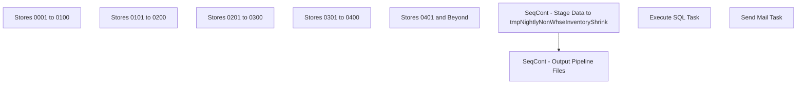

# SSIS Package: WMS_NonWarehouseInventoryShrinkToAptos

**Project:** WMS_NonWarehouseInventoryShrinkToAptos  
**Folder:** WMS  
**Server:** STL-SSIS-P-01  

## Connection Managers

| Name | Type | Server | Catalog | Connection (sanitized) |
|---|---|---|---|---|
| SMTP | SMTP |  |  |  |
| me_01 | OLEDB | BEDROCKDB02 | me_01 | Data Source=BEDROCKDB02; Initial Catalog=me_01; Provider=SQLNCLI11.1; Integrated Security=SSPI; Auto Translate=False |

## Control Flow Tasks

| Task | Type |
|---|---|
| WMS_NonWarehouseInventoryShrinkToAptos | Package |
| SeqCont - Output Pipeline Files | SEQUENCE |
| Stores 0001 to 0100 | ExecuteSQLTask |
| Stores 0101 to 0200 | ExecuteSQLTask |
| Stores 0201 to 0300 | ExecuteSQLTask |
| Stores 0301 to 0400 | ExecuteSQLTask |
| Stores 0401 and Beyond | ExecuteSQLTask |
| SeqCont - Stage Data to tmpNightlyNonWhseInventoryShrink | SEQUENCE |
| Execute SQL Task | ExecuteSQLTask |
| Send Mail Task | SendMailTask |

## Control Flow Outline

```text
- Send Mail Task [SendMailTask]
- SeqCont - Output Pipeline Files [SEQUENCE]
  - Stores 0001 to 0100 [ExecuteSQLTask]
  - Stores 0101 to 0200 [ExecuteSQLTask]
  - Stores 0201 to 0300 [ExecuteSQLTask]
  - Stores 0301 to 0400 [ExecuteSQLTask]
  - Stores 0401 and Beyond [ExecuteSQLTask]
- SeqCont - Stage Data to tmpNightlyNonWhseInventoryShrink [SEQUENCE]
  - Execute SQL Task [ExecuteSQLTask]
```

## Architecture Diagram



## Variables

| Namespace | Name | Expression-bound |
|---|---|---|
| System | Propagate | No |
| User | DateTimeStamp | Yes |
| User | EndDate | Yes |
| User | EndDateAsDATE | Yes |
| User | GetDate | Yes |
| User | GetDateAsDATE | Yes |
| User | StartDate | Yes |
| User | StartDateAsDATE | Yes |

### Expression-bound variable values

#### User::DateTimeStamp

**Expression:**

```sql
(DT_WSTR,4)DATEPART("yyyy",GetDate()) 
+ (DT_WSTR,4)DATEPART("mm",GetDate()) 
+ (DT_WSTR,4)DATEPART("dd",GetDate()) 
+ (DT_WSTR,4)DATEPART("hh",GetDate()) 
+ (DT_WSTR,4)DATEPART("mi",GetDate()) 
+ (DT_WSTR,4)DATEPART("ss",GetDate()) 
+ (DT_WSTR,4)DATEPART("ms",GetDate())
```

**Evaluated value:**

```sql
2023117202626550
```

#### User::EndDate

**Expression:**

```sql
dateadd("dd", @[$Package::DaysToInclude], @[User::StartDate])
```

**Evaluated value:**

```sql
11/7/2023
```

#### User::EndDateAsDATE

**Expression:**

```sql
(DT_WSTR, 4) datepart("year", @[User::EndDate])  + "-" +
right("0"+ (DT_WSTR, 2) datepart("mm", @[User::EndDate]),2)  + "-" +
right("0" +(DT_WSTR, 2) datepart("dd",  @[User::EndDate]),2)
```

**Evaluated value:**

```sql
2023-11-07
```

#### User::GetDate

**Expression:**

```sql
(DT_DATE)DATEDIFF("Day", (DT_DATE) 0, GETDATE())
```

**Evaluated value:**

```sql
11/7/2023
```

#### User::GetDateAsDATE

**Expression:**

```sql
(DT_WSTR, 4) datepart("year", @[User::GetDate])  + "-" +
right("0"+ (DT_WSTR, 2) datepart("mm", @[User::GetDate]),2)  + "-" +
right("0" +(DT_WSTR, 2) datepart("dd",  @[User::GetDate]),2)
```

**Evaluated value:**

```sql
2023-11-07
```

#### User::StartDate

**Expression:**

```sql
dateadd("dd", -@[$Package::DaysToGoBack] , @[User::GetDate] )
```

**Evaluated value:**

```sql
11/6/2023
```

#### User::StartDateAsDATE

**Expression:**

```sql
(DT_WSTR, 4) datepart("year", @[User::StartDate])  + "-" +
right("0"+ (DT_WSTR, 2) datepart("mm", @[User::StartDate]),2)  + "-" +
right("0" +(DT_WSTR, 2) datepart("dd",  @[User::StartDate]),2)
```

**Evaluated value:**

```sql
2023-11-06
```

## Execute SQL Tasks

### Stores 0001 to 0100

**Path:** `Package\SeqCont - Output Pipeline Files\Stores 0001 to 0100`  
**Connection:** me_01 (BEDROCKDB02/me_01)  

```sql
if (select count(*) from tmpNightlyNonWhseInventoryShrink where location_code between 0001 and 0100) > 0 

begin
	declare @query varchar(1000),
			@date varchar(200),
			@file_name varchar(100),
			@file_location varchar(100),
			@server varchar(20),
			@username varchar(20),
			@password varchar(20),
			@database varchar(20),
			@sqlcmd varchar(1000),
			@query_text varchar(4000)

	select @query_text = 'exec spMerchandisingOutputnNonWhseInventoryShrinkBatched 0001, 0100' 
	set @date = convert(varchar, datepart(yyyy, getdate())) + convert(varchar, datepart(mm, getdate())) + convert(varchar, datepart(dd, getdate())) + convert(varchar, datepart(hh, getdate())) + convert(varchar, datepart(mi, getdate())) + convert(varchar, datepart(ss, getdate()))
	set @query = @query_text
	set @file_location = '\\pipeapp01\Company01\Text File to IM Import Tables- Import Shrink Adj\'
	set @file_name = 'STSIMSA.StoreSyncGroup1.' + @date + '.GO'
	set @server = 'bedrockdb02'
	set @database = 'me_01'
	set @sqlcmd = 'sqlcmd -S' + @server + ' -d' + @database + ' -Q' + '"' + @query + '"' + ' -o' + '"' + @file_location + @file_name + '"' + ' -s"," -w100 -W'
	exec master..xp_cmdshell @sqlcmd
end

```

### Stores 0101 to 0200

**Path:** `Package\SeqCont - Output Pipeline Files\Stores 0101 to 0200`  
**Connection:** me_01 (BEDROCKDB02/me_01)  

```sql
if (select count(*) from tmpNightlyNonWhseInventoryShrink where location_code between 0101 and 0200) > 0 

begin
	declare @query varchar(1000),
			@date varchar(200),
			@file_name varchar(100),
			@file_location varchar(100),
			@server varchar(20),
			@username varchar(20),
			@password varchar(20),
			@database varchar(20),
			@sqlcmd varchar(1000),
			@query_text varchar(4000)

	select @query_text = 'exec spMerchandisingOutputnNonWhseInventoryShrinkBatched 0101, 0200' 
	set @date = convert(varchar, datepart(yyyy, getdate())) + convert(varchar, datepart(mm, getdate())) + convert(varchar, datepart(dd, getdate())) + convert(varchar, datepart(hh, getdate())) + convert(varchar, datepart(mi, getdate())) + convert(varchar, datepart(ss, getdate()))
	set @query = @query_text
	set @file_location = '\\pipeapp01\Company01\Text File to IM Import Tables- Import Shrink Adj\'
	set @file_name = 'STSIMSA.StoreSyncGroup2.' + @date + '.GO'
	set @server = 'bedrockdb02'
	set @database = 'me_01'
	set @sqlcmd = 'sqlcmd -S' + @server + ' -d' + @database + ' -Q' + '"' + @query + '"' + ' -o' + '"' + @file_location + @file_name + '"' + ' -s"," -w100 -W'
	exec master..xp_cmdshell @sqlcmd
end
```

### Stores 0201 to 0300

**Path:** `Package\SeqCont - Output Pipeline Files\Stores 0201 to 0300`  
**Connection:** me_01 (BEDROCKDB02/me_01)  

```sql
if (select count(*) from tmpNightlyNonWhseInventoryShrink where location_code between 0201 and 0300) > 0 

begin
	declare @query varchar(1000),
			@date varchar(200),
			@file_name varchar(100),
			@file_location varchar(100),
			@server varchar(20),
			@username varchar(20),
			@password varchar(20),
			@database varchar(20),
			@sqlcmd varchar(1000),
			@query_text varchar(4000)

	select @query_text = 'exec spMerchandisingOutputnNonWhseInventoryShrinkBatched 0201, 0300' 
	set @date = convert(varchar, datepart(yyyy, getdate())) + convert(varchar, datepart(mm, getdate())) + convert(varchar, datepart(dd, getdate())) + convert(varchar, datepart(hh, getdate())) + convert(varchar, datepart(mi, getdate())) + convert(varchar, datepart(ss, getdate()))
	set @query = @query_text
	set @file_location = '\\pipeapp01\Company01\Text File to IM Import Tables- Import Shrink Adj\'
	set @file_name = 'STSIMSA.StoreSyncGroup3.' + @date + '.GO'
	set @server = 'bedrockdb02'
	set @database = 'me_01'
	set @sqlcmd = 'sqlcmd -S' + @server + ' -d' + @database + ' -Q' + '"' + @query + '"' + ' -o' + '"' + @file_location + @file_name + '"' + ' -s"," -w100 -W'
	exec master..xp_cmdshell @sqlcmd
end

```

### Stores 0301 to 0400

**Path:** `Package\SeqCont - Output Pipeline Files\Stores 0301 to 0400`  
**Connection:** me_01 (BEDROCKDB02/me_01)  

```sql
if (select count(*) from tmpNightlyNonWhseInventoryShrink where location_code between 0301 and 0400) > 0 

begin
	declare @query varchar(1000),
			@date varchar(200),
			@file_name varchar(100),
			@file_location varchar(100),
			@server varchar(20),
			@username varchar(20),
			@password varchar(20),
			@database varchar(20),
			@sqlcmd varchar(1000),
			@query_text varchar(4000)

	select @query_text = 'exec spMerchandisingOutputnNonWhseInventoryShrinkBatched 0301, 0400' 
	set @date = convert(varchar, datepart(yyyy, getdate())) + convert(varchar, datepart(mm, getdate())) + convert(varchar, datepart(dd, getdate())) + convert(varchar, datepart(hh, getdate())) + convert(varchar, datepart(mi, getdate())) + convert(varchar, datepart(ss, getdate()))
	set @query = @query_text
	set @file_location = '\\pipeapp01\Company01\Text File to IM Import Tables- Import Shrink Adj\'
	set @file_name = 'STSIMSA.StoreSyncGroup4.' + @date + '.GO'
	set @server = 'bedrockdb02'
	set @database = 'me_01'
	set @sqlcmd = 'sqlcmd -S' + @server + ' -d' + @database + ' -Q' + '"' + @query + '"' + ' -o' + '"' + @file_location + @file_name + '"' + ' -s"," -w100 -W'
	exec master..xp_cmdshell @sqlcmd
end


```

### Stores 0401 and Beyond

**Path:** `Package\SeqCont - Output Pipeline Files\Stores 0401 and Beyond`  
**Connection:** me_01 (BEDROCKDB02/me_01)  

```sql
if (select count(*) from tmpNightlyNonWhseInventoryShrink where location_code between 0401 and 2999) > 0 

begin
	declare @query varchar(1000),
			@date varchar(200),
			@file_name varchar(100),
			@file_location varchar(100),
			@server varchar(20),
			@username varchar(20),
			@password varchar(20),
			@database varchar(20),
			@sqlcmd varchar(1000),
			@query_text varchar(4000)

	select @query_text = 'exec spMerchandisingOutputnNonWhseInventoryShrinkBatched 0401, 2999' 
	set @date = convert(varchar, datepart(yyyy, getdate())) + convert(varchar, datepart(mm, getdate())) + convert(varchar, datepart(dd, getdate())) + convert(varchar, datepart(hh, getdate())) + convert(varchar, datepart(mi, getdate())) + convert(varchar, datepart(ss, getdate()))
	set @query = @query_text
	set @file_location = '\\pipeapp01\Company01\Text File to IM Import Tables- Import Shrink Adj\'
	set @file_name = 'STSIMSA.StoreSyncGroup5.' + @date + '.GO'
	set @server = 'bedrockdb02'
	set @database = 'me_01'
	set @sqlcmd = 'sqlcmd -S' + @server + ' -d' + @database + ' -Q' + '"' + @query + '"' + ' -o' + '"' + @file_location + @file_name + '"' + ' -s"," -w100 -W'
	exec master..xp_cmdshell @sqlcmd
end
```

### Execute SQL Task

**Path:** `Package\SeqCont - Stage Data to tmpNightlyNonWhseInventoryShrink\Execute SQL Task`  
**Connection:** me_01 (BEDROCKDB02/me_01)  

```sql

-- =====================================================================================================
-- Name: spMerchandisingSelectNonWhseInventoryShrink
--
-- Description:	Compares inventory by whse/style in merch versus data provided by warehouses, outputs difference
--
--
-- Revision History
--		Name:			Date:			Comments:
--		Dan Tweedie		2022-07-06		Created proc.	
--		Tim Callahan	2023-08-29		Modified Proc to Change Source for Capture store inventory
--		Tim Callahan	2023-10-04		Modifed store list source to a view rather than hardcoded 
--		Tim Callahan	2023-11-07		Created and referencing a new view on stl-ssis-p-01 to include some locations that do not have the warehousing flags 
--	=====================================================================================================

set nocount on


----------------------------------------------------------------------------------------------------


---capture list of 'active' styles (as opposed to inactive styles)
IF (Object_ID('tempdb..#active') IS NOT NULL) DROP TABLE #active
select s.style_code, s.short_desc, 
case when substring(hg.hierarchy_group_code,7,2)='60' then 'SUP' else 'MERCH' end as style_type,
case when substring(hg.hierarchy_group_code,7,2)='60' 
		then isnull(ecp.custom_property_value,1) 
		else s.distribution_multiple 
	end as DistMult
into #active
from style s (nolock)
join style_group sg (nolock) on s.style_id = sg.style_id
join hierarchy_group hg (nolock) on hg.hierarchy_group_id = sg.hierarchy_group_id
left join entity_custom_property ecp (nolock) on ecp.parent_id = s.style_id
	and	ecp.custom_property_id = 2 -- FRCSTM
	and parent_type = 1
where s.active_flag = 1


--Capture inventory from store
IF (Object_ID('tempdb..#merch') IS NOT NULL) DROP TABLE #merch
select  l.location_code, ---NEED TO USE LOCATION CODE
		s.style_code,
		s.short_desc,
		case when ecp.custom_property_value is not null and substring(hg.hierarchy_group_code,7,2)='60'
		then sum(iit.total_on_hand_units * ecp.custom_property_value)
		else sum(iit.total_on_hand_units)
		end "Units"
into #merch
from ib_inventory_total iit with (nolock)
join location l with (nolock) 
	on iit.location_id=l.location_id 
	and l.location_type=2 --store
inner join	sku sk with (nolock)
	on		iit.sku_id = sk.sku_id
	and		iit.inventory_status_id = 1
inner join	style s with (nolock) on sk.style_id = s.style_id
join style_group sg with (nolock) on s.style_id = sg.style_id
join hierarchy_group hg with (nolock) on hg.hierarchy_group_id = sg.hierarchy_group_id
left join 	entity_custom_property ecp with (nolock)  
	on 		ecp.parent_id = s.style_id
	and 		ecp.custom_property_id = 2 -- FRCSTM
	and		parent_type = 1
where s.active_flag = 1
group by l.location_code, s.style_code,s.short_desc,ecp.custom_property_value,hg.hierarchy_group_code


-------------------------------------------------------------------------------
--ARCHIVE NIGHTLY SNAPSHOT OF MERCH INVENTORY
insert NightlyMerchStoreInventory
select *, getdate() as capture_date
from #merch

-------------------------------------
-------capture whse/webstore inventories (from WM and 3PLs)
truncate table tblNightlyStoreInventory
----------------------------------------

--Capture store inventory, prestaged via SSIS from Dynamics WMS
	--insert tblNightlyStoreInventory
	--select 
	--d.LocationCode, 
	--d.StyleCode, 
	--d.SKUDescription, 
	--d.Qty, 
	--cast(d.LoadDate as datetime) as LoadDate
	--from DynamicsWMSNonWhseInventoryStage d
	--join #active a on a.style_code = d.StyleCode
-- Replaced Above on 8/29/2023
	insert tblNightlyStoreInventory
	select
	d.LocationCode,
	d.StyleCode,
	d.SKUDescription,
	d.Qty,
	getdate () as LoadDate
	from DynamicsWMSNonWhseInventory d
	join #active a on a.style_code = d.StyleCode


---archive whse inventory snapshot
delete
from NightlyNonWhseInventory
where datediff(dd, load_date, getdate()) > 365

insert NightlyNonWhseInventory
select * 
from tblNightlyStoreInventory
---------------------------

-----COMPARE INVENTORY - OUTPUT DIFFERENCE ----NEED TO REWORK THIS
IF (Object_ID('tempdb..#total_summary') IS NOT NULL) DROP TABLE #total_summary
---NEED TO ADD LOCATION CODE
select M.*, W.DynamicsInventory
into #total_summary 
from 
	(
		select M.style_code, M.short_desc, M.style_type, M.distmult, M.location_code,
		sum(M.MerchInventory) MerchInventory
		--new line above, previously the 'sum' was a 'max'
		from 
			(select a.style_code,
				   a.short_desc, 
				   a.style_type,
				   a.distmult,
				   m.location_code,
				   M.units as MerchInventory
			from #active a
			left join #merch M on a.style_code = M.style_code
			) M
		group by M.style_code, M.short_desc, M.style_type, M.distmult, m.location_code
	) M
	join 
	(
		select M.style_code, M.short_desc, M.style_type, M.distmult, M.location_code,
		sum(M.DynamicsInventory) DynamicsInventory
		--new line above, previously the 'sum' was a 'max'
		from 
			(select a.style_code,
				   a.short_desc,
				   a.style_type,
				   a.distmult,
				   M.location_code,
				   M.qty as DynamicsInventory
			from #active a
			left join tblNightlyStoreInventory M on a.style_code = M.style_code
			) M
		group by M.style_code, M.short_desc, M.style_type, M.distmult, M.location_code
	) W 
on M.style_code = W.style_code 
and M.location_code=W.location_code
where M.MerchInventory <> W.DynamicsInventory


----------------------------------------

IF (Object_ID('me_01..tmpNightlyNonWhseInventoryShrink') IS NOT NULL) DROP TABLE tmpNightlyNonWhseInventoryShrink
----NEED TO REWORK, USE LOCATION CODE
select --top 100 
	   ts.location_code,
	   ts.style_code,
	   ts.short_desc,
	   ts.MerchInventory as MerchQty,
	   ts.DynamicsInventory as DynQty,
	   ts.MerchInventory-ts.DynamicsInventory shrinkqty,
	   ts.style_type,
	   ts.MerchInventory-ts.DynamicsInventory shrinkqty_distribution_multiple
into tmpNightlyNonWhseInventoryShrink
from #total_summary ts
where ts.MerchInventory-ts.DynamicsInventory <> 0
AND ts.style_type <> 'SUP' -- LT Added 02/16 per Dawn G.'s request to exclude 1013 supplies from sync
--and ts.location_code in (select distinct LocationCode from [stl-ssis-p-01].IntegrationStaging.[ERP].[vwWarehouseIDToLocationCodeRetailInventory] where LocationCode not in ('0013','2013'))
and ts.location_code in (select distinct LocationCode from [stl-ssis-p-01].IntegrationStaging.[ERP].[vwWarehouseIDToLocationCodeRetailInventory_InventorySync] where LocationCode not in ('0013','2013')) -- Replaced above on 11/7/2023


-- Replaced Location List with Query Above on 10/4/2023
--('0001','0002','0102','0105','0119','0130','0167','0174','0177',
--'0183','0204','0205','0212','0215','0221','0278','0286','0358',
--'0404','0415','0439','0521','0534','0540','2001','2010','2020',
--'2022','2023','2024','2026','2028','2029','2045','2047','2048',
--'2051','2062','2063','2069','2081','2082',
--'0003','0004','0012','0016','0020','0021','0030','0037','0038',
--'0043','0053','0056','0062','0063','0065','0068','0076','0084',
--'0085','0087','0093','0098','0101','0103','0109','0113','0122',
--'0126','0129','0131','0133','0134','0137','0138','0139','0144',
--'0149','0156','0157','0166','0185','0186','0190','0194','0195',
--'0196','0202','0203','0208','0214','0224','0239','0251','0267',
--'0277','0281','0313','0316','0321','0423','0425','0448','0535',
--'0536','0603','0614',
--'0006','0010','0011','0014','0018','0022','0029','0031','0032','0036','0040','0041','0045','0046','0049','0051','0055','0059','0066',
--'0071','0072','0078','0082','0083','0086','0089','0090','0091','0092','0094','0096','0099','0106','0108','0110','0116','0117','0118',
--'0123','0125','0128','0132','0141','0145','0148','0152','0158','0160','0161','0164','0168','0169','0171','0175','0178','0181','0191',
--'0192','0193','0198','0199','0201','0206','0207','0210','0213','0220','0222','0223','0226','0234','0236','0237','0244','0247','0248',
--'0254','0256','0257','0260','0268','0271','0273','0275','0287','0290','0291','0297','0298','0299','0300','0307','0308','0309','0310',
--'0315','0317','0318','0319','0324','0326','0328','0329','0330','0331','0335','0337','0345','0349','0350','0393','0397','0398','0421',
--'0422','0424','0446','0447','0449','0453','0454','0457','0458','0468','0520','0537','0541','0542','0543','0549','0551','0607','0613',
--'0621','2003','2006','2016','2017','2018','2033','2034','2035','2036','2037','2042','2043','2052','2054','2058','2077','2078'
--)--Only includes pilot stores


--archive nightly discrepancies
insert NightlyNonWhseInventoryShrink 
select *, getdate()
from tmpNightlyNonWhseInventoryShrink

--------------------

--------generate outbound email ----not using --- if we need to use, then we need a new proc for stores
--exec spMerchandisingEmailNightlySyncReport

---to ensure we don't try to post invalid qty's -- this step is after the email so the qty's will still be reported
if (select count(*) from tmpNightlyNonWhseInventoryShrink where shrinkqty_distribution_multiple like '%.%' or shrinkqty_distribution_multiple = 0) > 0 
begin
delete from tmpNightlyNonWhseInventoryShrink where shrinkqty_distribution_multiple like '%.%' or shrinkqty_distribution_multiple = 0
end


-------generate nightly shrink file
--if (select count(*) from tmpNightlyNonWhseInventoryShrink) > 0 

--begin
--	declare @query varchar(1000),
--			@date varchar(200),
--			@file_name varchar(100),
--			@file_location varchar(100),
--			@server varchar(20),
--			@username varchar(20),
--			@password varchar(20),
--			@database varchar(20),
--			@sqlcmd varchar(1000),
--			@query_text varchar(4000)

--	select @query_text = 'exec spMerchandisingOutputnNonWhseInventoryShrink' 
--	set @date = convert(varchar, datepart(yyyy, getdate())) + convert(varchar, datepart(mm, getdate())) + convert(varchar, datepart(dd, getdate())) + convert(varchar, datepart(hh, getdate())) + convert(varchar, datepart(mi, getdate())) + convert(varchar, datepart(ss, getdate()))
--	set @query = @query_text
--	set @file_location = '\\pipeapp01\Company01\Text File to IM Import Tables- Import Shrink Adj\'
--	set @file_name = 'STSIMSA.StoreSync.' + @date + '.GO'
--	set @server = 'bedrockdb02'
--	set @database = 'me_01'
--	set @sqlcmd = 'sqlcmd -S' + @server + ' -d' + @database + ' -Q' + '"' + @query + '"' + ' -o' + '"' + @file_location + @file_name + '"' + ' -s"," -w100 -W'
--	exec master..xp_cmdshell @sqlcmd
--end

----------execute the pipeline segments
--EXEC pipeapp01.master..xp_cmdshell 'PipelineScheduleClient Start 16506 0'

--EXEC pipeapp01.master..xp_cmdshell 'PipelineScheduleClient Start 19000 0'
-----------------------------------------------------------------------------------


-----check for error, send alert 
----Pipeline Errors -- if there is an error during the posting to the production tables, it is written in the error table
--if (select count(*)
--	from imp_shrink_adj isa (nolock)
--	join imp_shrink_adj_sku isas (nolock) on isa.imp_shrink_adj_id = isas.imp_shrink_adj_id
--	join upc (nolock) on upc.upc_number = isas.upc_number
--	join sku (nolock) on sku.sku_id = upc.sku_id
--	join style s (nolock) on s.style_id = sku.style_id
--	join im_import_repl_queue iirq (nolock) on iirq.entity_id = isa.imp_shrink_adj_id and iirq.entity_code = 1
--	join pipeapp01.PipelineRepository.dbo.error_queue eq on iirq.im_import_repl_queue_id = eq.sequence_id 
--	where iirq.entity_id in (select substring(entity_key,1,CHARINDEX('~', substring(entity_key,1,30),1)-1)
--								from pipeapp01.PipelineRepository.dbo.error_queue
--								where segment_id = 19000 and entity_code = 1)
--	---and datediff(hh, iirq.action_date, getdate()) <= 24
--	and isa.grouping_label = 'Nightly Sync') > 0 
	
--begin
--	exec msdb.dbo.sp_send_dbmail
--	@profile_name = 'MerchAdmin',
--	@recipients = 'EntSysSupport@buildabear.com',
--	@body = 'Nightly Sync Error. Check Pipeline 19000 Error Queue for Details',
--	@subject = 'Nightly Sync Error'
--end


```

## Data Flow: Sources

_None detected._

## Data Flow: Destinations

_None detected._
