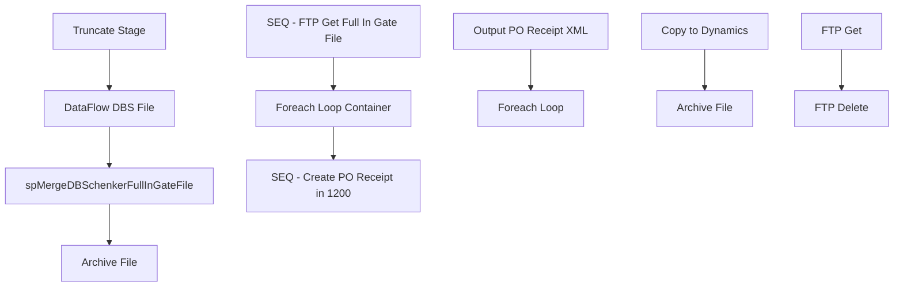

# SSIS Package: WMS_POReceipt1200FromDBSchenker

**Project:** WMS_POReceipt1200FromDBSchenker  
**Folder:** WMS  
**Server:** STL-SSIS-P-01  

## Connection Managers

| Name | Type | Server | Catalog | Connection (sanitized) |
|---|---|---|---|---|
| DBS_CSV | FLATFILE |  |  |  |
| DBSchenkerFTP | FTP |  |  |  |
| DBSchenker_FullInGate | FILE |  |  |  |
| IntegrationStaging | OLEDB | STL-SSIS-p-01 | IntegrationStaging | Data Source=STL-SSIS-p-01; Initial Catalog=IntegrationStaging; Provider=SQLNCLI11.1; Integrated Security=SSPI; Auto Translate=False |
| SMTP | SMTP |  |  |  |

## Control Flow Tasks

| Task | Type |
|---|---|
| WMS_POReceipt1200FromDBSchenker | Package |
| Foreach Loop Container | FOREACHLOOP |
| Archive File | FileSystemTask |
| DataFlow DBS File | Pipeline |
| spMergeDBSchenkerFullInGateFile | ExecuteSQLTask |
| Truncate Stage | ExecuteSQLTask |
| SEQ - Create PO Receipt in 1200 | SEQUENCE |
| Foreach Loop | FOREACHLOOP |
| Archive File | FileSystemTask |
| Copy to Dynamics | FileSystemTask |
| Output PO Receipt XML | ExecuteSQLTask |
| SEQ - FTP Get Full In Gate File | SEQUENCE |
| FTP Delete | FtpTask |
| FTP Get | FtpTask |

## Control Flow Outline

```text
- Foreach Loop Container [FOREACHLOOP]
  - Archive File [FileSystemTask]
  - DataFlow DBS File [Pipeline]
  - Truncate Stage [ExecuteSQLTask]
  - spMergeDBSchenkerFullInGateFile [ExecuteSQLTask]
- SEQ - Create PO Receipt in 1200 [SEQUENCE]
  - Foreach Loop [FOREACHLOOP]
    - Archive File [FileSystemTask]
    - Copy to Dynamics [FileSystemTask]
  - Output PO Receipt XML [ExecuteSQLTask]
- SEQ - FTP Get Full In Gate File [SEQUENCE]
  - FTP Delete [FtpTask]
  - FTP Get [FtpTask]
```

## Architecture Diagram



## Variables

| Namespace | Name | Expression-bound |
|---|---|---|
| User | DateTimeStamp | Yes |
| User | DynamicsReceiptFileInLoop | No |
| User | EndDate | Yes |
| User | EndDateAsDATE | Yes |
| User | FullInGateArchiveFile | Yes |
| User | FullInGateFile | No |
| User | GetDate | Yes |
| User | GetDateAsDATE | Yes |
| User | POReceiptArchiveFileName | Yes |
| User | StartDate | Yes |
| User | StartDateAsDATE | Yes |

### Expression-bound variable values

#### User::DateTimeStamp

**Expression:**

```sql
(DT_WSTR,4)DATEPART("yyyy",GetDate()) 
+ (DT_WSTR,4)DATEPART("mm",GetDate()) 
+ (DT_WSTR,4)DATEPART("dd",GetDate()) 
+ (DT_WSTR,4)DATEPART("hh",GetDate()) 
+ (DT_WSTR,4)DATEPART("mi",GetDate()) 
+ (DT_WSTR,4)DATEPART("ss",GetDate()) 
+ (DT_WSTR,4)DATEPART("ms",GetDate())
```

**Evaluated value:**

```sql
202041610524700
```

#### User::EndDate

**Expression:**

```sql
dateadd("dd", @[$Package::DaysToInclude], @[User::StartDate])
```

**Evaluated value:**

```sql
4/16/2020
```

#### User::EndDateAsDATE

**Expression:**

```sql
(DT_WSTR, 4) datepart("year", @[User::EndDate])  + "-" + 
(DT_WSTR, 2) datepart("mm", @[User::EndDate])  + "-" + 
(DT_WSTR, 2) datepart("dd",  @[User::EndDate])
```

**Evaluated value:**

```sql
2020-4-16
```

#### User::FullInGateArchiveFile

**Expression:**

```sql
@[$Package::FullInGateFileStageFolder] + "Archive\\FullInGate." +  @[User::DateTimeStamp] + ".csv"
```

**Evaluated value:**

```sql
\\stl-ssis-p-01\IntegrationStaging\Dynamics\DBSchenker_FullInGate\Archive\FullInGate.202041610524700.csv
```

#### User::GetDate

**Expression:**

```sql
(DT_DATE)DATEDIFF("Day", (DT_DATE) 0, GETDATE())
```

**Evaluated value:**

```sql
4/16/2020
```

#### User::GetDateAsDATE

**Expression:**

```sql
(DT_WSTR, 4) datepart("year", @[User::GetDate])  + "-" + 
(DT_WSTR, 2) datepart("mm", @[User::GetDate])  + "-" + 
(DT_WSTR, 2) datepart("dd",  @[User::GetDate])
```

**Evaluated value:**

```sql
2020-4-16
```

#### User::POReceiptArchiveFileName

**Expression:**

```sql
@[$Package::DynamicsPOReceipt1200FileLocationPreStage] + "Archive\\POReceipt" +  @[User::DateTimeStamp] + ".xml"
```

**Evaluated value:**

```sql
\\stl-ssis-p-01\IntegrationStaging\Dynamics\DBSchenker_FullInGate\POReceiptToDynamics\Archive\POReceipt202041610524700.xml
```

#### User::StartDate

**Expression:**

```sql
dateadd("dd", -@[$Package::DaysToGoBack] , @[User::GetDate] )
```

**Evaluated value:**

```sql
4/15/2020
```

#### User::StartDateAsDATE

**Expression:**

```sql
(DT_WSTR, 4) datepart("year", @[User::StartDate])  + "-" + 
(DT_WSTR, 2) datepart("mm", @[User::StartDate])  + "-" + 
(DT_WSTR, 2) datepart("dd",  @[User::StartDate])
```

**Evaluated value:**

```sql
2020-4-15
```

## Execute SQL Tasks

### Truncate Stage

**Path:** `Package\Foreach Loop Container\Truncate Stage`  
**Connection:** IntegrationStaging (STL-SSIS-p-01/IntegrationStaging)  

```sql
TRUNCATE TABLE WMS.DBSchenkerFullInGateFileStage
```

### spMergeDBSchenkerFullInGateFile

**Path:** `Package\Foreach Loop Container\spMergeDBSchenkerFullInGateFile`  
**Connection:** IntegrationStaging (STL-SSIS-p-01/IntegrationStaging)  

```sql
exec WMS.spMergeDBSchenkerFullInGateFile
```

### Output PO Receipt XML

**Path:** `Package\SEQ - Create PO Receipt in 1200\Output PO Receipt XML`  
**Connection:** IntegrationStaging (STL-SSIS-p-01/IntegrationStaging)  

> ⚠️ `SqlStatementSource` is overridden at runtime by a property expression (shown below); the static SQL may not be what executes.

**Static SqlStatementSource:**

```sql
exec WMS.spOutputPurchaseOrderReceiptDBStoDynamics1200XML '\\stl-ssis-p-01\IntegrationStaging\Dynamics\DBSchenker_FullInGate\POReceiptToDynamics\'
```

**Property expression (runtime override):**

```sql
"exec WMS.spOutputPurchaseOrderReceiptDBStoDynamics1200XML '" +   @[$Package::DynamicsPOReceipt1200FileLocationPreStage] + "'"
```

## Data Flow: Sources

| Component | Source Object | Type | Data Flow Task | Connection | SQL Kind |
|---|---|---|---|---|---|
| DBS File |  | FlatFileSource | DataFlow DBS File | DBS_CSV |  |

## Data Flow: Destinations

| Component | Target Table | Type | Data Flow Task | Connection | SQL Kind |
|---|---|---|---|---|---|
| DBSchenkerFullInGateFileStage |  | OLEDBDestination | DataFlow DBS File | IntegrationStaging |  |
