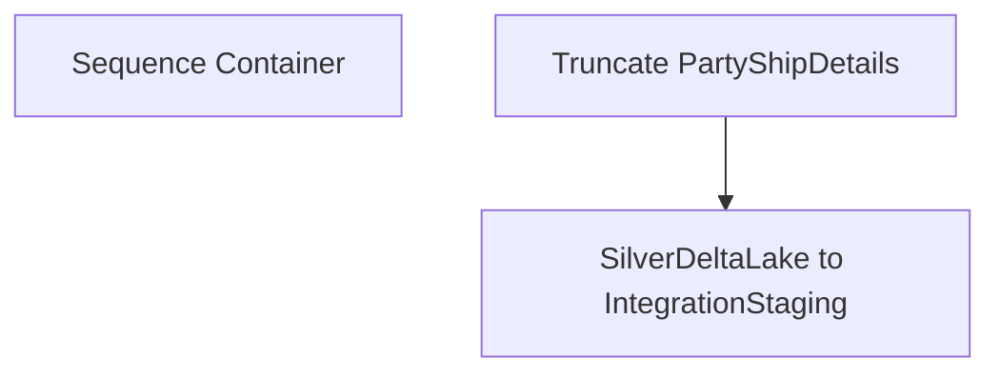

# SSIS Package: WMS_PartyWebOrdersShippedDetailExtract

**Project:** WMS_PartyWebOrdersShippedDetailExtract  
**Folder:** WMS  
**Server:** STL-SSIS-P-01  

## Connection Managers

| Name | Type | Server | Catalog | Connection (sanitized) |
|---|---|---|---|---|
| IntegrationStaging | OLEDB | STL-SSIS-P-01 | IntegrationStaging | Data Source=STL-SSIS-P-01; Initial Catalog=IntegrationStaging; Provider=SQLNCLI11.1; Integrated Security=SSPI; Auto Translate=False |
| silverdeltalake | OLEDB | azsynapsewkstt3osb-ondemand.sql.azuresynapse.net | silverdeltalake | Data Source=azsynapsewkstt3osb-ondemand.sql.azuresynapse.net; Initial Catalog=silverdeltalake; Provider=SQLNCLI11.1; Auto Translate=False |

## Control Flow Tasks

| Task | Type |
|---|---|
| WMS_PartyWebOrdersShippedDetailExtract | Package |
| Sequence Container | SEQUENCE |
| SilverDeltaLake to IntegrationStaging | Pipeline |
| Truncate PartyShipDetails | ExecuteSQLTask |

## Control Flow Outline

```text
- Sequence Container [SEQUENCE]
  - SilverDeltaLake to IntegrationStaging [Pipeline]
  - Truncate PartyShipDetails [ExecuteSQLTask]
```

## Architecture Diagram



## Variables

_None detected._

## Execute SQL Tasks

### Truncate PartyShipDetails

**Path:** `Package\Sequence Container\Truncate PartyShipDetails`  
**Connection:** IntegrationStaging (STL-SSIS-P-01/IntegrationStaging)  

```sql
TRUNCATE TABLE WMS.PartyShipDetails
```

## Data Flow: Sources

| Component | Source Object | Type | Data Flow Task | Connection | SQL Kind |
|---|---|---|---|---|---|
| SilverDeltaLake |  | OLEDBSource | SilverDeltaLake to IntegrationStaging | silverdeltalake | SqlCommand |

#### SilverDeltaLake — SqlCommand

```sql
SELECT 
	st.BABAptosShipmentNum PartyID
	, st.BABStoreNumber Store
	, ll.ItemId Style
	, CAST(SUM(ll.Qty) AS int) Qty
	, CONVERT(datetime,st.ShipConfirmUTCDateTime AT TIME ZONE 'UTC' AT TIME ZONE 'Central Standard Time') ShipDate
	, CONCAT(st.CarrierCode,' ', st.CarrierServiceCode) ShipMethod
	, TRIM(c.MasterTrackingNum) Tracking
	, ll.OrderNum TransferNumber
  FROM dynamics_WHSShipmentTable st
	JOIN dbo.dynamics_WHSLoadLine ll ON st.ShipmentId = ll.ShipmentId AND st.LoadId = ll.LoadId AND st.DataAreaId = ll.DataAreaId	
	JOIN dbo.dynamics_WHSContainerTable c ON st.ShipmentId = c.shipmentID AND st.dataareaid = c.DataAreaId
  WHERE 1=1
	AND st.DataAreaId = '1100'
	AND st.InventLocationId = '1013'
	AND st.OrderNum LIKE 'TO%'
	AND LEN(st.BABAptosShipmentNum) = 7
	AND st.ShipmentStatus = 5
	AND CAST(CONVERT(datetime,st.ShipConfirmUTCDateTime AT TIME ZONE 'UTC' AT TIME ZONE 'Central Standard Time') AS date) = CAST(DATEADD(day,-1,getdate()) AS date)
	AND c.CloseContainerProfileId = '1013Web'
  GROUP BY st.BABAptosShipmentNum
	, st.BABStoreNumber
	, ll.ItemId
	, CONVERT(datetime,st.ShipConfirmUTCDateTime AT TIME ZONE 'UTC' AT TIME ZONE 'Central Standard Time')
	, CONCAT(st.CarrierCode,' ', st.CarrierServiceCode)
	, c.MasterTrackingNum 
	, ll.OrderNum
 ORDER BY st.BABStoreNumber
 ,st.BABAptosShipmentNum
	, ll.ItemId
```

## Data Flow: Destinations

| Component | Target Table | Type | Data Flow Task | Connection | SQL Kind |
|---|---|---|---|---|---|
| PartyShipDetails |  | OLEDBDestination | SilverDeltaLake to IntegrationStaging | IntegrationStaging |  |
