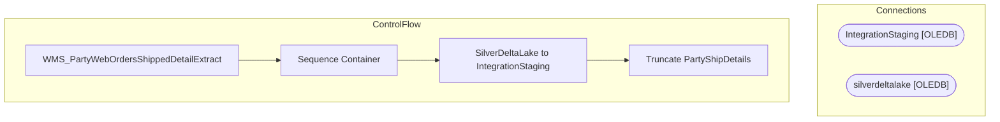

# SSIS Package: WMS_PartyWebOrdersShippedDetailExtract

**Project:** WMS_PartyWebOrdersShippedDetailExtract  
**Folder:** WMS  
**Server:** STL-SSIS-P-01  

## Architecture Diagram

## Connection Managers

| Name | Type |
|---|---|
| IntegrationStaging | OLEDB |
| silverdeltalake | OLEDB |

## Control Flow Tasks

| Task | Type |
|---|---|
| WMS_PartyWebOrdersShippedDetailExtract | Microsoft.Package |
| Sequence Container | STOCK:SEQUENCE |
| SilverDeltaLake to IntegrationStaging | Microsoft.Pipeline |
| Truncate PartyShipDetails | Microsoft.ExecuteSQLTask |

## Data Flow: Sources

| Component | SQL Preview |
|---|---|
|  | SELECT  	st.BABAptosShipmentNum PartyID 	, st.BABStoreNumber Store 	, ll.ItemId Style 	, CAST(SUM(ll.Qty) AS int) Qty 	, CONVERT(datetime,st.ShipConfirmUTCDateTime AT TIME ZONE 'UTC' AT TIME ZONE 'Central Standard Time') ShipDate 	, CONCAT(st.CarrierCode,' ', st.CarrierServiceCode) ShipMethod 	, TRIM(c.MasterTrackingNum) Tracking 	, ll.OrderNum TransferNumber   FROM dynamics_WHSShipmentTable st 	J |

## Data Flow: Destinations

| Component | Destination |
|---|---|
|  | [WMS].[PartyShipDetails] |

