# SSIS Package: WMS_ProductDataExtract

**Project:** WMS_ProductDataExtract  
**Folder:** WMS  
**Server:** STL-SSIS-P-01  

## Architecture Diagram

```mermaid
flowchart TD
    subgraph Connections
        Dynamics_AX_Connection_Manager_1_conn(["Dynamics AX Connection Manager 1 [DynamicsAX]"])
        IntegrationStaging_conn(["IntegrationStaging [OLEDB]"])
        SMTP_conn(["SMTP [SMTP]"])
    end
    subgraph ControlFlow
        WMS_ProductDataExtract_task["WMS_ProductDataExtract"]
        SEQ___Product_Extracts_task["SEQ - Product Extracts"]
        WMS_ProductDataExtract_task --> SEQ___Product_Extracts_task
        SEQ___ItemMaster_task["SEQ - ItemMaster"]
        SEQ___Product_Extracts_task --> SEQ___ItemMaster_task
        ItemMaster_task["ItemMaster"]
        SEQ___ItemMaster_task --> ItemMaster_task
        Merge_ItemMaster_task["Merge ItemMaster"]
        ItemMaster_task --> Merge_ItemMaster_task
        Truncate_Stage_task["Truncate Stage"]
        Merge_ItemMaster_task --> Truncate_Stage_task
        SEQ___ItemMasterProducts_task["SEQ - ItemMasterProducts"]
        Truncate_Stage_task --> SEQ___ItemMasterProducts_task
        Merge_ItemMasterProducts_task["Merge ItemMasterProducts"]
        SEQ___ItemMasterProducts_task --> Merge_ItemMasterProducts_task
        Products_task["Products"]
        Merge_ItemMasterProducts_task --> Products_task
        Truncate_Stage_task["Truncate Stage"]
        Products_task --> Truncate_Stage_task
        SEQ___ItemsUOM_task["SEQ - ItemsUOM"]
        Truncate_Stage_task --> SEQ___ItemsUOM_task
        ItemsUOM_task["ItemsUOM"]
        SEQ___ItemsUOM_task --> ItemsUOM_task
        Merge_ItemsUOM_task["Merge ItemsUOM"]
        ItemsUOM_task --> Merge_ItemsUOM_task
        Truncate_Stage_task["Truncate Stage"]
        Merge_ItemsUOM_task --> Truncate_Stage_task
        SEQ___Product_Xtra_Extracts_task["SEQ - Product Xtra Extracts"]
        Truncate_Stage_task --> SEQ___Product_Xtra_Extracts_task
        SEQ___ItemMaster_task["SEQ - ItemMaster"]
        SEQ___Product_Xtra_Extracts_task --> SEQ___ItemMaster_task
        ItemMaster_task["ItemMaster"]
        SEQ___ItemMaster_task --> ItemMaster_task
        Merge_ItemMaster_task["Merge ItemMaster"]
        ItemMaster_task --> Merge_ItemMaster_task
        Truncate_Stage_task["Truncate Stage"]
        Merge_ItemMaster_task --> Truncate_Stage_task
        SEQ___ItemMasterProducts_task["SEQ - ItemMasterProducts"]
        Truncate_Stage_task --> SEQ___ItemMasterProducts_task
        Merge_ItemMasterProducts_task["Merge ItemMasterProducts"]
        SEQ___ItemMasterProducts_task --> Merge_ItemMasterProducts_task
        Products_task["Products"]
        Merge_ItemMasterProducts_task --> Products_task
        Truncate_Stage_task["Truncate Stage"]
        Products_task --> Truncate_Stage_task
        SEQ___ItemsUOM_task["SEQ - ItemsUOM"]
        Truncate_Stage_task --> SEQ___ItemsUOM_task
        ItemsUOM_task["ItemsUOM"]
        SEQ___ItemsUOM_task --> ItemsUOM_task
        Merge_ItemsUOM_task["Merge ItemsUOM"]
        ItemsUOM_task --> Merge_ItemsUOM_task
        Truncate_Stage_task["Truncate Stage"]
        Merge_ItemsUOM_task --> Truncate_Stage_task
        SeqCont___ReleasedProductsV2_task["SeqCont - ReleasedProductsV2"]
        Truncate_Stage_task --> SeqCont___ReleasedProductsV2_task
        Data_Flow_Task_task["Data Flow Task"]
        SeqCont___ReleasedProductsV2_task --> Data_Flow_Task_task
        Merge___spMergeReleasedProducts_task["Merge - spMergeReleasedProducts"]
        Data_Flow_Task_task --> Merge___spMergeReleasedProducts_task
        Truncate_Stage_task["Truncate Stage"]
        Merge___spMergeReleasedProducts_task --> Truncate_Stage_task
        Send_Mail_Task_task["Send Mail Task"]
        Truncate_Stage_task --> Send_Mail_Task_task
    end
```

## Connection Managers

| Name | Type |
|---|---|
| Dynamics AX Connection Manager 1 | DynamicsAX |
| IntegrationStaging | OLEDB |
| SMTP | SMTP |

## Control Flow Tasks

| Task | Type |
|---|---|
| WMS_ProductDataExtract | Microsoft.Package |
| SEQ - Product Extracts | STOCK:SEQUENCE |
| SEQ - ItemMaster | STOCK:SEQUENCE |
| ItemMaster | Microsoft.Pipeline |
| Merge ItemMaster | Microsoft.ExecuteSQLTask |
| Truncate Stage | Microsoft.ExecuteSQLTask |
| SEQ - ItemMasterProducts | STOCK:SEQUENCE |
| Merge ItemMasterProducts | Microsoft.ExecuteSQLTask |
| Products | Microsoft.Pipeline |
| Truncate Stage | Microsoft.ExecuteSQLTask |
| SEQ - ItemsUOM | STOCK:SEQUENCE |
| ItemsUOM | Microsoft.Pipeline |
| Merge ItemsUOM | Microsoft.ExecuteSQLTask |
| Truncate Stage | Microsoft.ExecuteSQLTask |
| SEQ - Product Xtra Extracts | STOCK:SEQUENCE |
| SEQ - ItemMaster | STOCK:SEQUENCE |
| ItemMaster | Microsoft.Pipeline |
| Merge ItemMaster | Microsoft.ExecuteSQLTask |
| Truncate Stage | Microsoft.ExecuteSQLTask |
| SEQ - ItemMasterProducts | STOCK:SEQUENCE |
| Merge ItemMasterProducts | Microsoft.ExecuteSQLTask |
| Products | Microsoft.Pipeline |
| Truncate Stage | Microsoft.ExecuteSQLTask |
| SEQ - ItemsUOM | STOCK:SEQUENCE |
| ItemsUOM | Microsoft.Pipeline |
| Merge ItemsUOM | Microsoft.ExecuteSQLTask |
| Truncate Stage | Microsoft.ExecuteSQLTask |
| SeqCont - ReleasedProductsV2 | STOCK:SEQUENCE |
| Data Flow Task | Microsoft.Pipeline |
| Merge - spMergeReleasedProducts | Microsoft.ExecuteSQLTask |
| Truncate Stage | Microsoft.ExecuteSQLTask |
| Send Mail Task | Microsoft.SendMailTask |

## Data Flow: Sources

_None detected._

## Data Flow: Destinations

| Component | Destination |
|---|---|
|  | [WMS].[ItemMasterStage] |
|  | [WMS].[ItemMasterStage] |
|  | [WMS].[ItemMasterStage] |
|  | [WMS].[ItemMasterStage] |
|  | [WMS].[ItemMasterStage] |
|  | [WMS].[ItemMasterStage] |
|  | [WMS].[ItemMasterProductsStage] |
|  | [WMS].[ItemsUOMStage] |
|  | [WMS].[ItemMasterXtraStage] |
|  | [WMS].[ItemMasterXtraStage] |
|  | [WMS].[ItemMasterXtraStage] |
|  | [WMS].[ItemMasterXtraStage] |
|  | [WMS].[ItemMasterXtraStage] |
|  | [WMS].[ItemMasterXtraStage] |
|  | [WMS].[ItemMasterProductsXtraStage] |
|  | [WMS].[ItemsUOMXtraStage] |
|  | [WMS].[ReleasedProductsStage] |

