# SSIS Package: WMS_ProductDataExtract

**Project:** WMS_ProductDataExtract  
**Folder:** WMS  
**Server:** STL-SSIS-P-01  

## Connection Managers

| Name | Type | Server | Catalog | Connection (sanitized) |
|---|---|---|---|---|
| Dynamics AX Connection Manager 1 | DynamicsAX |  |  |  |
| IntegrationStaging | OLEDB | stl-ssis-t-01 | IntegrationStaging | Data Source=stl-ssis-t-01; Initial Catalog=IntegrationStaging; Provider=SQLNCLI11.1; Integrated Security=SSPI; Auto Translate=False |
| SMTP | SMTP |  |  |  |

## Control Flow Tasks

| Task | Type |
|---|---|
| WMS_ProductDataExtract | Package |
| SEQ - Product Extracts | SEQUENCE |
| SEQ - ItemMaster | SEQUENCE |
| ItemMaster | Pipeline |
| Merge ItemMaster | ExecuteSQLTask |
| Truncate Stage | ExecuteSQLTask |
| SEQ - ItemMasterProducts | SEQUENCE |
| Merge ItemMasterProducts | ExecuteSQLTask |
| Products | Pipeline |
| Truncate Stage | ExecuteSQLTask |
| SEQ - ItemsUOM | SEQUENCE |
| ItemsUOM | Pipeline |
| Merge ItemsUOM | ExecuteSQLTask |
| Truncate Stage | ExecuteSQLTask |
| SEQ - Product Xtra Extracts | SEQUENCE |
| SEQ - ItemMaster | SEQUENCE |
| ItemMaster | Pipeline |
| Merge ItemMaster | ExecuteSQLTask |
| Truncate Stage | ExecuteSQLTask |
| SEQ - ItemMasterProducts | SEQUENCE |
| Merge ItemMasterProducts | ExecuteSQLTask |
| Products | Pipeline |
| Truncate Stage | ExecuteSQLTask |
| SEQ - ItemsUOM | SEQUENCE |
| ItemsUOM | Pipeline |
| Merge ItemsUOM | ExecuteSQLTask |
| Truncate Stage | ExecuteSQLTask |
| SeqCont - ReleasedProductsV2 | SEQUENCE |
| Data Flow Task | Pipeline |
| Merge - spMergeReleasedProducts | ExecuteSQLTask |
| Truncate Stage | ExecuteSQLTask |
| Send Mail Task | SendMailTask |

## Control Flow Outline

```text
- Send Mail Task [SendMailTask]
- SEQ - Product Extracts [SEQUENCE]
  - SEQ - ItemMaster [SEQUENCE]
  - SEQ - ItemMasterProducts [SEQUENCE]
    - Merge ItemMasterProducts [ExecuteSQLTask]
    - Products [Pipeline]
    - Truncate Stage [ExecuteSQLTask]
    - ItemMaster [Pipeline]
    - Merge ItemMaster [ExecuteSQLTask]
    - Truncate Stage [ExecuteSQLTask]
  - SEQ - ItemsUOM [SEQUENCE]
    - ItemsUOM [Pipeline]
    - Merge ItemsUOM [ExecuteSQLTask]
    - Truncate Stage [ExecuteSQLTask]
- SEQ - Product Xtra Extracts [SEQUENCE]
  - SEQ - ItemMaster [SEQUENCE]
  - SEQ - ItemMasterProducts [SEQUENCE]
    - Merge ItemMasterProducts [ExecuteSQLTask]
    - Products [Pipeline]
    - Truncate Stage [ExecuteSQLTask]
    - ItemMaster [Pipeline]
    - Merge ItemMaster [ExecuteSQLTask]
    - Truncate Stage [ExecuteSQLTask]
  - SEQ - ItemsUOM [SEQUENCE]
    - ItemsUOM [Pipeline]
    - Merge ItemsUOM [ExecuteSQLTask]
    - Truncate Stage [ExecuteSQLTask]
- SeqCont - ReleasedProductsV2 [SEQUENCE]
  - Data Flow Task [Pipeline]
  - Merge - spMergeReleasedProducts [ExecuteSQLTask]
  - Truncate Stage [ExecuteSQLTask]
```

## Architecture Diagram

```mermaid
flowchart TD
    n_Package_SEQ___Product_Extracts["SEQ - Product Extracts"]
    n_Package_SEQ___Product_Extracts_SEQ___ItemMaster["SEQ - ItemMaster"]
    n_Package_SEQ___Product_Extracts_SEQ___ItemMaster_ItemMaster["ItemMaster"]
    n_Package_SEQ___Product_Extracts_SEQ___ItemMaster_Merge_ItemMaster["Merge ItemMaster"]
    n_Package_SEQ___Product_Extracts_SEQ___ItemMaster_Truncate_Stage["Truncate Stage"]
    n_Package_SEQ___Product_Extracts_SEQ___ItemMasterProducts["SEQ - ItemMasterProducts"]
    n_Package_SEQ___Product_Extracts_SEQ___ItemMasterProducts_Merge_ItemMasterProducts["Merge ItemMasterProducts"]
    n_Package_SEQ___Product_Extracts_SEQ___ItemMasterProducts_Products["Products"]
    n_Package_SEQ___Product_Extracts_SEQ___ItemMasterProducts_Truncate_Stage["Truncate Stage"]
    n_Package_SEQ___Product_Extracts_SEQ___ItemsUOM["SEQ - ItemsUOM"]
    n_Package_SEQ___Product_Extracts_SEQ___ItemsUOM_ItemsUOM["ItemsUOM"]
    n_Package_SEQ___Product_Extracts_SEQ___ItemsUOM_Merge_ItemsUOM["Merge ItemsUOM"]
    n_Package_SEQ___Product_Extracts_SEQ___ItemsUOM_Truncate_Stage["Truncate Stage"]
    n_Package_SEQ___Product_Xtra_Extracts["SEQ - Product Xtra Extracts"]
    n_Package_SEQ___Product_Xtra_Extracts_SEQ___ItemMaster["SEQ - ItemMaster"]
    n_Package_SEQ___Product_Xtra_Extracts_SEQ___ItemMaster_ItemMaster["ItemMaster"]
    n_Package_SEQ___Product_Xtra_Extracts_SEQ___ItemMaster_Merge_ItemMaster["Merge ItemMaster"]
    n_Package_SEQ___Product_Xtra_Extracts_SEQ___ItemMaster_Truncate_Stage["Truncate Stage"]
    n_Package_SEQ___Product_Xtra_Extracts_SEQ___ItemMasterProducts["SEQ - ItemMasterProducts"]
    n_Package_SEQ___Product_Xtra_Extracts_SEQ___ItemMasterProducts_Merge_ItemMasterProducts["Merge ItemMasterProducts"]
    n_Package_SEQ___Product_Xtra_Extracts_SEQ___ItemMasterProducts_Products["Products"]
    n_Package_SEQ___Product_Xtra_Extracts_SEQ___ItemMasterProducts_Truncate_Stage["Truncate Stage"]
    n_Package_SEQ___Product_Xtra_Extracts_SEQ___ItemsUOM["SEQ - ItemsUOM"]
    n_Package_SEQ___Product_Xtra_Extracts_SEQ___ItemsUOM_ItemsUOM["ItemsUOM"]
    n_Package_SEQ___Product_Xtra_Extracts_SEQ___ItemsUOM_Merge_ItemsUOM["Merge ItemsUOM"]
    n_Package_SEQ___Product_Xtra_Extracts_SEQ___ItemsUOM_Truncate_Stage["Truncate Stage"]
    n_Package_SeqCont___ReleasedProductsV2["SeqCont - ReleasedProductsV2"]
    n_Package_SeqCont___ReleasedProductsV2_Data_Flow_Task["Data Flow Task"]
    n_Package_SeqCont___ReleasedProductsV2_Merge___spMergeReleasedProducts["Merge - spMergeReleasedProducts"]
    n_Package_SeqCont___ReleasedProductsV2_Truncate_Stage["Truncate Stage"]
    n_Package_EventHandlers_OnError__Send_Mail_Task["Send Mail Task"]
    n_Package_SEQ___Product_Extracts_SEQ___ItemMaster_Truncate_Stage --> n_Package_SEQ___Product_Extracts_SEQ___ItemMaster_ItemMaster
    n_Package_SEQ___Product_Extracts_SEQ___ItemMaster_ItemMaster --> n_Package_SEQ___Product_Extracts_SEQ___ItemMaster_Merge_ItemMaster
    n_Package_SEQ___Product_Extracts_SEQ___ItemMasterProducts_Truncate_Stage --> n_Package_SEQ___Product_Extracts_SEQ___ItemMasterProducts_Products
    n_Package_SEQ___Product_Extracts_SEQ___ItemMasterProducts_Products --> n_Package_SEQ___Product_Extracts_SEQ___ItemMasterProducts_Merge_ItemMasterProducts
    n_Package_SEQ___Product_Extracts_SEQ___ItemsUOM_Truncate_Stage --> n_Package_SEQ___Product_Extracts_SEQ___ItemsUOM_ItemsUOM
    n_Package_SEQ___Product_Extracts_SEQ___ItemsUOM_ItemsUOM --> n_Package_SEQ___Product_Extracts_SEQ___ItemsUOM_Merge_ItemsUOM
    n_Package_SEQ___Product_Extracts_SEQ___ItemMaster --> n_Package_SEQ___Product_Extracts_SEQ___ItemMasterProducts
    n_Package_SEQ___Product_Extracts_SEQ___ItemMasterProducts --> n_Package_SEQ___Product_Extracts_SEQ___ItemsUOM
    n_Package_SEQ___Product_Xtra_Extracts_SEQ___ItemMaster_Truncate_Stage --> n_Package_SEQ___Product_Xtra_Extracts_SEQ___ItemMaster_ItemMaster
    n_Package_SEQ___Product_Xtra_Extracts_SEQ___ItemMaster_ItemMaster --> n_Package_SEQ___Product_Xtra_Extracts_SEQ___ItemMaster_Merge_ItemMaster
    n_Package_SEQ___Product_Xtra_Extracts_SEQ___ItemMasterProducts_Truncate_Stage --> n_Package_SEQ___Product_Xtra_Extracts_SEQ___ItemMasterProducts_Products
    n_Package_SEQ___Product_Xtra_Extracts_SEQ___ItemMasterProducts_Products --> n_Package_SEQ___Product_Xtra_Extracts_SEQ___ItemMasterProducts_Merge_ItemMasterProducts
    n_Package_SEQ___Product_Xtra_Extracts_SEQ___ItemsUOM_Truncate_Stage --> n_Package_SEQ___Product_Xtra_Extracts_SEQ___ItemsUOM_ItemsUOM
    n_Package_SEQ___Product_Xtra_Extracts_SEQ___ItemsUOM_ItemsUOM --> n_Package_SEQ___Product_Xtra_Extracts_SEQ___ItemsUOM_Merge_ItemsUOM
    n_Package_SEQ___Product_Xtra_Extracts_SEQ___ItemMaster --> n_Package_SEQ___Product_Xtra_Extracts_SEQ___ItemMasterProducts
    n_Package_SEQ___Product_Xtra_Extracts_SEQ___ItemMasterProducts --> n_Package_SEQ___Product_Xtra_Extracts_SEQ___ItemsUOM
    n_Package_SeqCont___ReleasedProductsV2_Truncate_Stage --> n_Package_SeqCont___ReleasedProductsV2_Data_Flow_Task
    n_Package_SeqCont___ReleasedProductsV2_Data_Flow_Task --> n_Package_SeqCont___ReleasedProductsV2_Merge___spMergeReleasedProducts
    n_Package_SEQ___Product_Extracts --> n_Package_SEQ___Product_Xtra_Extracts
    n_Package_SEQ___Product_Extracts --> n_Package_SeqCont___ReleasedProductsV2
```



## Variables

| Namespace | Name | Expression-bound |
|---|---|---|
| System | Propagate | No |

## Execute SQL Tasks

### Merge ItemMasterProducts

**Path:** `Package\SEQ - Product Extracts\SEQ - ItemMasterProducts\Merge ItemMasterProducts`  
**Connection:** IntegrationStaging (stl-ssis-t-01/IntegrationStaging)  

```sql
exec WMS.spMergeItemMasterProducts
```

### Truncate Stage

**Path:** `Package\SEQ - Product Extracts\SEQ - ItemMasterProducts\Truncate Stage`  
**Connection:** IntegrationStaging (stl-ssis-t-01/IntegrationStaging)  

```sql
TRUNCATE TABLE WMS.ItemMasterProductsStage
```

### Merge ItemMaster

**Path:** `Package\SEQ - Product Extracts\SEQ - ItemMaster\Merge ItemMaster`  
**Connection:** IntegrationStaging (stl-ssis-t-01/IntegrationStaging)  

```sql
exec WMS.spMergeItemMaster
```

### Truncate Stage

**Path:** `Package\SEQ - Product Extracts\SEQ - ItemMaster\Truncate Stage`  
**Connection:** IntegrationStaging (stl-ssis-t-01/IntegrationStaging)  

```sql
TRUNCATE TABLE WMS.ItemMasterStage
```

### Merge ItemsUOM

**Path:** `Package\SEQ - Product Extracts\SEQ - ItemsUOM\Merge ItemsUOM`  
**Connection:** IntegrationStaging (stl-ssis-t-01/IntegrationStaging)  

```sql
exec WMS.spMergeItemsUOM
```

### Truncate Stage

**Path:** `Package\SEQ - Product Extracts\SEQ - ItemsUOM\Truncate Stage`  
**Connection:** IntegrationStaging (stl-ssis-t-01/IntegrationStaging)  

```sql
TRUNCATE TABLE WMS.ItemsUOMStage
```

### Merge ItemMasterProducts

**Path:** `Package\SEQ - Product Xtra Extracts\SEQ - ItemMasterProducts\Merge ItemMasterProducts`  
**Connection:** IntegrationStaging (stl-ssis-t-01/IntegrationStaging)  

```sql
exec WMS.spMergeItemMasterProductsXtra
```

### Truncate Stage

**Path:** `Package\SEQ - Product Xtra Extracts\SEQ - ItemMasterProducts\Truncate Stage`  
**Connection:** IntegrationStaging (stl-ssis-t-01/IntegrationStaging)  

```sql
TRUNCATE TABLE WMS.ItemMasterProductsXtraStage
```

### Merge ItemMaster

**Path:** `Package\SEQ - Product Xtra Extracts\SEQ - ItemMaster\Merge ItemMaster`  
**Connection:** IntegrationStaging (stl-ssis-t-01/IntegrationStaging)  

```sql
exec WMS.spMergeItemMasterXtra
```

### Truncate Stage

**Path:** `Package\SEQ - Product Xtra Extracts\SEQ - ItemMaster\Truncate Stage`  
**Connection:** IntegrationStaging (stl-ssis-t-01/IntegrationStaging)  

```sql
TRUNCATE TABLE WMS.ItemMasterXtraStage
```

### Merge ItemsUOM

**Path:** `Package\SEQ - Product Xtra Extracts\SEQ - ItemsUOM\Merge ItemsUOM`  
**Connection:** IntegrationStaging (stl-ssis-t-01/IntegrationStaging)  

```sql
exec WMS.spMergeItemsUOMXtra
```

### Truncate Stage

**Path:** `Package\SEQ - Product Xtra Extracts\SEQ - ItemsUOM\Truncate Stage`  
**Connection:** IntegrationStaging (stl-ssis-t-01/IntegrationStaging)  

```sql
TRUNCATE TABLE WMS.ItemsUOMXtraStage
```

### Merge - spMergeReleasedProducts

**Path:** `Package\SeqCont - ReleasedProductsV2\Merge - spMergeReleasedProducts`  
**Connection:** IntegrationStaging (stl-ssis-t-01/IntegrationStaging)  

```sql
exec [WMS].[spMergeReleasedProducts]
```

### Truncate Stage

**Path:** `Package\SeqCont - ReleasedProductsV2\Truncate Stage`  
**Connection:** IntegrationStaging (stl-ssis-t-01/IntegrationStaging)  

```sql
truncate table WMS.ReleasedProductsStage 

```

## Data Flow: Sources

_None detected._

## Data Flow: Destinations

| Component | Target Table | Type | Data Flow Task | Connection | SQL Kind |
|---|---|---|---|---|---|
| ItemMasterStage |  | OLEDBDestination | ItemMaster | IntegrationStaging |  |
| ItemMasterStage 1 |  | OLEDBDestination | ItemMaster | IntegrationStaging |  |
| ItemMasterStage 1 1 |  | OLEDBDestination | ItemMaster | IntegrationStaging |  |
| ItemMasterStage 1 2 |  | OLEDBDestination | ItemMaster | IntegrationStaging |  |
| ItemMasterStage 1 3 |  | OLEDBDestination | ItemMaster | IntegrationStaging |  |
| ItemMasterStage 1 4 |  | OLEDBDestination | ItemMaster | IntegrationStaging |  |
| ItemMasterProductsStage |  | OLEDBDestination | Products | IntegrationStaging |  |
| ItemsUOMStage |  | OLEDBDestination | ItemsUOM | IntegrationStaging |  |
| ItemMasterStage |  | OLEDBDestination | ItemMaster | IntegrationStaging |  |
| ItemMasterStage 1 |  | OLEDBDestination | ItemMaster | IntegrationStaging |  |
| ItemMasterStage 1 1 |  | OLEDBDestination | ItemMaster | IntegrationStaging |  |
| ItemMasterStage 1 2 |  | OLEDBDestination | ItemMaster | IntegrationStaging |  |
| ItemMasterStage 1 3 |  | OLEDBDestination | ItemMaster | IntegrationStaging |  |
| ItemMasterStage 1 4 |  | OLEDBDestination | ItemMaster | IntegrationStaging |  |
| ItemMasterProductsXtraStage |  | OLEDBDestination | Products | IntegrationStaging |  |
| ItemsUOMStage |  | OLEDBDestination | ItemsUOM | IntegrationStaging |  |
| OLE DB Destination - IntStaging - WmsReleasedProductsStage |  | OLEDBDestination | Data Flow Task | IntegrationStaging |  |
