# SSIS Package: WMS_PurchaseOrderReceipt

**Project:** WMS_PurchaseOrderReceipt  
**Folder:** WMS  
**Server:** STL-SSIS-P-01  

## Connection Managers

| Name | Type | Server | Catalog | Connection (sanitized) |
|---|---|---|---|---|
| AzureServiceBus | Azure Service Bus (KingswaySoft) |  |  |  |
| Dynamics AX Connection Manager | DynamicsAX |  |  |  |
| IntegrationStaging | OLEDB | STL-SSIS-P-01 | IntegrationStaging | Data Source=STL-SSIS-P-01; Initial Catalog=IntegrationStaging; Provider=SQLNCLI11.1; Integrated Security=SSPI; Auto Translate=False |
| SMTP | SMTP |  |  |  |

## Control Flow Tasks

| Task | Type |
|---|---|
| WMS_PurchaseOrderReceipt | Package |
| SEQ - ProductReceiptLine | SEQUENCE |
| ProductReceipitHeader | Pipeline |
| ProductReceiptLine | Pipeline |
| spMergePurchaseOrderReceiptFromDynamicsReceiptHeaderAndLine | ExecuteSQLTask |
| Truncate Stage | ExecuteSQLTask |
| Seq - Stage and Merge from Azure Service Bus | SEQUENCE |
| Data Flow - outboundporeceipt-aptos | Pipeline |
| spMergePurchaseOrderReceipt | ExecuteSQLTask |
| Truncate Stage | ExecuteSQLTask |
| Seq - Stage File to Pipeline and Dynamics 1200 Shipment | SEQUENCE |
| Create Dynamics Shipment | ExecuteSQLTask |
| Create Pipeline File | ExecuteSQLTask |
| MergeShipmentInvoiceFromPOReceipt | ExecuteSQLTask |
| Send Mail Task | SendMailTask |

## Control Flow Outline

```text
- Send Mail Task [SendMailTask]
- SEQ - ProductReceiptLine [SEQUENCE]
  - ProductReceipitHeader [Pipeline]
  - ProductReceiptLine [Pipeline]
  - Truncate Stage [ExecuteSQLTask]
  - spMergePurchaseOrderReceiptFromDynamicsReceiptHeaderAndLine [ExecuteSQLTask]
- Seq - Stage File to Pipeline and Dynamics 1200 Shipment [SEQUENCE]
  - Create Dynamics Shipment [ExecuteSQLTask]
  - Create Pipeline File [ExecuteSQLTask]
  - MergeShipmentInvoiceFromPOReceipt [ExecuteSQLTask]
- Seq - Stage and Merge from Azure Service Bus [SEQUENCE]
  - Data Flow - outboundporeceipt-aptos [Pipeline]
  - Truncate Stage [ExecuteSQLTask]
  - spMergePurchaseOrderReceipt [ExecuteSQLTask]
```

## Architecture Diagram

```mermaid
flowchart TD
    n_Package_SEQ___ProductReceiptLine["SEQ - ProductReceiptLine"]
    n_Package_SEQ___ProductReceiptLine_ProductReceipitHeader["ProductReceipitHeader"]
    n_Package_SEQ___ProductReceiptLine_ProductReceiptLine["ProductReceiptLine"]
    n_Package_SEQ___ProductReceiptLine_spMergePurchaseOrderReceiptFromDynamicsReceiptHeaderAndLine["spMergePurchaseOrderReceiptFromDynamicsReceiptHeaderAndLine"]
    n_Package_SEQ___ProductReceiptLine_Truncate_Stage["Truncate Stage"]
    n_Package_Seq___Stage_and_Merge_from_Azure_Service_Bus["Seq - Stage and Merge from Azure Service Bus"]
    n_Package_Seq___Stage_and_Merge_from_Azure_Service_Bus_Data_Flow___outboundporeceipt_aptos["Data Flow - outboundporeceipt-aptos"]
    n_Package_Seq___Stage_and_Merge_from_Azure_Service_Bus_spMergePurchaseOrderReceipt["spMergePurchaseOrderReceipt"]
    n_Package_Seq___Stage_and_Merge_from_Azure_Service_Bus_Truncate_Stage["Truncate Stage"]
    n_Package_Seq___Stage_File_to_Pipeline_and_Dynamics_1200_Shipment["Seq - Stage File to Pipeline and Dynamics 1200 Shipment"]
    n_Package_Seq___Stage_File_to_Pipeline_and_Dynamics_1200_Shipment_Create_Dynamics_Shipment["Create Dynamics Shipment"]
    n_Package_Seq___Stage_File_to_Pipeline_and_Dynamics_1200_Shipment_Create_Pipeline_File["Create Pipeline File"]
    n_Package_Seq___Stage_File_to_Pipeline_and_Dynamics_1200_Shipment_MergeShipmentInvoiceFromPOReceipt["MergeShipmentInvoiceFromPOReceipt"]
    n_Package_EventHandlers_OnError__Send_Mail_Task["Send Mail Task"]
    n_Package_SEQ___ProductReceiptLine_ProductReceipitHeader --> n_Package_SEQ___ProductReceiptLine_ProductReceiptLine
    n_Package_SEQ___ProductReceiptLine_Truncate_Stage --> n_Package_SEQ___ProductReceiptLine_ProductReceipitHeader
    n_Package_SEQ___ProductReceiptLine_ProductReceiptLine --> n_Package_SEQ___ProductReceiptLine_spMergePurchaseOrderReceiptFromDynamicsReceiptHeaderAndLine
    n_Package_Seq___Stage_and_Merge_from_Azure_Service_Bus_Truncate_Stage --> n_Package_Seq___Stage_and_Merge_from_Azure_Service_Bus_Data_Flow___outboundporeceipt_aptos
    n_Package_Seq___Stage_and_Merge_from_Azure_Service_Bus_Data_Flow___outboundporeceipt_aptos --> n_Package_Seq___Stage_and_Merge_from_Azure_Service_Bus_spMergePurchaseOrderReceipt
    n_Package_Seq___Stage_File_to_Pipeline_and_Dynamics_1200_Shipment_Create_Pipeline_File --> n_Package_Seq___Stage_File_to_Pipeline_and_Dynamics_1200_Shipment_MergeShipmentInvoiceFromPOReceipt
    n_Package_Seq___Stage_File_to_Pipeline_and_Dynamics_1200_Shipment_Create_Pipeline_File --> n_Package_Seq___Stage_File_to_Pipeline_and_Dynamics_1200_Shipment_Create_Dynamics_Shipment
    n_Package_SEQ___ProductReceiptLine --> n_Package_Seq___Stage_File_to_Pipeline_and_Dynamics_1200_Shipment
```



## Variables

| Namespace | Name | Expression-bound |
|---|---|---|
| System | Propagate | No |
| User | DateTimeStamp | Yes |
| User | EndDate | Yes |
| User | EndDateAsDATE | Yes |
| User | GetDate | Yes |
| User | GetDateAsDATE | Yes |
| User | StartDate | Yes |
| User | StartDateAsDATE | Yes |

### Expression-bound variable values

#### User::DateTimeStamp

**Expression:**

```sql
(DT_WSTR,4)DATEPART("yyyy",GetDate()) 
+ (DT_WSTR,4)DATEPART("mm",GetDate()) 
+ (DT_WSTR,4)DATEPART("dd",GetDate()) 
+ (DT_WSTR,4)DATEPART("hh",GetDate()) 
+ (DT_WSTR,4)DATEPART("mi",GetDate()) 
+ (DT_WSTR,4)DATEPART("ss",GetDate()) 
+ (DT_WSTR,4)DATEPART("ms",GetDate())
```

**Evaluated value:**

```sql
2022829648777
```

#### User::EndDate

**Expression:**

```sql
dateadd("dd", @[$Package::DaysToInclude], @[User::StartDate])
```

**Evaluated value:**

```sql
8/2/2022
```

#### User::EndDateAsDATE

**Expression:**

```sql
(DT_WSTR, 4) datepart("year", @[User::EndDate])  + "-" + 
(DT_WSTR, 2) datepart("mm", @[User::EndDate])  + "-" + 
(DT_WSTR, 2) datepart("dd",  @[User::EndDate])
```

**Evaluated value:**

```sql
2022-8-2
```

#### User::GetDate

**Expression:**

```sql
(DT_DATE)DATEDIFF("Day", (DT_DATE) 0, GETDATE())
```

**Evaluated value:**

```sql
8/2/2022
```

#### User::GetDateAsDATE

**Expression:**

```sql
(DT_WSTR, 4) datepart("year", @[User::GetDate])  + "-" + 
(DT_WSTR, 2) datepart("mm", @[User::GetDate])  + "-" + 
(DT_WSTR, 2) datepart("dd",  @[User::GetDate])
```

**Evaluated value:**

```sql
2022-8-2
```

#### User::StartDate

**Expression:**

```sql
dateadd("dd", -@[$Package::DaysToGoBack] , @[User::GetDate] )
```

**Evaluated value:**

```sql
8/1/2022
```

#### User::StartDateAsDATE

**Expression:**

```sql
(DT_WSTR, 4) datepart("year", @[User::StartDate])  + "-" + 
(DT_WSTR, 2) datepart("mm", @[User::StartDate])  + "-" + 
(DT_WSTR, 2) datepart("dd",  @[User::StartDate])
```

**Evaluated value:**

```sql
2022-8-1
```

## Execute SQL Tasks

### Truncate Stage

**Path:** `Package\SEQ - ProductReceiptLine\Truncate Stage`  
**Connection:** IntegrationStaging (STL-SSIS-P-01/IntegrationStaging)  

```sql
TRUNCATE TABLE wms.DynamicsProductReceiptHeaderStage

TRUNCATE TABLE wms.DynamicsProductReceiptLineStage
```

### spMergePurchaseOrderReceiptFromDynamicsReceiptHeaderAndLine

**Path:** `Package\SEQ - ProductReceiptLine\spMergePurchaseOrderReceiptFromDynamicsReceiptHeaderAndLine`  
**Connection:** IntegrationStaging (STL-SSIS-P-01/IntegrationStaging)  

```sql
exec WMS.spMergePurchaseOrderReceiptFromDynamicsReceiptHeaderAndLine
```

### Create Dynamics Shipment

**Path:** `Package\Seq - Stage File to Pipeline and Dynamics 1200 Shipment\Create Dynamics Shipment`  
**Connection:** IntegrationStaging (STL-SSIS-P-01/IntegrationStaging)  

> ⚠️ `SqlStatementSource` is overridden at runtime by a property expression (shown below); the static SQL may not be what executes.

**Static SqlStatementSource:**

```sql
exec WMS.spOutputShipmentInvoiceFromWMSPOReceipt '\\stl-dynsnc-p-01\BABWIntegrations\WMS_SO\PROD\1200\Inbound\'
```

**Property expression (runtime override):**

```sql
"exec WMS.spOutputShipmentInvoiceFromWMSPOReceipt '" +  @[$Package::DynamicsShipmentXMLStageLocation] + "'"
```

### Create Pipeline File

**Path:** `Package\Seq - Stage File to Pipeline and Dynamics 1200 Shipment\Create Pipeline File`  
**Connection:** IntegrationStaging (STL-SSIS-P-01/IntegrationStaging)  

> ⚠️ `SqlStatementSource` is overridden at runtime by a property expression (shown below); the static SQL may not be what executes.

**Static SqlStatementSource:**

```sql
exec WMS.spCreateFileWMSPurchaseOrderReceipts @FilePath = '\\pipeapp01\Company01\Text File to IM - Import PO Receipts\'
```

**Property expression (runtime override):**

```sql
"exec WMS.spCreateFileWMSPurchaseOrderReceipts @FilePath = " +  "'" + @[$Package::WMS_POReceiptFilePath] + "'"
```

### MergeShipmentInvoiceFromPOReceipt

**Path:** `Package\Seq - Stage File to Pipeline and Dynamics 1200 Shipment\MergeShipmentInvoiceFromPOReceipt`  
**Connection:** IntegrationStaging (STL-SSIS-P-01/IntegrationStaging)  

```sql
exec WMS.spMergeShipmentInvoiceFromPOReceipt
```

### Truncate Stage

**Path:** `Package\Seq - Stage and Merge from Azure Service Bus\Truncate Stage`  
**Connection:** IntegrationStaging (STL-SSIS-P-01/IntegrationStaging)  

```sql
TRUNCATE TABLE WMS.PurchaseOrderReceiptStage

```

### spMergePurchaseOrderReceipt

**Path:** `Package\Seq - Stage and Merge from Azure Service Bus\spMergePurchaseOrderReceipt`  
**Connection:** IntegrationStaging (STL-SSIS-P-01/IntegrationStaging)  

```sql
exec WMS.spMergePurchaseOrderReceipt
```

## Data Flow: Sources

_None detected._

## Data Flow: Destinations

| Component | Target Table | Type | Data Flow Task | Connection | SQL Kind |
|---|---|---|---|---|---|
| DynamicsProductReceiptHeaderStage |  | OLEDBDestination | ProductReceipitHeader | IntegrationStaging |  |
| DynamicsProductReceiptLineStage |  | OLEDBDestination | ProductReceiptLine | IntegrationStaging |  |
| WMS PurchaseOrderReceiptStage |  | OLEDBDestination | Data Flow - outboundporeceipt-aptos | IntegrationStaging |  |
