# SSIS Package: WMS_PurchaseOrderToDynamics

**Project:** WMS_PurchaseOrderToDynamics  
**Folder:** WMS  
**Server:** STL-SSIS-P-01  

## Connection Managers

| Name | Type | Server | Catalog | Connection (sanitized) |
|---|---|---|---|---|
| HTTP Connection Manager | HTTP (KingswaySoft) |  |  |  |
| IntegrationStaging | OLEDB | STL-SSIS-T-01 | IntegrationStaging | Data Source=STL-SSIS-T-01; Initial Catalog=IntegrationStaging; Provider=SQLNCLI11.1; Integrated Security=SSPI; Auto Translate=False |
| ME_01 | OLEDB | bedrocktestdb02 | me_01 | Data Source=bedrocktestdb02; Initial Catalog=me_01; Provider=SQLNCLI11.1; Integrated Security=SSPI; Auto Translate=False |
| POCreate API | HTTP (KingswaySoft) |  |  |  |
| POUpdate API | HTTP (KingswaySoft) |  |  |  |
| POUpdate_preECO API | HTTP (KingswaySoft) |  |  |  |
| PO_JSON | FLATFILE |  |  |  |
| SMTP | SMTP |  |  |  |

## Control Flow Tasks

| Task | Type |
|---|---|
| WMS_PurchaseOrderToDynamics | Package |
| ON Demand JSON to File | Pipeline |
| SEQ - Push to Dynamics - Post-ECO | SEQUENCE |
| Email Summary | ExecuteSQLTask |
| Foreach Loop Container | FOREACHLOOP |
| DataFlow - PO to Dynamics API | Pipeline |
| Execute SQL Task | ExecuteSQLTask |
| PreStage PO | ExecuteSQLTask |
| SEQ - Push to Dynamics - Pre-ECO Updates Only | SEQUENCE |
| Email Summary | ExecuteSQLTask |
| Foreach Loop Container | FOREACHLOOP |
| DataFlow - PO to Dynamics API | Pipeline |
| Execute SQL Task | ExecuteSQLTask |
| PreStage PO | ExecuteSQLTask |
| SEQ - Stage For Dynamics | SEQUENCE |
| Merge PO Data | ExecuteSQLTask |
| Push PO to TPM | ExecuteSQLTask |
| Stage PO Data | Pipeline |
| Truncate Stage | ExecuteSQLTask |
| Validate PO to Stage | Pipeline |
| SEQ - Stage For TPM | SEQUENCE |
| sp_keith_ib_audit_trail | ExecuteSQLTask |
| sp_keith_ib_audit_trail_pointer | ExecuteSQLTask |
| sp_po_cancel | ExecuteSQLTask |
| sp_po_deleted_lines | ExecuteSQLTask |
| sp_po_line_quantity_zero | ExecuteSQLTask |
| sp_po_new | ExecuteSQLTask |
| sp_po_updates | ExecuteSQLTask |
| Truncate Stage | ExecuteSQLTask |
| Send Mail Task | SendMailTask |

## Control Flow Outline

```text
- Send Mail Task [SendMailTask]
- ON Demand JSON to File [Pipeline]
- SEQ - Push to Dynamics - Post-ECO [SEQUENCE]
  - Email Summary [ExecuteSQLTask]
  - Foreach Loop Container [FOREACHLOOP]
    - DataFlow - PO to Dynamics API [Pipeline]
    - Execute SQL Task [ExecuteSQLTask]
  - PreStage PO [ExecuteSQLTask]
- SEQ - Push to Dynamics - Pre-ECO Updates Only [SEQUENCE]
  - Email Summary [ExecuteSQLTask]
  - Foreach Loop Container [FOREACHLOOP]
    - DataFlow - PO to Dynamics API [Pipeline]
    - Execute SQL Task [ExecuteSQLTask]
  - PreStage PO [ExecuteSQLTask]
- SEQ - Stage For Dynamics [SEQUENCE]
  - Merge PO Data [ExecuteSQLTask]
  - Push PO to TPM [ExecuteSQLTask]
  - Stage PO Data [Pipeline]
  - Truncate Stage [ExecuteSQLTask]
  - Validate PO to Stage [Pipeline]
- SEQ - Stage For TPM [SEQUENCE]
  - Truncate Stage [ExecuteSQLTask]
  - sp_keith_ib_audit_trail [ExecuteSQLTask]
  - sp_keith_ib_audit_trail_pointer [ExecuteSQLTask]
  - sp_po_cancel [ExecuteSQLTask]
  - sp_po_deleted_lines [ExecuteSQLTask]
  - sp_po_line_quantity_zero [ExecuteSQLTask]
  - sp_po_new [ExecuteSQLTask]
  - sp_po_updates [ExecuteSQLTask]
```

## Architecture Diagram

```mermaid
flowchart TD
    n_Package_ON_Demand_JSON_to_File["ON Demand JSON to File"]
    n_Package_SEQ___Push_to_Dynamics___Post_ECO["SEQ - Push to Dynamics - Post-ECO"]
    n_Package_SEQ___Push_to_Dynamics___Post_ECO_Email_Summary["Email Summary"]
    n_Package_SEQ___Push_to_Dynamics___Post_ECO_Foreach_Loop_Container["Foreach Loop Container"]
    n_Package_SEQ___Push_to_Dynamics___Post_ECO_Foreach_Loop_Container_DataFlow___PO_to_Dynamics_API["DataFlow - PO to Dynamics API"]
    n_Package_SEQ___Push_to_Dynamics___Post_ECO_Foreach_Loop_Container_Execute_SQL_Task["Execute SQL Task"]
    n_Package_SEQ___Push_to_Dynamics___Post_ECO_PreStage_PO["PreStage PO"]
    n_Package_SEQ___Push_to_Dynamics___Pre_ECO_Updates_Only["SEQ - Push to Dynamics - Pre-ECO Updates Only"]
    n_Package_SEQ___Push_to_Dynamics___Pre_ECO_Updates_Only_Email_Summary["Email Summary"]
    n_Package_SEQ___Push_to_Dynamics___Pre_ECO_Updates_Only_Foreach_Loop_Container["Foreach Loop Container"]
    n_Package_SEQ___Push_to_Dynamics___Pre_ECO_Updates_Only_Foreach_Loop_Container_DataFlow___PO_to_Dynamics_API["DataFlow - PO to Dynamics API"]
    n_Package_SEQ___Push_to_Dynamics___Pre_ECO_Updates_Only_Foreach_Loop_Container_Execute_SQL_Task["Execute SQL Task"]
    n_Package_SEQ___Push_to_Dynamics___Pre_ECO_Updates_Only_PreStage_PO["PreStage PO"]
    n_Package_SEQ___Stage_For_Dynamics["SEQ - Stage For Dynamics"]
    n_Package_SEQ___Stage_For_Dynamics_Merge_PO_Data["Merge PO Data"]
    n_Package_SEQ___Stage_For_Dynamics_Push_PO_to_TPM["Push PO to TPM"]
    n_Package_SEQ___Stage_For_Dynamics_Stage_PO_Data["Stage PO Data"]
    n_Package_SEQ___Stage_For_Dynamics_Truncate_Stage["Truncate Stage"]
    n_Package_SEQ___Stage_For_Dynamics_Validate_PO_to_Stage["Validate PO to Stage"]
    n_Package_SEQ___Stage_For_TPM["SEQ - Stage For TPM"]
    n_Package_SEQ___Stage_For_TPM_sp_keith_ib_audit_trail["sp_keith_ib_audit_trail"]
    n_Package_SEQ___Stage_For_TPM_sp_keith_ib_audit_trail_pointer["sp_keith_ib_audit_trail_pointer"]
    n_Package_SEQ___Stage_For_TPM_sp_po_cancel["sp_po_cancel"]
    n_Package_SEQ___Stage_For_TPM_sp_po_deleted_lines["sp_po_deleted_lines"]
    n_Package_SEQ___Stage_For_TPM_sp_po_line_quantity_zero["sp_po_line_quantity_zero"]
    n_Package_SEQ___Stage_For_TPM_sp_po_new["sp_po_new"]
    n_Package_SEQ___Stage_For_TPM_sp_po_updates["sp_po_updates"]
    n_Package_SEQ___Stage_For_TPM_Truncate_Stage["Truncate Stage"]
    n_Package_EventHandlers_OnError__Send_Mail_Task["Send Mail Task"]
    n_Package_SEQ___Push_to_Dynamics___Post_ECO_Foreach_Loop_Container_DataFlow___PO_to_Dynamics_API --> n_Package_SEQ___Push_to_Dynamics___Post_ECO_Foreach_Loop_Container_Execute_SQL_Task
    n_Package_SEQ___Push_to_Dynamics___Post_ECO_PreStage_PO --> n_Package_SEQ___Push_to_Dynamics___Post_ECO_Foreach_Loop_Container
    n_Package_SEQ___Push_to_Dynamics___Post_ECO_Foreach_Loop_Container --> n_Package_SEQ___Push_to_Dynamics___Post_ECO_Email_Summary
    n_Package_SEQ___Push_to_Dynamics___Pre_ECO_Updates_Only_Foreach_Loop_Container_DataFlow___PO_to_Dynamics_API --> n_Package_SEQ___Push_to_Dynamics___Pre_ECO_Updates_Only_Foreach_Loop_Container_Execute_SQL_Task
    n_Package_SEQ___Push_to_Dynamics___Pre_ECO_Updates_Only_PreStage_PO --> n_Package_SEQ___Push_to_Dynamics___Pre_ECO_Updates_Only_Foreach_Loop_Container
    n_Package_SEQ___Push_to_Dynamics___Pre_ECO_Updates_Only_Foreach_Loop_Container --> n_Package_SEQ___Push_to_Dynamics___Pre_ECO_Updates_Only_Email_Summary
    n_Package_SEQ___Stage_For_Dynamics_Truncate_Stage --> n_Package_SEQ___Stage_For_Dynamics_Stage_PO_Data
    n_Package_SEQ___Stage_For_Dynamics_Stage_PO_Data --> n_Package_SEQ___Stage_For_Dynamics_Merge_PO_Data
    n_Package_SEQ___Stage_For_Dynamics_Merge_PO_Data --> n_Package_SEQ___Stage_For_Dynamics_Validate_PO_to_Stage
    n_Package_SEQ___Stage_For_Dynamics_Validate_PO_to_Stage --> n_Package_SEQ___Stage_For_Dynamics_Push_PO_to_TPM
    n_Package_SEQ___Stage_For_TPM_Truncate_Stage --> n_Package_SEQ___Stage_For_TPM_sp_keith_ib_audit_trail
    n_Package_SEQ___Stage_For_TPM_sp_keith_ib_audit_trail --> n_Package_SEQ___Stage_For_TPM_sp_keith_ib_audit_trail_pointer
    n_Package_SEQ___Stage_For_TPM_sp_keith_ib_audit_trail_pointer --> n_Package_SEQ___Stage_For_TPM_sp_po_new
    n_Package_SEQ___Stage_For_TPM_sp_po_new --> n_Package_SEQ___Stage_For_TPM_sp_po_updates
    n_Package_SEQ___Stage_For_TPM_sp_po_updates --> n_Package_SEQ___Stage_For_TPM_sp_po_cancel
    n_Package_SEQ___Stage_For_TPM_sp_po_cancel --> n_Package_SEQ___Stage_For_TPM_sp_po_deleted_lines
    n_Package_SEQ___Stage_For_TPM_sp_po_deleted_lines --> n_Package_SEQ___Stage_For_TPM_sp_po_line_quantity_zero
    n_Package_SEQ___Stage_For_Dynamics --> n_Package_SEQ___Push_to_Dynamics___Pre_ECO_Updates_Only
    n_Package_SEQ___Stage_For_TPM --> n_Package_SEQ___Stage_For_Dynamics
    n_Package_SEQ___Push_to_Dynamics___Pre_ECO_Updates_Only --> n_Package_SEQ___Push_to_Dynamics___Post_ECO
```



## Variables

| Namespace | Name | Expression-bound |
|---|---|---|
| System | Propagate | No |
| User | APIStagePONumber | No |
| User | APIStageVendorAccountNumber | No |
| User | DateTimeStamp | Yes |
| User | EndDate | Yes |
| User | EndDateAsDATE | Yes |
| User | GetDate | Yes |
| User | GetDateAsDATE | Yes |
| User | POStageAPIStage | No |
| User | SQLPOAPI | Yes |
| User | SQLPOLineCostFactorsAPI | Yes |
| User | StartDate | Yes |
| User | StartDateAsDATE | Yes |

### Expression-bound variable values

#### User::DateTimeStamp

**Expression:**

```sql
(DT_WSTR,4)DATEPART("yyyy",GetDate()) 
+ (DT_WSTR,4)DATEPART("mm",GetDate()) 
+ (DT_WSTR,4)DATEPART("dd",GetDate()) 
+ (DT_WSTR,4)DATEPART("hh",GetDate()) 
+ (DT_WSTR,4)DATEPART("mi",GetDate()) 
+ (DT_WSTR,4)DATEPART("ss",GetDate()) 
+ (DT_WSTR,4)DATEPART("ms",GetDate())
```

**Evaluated value:**

```sql
202281145142903
```

#### User::EndDate

**Expression:**

```sql
dateadd("dd", @[$Package::DaysToInclude], @[User::StartDate])
```

**Evaluated value:**

```sql
8/1/2022
```

#### User::EndDateAsDATE

**Expression:**

```sql
(DT_WSTR, 4) datepart("year", @[User::EndDate])  + "-" + 
(DT_WSTR, 2) datepart("mm", @[User::EndDate])  + "-" + 
(DT_WSTR, 2) datepart("dd",  @[User::EndDate])
```

**Evaluated value:**

```sql
2022-8-1
```

#### User::GetDate

**Expression:**

```sql
(DT_DATE)DATEDIFF("Day", (DT_DATE) 0, GETDATE())
```

**Evaluated value:**

```sql
8/1/2022
```

#### User::GetDateAsDATE

**Expression:**

```sql
(DT_WSTR, 4) datepart("year", @[User::GetDate])  + "-" + 
(DT_WSTR, 2) datepart("mm", @[User::GetDate])  + "-" + 
(DT_WSTR, 2) datepart("dd",  @[User::GetDate])
```

**Evaluated value:**

```sql
2022-8-1
```

#### User::SQLPOAPI

**Expression:**

```sql
"select *
from WMS.vwPOAptosToDynamics
where 
	PONumber = '" + @[User::APIStagePONumber] + "'
and VendorAccountNumber = '" +  @[User::APIStageVendorAccountNumber] + "'"
```

**Evaluated value:**

```sql
select *
from WMS.vwPOAptosToDynamics
where 
	PONumber = ''
and VendorAccountNumber = ''
```

#### User::SQLPOLineCostFactorsAPI

**Expression:**

```sql
"select DISTINCT
	cast(po.po_no as varchar) as po_no,
	cast(pl.line_no as int) as POMainLine,
	pls.po_line_shipment_id as DynamicsPOLine,
	cast(case cf.cost_factor_code 
		when 'ACTF' then 'GCACTFEE'
		when 'DUTY' then 'DUTY'
		when 'FOB' then 'FOBROY'
		when 'INB' then 'OCEANFRT'
		when 'SFEE' then 'INSPFEES'
		when 'WHS' then 'WHSFEES'
	end as nvarchar(15)) as ChargeCode,
	'Proportional' as ChargeCategory,
	cast((pls.quantity*pcf.factor_amount) as decimal(18,2)) as ChargeValue
from po with (nolock)
join po_line pl with (nolock) on po.po_id=pl.po_id
join po_line_shipment pls with (nolock) on pls.po_id=po.po_id and pls.po_line_id=pl.po_line_id
join po_line_cost_factor pcf with (nolock) on pcf.po_id=po.po_id and pl.po_line_id=pcf.po_line_id
join cost_factor cf with (nolock) on cf.cost_factor_id=pcf.cost_factor_id
join style_color sc with (nolock) on sc.style_color_id=pl.style_color_id
join style s with (nolock) on s.style_id=sc.style_id
where 1=1
and pcf.factor_amount > 0
and po.po_no = '" +  @[User::APIStagePONumber] + "'"
```

**Evaluated value:**

```sql
select DISTINCT
	cast(po.po_no as varchar) as po_no,
	cast(pl.line_no as int) as POMainLine,
	pls.po_line_shipment_id as DynamicsPOLine,
	cast(case cf.cost_factor_code 
		when 'ACTF' then 'GCACTFEE'
		when 'DUTY' then 'DUTY'
		when 'FOB' then 'FOBROY'
		when 'INB' then 'OCEANFRT'
		when 'SFEE' then 'INSPFEES'
		when 'WHS' then 'WHSFEES'
	end as nvarchar(15)) as ChargeCode,
	'Proportional' as ChargeCategory,
	cast((pls.quantity*pcf.factor_amount) as decimal(18,2)) as ChargeValue
from po with (nolock)
join po_line pl with (nolock) on po.po_id=pl.po_id
join po_line_shipment pls with (nolock) on pls.po_id=po.po_id and pls.po_line_id=pl.po_line_id
join po_line_cost_factor pcf with (nolock) on pcf.po_id=po.po_id and pl.po_line_id=pcf.po_line_id
join cost_factor cf with (nolock) on cf.cost_factor_id=pcf.cost_factor_id
join style_color sc with (nolock) on sc.style_color_id=pl.style_color_id
join style s with (nolock) on s.style_id=sc.style_id
where 1=1
and pcf.factor_amount > 0
and po.po_no = ''
```

#### User::StartDate

**Expression:**

```sql
dateadd("dd", -@[$Package::DaysToGoBack] , @[User::GetDate] )
```

**Evaluated value:**

```sql
7/31/2022
```

#### User::StartDateAsDATE

**Expression:**

```sql
(DT_WSTR, 4) datepart("year", @[User::StartDate])  + "-" + 
(DT_WSTR, 2) datepart("mm", @[User::StartDate])  + "-" + 
(DT_WSTR, 2) datepart("dd",  @[User::StartDate])
```

**Evaluated value:**

```sql
2022-7-31
```

## Execute SQL Tasks

### Email Summary

**Path:** `Package\SEQ - Push to Dynamics - Post-ECO\Email Summary`  
**Connection:** IntegrationStaging (STL-SSIS-T-01/IntegrationStaging)  

> ⚠️ `SqlStatementSource` is overridden at runtime by a property expression (shown below); the static SQL may not be what executes.

**Static SqlStatementSource:**

```sql
exec WMS.spEmailPOExportSummary '{DF46A8A6-E3AE-4902-AC72-4D804410EB4F}'
```

**Property expression (runtime override):**

```sql
"exec WMS.spEmailPOExportSummary '" +  @[System::ExecutionInstanceGUID] + "'"
```

### Execute SQL Task

**Path:** `Package\SEQ - Push to Dynamics - Post-ECO\Foreach Loop Container\Execute SQL Task`  
**Connection:** IntegrationStaging (STL-SSIS-T-01/IntegrationStaging)  

> ⚠️ `SqlStatementSource` is overridden at runtime by a property expression (shown below); the static SQL may not be what executes.

**Static SqlStatementSource:**

```sql
update e
set e.ExportedToDynamicsDate = getdate(),
e. BatchID = '{DF46A8A6-E3AE-4902-AC72-4D804410EB4F}'
from WMS.PurchaseOrderMerchToDynamics  e  
join WMS.vwPOAptosToDynamics p 
	on e.PONumber=p.PONumber
	and e.POLineNumber=p.POLineNumber
where e.PONumber = ''
and p.VendorAccountNumber =''
```

**Property expression (runtime override):**

```sql
"update e
set e.ExportedToDynamicsDate = getdate(),
e. BatchID = '" + @[System::ExecutionInstanceGUID] + "'
from WMS.PurchaseOrderMerchToDynamics  e  
join WMS.vwPOAptosToDynamics p 
	on e.PONumber=p.PONumber
	and e.POLineNumber=p.POLineNumber
where e.PONumber = '" + @[User::APIStagePONumber] + "'
and p.VendorAccountNumber ='" +  @[User::APIStageVendorAccountNumber] + "'"
```

### PreStage PO

**Path:** `Package\SEQ - Push to Dynamics - Post-ECO\PreStage PO`  
**Connection:** IntegrationStaging (STL-SSIS-T-01/IntegrationStaging)  

```sql
select distinct po.PONumber, po.VendorAccountNumber
from WMS.vwPOAptosToDynamics po
where NOT exists 
	(
		select d.PONumber 
		from WMS.PurchaseOrderMerchToDynamics d with (nolock)
		where cast(d.InsertDate as date) < '2021-06-28'--- FIRST DAY OF API SPLIT TO USE THIS API + NEW API
		and d.PONumber = po.PONumber
		AND d.Warehouse='9980'
		and d.POLineNumber=po.POLineNumber
	)
```

### Email Summary

**Path:** `Package\SEQ - Push to Dynamics - Pre-ECO Updates Only\Email Summary`  
**Connection:** IntegrationStaging (STL-SSIS-T-01/IntegrationStaging)  

> ⚠️ `SqlStatementSource` is overridden at runtime by a property expression (shown below); the static SQL may not be what executes.

**Static SqlStatementSource:**

```sql
exec WMS.spEmailPOExportSummary '{DF46A8A6-E3AE-4902-AC72-4D804410EB4F}'
```

**Property expression (runtime override):**

```sql
"exec WMS.spEmailPOExportSummary '" +  @[System::ExecutionInstanceGUID] + "'"
```

### Execute SQL Task

**Path:** `Package\SEQ - Push to Dynamics - Pre-ECO Updates Only\Foreach Loop Container\Execute SQL Task`  
**Connection:** IntegrationStaging (STL-SSIS-T-01/IntegrationStaging)  

> ⚠️ `SqlStatementSource` is overridden at runtime by a property expression (shown below); the static SQL may not be what executes.

**Static SqlStatementSource:**

```sql
update e
set e.ExportedToDynamicsDate = getdate(),
e. BatchID = '{DF46A8A6-E3AE-4902-AC72-4D804410EB4F}'
from WMS.PurchaseOrderMerchToDynamics  e  
join WMS.vwPOAptosToDynamics p 
	on e.PONumber=p.PONumber
	and e.POLineNumber=p.POLineNumber
where e.PONumber = ''
and p.VendorAccountNumber =''
```

**Property expression (runtime override):**

```sql
"update e
set e.ExportedToDynamicsDate = getdate(),
e. BatchID = '" + @[System::ExecutionInstanceGUID] + "'
from WMS.PurchaseOrderMerchToDynamics  e  
join WMS.vwPOAptosToDynamics p 
	on e.PONumber=p.PONumber
	and e.POLineNumber=p.POLineNumber
where e.PONumber = '" + @[User::APIStagePONumber] + "'
and p.VendorAccountNumber ='" +  @[User::APIStageVendorAccountNumber] + "'"
```

### PreStage PO

**Path:** `Package\SEQ - Push to Dynamics - Pre-ECO Updates Only\PreStage PO`  
**Connection:** IntegrationStaging (STL-SSIS-T-01/IntegrationStaging)  

```sql
select distinct po.PONumber, po.VendorAccountNumber
from WMS.vwPOAptosToDynamics po
where exists 
	(
		select d.PONumber 
		from WMS.PurchaseOrderMerchToDynamics d with (nolock)
		where cast(d.InsertDate as date) < '2021-06-28'--- FIRST DAY OF API SPLIT TO USE THIS API + NEW API
		and d.PONumber = po.PONumber
		AND d.Warehouse='9980'
		and d.POLineNumber=po.POLineNumber
	)
```

### Merge PO Data

**Path:** `Package\SEQ - Stage For Dynamics\Merge PO Data`  
**Connection:** IntegrationStaging (STL-SSIS-T-01/IntegrationStaging)  

```sql
exec WMS.spMergePurchaseOrderMerchToDynamics
```

### Push PO to TPM

**Path:** `Package\SEQ - Stage For Dynamics\Push PO to TPM`  
**Connection:** ME_01 (bedrocktestdb02/me_01)  

```sql
exec spMerchandisingOutputTPMPoXML
```

### Truncate Stage

**Path:** `Package\SEQ - Stage For Dynamics\Truncate Stage`  
**Connection:** IntegrationStaging (STL-SSIS-T-01/IntegrationStaging)  

```sql
TRUNCATE TABLE wms.PurchaseOrderMerchToDynamicsStage

TRUNCATE TABLE WMS.ValidateAptosPOtoStage

```

### Truncate Stage

**Path:** `Package\SEQ - Stage For TPM\Truncate Stage`  
**Connection:** ME_01 (bedrocktestdb02/me_01)  

```sql
TRUNCATE TABLE tpm_po_create_line_1
TRUNCATE TABLE DynamicsPOLines
```

### sp_keith_ib_audit_trail

**Path:** `Package\SEQ - Stage For TPM\sp_keith_ib_audit_trail`  
**Connection:** ME_01 (bedrocktestdb02/me_01)  

```sql
EXEC sp_keith_ib_audit_trail
```

### sp_keith_ib_audit_trail_pointer

**Path:** `Package\SEQ - Stage For TPM\sp_keith_ib_audit_trail_pointer`  
**Connection:** ME_01 (bedrocktestdb02/me_01)  

```sql
exec sp_keith_ib_audit_trail_pointer
```

### sp_po_cancel

**Path:** `Package\SEQ - Stage For TPM\sp_po_cancel`  
**Connection:** ME_01 (bedrocktestdb02/me_01)  

```sql
exec sp_po_cancel
```

### sp_po_deleted_lines

**Path:** `Package\SEQ - Stage For TPM\sp_po_deleted_lines`  
**Connection:** ME_01 (bedrocktestdb02/me_01)  

```sql
exec sp_po_deleted_lines
```

### sp_po_line_quantity_zero

**Path:** `Package\SEQ - Stage For TPM\sp_po_line_quantity_zero`  
**Connection:** ME_01 (bedrocktestdb02/me_01)  

```sql
exec sp_po_line_quantity_zero
```

### sp_po_new

**Path:** `Package\SEQ - Stage For TPM\sp_po_new`  
**Connection:** ME_01 (bedrocktestdb02/me_01)  

```sql
exec sp_po_new
```

### sp_po_updates

**Path:** `Package\SEQ - Stage For TPM\sp_po_updates`  
**Connection:** ME_01 (bedrocktestdb02/me_01)  

```sql
exec sp_po_updates
```

## Data Flow: Sources

| Component | Source Object | Type | Data Flow Task | Connection | SQL Kind |
|---|---|---|---|---|---|
| PO Line Cost Factors |  | OLEDBSource | ON Demand JSON to File | ME_01 | SqlCommand |
| vwPOAptosToDynamics |  | OLEDBSource | ON Demand JSON to File | IntegrationStaging | SqlCommand |
| PO Line Cost Factors |  | OLEDBSource | DataFlow - PO to Dynamics API | ME_01 | SqlCommand |
| vwPOAptosToDynamics |  | OLEDBSource | DataFlow - PO to Dynamics API | IntegrationStaging |  |
| PO Line Cost Factors |  | OLEDBSource | DataFlow - PO to Dynamics API | ME_01 | SqlCommand |
| vwPOAptosToDynamics |  | OLEDBSource | DataFlow - PO to Dynamics API | IntegrationStaging |  |
| vwWMSPOStagedForDynamics |  | OLEDBSource | Stage PO Data | ME_01 | SqlCommand |
| vwWMSValidatePOStagedForDynamics |  | OLEDBSource | Validate PO to Stage | ME_01 |  |

#### PO Line Cost Factors — SqlCommand

```sql
select DISTINCT
	cast(po.po_no as varchar) as po_no,
	cast(pl.line_no as int) as POMainLine,
pls.po_line_shipment_id as DynamicsPOLine,
	cast(case cf.cost_factor_code 
		when 'ACTF' then 'GCACTFEE'
		when 'DUTY' then 'DUTY'
		when 'FOB' then 'FOBROY'
		when 'INB' then 'OCEANFRT'
		when 'SFEE' then 'INSPFEES'
		when 'WHS' then 'WHSFEES'
	end as nvarchar(15)) as ChargeCode,
	--cast('Freight' as nvarchar(15)) as ChargeCode,
	'Proportional' as ChargeCategory,
	cast((pls.quantity*pcf.factor_amount) as decimal(18,2)) as ChargeValue
from po with (nolock)
join po_line pl with (nolock) on po.po_id=pl.po_id
join po_line_shipment pls with (nolock) on pls.po_id=po.po_id and pls.po_line_id=pl.po_line_id
join po_line_cost_factor pcf with (nolock) on pcf.po_id=po.po_id and pl.po_line_id=pcf.po_line_id
join cost_factor cf with (nolock) on cf.cost_factor_id=pcf.cost_factor_id
join style_color sc with (nolock) on sc.style_color_id=pl.style_color_id
join style s with (nolock) on s.style_id=sc.style_id
--join tpm_po_create_line_1 tpcl with (nolock) on po.po_no=tpcl.po_no
where 1=1
and pcf.factor_amount > 0
```

#### vwPOAptosToDynamics — SqlCommand

```sql
with 
POHistory as
	(
		select concat(AptosDocumentNumber, '_', PO_OrderAccountNumber) as POVendorAccountForJoin
		from wms.DynamicsAPILog with (nolock)
		where IntegrationName = 'WMS_PurchaseOrderToDynamics'
		--and ResponseBody like '%hasErrors%false%'
		group by concat(AptosDocumentNumber, '_', PO_OrderAccountNumber)
	)
select  --1200 PO
	po.PONumber,
	po.POLineNumber,
	po.ItemNumber,
	po.Quantity,
	'ea' as UnitOfMeasure,
	convert(varchar, isnull(po.DeliveryDate, po.UpdateDate), 101) as DeliveryDate,
	vm.VendorAccountNumber, 
	vm.InvoiceVendorAccountNumber as InvoiceAccount,
	po.UnitCost as ItemPrice,
	getdate() as TransmitDate,
	--case when concat(po.PONumber, '_', vm.VendorAccountNumber) in (select POVendorAccountForJoin from POHistory) then 'Update' else 'Create' end as ActionFlag,
	--case 
	--	when po.PONumber in ('1073314','1074297')
	--		then 'Create'
	--	else 'Update'
	--end as ActionFlag,
	'Create' as ActionFlag,
	po.POMainLine,
	concat(po.PONumber, '_', po.POLineNumber) as POLineNumberForJoin,
	concat(po.PONumber, '_', vm.VendorAccountNumber) as POVendorAccountForJoin,
	po.NetFinalPrice
from WMS.PurchaseOrderMerchToDynamics po with (nolock)
join erp.VendorMaster vm with (nolock) 
	on vm.Entity = 1200
	and cast(po.VendorCode as nvarchar) =
		case 
			when vm.OrganizationPhoneticName like '%-%' 
			then substring(vm.OrganizationPhoneticName, 1, charindex('-',vm.OrganizationPhoneticName)-1) 
			else vm.OrganizationPhoneticName 
		end
	and po.FactoryCode =
		case 
			when vm.OrganizationPhoneticName like '%-%' 
			then substring(vm.OrganizationPhoneticName, charindex('-',vm.OrganizationPhoneticName)+1, 20) 
			else po.FactoryCode
		end
where 1=1
and po.PONumber = '1075297' 
and vm.VendorAccountNumber ='14099-26'
```

#### vwWMSPOStagedForDynamics — SqlCommand

```sql
with 
POLineNetFinalPrice as
	(
		select DISTINCT
			cast(po.po_no as varchar) as po_no,
			cast(pl.line_no as int) as POMainLine,
			cast (pl.net_final_cost as decimal (18,2)) as NetFinalPrice
		from po with (nolock)
		join po_line pl with (nolock) on po.po_id=pl.po_id
		join po_line_shipment pls with (nolock) on pls.po_id=po.po_id and pls.po_line_id=pl.po_line_id
		join po_line_cost_factor pcf with (nolock) on pcf.po_id=po.po_id and pl.po_line_id=pcf.po_line_id
		join cost_factor cf with (nolock) on cf.cost_factor_id=pcf.cost_factor_id
		join style_color sc with (nolock) on sc.style_color_id=pl.style_color_id
		join style s with (nolock) on s.style_id=sc.style_id
		where 1=1
		and pcf.factor_amount > 0
		group by 
			po.po_no, 
			pl.line_no,
			cast (pl.net_final_cost as decimal (18,2))
	),
StyleFactoryCodes as
	(
		select 
			s.style_code,
			cast(attribute_set_code as varchar(10)) as FactoryCode
		from style s with (nolock)
		join entity_attribute_set easfact (nolock) 
			on s.style_id=easfact.parent_id
			and easfact.attribute_id = 122 
		join attribute_set ats on easfact.attribute_set_id = ats.attribute_set_id
	),
GiftCards as
	(
		select
			cast(s.style_code as varchar(6)) as Style
		from style s with (nolock)
		join style_group sg with (nolock) on s.style_id = sg.style_id
		join hierarchy_group hg with (nolock) on sg.hierarchy_group_id=hg.hierarchy_group_id
		where s.active_flag = 1
		and substring(hg.hierarchy_group_code, 1,8) in ('R-B-D-80','R-B-U-80')
	)
select distinct
	po.po_no as PONumber,
	po.OrderLine as POLineNumber,
	cast(po.ItemId as varchar(10)) as ItemNumber,
	po.CurrQty as Quantity,
	po.EndDeliverDateTime as DeliveryDate,
	cast(po.ShipFromID as varchar(10)) as VendorCode,
	po.UnitCost,
	sfc.FactoryCode, 
	nfp.NetFinalPrice,
	po.line_no as POMainLine
from tpm_po_create_line_1 po
join StyleFactoryCodes sfc on po.ItemID=sfc.Style_Code
join POLineNetFinalPrice nfp 
	on po.po_no=nfp.po_no
	and po.line_no=nfp.POMainLine
where po.ShipToID=980
and po.TransactionType not in ( 'Deleted Line', 'Cancelled')
and po.ItemID not in (select Style from GiftCards) --excludes giftcards from going to Dynamics
UNION
select 
	po.po_no as PONumber,
	po.OrderLine as POLineNumber,
	NULL as ItemNumber,
	0 as Quantity,
	NULL as DeliveryDate,
	cast(po.ShipFromID as varchar(10)) as VendorCode,
	0 as UnitCost,
	NULL as FactoryCode,
	isnull(nfp.NetFinalPrice,0) as NetFinalPrice,
	po.line_no as POMainLine
from tpm_po_create_line_1 po
left join POLineNetFinalPrice nfp 
	on po.po_no=nfp.po_no
	and po.line_no=nfp.POMainLine
where po.ShipToID=980
and po.TransactionType in ( 'Deleted Line', 'Cancelled')
```

## Data Flow: Destinations

| Component | Target Table | Type | Data Flow Task | Connection | SQL Kind |
|---|---|---|---|---|---|
| Flat File Destination |  | FlatFileDestination | ON Demand JSON to File | PO_JSON |  |
| DynamicsAPILog |  | OLEDBDestination | DataFlow - PO to Dynamics API | IntegrationStaging |  |
| DynamicsAPILog - Update too |  | OLEDBDestination | DataFlow - PO to Dynamics API | IntegrationStaging |  |
| DynamicsAPILog - Update too |  | OLEDBDestination | DataFlow - PO to Dynamics API | IntegrationStaging |  |
| PurchaseOrderMerchToDynamicsStage |  | OLEDBDestination | Stage PO Data | IntegrationStaging |  |
| ValidateAptosPOtoStage |  | OLEDBDestination | Validate PO to Stage | IntegrationStaging |  |
