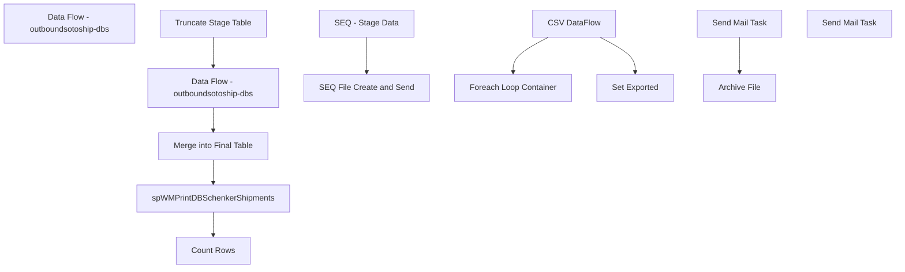

# SSIS Package: WMS_ShipConfirmDBS

**Project:** WMS_ShipConfirmDBS  
**Folder:** WMS  
**Server:** STL-SSIS-P-01  

## Connection Managers

| Name | Type | Server | Catalog | Connection (sanitized) |
|---|---|---|---|---|
| Azure Service Bus | Azure Service Bus (KingswaySoft) |  |  |  |
| DBSexportCSV | FLATFILE |  |  |  |
| IntegrationStaging | OLEDB | STL-SSIS-p-01 | IntegrationStaging | Data Source=STL-SSIS-p-01; Initial Catalog=IntegrationStaging; Provider=SQLNCLI11.1; Integrated Security=SSPI; Auto Translate=False |
| SMTP | SMTP |  |  |  |

## Control Flow Tasks

| Task | Type |
|---|---|
| WMS_ShipConfirmDBS | Package |
| Data Flow - outboundsotoship-dbs | Pipeline |
| SEQ - Stage Data | SEQUENCE |
| Count Rows | ExecuteSQLTask |
| Data Flow - outboundsotoship-dbs | Pipeline |
| Merge into Final Table | ExecuteSQLTask |
| spWMPrintDBSchenkerShipments | ExecuteSQLTask |
| Truncate Stage Table | ExecuteSQLTask |
| SEQ File Create and Send | SEQUENCE |
| CSV DataFlow | Pipeline |
| Foreach Loop Container | FOREACHLOOP |
| Archive File | FileSystemTask |
| Send Mail Task | SendMailTask |
| Set Exported | ExecuteSQLTask |
| Send Mail Task | SendMailTask |

## Control Flow Outline

```text
- Send Mail Task [SendMailTask]
- Data Flow - outboundsotoship-dbs [Pipeline]
- SEQ - Stage Data [SEQUENCE]
  - Count Rows [ExecuteSQLTask]
  - Data Flow - outboundsotoship-dbs [Pipeline]
  - Merge into Final Table [ExecuteSQLTask]
  - Truncate Stage Table [ExecuteSQLTask]
  - spWMPrintDBSchenkerShipments [ExecuteSQLTask]
- SEQ File Create and Send [SEQUENCE]
  - CSV DataFlow [Pipeline]
  - Foreach Loop Container [FOREACHLOOP]
    - Archive File [FileSystemTask]
    - Send Mail Task [SendMailTask]
  - Set Exported [ExecuteSQLTask]
```

## Architecture Diagram



## Variables

| Namespace | Name | Expression-bound |
|---|---|---|
| System | Propagate | No |
| User | DateTimeStamp | Yes |
| User | EndDate | Yes |
| User | EndDateAsDATE | Yes |
| User | GetDate | Yes |
| User | GetDateAsDATE | Yes |
| User | RowCount | No |
| User | ShipmentFileArchivePath | Yes |
| User | ShipmentFileStaged | No |
| User | StartDate | Yes |
| User | StartDateAsDATE | Yes |

### Expression-bound variable values

#### User::DateTimeStamp

**Expression:**

```sql
(DT_WSTR,4)DATEPART("yyyy",GetDate()) 
+ (DT_WSTR,4)DATEPART("mm",GetDate()) 
+ (DT_WSTR,4)DATEPART("dd",GetDate()) 
+ (DT_WSTR,4)DATEPART("hh",GetDate()) 
+ (DT_WSTR,4)DATEPART("mi",GetDate()) 
+ (DT_WSTR,4)DATEPART("ss",GetDate()) 
+ (DT_WSTR,4)DATEPART("ms",GetDate())
```

**Evaluated value:**

```sql
2021111911932627
```

#### User::EndDate

**Expression:**

```sql
dateadd("dd", @[$Package::DaysToInclude], @[User::StartDate])
```

**Evaluated value:**

```sql
11/19/2021
```

#### User::EndDateAsDATE

**Expression:**

```sql
(DT_WSTR, 4) datepart("year", @[User::EndDate])  + "-" + 
(DT_WSTR, 2) datepart("mm", @[User::EndDate])  + "-" + 
(DT_WSTR, 2) datepart("dd",  @[User::EndDate])
```

**Evaluated value:**

```sql
2021-11-19
```

#### User::GetDate

**Expression:**

```sql
(DT_DATE)DATEDIFF("Day", (DT_DATE) 0, GETDATE())
```

**Evaluated value:**

```sql
11/19/2021
```

#### User::GetDateAsDATE

**Expression:**

```sql
(DT_WSTR, 4) datepart("year", @[User::GetDate])  + "-" + 
(DT_WSTR, 2) datepart("mm", @[User::GetDate])  + "-" + 
(DT_WSTR, 2) datepart("dd",  @[User::GetDate])
```

**Evaluated value:**

```sql
2021-11-19
```

#### User::ShipmentFileArchivePath

**Expression:**

```sql
"\\\\" + @[$Package::IntegrationStaging_ServerName] + "\\IntegrationStaging\\DBS\\Archive\\"
```

**Evaluated value:**

```sql
\\STL-SSIS-p-01\IntegrationStaging\DBS\Archive\
```

#### User::StartDate

**Expression:**

```sql
dateadd("dd", -@[$Package::DaysToGoBack] , @[User::GetDate] )
```

**Evaluated value:**

```sql
11/18/2021
```

#### User::StartDateAsDATE

**Expression:**

```sql
(DT_WSTR, 4) datepart("year", @[User::StartDate])  + "-" + 
(DT_WSTR, 2) datepart("mm", @[User::StartDate])  + "-" + 
(DT_WSTR, 2) datepart("dd",  @[User::StartDate])
```

**Evaluated value:**

```sql
2021-11-18
```

## Execute SQL Tasks

### Count Rows

**Path:** `Package\SEQ - Stage Data\Count Rows`  
**Connection:** IntegrationStaging (STL-SSIS-p-01/IntegrationStaging)  

```sql
select 
	count(*) as Rowz
from [WMS].[ShipConfirmDBSchenker] scdb (nolock)
where warehouse in ('9980', '8175')
and datediff(dd, dateadd(hh, -6, [_upstream.EnqueuedTimeUTC]), getdate()) = 0
and ShipToCountry = 'CAN'
and SentToHA is null

```

### Merge into Final Table

**Path:** `Package\SEQ - Stage Data\Merge into Final Table`  
**Connection:** IntegrationStaging (STL-SSIS-p-01/IntegrationStaging)  

```sql
exec [WMS].[spMergeShipConfirmDBSchenker]
```

### Truncate Stage Table

**Path:** `Package\SEQ - Stage Data\Truncate Stage Table`  
**Connection:** IntegrationStaging (STL-SSIS-p-01/IntegrationStaging)  

```sql
Truncate table wms.ShipConfirmDBSchenkerStage
```

### spWMPrintDBSchenkerShipments

**Path:** `Package\SEQ - Stage Data\spWMPrintDBSchenkerShipments`  
**Connection:** IntegrationStaging (STL-SSIS-p-01/IntegrationStaging)  

```sql
exec [WMS].[spWMPrintDBSchenkerShipments]
```

### Set Exported

**Path:** `Package\SEQ File Create and Send\Set Exported`  
**Connection:** IntegrationStaging (STL-SSIS-p-01/IntegrationStaging)  

```sql
update wms.ShipConfirmDBSchenker
set SentToHA = getdate()
where SentToHA is NULL
and datediff(dd, dateadd(hh, -5, [_upstream.EnqueuedTimeUTC]), getdate()) <=1
```

## Data Flow: Sources

| Component | Source Object | Type | Data Flow Task | Connection | SQL Kind |
|---|---|---|---|---|---|
| ShipConfirmDBSchenker |  | OLEDBSource | CSV DataFlow | IntegrationStaging | SqlCommand |

#### ShipConfirmDBSchenker — SqlCommand

```sql
with 
ShipConfirm as
	(
		select 
			scdb.itemId as itemId, 
			replace(scdb.itemName, ',', '') as itemName, 
			cc.CountryCode2D as countryOfOrigin,
			scdb.harmonizedCode as harmonizedCode,
			scdb.unitPrice as unitPrice, 
			sum(scdb.quantity) as quantity,
			sum(cast(scdb.netSalesPrice as numeric(15,2))) as extended_cost,
			max(scdb.loadNumber) loadNumber,
			convert(varchar,dateadd(hh, -5, [_upstream.EnqueuedTimeUTC]), 112) as ShipDate
		from [WMS].[ShipConfirmDBSchenker] scdb (nolock)
		left join WMS.CountryCodes cc with (nolock) on scdb.countryOfOrigin=cc.CountryCode3D
		where scdb.warehouse in ('9980', '8175')
		and ShipToCountry = 'CAN'
		and datediff(dd, dateadd(hh, -5, [_upstream.EnqueuedTimeUTC]), getdate()) <=1
		and SentToHA is null
--and cast(dateadd(hh, -5, [_upstream.EnqueuedTimeUTC]) as date) = '2020-09-15'
		group by 
			scdb.itemId, 
			scdb.itemName, 
			cc.CountryCode2D,
			scdb.harmonizedCode, 
			scdb.unitPrice, 
			scdb.loadNumber,
			convert(varchar,dateadd(hh, -5, [_upstream.EnqueuedTimeUTC]), 112)
	)
select
	itemID,
	itemName,
	countryOfOrigin,
	harmonizedCode,
	unitPrice,
	quantity,
	extended_cost,
	--cast(concat(ShipDate, cast(replace(LoadNumber, 'Load', '') as int)) as nvarchar(100)) as LoadNumber
	LoadNumber
from ShipConfirm
order by 
	loadNumber, 
	itemId
```

## Data Flow: Destinations

| Component | Target Table | Type | Data Flow Task | Connection | SQL Kind |
|---|---|---|---|---|---|
| DUMP_outboundsotoship-dbs |  | OLEDBDestination | Data Flow - outboundsotoship-dbs | IntegrationStaging |  |
| ShipConfirmDBSchenkerStage |  | OLEDBDestination | Data Flow - outboundsotoship-dbs | IntegrationStaging |  |
| DBSexportCSV |  | FlatFileDestination | CSV DataFlow | DBSexportCSV |  |
