# SSIS Package: WMS_ShipConfirmDBS

**Project:** WMS_ShipConfirmDBS  
**Folder:** WMS  
**Server:** STL-SSIS-P-01  

## Architecture Diagram

```mermaid
flowchart TD
    subgraph Connections
        Azure_Service_Bus_conn(["Azure Service Bus [Azure Service Bus (KingswaySoft)]"])
        DBSexportCSV_conn(["DBSexportCSV [FLATFILE]"])
        IntegrationStaging_conn(["IntegrationStaging [OLEDB]"])
        SMTP_conn(["SMTP [SMTP]"])
    end
    subgraph ControlFlow
        WMS_ShipConfirmDBS_task["WMS_ShipConfirmDBS"]
        Data_Flow___outboundsotoship_dbs_task["Data Flow - outboundsotoship-dbs"]
        WMS_ShipConfirmDBS_task --> Data_Flow___outboundsotoship_dbs_task
        SEQ___Stage_Data_task["SEQ - Stage Data"]
        Data_Flow___outboundsotoship_dbs_task --> SEQ___Stage_Data_task
        Count_Rows_task["Count Rows"]
        SEQ___Stage_Data_task --> Count_Rows_task
        Data_Flow___outboundsotoship_dbs_task["Data Flow - outboundsotoship-dbs"]
        Count_Rows_task --> Data_Flow___outboundsotoship_dbs_task
        Merge_into_Final_Table_task["Merge into Final Table"]
        Data_Flow___outboundsotoship_dbs_task --> Merge_into_Final_Table_task
        spWMPrintDBSchenkerShipments_task["spWMPrintDBSchenkerShipments"]
        Merge_into_Final_Table_task --> spWMPrintDBSchenkerShipments_task
        Truncate_Stage_Table_task["Truncate Stage Table"]
        spWMPrintDBSchenkerShipments_task --> Truncate_Stage_Table_task
        SEQ_File_Create_and_Send_task["SEQ File Create and Send"]
        Truncate_Stage_Table_task --> SEQ_File_Create_and_Send_task
        CSV_DataFlow_task["CSV DataFlow"]
        SEQ_File_Create_and_Send_task --> CSV_DataFlow_task
        Foreach_Loop_Container_task["Foreach Loop Container"]
        CSV_DataFlow_task --> Foreach_Loop_Container_task
        Archive_File_task["Archive File"]
        Foreach_Loop_Container_task --> Archive_File_task
        Send_Mail_Task_task["Send Mail Task"]
        Archive_File_task --> Send_Mail_Task_task
        Set_Exported_task["Set Exported"]
        Send_Mail_Task_task --> Set_Exported_task
        Send_Mail_Task_task["Send Mail Task"]
        Set_Exported_task --> Send_Mail_Task_task
    end
```

## Connection Managers

| Name | Type |
|---|---|
| Azure Service Bus | Azure Service Bus (KingswaySoft) |
| DBSexportCSV | FLATFILE |
| IntegrationStaging | OLEDB |
| SMTP | SMTP |

## Control Flow Tasks

| Task | Type |
|---|---|
| WMS_ShipConfirmDBS | Microsoft.Package |
| Data Flow - outboundsotoship-dbs | Microsoft.Pipeline |
| SEQ - Stage Data | STOCK:SEQUENCE |
| Count Rows | Microsoft.ExecuteSQLTask |
| Data Flow - outboundsotoship-dbs | Microsoft.Pipeline |
| Merge into Final Table | Microsoft.ExecuteSQLTask |
| spWMPrintDBSchenkerShipments | Microsoft.ExecuteSQLTask |
| Truncate Stage Table | Microsoft.ExecuteSQLTask |
| SEQ File Create and Send | STOCK:SEQUENCE |
| CSV DataFlow | Microsoft.Pipeline |
| Foreach Loop Container | STOCK:FOREACHLOOP |
| Archive File | Microsoft.FileSystemTask |
| Send Mail Task | Microsoft.SendMailTask |
| Set Exported | Microsoft.ExecuteSQLTask |
| Send Mail Task | Microsoft.SendMailTask |

## Data Flow: Sources

| Component | SQL Preview |
|---|---|
|  | with  ShipConfirm as 	( 		select  			scdb.itemId as itemId,  			replace(scdb.itemName, ',', '') as itemName,  			cc.CountryCode2D as countryOfOrigin, 			scdb.harmonizedCode as harmonizedCode, 			scdb.unitPrice as unitPrice,  			sum(scdb.quantity) as quantity, 			sum(cast(scdb.netSalesPrice as numeric(15,2))) as extended_cost, 			max(scdb.loadNumber) loadNumber, 			convert(varchar,dateadd(hh, -5, [ |

## Data Flow: Destinations

| Component | Destination |
|---|---|
|  | [DUMP_outboundsotoship-dbs] |
|  | [WMS].[ShipConfirmDBSchenkerStage] |

