# SSIS Package: WMS_ShipConfirmToAptos

**Project:** WMS_ShipConfirmToAptos  
**Folder:** WMS  
**Server:** STL-SSIS-P-01  

## Architecture Diagram

```mermaid
flowchart TD
    subgraph Connections
        Azure_Service_Bus_conn(["Azure Service Bus [Azure Service Bus (KingswaySoft)]"])
        Azure_Service_Bus_Connection_Manager_conn(["Azure Service Bus Connection Manager [Azure Service Bus (KingswaySoft)]"])
        IntegrationStaging_conn(["IntegrationStaging [OLEDB]"])
        ME_01_conn(["ME_01 [OLEDB]"])
        SMTP_conn(["SMTP [SMTP]"])
    end
    subgraph ControlFlow
        WMS_ShipConfirmToAptos_task["WMS_ShipConfirmToAptos"]
        Data_Flow___outboundsotoship_aptos___BACKUP_20201218_task["Data Flow - outboundsotoship-aptos - BACKUP 20201218"]
        WMS_ShipConfirmToAptos_task --> Data_Flow___outboundsotoship_aptos___BACKUP_20201218_task
        Data_Flow___outboundsotoship_aptos___OLD_task["Data Flow - outboundsotoship-aptos - OLD"]
        Data_Flow___outboundsotoship_aptos___BACKUP_20201218_task --> Data_Flow___outboundsotoship_aptos___OLD_task
        Pipeline_File_task["Pipeline File"]
        Data_Flow___outboundsotoship_aptos___OLD_task --> Pipeline_File_task
        Proc_to_create_pipeline_file_task["Proc to create pipeline file"]
        Pipeline_File_task --> Proc_to_create_pipeline_file_task
        SEQ___Download_and_Merge_Data_task["SEQ - Download and Merge Data"]
        Proc_to_create_pipeline_file_task --> SEQ___Download_and_Merge_Data_task
        Data_Flow___outboundsotoship_aptos_task["Data Flow - outboundsotoship-aptos"]
        SEQ___Download_and_Merge_Data_task --> Data_Flow___outboundsotoship_aptos_task
        Merge_ShipmentConfirmAptos_task["Merge ShipmentConfirmAptos"]
        Data_Flow___outboundsotoship_aptos_task --> Merge_ShipmentConfirmAptos_task
        Truncate_Stage_task["Truncate Stage"]
        Merge_ShipmentConfirmAptos_task --> Truncate_Stage_task
        SEQ___Stage_ERDMatrix_task["SEQ - Stage ERDMatrix"]
        Truncate_Stage_task --> SEQ___Stage_ERDMatrix_task
        ERDMatrix_task["ERDMatrix"]
        SEQ___Stage_ERDMatrix_task --> ERDMatrix_task
        Merge_ERD_Matrix_task["Merge ERD Matrix"]
        ERDMatrix_task --> Merge_ERD_Matrix_task
        Truncate_Stage_task["Truncate Stage"]
        Merge_ERD_Matrix_task --> Truncate_Stage_task
        Send_Mail_Task_task["Send Mail Task"]
        Truncate_Stage_task --> Send_Mail_Task_task
    end
```

## Connection Managers

| Name | Type |
|---|---|
| Azure Service Bus | Azure Service Bus (KingswaySoft) |
| Azure Service Bus Connection Manager | Azure Service Bus (KingswaySoft) |
| IntegrationStaging | OLEDB |
| ME_01 | OLEDB |
| SMTP | SMTP |

## Control Flow Tasks

| Task | Type |
|---|---|
| WMS_ShipConfirmToAptos | Microsoft.Package |
| Data Flow - outboundsotoship-aptos - BACKUP 20201218 | Microsoft.Pipeline |
| Data Flow - outboundsotoship-aptos - OLD | Microsoft.Pipeline |
| Pipeline File | STOCK:SEQUENCE |
| Proc to create pipeline file | Microsoft.ExecuteSQLTask |
| SEQ - Download and Merge Data | STOCK:SEQUENCE |
| Data Flow - outboundsotoship-aptos | Microsoft.Pipeline |
| Merge ShipmentConfirmAptos | Microsoft.ExecuteSQLTask |
| Truncate Stage | Microsoft.ExecuteSQLTask |
| SEQ - Stage ERDMatrix | STOCK:SEQUENCE |
| ERDMatrix | Microsoft.Pipeline |
| Merge ERD Matrix | Microsoft.ExecuteSQLTask |
| Truncate Stage | Microsoft.ExecuteSQLTask |
| Send Mail Task | Microsoft.SendMailTask |

## Data Flow: Sources

| Component | SQL Preview |
|---|---|
|  | select AptosShipmentNumber, cast(DynamicsOrder as nvarchar(20)) as DynamicsOrder from wms.vwAptosDistrosInDynamics group by AptosShipmentNumber, cast(DynamicsOrder as nvarchar(20)) |
|  | select AptosShipmentNumber, cast(DynamicsOrder as nvarchar(20)) as DynamicsOrder from wms.vwAptosDistrosInDynamics group by AptosShipmentNumber, cast(DynamicsOrder as nvarchar(20)) |

## Data Flow: Destinations

| Component | Destination |
|---|---|
|  | [WMS].[ShipmentConfirmAptosStage] |
|  | [WMS].[ShipmentConfirmAptosStage] |
|  | [WMS].[ShipmentConfirmAptosStage] |
|  | [WMS].[ERDMatrixStage] |
|  | [dbo].[erd_matrix] |

