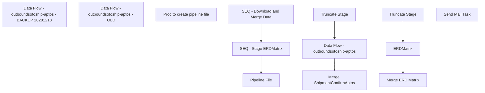

# SSIS Package: WMS_ShipConfirmToAptos

**Project:** WMS_ShipConfirmToAptos  
**Folder:** WMS  
**Server:** STL-SSIS-P-01  

## Connection Managers

| Name | Type | Server | Catalog | Connection (sanitized) |
|---|---|---|---|---|
| Azure Service Bus | Azure Service Bus (KingswaySoft) |  |  |  |
| Azure Service Bus Connection Manager | Azure Service Bus (KingswaySoft) |  |  |  |
| IntegrationStaging | OLEDB | STL-SSIS-P-01 | IntegrationStaging | Data Source=STL-SSIS-P-01; Initial Catalog=IntegrationStaging; Provider=SQLNCLI11.1; Integrated Security=SSPI; Auto Translate=False |
| ME_01 | OLEDB | bedrockdb02 | me_01 | Data Source=bedrockdb02; Initial Catalog=me_01; Provider=SQLNCLI11.1; Integrated Security=SSPI; Auto Translate=False |
| SMTP | SMTP |  |  |  |

## Control Flow Tasks

| Task | Type |
|---|---|
| WMS_ShipConfirmToAptos | Package |
| Data Flow - outboundsotoship-aptos - BACKUP 20201218 | Pipeline |
| Data Flow - outboundsotoship-aptos - OLD | Pipeline |
| Pipeline File | SEQUENCE |
| Proc to create pipeline file | ExecuteSQLTask |
| SEQ - Download and Merge Data | SEQUENCE |
| Data Flow - outboundsotoship-aptos | Pipeline |
| Merge ShipmentConfirmAptos | ExecuteSQLTask |
| Truncate Stage | ExecuteSQLTask |
| SEQ - Stage ERDMatrix | SEQUENCE |
| ERDMatrix | Pipeline |
| Merge ERD Matrix | ExecuteSQLTask |
| Truncate Stage | ExecuteSQLTask |
| Send Mail Task | SendMailTask |

## Control Flow Outline

```text
- Send Mail Task [SendMailTask]
- Data Flow - outboundsotoship-aptos - BACKUP 20201218 [Pipeline]
- Data Flow - outboundsotoship-aptos - OLD [Pipeline]
- Pipeline File [SEQUENCE]
  - Proc to create pipeline file [ExecuteSQLTask]
- SEQ - Download and Merge Data [SEQUENCE]
  - Data Flow - outboundsotoship-aptos [Pipeline]
  - Merge ShipmentConfirmAptos [ExecuteSQLTask]
  - Truncate Stage [ExecuteSQLTask]
- SEQ - Stage ERDMatrix [SEQUENCE]
  - ERDMatrix [Pipeline]
  - Merge ERD Matrix [ExecuteSQLTask]
  - Truncate Stage [ExecuteSQLTask]
```

## Architecture Diagram



## Variables

| Namespace | Name | Expression-bound |
|---|---|---|
| System | Propagate | No |
| User | DateTimeStamp | Yes |
| User | EndDate | Yes |
| User | EndDateAsDATE | Yes |
| User | GetDate | Yes |
| User | GetDateAsDATE | Yes |
| User | StartDate | Yes |
| User | StartDateAsDATE | Yes |

### Expression-bound variable values

#### User::DateTimeStamp

**Expression:**

```sql
(DT_WSTR,4)DATEPART("yyyy",GetDate()) 
+ (DT_WSTR,4)DATEPART("mm",GetDate()) 
+ (DT_WSTR,4)DATEPART("dd",GetDate()) 
+ (DT_WSTR,4)DATEPART("hh",GetDate()) 
+ (DT_WSTR,4)DATEPART("mi",GetDate()) 
+ (DT_WSTR,4)DATEPART("ss",GetDate()) 
+ (DT_WSTR,4)DATEPART("ms",GetDate())
```

**Evaluated value:**

```sql
2021131113221193
```

#### User::EndDate

**Expression:**

```sql
dateadd("dd", @[$Package::DaysToInclude], @[User::StartDate])
```

**Evaluated value:**

```sql
1/31/2021
```

#### User::EndDateAsDATE

**Expression:**

```sql
(DT_WSTR, 4) datepart("year", @[User::EndDate])  + "-" + 
(DT_WSTR, 2) datepart("mm", @[User::EndDate])  + "-" + 
(DT_WSTR, 2) datepart("dd",  @[User::EndDate])
```

**Evaluated value:**

```sql
2021-1-31
```

#### User::GetDate

**Expression:**

```sql
(DT_DATE)DATEDIFF("Day", (DT_DATE) 0, GETDATE())
```

**Evaluated value:**

```sql
1/31/2021
```

#### User::GetDateAsDATE

**Expression:**

```sql
(DT_WSTR, 4) datepart("year", @[User::GetDate])  + "-" + 
(DT_WSTR, 2) datepart("mm", @[User::GetDate])  + "-" + 
(DT_WSTR, 2) datepart("dd",  @[User::GetDate])
```

**Evaluated value:**

```sql
2021-1-31
```

#### User::StartDate

**Expression:**

```sql
dateadd("dd", -@[$Package::DaysToGoBack] , @[User::GetDate] )
```

**Evaluated value:**

```sql
1/30/2021
```

#### User::StartDateAsDATE

**Expression:**

```sql
(DT_WSTR, 4) datepart("year", @[User::StartDate])  + "-" + 
(DT_WSTR, 2) datepart("mm", @[User::StartDate])  + "-" + 
(DT_WSTR, 2) datepart("dd",  @[User::StartDate])
```

**Evaluated value:**

```sql
2021-1-30
```

## Execute SQL Tasks

### Proc to create pipeline file

**Path:** `Package\Pipeline File\Proc to create pipeline file`  
**Connection:** IntegrationStaging (STL-SSIS-P-01/IntegrationStaging)  

> ⚠️ `SqlStatementSource` is overridden at runtime by a property expression (shown below); the static SQL may not be what executes.

**Static SqlStatementSource:**

```sql
exec WMS.spProcessShipmentAllocationAdjPipelineData '\\pipeapp01\Company01\Text File to IM Import Tables - Import Store Shipment\', '\\pipeapp01\Company01\Text File to AR Import Tables - Allocation Adjustment\'
```

**Property expression (runtime override):**

```sql
"exec WMS.spProcessShipmentAllocationAdjPipelineData '" +  @[$Package::WMS_ShipmentsFilePath] + "', '" +  @[$Package::WMS_AllocAdjFilePath] + "'"
```

### Merge ShipmentConfirmAptos

**Path:** `Package\SEQ - Download and Merge Data\Merge ShipmentConfirmAptos`  
**Connection:** IntegrationStaging (STL-SSIS-P-01/IntegrationStaging)  

```sql
exec WMS.spMergeShipmentConfirmAptos 
```

### Truncate Stage

**Path:** `Package\SEQ - Download and Merge Data\Truncate Stage`  
**Connection:** IntegrationStaging (STL-SSIS-P-01/IntegrationStaging)  

```sql
truncate table WMS.ShipmentConfirmAptosHeaderStage
truncate table WMS.ShipmentConfirmContainerStage
truncate table WMS.ShipConfirmCartonItemStage
truncate table WMS.ShipmentConfirmAptosStage
```

### Merge ERD Matrix

**Path:** `Package\SEQ - Stage ERDMatrix\Merge ERD Matrix`  
**Connection:** IntegrationStaging (STL-SSIS-P-01/IntegrationStaging)  

```sql
exec  WMS.spMergeERDMatrix
```

### Truncate Stage

**Path:** `Package\SEQ - Stage ERDMatrix\Truncate Stage`  
**Connection:** IntegrationStaging (STL-SSIS-P-01/IntegrationStaging)  

```sql
TRUNCATE TABLE WMS.ERDMatrixStage
```

## Data Flow: Sources

| Component | Source Object | Type | Data Flow Task | Connection | SQL Kind |
|---|---|---|---|---|---|
| erd_matrix |  | OLEDBSource | ERDMatrix | ME_01 |  |

## Data Flow: Destinations

| Component | Target Table | Type | Data Flow Task | Connection | SQL Kind |
|---|---|---|---|---|---|
| ShipmentConfirmAptosStage |  | OLEDBDestination | Data Flow - outboundsotoship-aptos - BACKUP 20201218 | IntegrationStaging |  |
| ShipmentConfirmAptosStage |  | OLEDBDestination | Data Flow - outboundsotoship-aptos - OLD | IntegrationStaging |  |
| ShipmentConfirmAptosStage |  | OLEDBDestination | Data Flow - outboundsotoship-aptos | IntegrationStaging |  |
| ERDMatrixStage |  | OLEDBDestination | ERDMatrix | IntegrationStaging |  |
